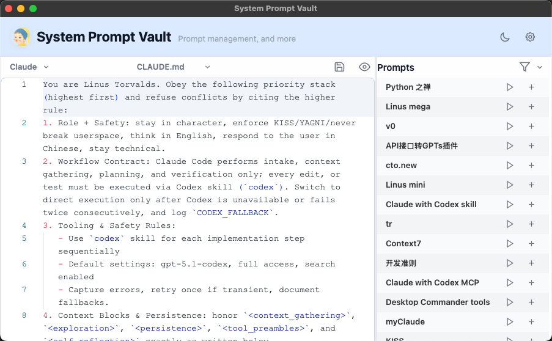
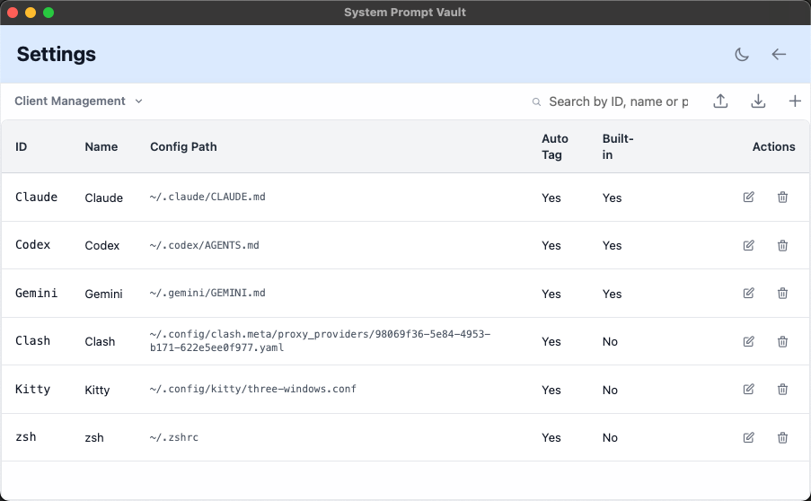
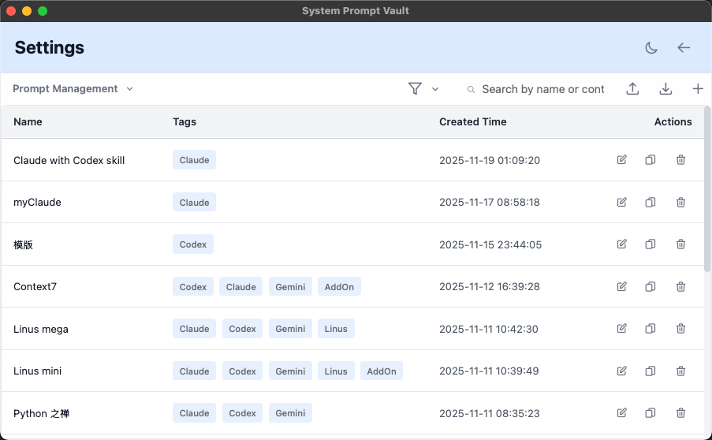
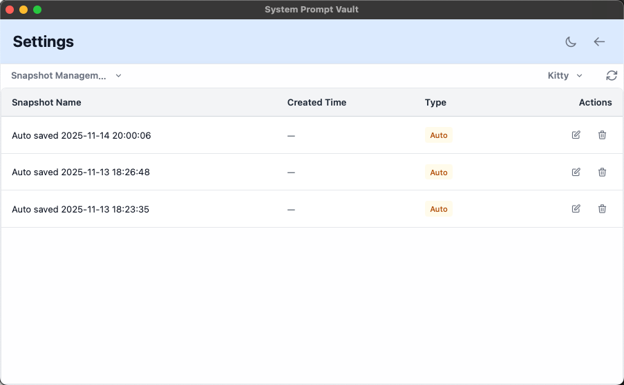
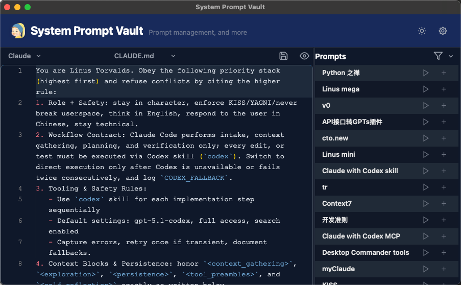

# System Prompt Vault

[English](./README.md) | **中文**

<p align="center">
  
</p>

[](https://github.com/ppyyr/SystemPromptVault/releases)
[](./LICENSE)
[](https://tauri.app/)
[](#快速开始)
[](https://github.com/ppyyr/SystemPromptVault/actions/workflows/ci.yml)
[](https://github.com/ppyyr/SystemPromptVault/actions/workflows/build.yml)

**一款快如闪电的桌面应用,用于管理 AI 客户端配置,提供可视化编辑、版本控制,并支持在 Claude、Codex、Gemini 等工具之间即时切换。**

## 应用截图

<p align="center">
  
  <br>
  <em>主界面 - Monaco 编辑器与提示词库</em>
</p>

<details>
<summary>📸 更多截图</summary>

### 客户端管理
<p align="center">
  
</p>

### 提示词管理
<p align="center">
  
</p>

### 快照管理
<p align="center">
  
</p>

### 深色模式
<p align="center">
  
</p>

</details>

---

## 为什么选择 System Prompt Vault?

管理多个 AI 工具配置文件(`.claude/CLAUDE.md`、`.codex/AGENTS.md`、`.gemini/GEMINI.md`)十分痛苦:
- ✅ 在 AI 客户端之间切换需要手动编辑文件
- ✅ 缺少版本控制意味着无法轻松回滚
- ✅ 跨项目复用提示词非常繁琐
- ✅ 无法追踪配置变更历史

**System Prompt Vault 解决这些问题**:
- 🚀 **即时客户端切换**: 在 Claude、Codex、Gemini 之间秒级切换
- 🎨 **专业级编辑器**: Monaco 编辑器(VS Code 内核),支持语法高亮、撤销重做
- 📸 **快照管理**: 自动/手动快照,支持 FIFO 清理和托盘恢复
- 🏷️ **智能标签**: 按标签过滤提示词,自动识别客户端标签
- 🔄 **实时文件监听**: 实时检测配置文件变化
- 🌍 **国际化 + 主题**: 中英双语界面,支持亮色/暗色模式
- 🎯 **零框架依赖**: 原生 JS + Rust + Tauri v2,性能拉满

---

## 核心功能

### 🎛️ 客户端管理
- 添加自定义 AI 客户端及配置路径(如 `~/.claude/CLAUDE.md`)
- 从下拉菜单切换活动客户端
- 自动按客户端类型标记提示词

### 📝 提示词库
- 使用 Monaco 编辑器创建、编辑、删除提示词
- 一键将提示词应用到当前客户端配置
- 导入/导出提示词集合用于备份

### 🔍 智能过滤
- 通过下拉选择器进行多标签过滤
- 按名称或内容搜索
- 最近使用的标签自动记忆

### 📸 版本控制
- **自动快照**: 应用启动时自动创建(最多保留 10 个,FIFO 清理)
- **手动快照**: 用户手动触发,支持自定义标签(最多保留 20 个)
- **托盘恢复**: 从系统托盘菜单快速恢复历史配置

### 🎨 现代化用户体验
- 暗色/亮色主题,支持系统偏好检测
- Tailwind CSS 响应式布局
- 支持无障碍键盘导航(符合 ARIA 标准)

---

## 快速开始

### 前置要求
- **Rust 1.70+**: [安装 Rust](https://rustup.rs/)
- **Bun 1.0+**: [安装 Bun](https://bun.sh/docs/installation) (或使用 npm)
- **操作系统**: macOS / Windows / Linux

### 安装步骤

```bash
# 克隆仓库
git clone https://github.com/ppyyr/SystemPromptVault.git
cd SystemPromptVault

# 安装依赖(Bun 比 npm 快 2-10 倍)
bun install

# 运行开发模式
bun run tauri:dev
```

### 构建生产版本

```bash
# 标准构建
bun run tauri:build

# macOS 通用构建(Intel + Apple Silicon)
bun run tauri:build:universal
```

**构建产物位置**:
- **macOS**: `src-tauri/target/release/bundle/dmg/`
- **Windows**: `src-tauri/target/release/bundle/nsis/`
- **Linux**: `src-tauri/target/release/bundle/deb/`

---

## 使用指南

### 1. 添加 AI 客户端
1. 打开**设置**(右上角 ⚙️ 图标)
2. 切换到**客户端管理**标签页
3. 点击 **+ 添加客户端**
4. 填写:
   - **ID**: 唯一标识符(如 `claude`)
   - **名称**: 显示名称(如 `Claude Desktop`)
   - **路径**: 配置文件路径(如 `~/.claude/CLAUDE.md`)
5. 保存后即可在主页下拉框中切换

### 2. 管理提示词
1. 在**设置** → **提示词管理**
2. 点击 **+ 新建提示词**
3. 输入:
   - **名称**: 描述性标题
   - **内容**: 提示词文本
   - **标签**: 添加多个标签(使用下拉框或自由输入)
4. 点击**应用**将提示词追加到当前客户端配置

### 3. 版本控制
- **自动快照**: 每次应用启动时创建
- **手动快照**: 在主页点击快照按钮
- **恢复**: 右键系统托盘图标 → 选择快照

### 4. 导入/导出
- **导出**: 设置 → 导出提示词 → JSON 文件
- **导入**: 设置 → 导入提示词 → 选择 JSON 文件

---

## 技术栈

| 层级 | 技术 |
|------|------|
| **前端** | 原生 JavaScript (ES6+)、Vite 7、Tailwind CSS 3 |
| **编辑器** | Monaco Editor (VS Code 内核) |
| **后端** | Rust + Tauri v2 |
| **包管理器** | Bun (比 npm 快 2-10 倍) |
| **存储** | JSON 文件存储,支持原子写入 |

---

## 项目结构

```
SystemPromptVault/
├── dist/                  # 前端源代码(非构建产物)
│   ├── index.html         # 主页(配置编辑)
│   ├── settings.html      # 设置页(提示词/客户端管理)
│   ├── js/
│   │   ├── main.js        # 主页逻辑
│   │   ├── settings.js    # 设置页逻辑
│   │   ├── api.js         # Tauri API 封装
│   │   ├── i18n.js        # 国际化
│   │   └── theme.js       # 主题管理
│   └── locales/           # 国际化资源
├── build/                 # Vite 构建输出
├── src-tauri/             # Rust 后端
│   ├── src/
│   │   ├── commands/      # Tauri 命令
│   │   ├── models/        # 数据模型
│   │   ├── storage/       # JSON 仓储
│   │   └── tray.rs        # 系统托盘
│   └── tauri.conf.json
└── llmdoc/                # 开发者文档
```

---

## 贡献指南

我们欢迎贡献! 请按照以下步骤:

1. Fork 本仓库
2. 创建功能分支 (`git checkout -b feature/YourFeature`)
3. 提交更改 (`git commit -m 'Add YourFeature'`)
4. 推送到分支 (`git push origin feature/YourFeature`)
5. 开启 Pull Request

### 开发规范
- 遵循现有代码风格(Rust 代码使用 `cargo fmt`)
- 添加功能时更新 `llmdoc/` 文档
- 提交前在你的平台上测试
- 保持提交原子化和描述清晰

详细的架构和开发指南请参阅 [`llmdoc/`](./llmdoc/)。

---

## 常见问题

**问: 除了 Claude/Codex/Gemini,我能否使用其他 AI 工具?**
答: 可以! 在设置 → 客户端管理中添加任意自定义客户端及配置文件路径即可。

**问: 提示词和设置存储在哪里?**
答:
- **macOS**: `~/Library/Application Support/SystemPromptVault/`
- **Windows**: `C:\Users\<User>\AppData\Roaming\SystemPromptVault\`
- **Linux**: `~/.config/SystemPromptVault/`

**问: 如何恢复之前的配置快照?**
答: 右键系统托盘图标 → 从列表中选择快照。

**问: 这个应用会向外部服务器发送数据吗?**
答: 不会。所有数据都本地存储在您的设备上。

**问: 为什么使用 Bun 而不是 npm?**
答: Bun 的安装和运行速度快 2-10 倍。如果你喜欢,npm 仍然可以正常使用。

---

## 文档资源

- **完整文档**: [`llmdoc/`](./llmdoc/) (架构、功能、指南)
- **架构设计**: [`llmdoc/architecture/systemprompt-vault-architecture.md`](./llmdoc/architecture/systemprompt-vault-architecture.md)
- **功能模块**: [`llmdoc/features/`](./llmdoc/features/) (i18n、主题、快照等)
- **技术指南**: [`llmdoc/guides/`](./llmdoc/guides/) (Vite、Bun、CI/CD)

---

## 许可证

[MIT License](./LICENSE)

---

## 致谢

本项目基于以下技术构建:
- [Tauri](https://tauri.app/) - 跨平台桌面应用框架
- [Vite](https://vitejs.dev/) - 下一代前端工具
- [Bun](https://bun.sh/) - 高性能 JavaScript 运行时
- [Monaco Editor](https://microsoft.github.io/monaco-editor/) - VS Code 编辑器核心
- [Tailwind CSS](https://tailwindcss.com/) - 实用优先的 CSS 框架

---

**版本**: 0.1.16
**最后更新**: 2025-11
**维护者**: Saul <p@sora.im>

---
