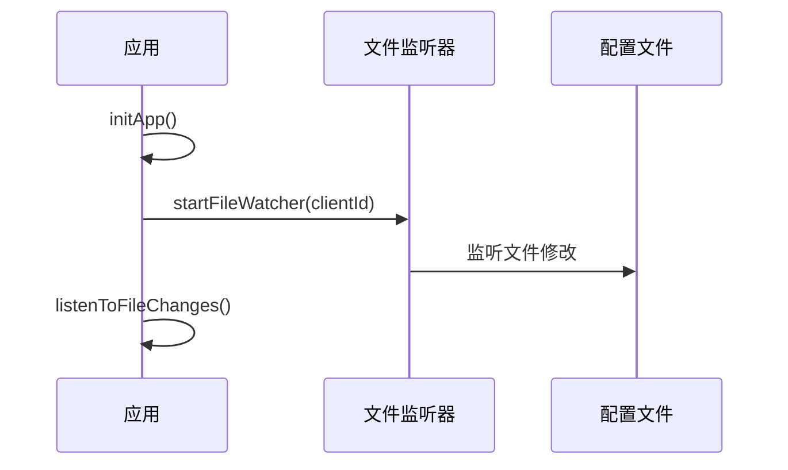
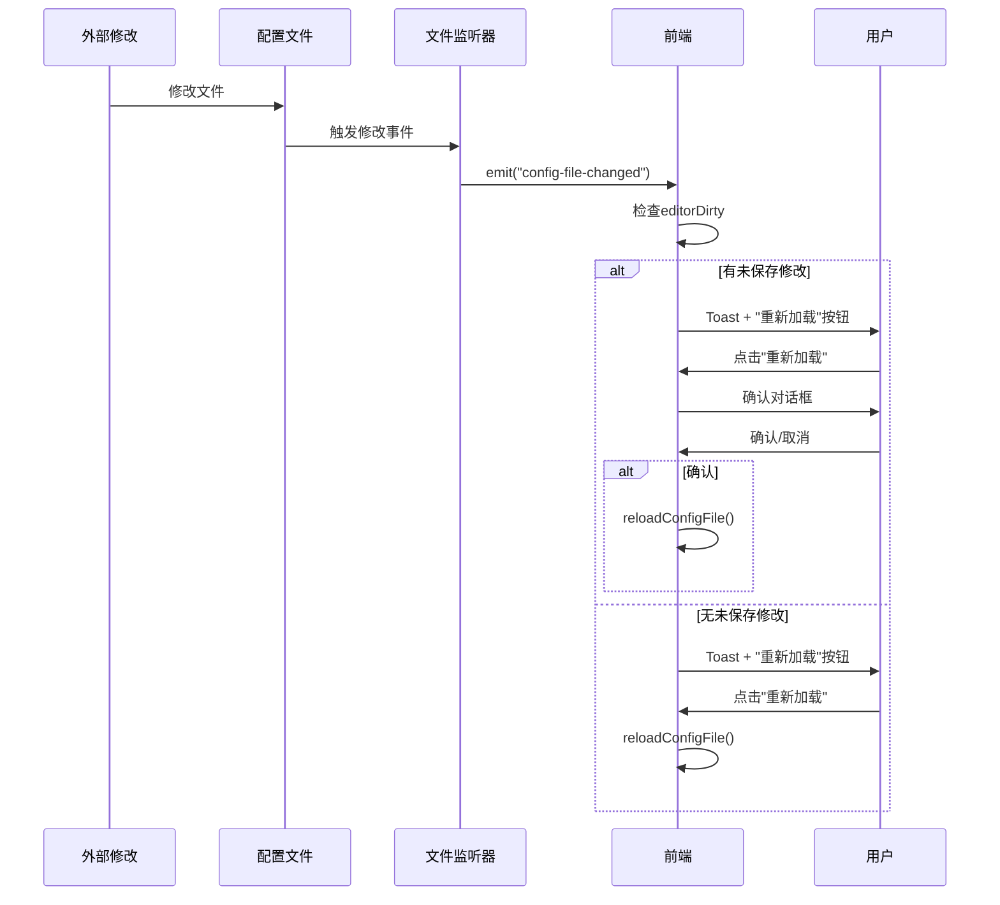
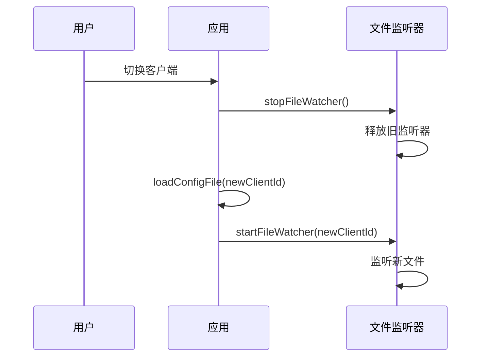

# 配置文件变化检测与重新加载功能

## 📸 功能概述

当配置文件在外部被修改时（例如通过System Tray恢复快照、使用外部编辑器修改、或在设置页面修改），主窗口会自动检测到变化并提示用户重新加载，避免编辑器内容与文件内容不同步。

## ✨ 核心特性

- ✅ **实时文件监听** - 使用 `notify` crate 监听配置文件变化
- ✅ **智能提示** - Toast通知带"重新加载"按钮
- ✅ **冲突保护** - 检测编辑器未保存修改，提示用户确认
- ✅ **自动管理** - 切换客户端时自动切换监听目标
- ✅ **跨平台支持** - macOS (FSEvents)、Windows、Linux

## 🎯 使用场景

### 场景1：从 System Tray 恢复快照
```
1. 用户在托盘菜单点击恢复快照
2. 后端写入配置文件
3. 文件监听器检测到变化
4. 主窗口显示Toast："配置文件已更新 [重新加载]"
5. 用户点击"重新加载"，编辑器内容更新
```

### 场景2：外部编辑器修改配置
```
1. 用户用VS Code打开 ~/.claude/custom_instructions
2. 修改并保存文件
3. 文件监听器检测到变化
4. SystemPromptVault主窗口显示Toast提示
5. 用户点击"重新加载"，编辑器内容更新
```

### 场景3：设置页面修改配置
```
1. 用户在设置页面修改配置并保存
2. 文件监听器检测到变化
3. 主窗口显示Toast提示
4. 用户点击"重新加载"，编辑器内容更新
```

### 场景4：有未保存修改时的保护
```
1. 用户在编辑器中修改了配置但未保存
2. 此时外部修改了配置文件
3. Toast显示："配置文件已在外部修改 [重新加载]"
4. 用户点击"重新加载"
5. 弹出确认对话框："配置文件已在外部修改，是否重新加载？（将丢失未保存的修改）"
6. 用户选择：
   - 确认 → 丢弃当前修改，加载文件内容
   - 取消 → 保留当前编辑器内容
```

## 🔧 技术实现

### 后端（Rust）

#### 1. 文件监听器 (`src-tauri/src/file_watcher.rs`)

```rust
use notify::{Watcher, RecursiveMode, Event};
use tauri::{AppHandle, Emitter};

pub struct ConfigFileWatcher {
    watcher: Option<notify::RecommendedWatcher>,
    watched_paths: Vec<PathBuf>,
}

impl ConfigFileWatcher {
    pub fn watch_file(&mut self, path: PathBuf, app_handle: AppHandle) -> Result<(), String> {
        // 创建文件监听器
        let mut watcher = notify::recommended_watcher(move |res: Result<Event, _>| {
            if let Ok(event) = res {
                if event.kind.is_modify() {
                    // 发送事件到前端
                    let _ = app_handle.emit("config-file-changed", path_str);
                }
            }
        })?;

        // 监听文件
        watcher.watch(&path, RecursiveMode::NonRecursive)?;
        self.watcher = Some(watcher);
        Ok(())
    }
}
```

**特点**：
- 使用 `notify::recommended_watcher` 自动选择最佳监听器
- macOS 使用 FSEvents (高性能)
- 仅监听文件修改事件（`is_modify()`）
- 通过独立线程转发事件，不阻塞主线程

#### 2. Tauri命令 (`src-tauri/src/commands/file_watcher.rs`)

```rust
#[tauri::command]
pub fn start_watching_config(
    file_path: String,
    app_handle: AppHandle,
    watcher: State<Arc<Mutex<ConfigFileWatcher>>>,
) -> Result<(), String> {
    let path = PathBuf::from(&file_path);
    let mut watcher_guard = watcher.lock()?;
    watcher_guard.watch_file(path, app_handle)?;
    Ok(())
}

#[tauri::command]
pub fn stop_watching_config(
    watcher: State<Arc<Mutex<ConfigFileWatcher>>>,
) -> Result<(), String> {
    let mut watcher_guard = watcher.lock()?;
    watcher_guard.stop();
    Ok(())
}
```

### 前端（JavaScript）

#### 1. 编辑器脏状态跟踪 (`dist/js/main.js`)

```javascript
const state = {
  editorDirty: false,  // 编辑器是否有未保存的修改
  fileChangeToast: null,  // 当前显示的文件变化Toast
};

// 监听编辑器内容变化
const handleEditorChange = () => {
  state.editorDirty = true;
};

// Monaco编辑器
if (state.monacoEditor) {
  state.monacoEditor.onDidChangeModelContent(() => {
    handleEditorChange();
  });
}

// Fallback编辑器
elements.configEditor?.addEventListener("input", handleEditorChange);
```

**特点**：
- 同时支持 Monaco 编辑器和原生 textarea
- 使用 `editorChangeBlocked` 标志避免程序化赋值触发脏标记
- 保存成功后自动清除脏标志

#### 2. 文件监听管理 (`dist/js/main.js`)

```javascript
// 启动监听当前客户端的配置文件
const startFileWatcher = async (clientId) => {
  const client = state.clients.find(c => c.id === clientId);
  if (!client) return;

  const invoke = await getInvoke();
  await invoke("start_watching_config", { filePath: client.config_file_path });
};

// 停止监听
const stopFileWatcher = async () => {
  const invoke = await getInvoke();
  await invoke("stop_watching_config");
};

// 监听Tauri事件
const listenToFileChanges = async () => {
  const { listen } = window.__TAURI_INTERNALS__;
  await listen("config-file-changed", async (event) => {
    await handleConfigFileChanged();
  });
};
```

#### 3. 文件变化处理 (`dist/js/main.js`)

```javascript
const handleConfigFileChanged = async () => {
  // 移除旧的Toast
  if (state.fileChangeToast) {
    state.fileChangeToast.remove();
    state.fileChangeToast = null;
  }

  // 如果编辑器有未保存的修改，显示警告Toast
  if (state.editorDirty) {
    state.fileChangeToast = showActionToast(
      "配置文件已在外部修改",
      "重新加载",
      async () => {
        const confirmed = await showConfirm(
          "配置文件已在外部修改，是否重新加载？（将丢失未保存的修改）"
        );
        if (confirmed) {
          await reloadConfigFile();
        }
      }
    );
  } else {
    // 如果没有未保存的修改，直接显示Toast
    state.fileChangeToast = showActionToast(
      "配置文件已更新",
      "重新加载",
      async () => {
        await reloadConfigFile();
      }
    );
  }
};

const reloadConfigFile = async () => {
  await loadConfigFile(state.currentClientId);
  state.editorDirty = false;
  showToast("配置已重新加载", "success");
};
```

#### 4. 带按钮的 Toast (`dist/js/utils.js`)

```javascript
export const showActionToast = (message, actionLabel, onAction) => {
  const toast = document.createElement("div");
  toast.className = "toast toast-info action-toast";

  const messageSpan = document.createElement("span");
  messageSpan.textContent = message;

  const button = document.createElement("button");
  button.className = "toast-action-btn";
  button.textContent = actionLabel;
  button.onclick = () => {
    if (typeof onAction === "function") {
      onAction();
    }
    toast.remove();
  };

  toast.appendChild(messageSpan);
  toast.appendChild(button);
  container.appendChild(toast);

  // 30秒后自动移除
  setTimeout(() => toast.remove(), 30000);

  return toast;
};
```

### 样式 (`dist/css/components.css`)

```css
.action-toast {
  display: flex;
  align-items: center;
  gap: 1rem;
  padding: 0.75rem 1rem;
  min-width: 320px;
}

.toast-action-btn {
  padding: 0.375rem 0.75rem;
  background: rgba(255, 255, 255, 0.2);
  border: 1px solid rgba(255, 255, 255, 0.3);
  border-radius: 4px;
  color: white;
  font-size: 0.875rem;
  font-weight: 500;
  cursor: pointer;
  transition: all 0.2s;
}

.toast-action-btn:hover {
  background: rgba(255, 255, 255, 0.3);
  border-color: rgba(255, 255, 255, 0.5);
}

.toast-info {
  background: linear-gradient(135deg, #667eea 0%, #764ba2 100%);
}
```

## 🔄 完整流程

### 应用启动流程


### 文件变化检测流程


### 切换客户端流程


## 📁 相关文件

### 后端
- `src-tauri/Cargo.toml` - 添加 `notify` 依赖
- `src-tauri/src/file_watcher.rs` - 文件监听器实现
- `src-tauri/src/commands/file_watcher.rs` - Tauri命令
- `src-tauri/src/main.rs` - 注册监听器和命令

### 前端
- `dist/js/main.js` - 文件监听管理、编辑器脏状态、重新加载逻辑
- `dist/js/utils.js` - `showActionToast` 函数
- `dist/css/components.css` - Toast样式

## ⚙️ 配置选项

### 自动重新加载超时时间
Toast提示默认 **30秒** 后自动消失，可在 `dist/js/utils.js` 中修改：

```javascript
setTimeout(() => toast.remove(), 30000);  // 修改这里的数值（毫秒）
```

### 文件监听延迟
文件监听器使用 `notify` crate 的默认配置，无延迟。

### 托盘恢复快照的主动通知机制

**背景**：macOS 的 FSEvents 在某些情况下（如快速连续写入、原子写入）可能不会立即触发文件变化事件，导致从托盘恢复快照后主窗口编辑器不同步。

**解决方案**：采用**双重保障机制**（文件监听器 + 主动事件发送）

```rust
// src-tauri/src/tray.rs:156-169
// 主动通知监听器，避免托盘恢复后主窗口不同步
let changed_path = {
    let repo = client_state.inner().lock()
        .map_err(|_| TrayError::from_poison("客户端仓库"))?;
    match repo.get_by_id(client_id) {
        Ok(Some(client)) => Some(client.config_file_path),
        _ => None,
    }
};
if let Some(path) = changed_path {
    let _ = app_handle.emit("config-file-changed", path);
}
```

**工作方式**：
1. **文件监听器（保留）**：继续监听外部编辑器的文件修改
2. **主动事件发送（新增）**：托盘恢复快照后立即发送 `config-file-changed` 事件

**优势**：
- ✅ 托盘恢复快照：100% 可靠触发主窗口更新
- ✅ 外部编辑器修改：仍可通过文件监听器检测
- ✅ 不依赖 macOS FSEvents 的可靠性

## 🐛 故障排查

### 问题1：文件变化不触发Toast
**可能原因**：
- 文件监听器未启动
- 文件路径错误

**解决方法**：
1. 打开浏览器控制台
2. 查找 `[FileWatcher] Started watching:` 日志
3. 确认路径是否正确
4. 尝试重启应用

### 问题2：Toast显示后无法重新加载
**可能原因**：
- 配置文件读取权限问题
- API调用失败

**解决方法**：
1. 打开浏览器控制台
2. 查找错误日志
3. 检查配置文件是否存在
4. 检查文件权限

### 问题3：编辑器脏状态不准确
**可能原因**：
- `editorChangeBlocked` 标志未正确设置
- Monaco编辑器事件绑定失败

**解决方法**：
1. 检查控制台是否有Monaco加载错误
2. 尝试刷新页面
3. 检查 `setEditorContent()` 是否正确设置 `editorChangeBlocked`

## 📊 性能影响

- **CPU占用**: 几乎为零（仅在文件修改时触发）
- **内存占用**: 约 1-2 MB（文件监听器线程）
- **响应延迟**: < 100ms（从文件修改到Toast显示）

## 🔒 安全考虑

1. **文件路径验证** - 仅监听应用管理的配置文件
2. **权限检查** - 文件不存在时返回错误，不会监听
3. **线程安全** - 使用 `Arc<Mutex<>>` 保证并发安全
4. **资源清理** - 应用关闭时自动停止监听器

## 📚 相关文档

- [快照版本管理系统](../llmdoc/features/snapshot-version-management.md)
- [编辑器模式状态管理](../llmdoc/features/editor-mode-state-management.md)
- [客户端配置管理](../llmdoc/features/client-configuration-management.md)

---

**版本**: v0.1.0
**最后更新**: 2025-11-11（修复托盘恢复快照同步问题）
**文档作者**: SystemPromptVault 开发团队
