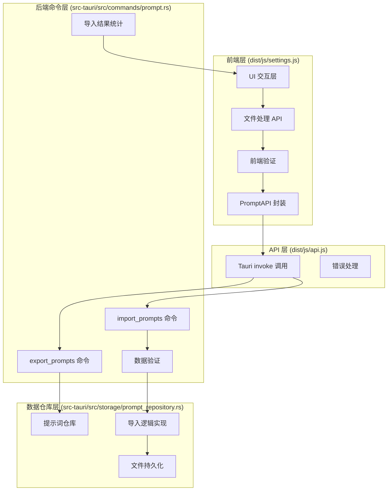

# 提示词导入导出功能技术实现分析

## 1. Purpose

深度分析 SystemPromptVault 项目中现有提示词导入导出功能的完整技术实现，提取可复用的代码模式、架构设计和数据验证机制，为客户端管理tab的导入导出功能开发提供技术参考。

## 2. How it Works

### 2.1 导入导出架构概览



### 2.2 前端导入导出实现细节

#### 2.2.1 导出功能实现 (dist/js/settings.js:1612-1631)

```javascript
const handleExportPrompts = async () => {
  try {
    // 1. 调用后端 API 获取导出数据
    const data = await withLoading(async () => PromptAPI.exportPrompts());

    // 2. 创建 Blob 对象，指定 JSON 格式和 UTF-8 编码
    const blob = new Blob([data], { type: "application/json;charset=utf-8" });

    // 3. 创建临时下载链接
    const url = URL.createObjectURL(blob);
    const link = document.createElement("a");
    link.href = url;

    // 4. 生成带时间戳的文件名
    link.download = `prompts_backup_${formatExportTimestamp()}.json`;

    // 5. 触发下载并清理资源
    document.body.appendChild(link);
    link.click();
    document.body.removeChild(link);
    URL.revokeObjectURL(url);

    showToast(t("toast.promptsExported", "Prompts exported"), "success");
  } catch (error) {
    showToast(
      getErrorMessage(error) || t("toast.exportPromptsFailed", "Failed to export prompts"),
      "error"
    );
  }
};
```

#### 2.2.2 导入功能实现 (dist/js/settings.js:1633-1656)

```javascript
const handleImportFileChange = async (event) => {
  const file = event.target?.files?.[0];
  if (!file) return;

  try {
    // 1. 读取文件内容
    const content = await file.text();

    // 2. 前端基础数据验证
    validateImportPayload(content);

    // 3. 调用后端导入 API 并重新加载数据
    const importResult = await withLoading(async () => {
      const result = await PromptAPI.importPrompts(content);
      await loadPrompts(); // 重新加载提示词列表以反映变更
      return result;
    });

    // 4. 显示导入结果统计
    const { total = 0, added = 0, updated = 0 } = importResult || {};
    showToast(formatImportResultMessage(total, added, updated), "success");
  } catch (error) {
    showToast(
      getErrorMessage(error) || t("toast.importPromptsFailed", "Failed to import prompts"),
      "error"
    );
  } finally {
    // 5. 清空文件选择器，允许重复选择同一文件
    if (event.target) {
      event.target.value = "";
    }
  }
};
```

#### 2.2.3 前端数据验证逻辑 (dist/js/settings.js:1680-1695)

```javascript
const validateImportPayload = (jsonText) => {
  // 1. 基础空值检查
  if (!jsonText.trim()) {
    throw new Error(t("errors.importFileEmpty", "Import file is empty"));
  }

  let parsed;
  try {
    // 2. JSON 格式解析
    parsed = JSON.parse(jsonText);
  } catch (error) {
    throw new Error(t("errors.importInvalidJson", "Invalid JSON format"));
  }

  // 3. 数据结构验证 - 必须是数组
  if (!Array.isArray(parsed)) {
    throw new Error(
      t("errors.importInvalidStructure", "JSON content must be an array of prompts")
    );
  }
};
```

#### 2.2.4 时间戳格式化函数 (dist/js/settings.js:2277-2283)

```javascript
const formatExportTimestamp = () => {
  const now = new Date();
  const pad = (value) => value.toString().padStart(2, "0");
  // 格式: YYYYMMDD_HHMMSS
  return `${now.getFullYear()}${pad(now.getMonth() + 1)}${pad(now.getDate())}_${pad(
    now.getHours()
  )}${pad(now.getMinutes())}${pad(now.getSeconds())}`;
};
```

#### 2.2.5 导入结果消息格式化 (dist/js/settings.js:1658-1678)

```javascript
const formatImportResultMessage = (total, added, updated) => {
  if (total === 0) {
    return t("toast.importNone", "No prompts were imported");
  }
  if (added === total) {
    return t("toast.importAllNew", "Imported {total} new prompts").replace("{total}", `${total}`);
  }
  if (added === 0) {
    return t("toast.importUpdatedOnly", "Updated {updated} prompts").replace(
      "{updated}",
      `${updated}`
    );
  }
  return t(
    "toast.importMixed",
    "Imported {total} prompts ({added} new, {updated} updated)"
  )
    .replace("{total}", `${total}`)
    .replace("{added}", `${added}`)
    .replace("{updated}", `${updated}`);
};
```

### 2.3 API 层封装实现 (dist/js/api.js:18-20)

```javascript
export const PromptAPI = {
  // ... 其他 API 方法
  exportPrompts: () => call("export_prompts"),
  importPrompts: (jsonData) => call("import_prompts", { jsonData }),
};
```

### 2.4 后端命令实现

#### 2.4.1 导入结果数据结构 (src-tauri/src/commands/prompt.rs:9-14)

```rust
#[derive(Debug, Clone, Serialize, Deserialize)]
pub struct ImportResult {
    pub total: usize,    // 处理的提示词总数
    pub added: usize,    // 新增的提示词数量
    pub updated: usize,  // 更新的提示词数量
}
```

#### 2.4.2 导出命令实现 (src-tauri/src/commands/prompt.rs:118-125)

```rust
#[tauri::command]
pub fn export_prompts(
    repository: State<'_, Arc<Mutex<PromptRepository>>>,
) -> Result<String, String> {
    // 1. 获取所有提示词数据
    let repo = lock_repo(&repository)?;
    let prompts = repo.get_all()?;

    // 2. 序列化为格式化的 JSON 字符串
    serde_json::to_string_pretty(&prompts)
        .map_err(|e| format!("序列化提示词失败: {}", e))
}
```

#### 2.4.3 导入命令实现 (src-tauri/src/commands/prompt.rs:127-142)

```rust
#[tauri::command]
pub fn import_prompts(
    repository: State<'_, Arc<Mutex<PromptRepository>>>,
    json_data: String,
) -> Result<ImportResult, String> {
    // 1. 解析和验证导入数据
    let prompts = parse_and_validate_prompts(&json_data)?;
    if prompts.is_empty() {
        return Ok(ImportResult {
            total: 0,
            added: 0,
            updated: 0,
        });
    }

    // 2. 执行导入逻辑
    let mut repo = lock_repo(&repository)?;
    repo.import_prompts(prompts)
}
```

#### 2.4.4 数据解析和深度验证 (src-tauri/src/commands/prompt.rs:144-161)

```rust
fn parse_and_validate_prompts(json_data: &str) -> Result<Vec<Prompt>, String> {
    let trimmed = json_data.trim();
    if trimmed.is_empty() {
        return Err("导入数据不能为空".to_string());
    }

    // 1. JSON 解析
    let value: Value = serde_json::from_str(trimmed)
        .map_err(|e| format!("解析提示词 JSON 失败: {}", e))?;

    // 2. 数组结构验证
    let entries = value.as_array()
        .ok_or_else(|| "导入数据必须是提示词数组".to_string())?;

    // 3. 逐条字段验证
    validate_prompt_entries(entries)?;

    // 4. 转换为 Prompt 对象
    let prompts: Vec<Prompt> = serde_json::from_value(value)
        .map_err(|e| format!("转换提示词数据失败: {}", e))?;

    // 5. 数据模型验证
    validate_prompt_models(&prompts)?;

    Ok(prompts)
}
```

#### 2.4.5 字段级别的详细验证 (src-tauri/src/commands/prompt.rs:163-201)

```rust
fn validate_prompt_entries(entries: &[Value]) -> Result<(), String> {
    for (index, entry) in entries.iter().enumerate() {
        let obj = entry.as_object()
            .ok_or_else(|| format!("第{}个条目必须是对象", index + 1))?;

        // 验证必需的字段类型和内容
        ensure_string_field(obj, "id", index)?;
        ensure_string_field(obj, "name", index)?;
        ensure_string_field(obj, "content", index)?;
        ensure_array_field(obj, "tags", index)?;
        ensure_string_field(obj, "created_at", index)?;
        ensure_string_field(obj, "updated_at", index)?;
    }
    Ok(())
}

fn ensure_string_field(
    obj: &serde_json::Map<String, Value>,
    field: &str,
    index: usize,
) -> Result<(), String> {
    match obj.get(field) {
        Some(Value::String(value)) if !value.trim().is_empty() => Ok(()),
        Some(Value::String(_)) => Err(format!(
            "第{}个提示词的{}不能为空",
            index + 1,
            field_label(field)
        )),
        Some(_) => Err(format!(
            "第{}个提示词的{}格式错误",
            index + 1,
            field_label(field)
        )),
        None => Err(format!(
            "第{}个提示词缺少{}字段",
            index + 1,
            field_label(field)
        )),
    }
}
```

### 2.5 数据仓库层导入逻辑 (src-tauri/src/storage/prompt_repository.rs:61-91)

```rust
impl PromptRepository {
    pub fn import_prompts(&mut self, prompts: Vec<Prompt>) -> Result<ImportResult, String> {
        if prompts.is_empty() {
            return Ok(ImportResult {
                total: 0,
                added: 0,
                updated: 0,
            });
        }

        let mut merged = self.prompts.clone();
        let mut added = 0usize;
        let mut updated = 0usize;

        // 逐条处理导入的提示词
        for prompt in prompts {
            if merged.contains_key(&prompt.id) {
                // ID 已存在 - 更新现有记录
                updated += 1;
            } else {
                // ID 不存在 - 添加新记录
                added += 1;
            }
            merged.insert(prompt.id.clone(), prompt);
        }

        // 原子性写入文件
        let merged_list: Vec<Prompt> = merged.values().cloned().collect();
        let content = serde_json::to_string_pretty(&merged_list)
            .map_err(|e| format!("序列化提示词失败: {}", e))?;
        atomic_write(&self.path, &content)?;

        // 更新内存状态
        self.prompts = merged;

        Ok(ImportResult {
            total: added + updated,
            added,
            updated,
        })
    }
}
```

## 3. Relevant Code Modules

### 前端核心模块
- `dist/js/settings.js:1612-1678` - 导入导出 UI 逻辑实现
- `dist/js/settings.js:1680-1695` - 前端数据验证逻辑
- `dist/js/settings.js:2277-2283` - 时间戳格式化工具函数
- `dist/js/api.js:18-20` - API 调用封装层

### 后端核心模块
- `src-tauri/src/commands/prompt.rs:118-251` - 导入导出命令实现
- `src-tauri/src/storage/prompt_repository.rs:61-91` - 数据仓库导入逻辑
- `src-tauri/src/models/prompt.rs` - 提示词数据模型定义

### 关键数据结构
- `ImportResult` - 导入操作统计结果
- `Prompt` - 提示词数据模型
- `ClientConfig` - 客户端配置数据模型 (可复用)

## 4. Attention

### 4.1 数据安全注意事项

1. **多层验证机制**: 前端初步验证 + 后端深度验证，确保数据安全性
2. **原子性操作**: 使用 `atomic_write` 确保文件写入的原子性，避免数据损坏
3. **内存状态同步**: 文件写入成功后立即更新内存状态，保证数据一致性
4. **错误边界处理**: 每个操作步骤都有详细的错误处理和用户友好的错误提示

### 4.2 用户体验设计

1. **操作反馈**: 清晰的成功/失败状态提示，包含详细的操作统计信息
2. **文件命名**: 自动生成带时间戳的有意义文件名，便于管理
3. **加载状态**: 使用 `withLoading` 包装器提供加载指示器
4. **重复操作支持**: 导入后清空文件选择器，允许重复选择同一文件

### 4.3 代码设计模式

1. **分层架构**: UI层 → API层 → 命令层 → 仓库层，职责清晰分离
2. **错误传播**: 使用 `Result<T, String>` 进行统一的错误处理和传播
3. **资源管理**: 及时释放 Blob URL 等浏览器资源
4. **国际化支持**: 所有用户界面文本都通过 `t()` 函数进行国际化

### 4.4 可复用的技术模式

1. **文件处理模式**: Blob创建 → URL生成 → 下载触发 → 资源清理
2. **数据验证模式**: 基础验证 → 结构验证 → 字段验证 → 模型验证
3. **导入统计模式**: 总数统计 → 新增/更新分类 → 详细结果反馈
4. **API封装模式**: 统一的调用接口 → 错误处理 → 参数转换

这些设计模式和实现细节可以直接应用到客户端管理tab的导入导出功能开发中。