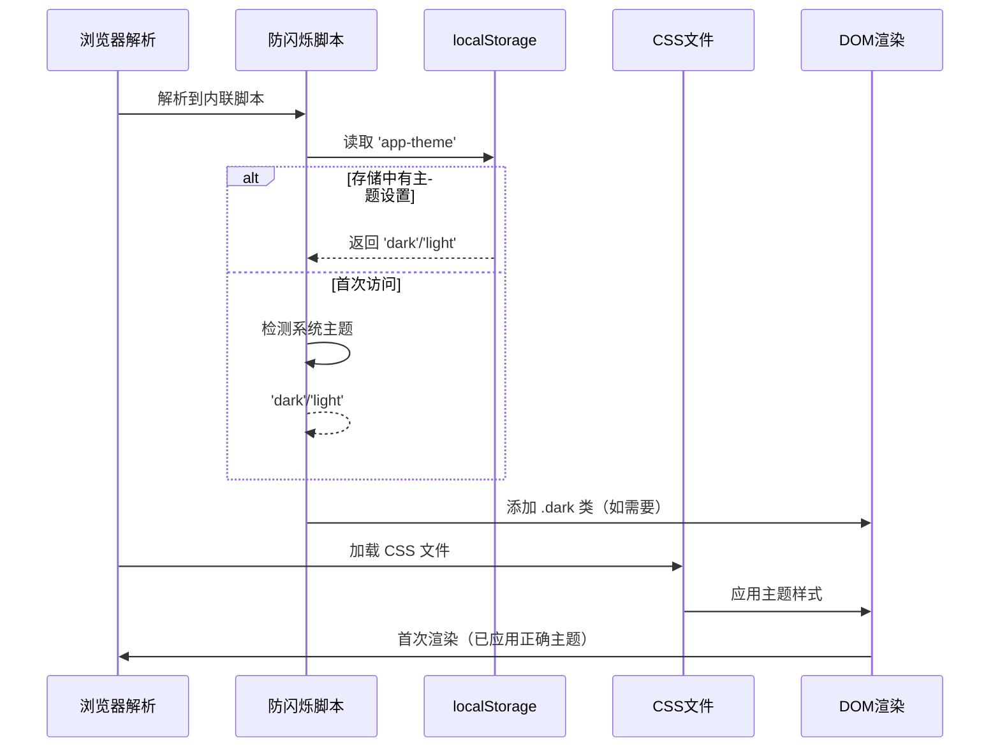

# 主题防闪烁模式分析

## 1. Purpose

深入分析 SystemPromptVault 主题系统的防闪烁（FOUC - Flash of Unstyled Content）实现机制，提取核心设计模式，为 i18n 系统的防闪烁实现提供可复用的技术方案和最佳实践。

## 2. How it Works

### 2.1 主题防闪烁脚本核心实现

```html
<!-- 防止主题闪烁 - 必须在页面渲染前执行 -->
<script>
  (function() {
    const theme = localStorage.getItem('app-theme') ||
      (window.matchMedia('(prefers-color-scheme: dark)').matches ? 'dark' : 'light');
    if (theme === 'dark') {
      document.documentElement.classList.add('dark');
    }
  })();
</script>
<link rel="stylesheet" href="css/output.css" />
```

**位置要求**：
- `<head>` 部分的最前端
- 所有 CSS 文件加载之前
- 不使用 `async` 或 `defer` 属性
- 同步执行确保在页面渲染前生效

### 2.2 主题防闪烁机制流程



### 2.3 主题常量与存储机制

```javascript
// theme.js 中的常量定义
const THEME_KEY = 'app-theme';
const THEME_DARK = 'dark';
const THEME_LIGHT = 'light';
```

**存储键名规范**：
- 使用应用前缀：`app-theme`
- 简洁明确的值：`'dark'` / `'light'`
- 与常量定义保持一致

### 2.4 主题获取优先级逻辑

```javascript
// 防闪烁脚本中的逻辑
const theme = localStorage.getItem('app-theme') ||
  (window.matchMedia('(prefers-color-scheme: dark)').matches ? 'dark' : 'light');
```

**优先级顺序**：
1. 用户手动设置的主题（localStorage）
2. 系统主题偏好（matchMedia）
3. 默认回退到亮色主题

### 2.5 主题应用方式

```javascript
// 防闪烁脚本中的应用方式
if (theme === 'dark') {
  document.documentElement.classList.add('dark');
}
```

**应用机制**：
- 操作 `document.documentElement`（HTML 元素）
- 添加 CSS 类名而非直接修改样式
- 与 Tailwind CSS 的 `darkMode: 'class'` 配置配合

### 2.6 与主题系统模块的协同

```javascript
// theme.js 中的 getCurrentTheme 函数
export function getCurrentTheme() {
  const stored = localStorage.getItem(THEME_KEY);
  if (stored === THEME_DARK || stored === THEME_LIGHT) {
    return stored;
  }
  return window.matchMedia('(prefers-color-scheme: dark)').matches ? THEME_DARK : THEME_LIGHT;
}
```

**一致性保证**：
- 防闪烁脚本与主题模块使用相同的逻辑
- 相同的存储键名和主题值
- 相同的优先级判断顺序

### 2.7 Tailwind CSS 集成配置

```javascript
// tailwind.config.js
module.exports = {
  darkMode: 'class',  // 通过 .dark 类控制暗色模式
  content: ["./dist/**/*.{html,js}"],
  // ...
}
```

**集成要点**：
- 使用 `class` 模式而非 `media` 模式
- 通过 `.dark` 类名激活暗色样式
- 所有 `dark:` 前缀的样式自动响应

### 2.8 CSS 主题变量系统

```css
/* 亮色主题变量 */
:root {
  --color-bg: #f5f5f5;
  --color-surface: #ffffff;
  --color-text: #333333;
}

/* 暗色主题变量覆盖 */
.dark {
  --color-bg: #0f0f0f;
  --color-surface: #1a1a1a;
  --color-text: #e8e8e8;
}
```

## 3. Relevant Code Modules

### 防闪烁脚本位置
- `dist/index.html:8-16`: 主页面防闪烁脚本
- `dist/settings.html:8-16`: 设置页面防闪烁脚本

### 主题系统核心
- `dist/js/theme.js:2-4`: 主题常量定义
- `dist/js/theme.js:20-27`: 主题获取逻辑（与防闪烁脚本一致）
- `dist/js/theme.js:32-40`: 主题应用逻辑

### 配置文件
- `tailwind.config.js`: Tailwind CSS `darkMode: 'class'` 配置
- `dist/css/main.css`: CSS 主题变量定义

## 4. Attention

### 实现注意事项

1. **执行时机关键**：脚本必须在 CSS 文件加载前同步执行
2. **DOM 元素选择**：使用 `document.documentElement` 确保 HTML 元素获得类名
3. **存储一致性**：防闪烁脚本与主题模块使用相同的存储键名
4. **逻辑一致性**：主题获取和应用的逻辑必须完全一致
5. **浏览器兼容性**：使用基础的 localStorage 和 matchMedia API

### 性能优化要点

1. **同步执行**：避免异步加载导致的渲染延迟
2. **最小化脚本**：只包含必要的主题检测和应用逻辑
3. **缓存优化**： localStorage 读取速度快，无性能问题
4. **CSS 优化**：类名切换由浏览器原生优化

### 维护注意事项

1. **代码重复**：防闪烁脚本与主题模块存在逻辑重复，需要保持同步
2. **常量维护**：主题键名和值必须在多处保持一致
3. **测试要求**：需要在首次访问和返回用户场景下测试
4. **浏览器支持**：确保目标浏览器支持所需 API

### 集成注意事项

1. **构建流程**：防闪烁脚本需要在构建过程中注入到 HTML 模板
2. **多页面支持**：每个 HTML 页面都需要包含防闪烁脚本
3. **样式加载顺序**：确保 CSS 文件在防闪烁脚本之后加载
4. **调试友好**：脚本简洁便于调试和维护

## 5. 可复用的设计模式

### 5.1 内联脚本防闪烁模式

**核心思想**：在页面渲染前通过内联脚本预先应用用户偏好

**模式结构**：
```html
<script>
  (function() {
    const preference = getStoredPreference() || detectSystemPreference();
    applyPreference(preference);
  })();
</script>
<link rel="stylesheet" href="styles.css" />
```

**适用场景**：
- 主题切换系统
- 语言切换系统
- 布局模式切换
- 任何需要避免 FOUC 的偏好设置

### 5.2 优先级决策模式

**三层决策结构**：
1. 用户显式设置（localStorage）
2. 系统自动检测（系统 API）
3. 默认回退值（硬编码常量）

**实现模板**：
```javascript
const preference = localStorage.getItem('app-key') ||
  (systemDetection() ? 'value1' : 'value2');
```

### 5.3 类名控制模式

**控制方式**：通过添加/移除 CSS 类名来激活不同的样式集合

**优势**：
- 与 CSS 框架深度集成
- 支持复杂的样式切换逻辑
- 性能优秀，浏览器原生支持
- 便于维护和扩展

### 5.4 一致性保证模式

**多模块一致性**：
- 常量定义统一
- 存储键名统一
- 逻辑判断统一
- 应用方式统一

**实现策略**：
- 在核心模块中定义常量
- 防闪烁脚本复用相同的逻辑
- 通过测试确保一致性