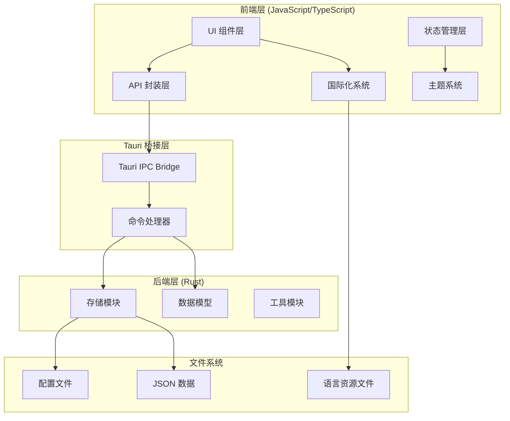
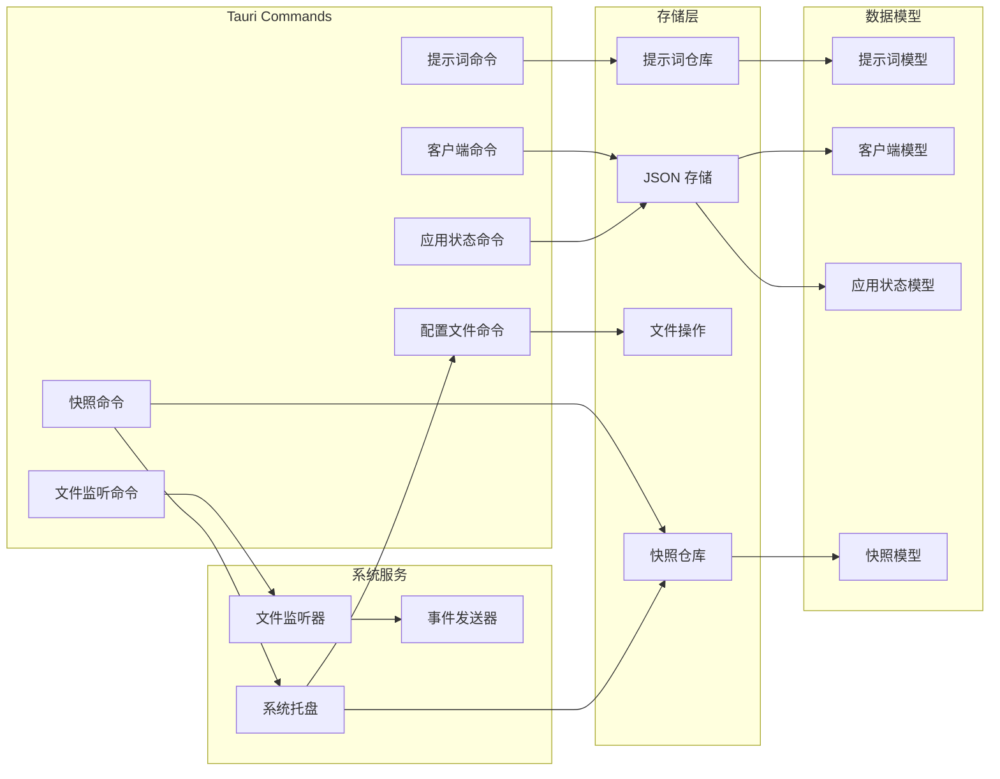

# SystemPromptVault 整体架构设计

## 1. Purpose

SystemPromptVault 是一个基于 Tauri v2 的桌面应用，用于管理和快速应用系统提示词。本文档描述系统的整体架构设计、技术栈选择、模块划分和数据流。

## 2. How it Works

### 2.1 技术栈架构



### 2.2 前端模块化架构

- **`dist/js/main.js`**: 主应用模块，包含应用初始化、状态管理、UI 渲染、i18n 集成
- **`dist/js/settings.js`**: 设置页面模块，管理提示词和客户端的 CRUD 操作、窗口生命周期管理、UI交互优化、语言设置界面
- **`dist/js/api.js`**: API 封装模块，统一处理 Tauri 命令调用
- **`dist/js/theme.js`**: 主题管理模块，处理暗色/亮色主题切换
- **`dist/js/i18n.js`**: 国际化模块，提供多语言支持、语言检测、DOM 自动更新、跨窗口同步
- **`dist/js/utils.js`**: 工具函数模块，提供通用工具方法、Toast 系统

### 2.3 Vite 构建流程架构

```mermaid
graph LR
    subgraph "源文件 (dist/)"
        HTML[HTML文件]
        JS[JavaScript模块]
        CSS[CSS样式]
    end

    subgraph "Vite 构建系统"
        ViteConfig[vite.config.js]
        DevServer[开发服务器 HMR]
        LegacyPlugin[@vitejs/plugin-legacy]
        Bundler[Rollup打包器]
    end

    subgraph "构建产物 (build/)"
        BundledHTML[优化后HTML]
        ModernBundle[现代浏览器Bundle]
        LegacyBundle[Legacy浏览器Bundle]
        OptimizedCSS[优化后CSS]
    end

    subgraph "Tauri 集成"
        TauriDev[tauri dev]
        TauriBuild[tauri build]
    end

    HTML --> ViteConfig
    JS --> ViteConfig
    CSS --> ViteConfig

    ViteConfig --> DevServer
    ViteConfig --> LegacyPlugin
    ViteConfig --> Bundler

    DevServer --> TauriDev
    Bundler --> ModernBundle
    LegacyPlugin --> LegacyBundle
    Bundler --> OptimizedCSS
    Bundler --> BundledHTML

    BundledHTML --> TauriBuild
    ModernBundle --> TauriBuild
    LegacyBundle --> TauriBuild
    OptimizedCSS --> TauriBuild
```

**构建命令**:
- `bun run dev`: 启动Vite开发服务器（HMR热重载，localhost:1420）
- `bun run build`: 生产构建（代码压缩、Tree-shaking、资源优化）
- `bun run preview`: 预览生产构建结果

**Tauri 集成自动化构建**:

Vite 构建已集成到 Tauri 的开发和生产构建流程中（`src-tauri/tauri.conf.json`）：

```json
{
  "build": {
    "beforeDevCommand": "bun run dev",
    "beforeBuildCommand": "bun run build",
    "frontendDist": "../build",
    "devUrl": "http://localhost:1420"
  }
}
```

- 执行 `bun run tauri dev` 时自动启动 Vite 开发服务器
- 执行 `bun run tauri build` 时自动执行 Vite 生产构建
- 开发者无需手动管理前端构建流程

**构建特性**:
- **模块热重载（HMR）**: 代码变更自动刷新，无需重新加载页面
- **代码分割**: 自动按需分割代码，优化加载性能
- **Legacy支持**: 自动生成兼容旧版浏览器的polyfills
- **资源优化**: 自动压缩JS/CSS，资源哈希命名，Tree-shaking
- **快速构建**: 基于esbuild的快速转译和打包

### 2.4 后端命令系统架构



### 2.5 核心数据流

1. **应用初始化流程**:
   ```
   DOM 加载 → i18n 初始化 → 主题初始化 → 元素缓存 → 事件绑定 → 数据加载 →
   启动快照 → 文件监听器 → UI 渲染
   ```

2. **提示词应用流程**:
   ```
   用户点击 → API 调用 → Rust 命令 → 文件写入 → 状态更新 → UI 反馈
   ```

3. **语言切换流程**:
   ```
   用户选择语言 → setLanguage() → 加载语言文件 → 更新 translations →
   localStorage 持久化 → 更新 <html lang> → 更新所有 data-i18n 元素 →
   触发 languageListeners → storage 事件跨窗口同步
   ```

4. **主题切换流程**:
   ```
   用户触发 → 主题计算 → CSS 类更新 → 本地存储 → 图标更新
   ```

5. **快照创建与恢复流程**:
   ```
   手动/自动触发 → 创建快照 → 持久化存储 → FIFO清理 → 刷新托盘菜单
   托盘恢复点击 → 读取快照 → 写入配置 → 发送事件 → 前端重新加载
   ```

6. **文件变化检测流程**:
   ```
   外部修改文件 → 文件监听器检测 → 发送Tauri事件 → 前端Toast提示 →
   用户确认 → 重新加载配置
   ```

7. **Vite 开发构建流程**:
   ```
   开发者修改代码 → Vite HMR检测 → 增量编译 → WebSocket推送 → 浏览器热更新
   ```

### 2.6 状态管理设计

```javascript
// main.js 中的状态结构
const state = {
  clients: [],                // 客户端列表
  currentClientId: "claude",  // 当前选中客户端
  prompts: [],                // 提示词列表
  selectedTags: [],           // 选中的过滤标签
  recentTags: [],             // 最近使用的标签列表（最多5个）
  tagDropdownOpen: false,     // 下拉菜单开关状态
  tagSearchQuery: "",         // 标签搜索关键词
  configContent: "",          // 当前配置文件内容
  splitRatio: 0.5,            // 左右面板分割比例
  editorDirty: false,         // 编辑器是否有未保存修改
  fileChangeToast: null,      // 当前文件变化Toast引用
  editorChangeBlocked: false, // 是否阻塞编辑器变化事件
  monacoEditor: null,         // Monaco编辑器实例
};

// tooltip 状态管理
const tooltipState = {
  activePromptId: null,
  anchorHovered: false,
  tooltipHovered: false,
};

// 本地存储键名
const RECENT_TAGS_KEY = "tagFilterRecentTags";  // 最近使用标签持久化键
const SPLIT_RATIO_KEY = "splitRatio";            // 分割比例持久化键
const LANGUAGE_STORAGE_KEY = "app_language";     // 用户语言选择持久化键（i18n 模块）
```

## 3. Relevant Code Modules

### 前端核心模块
- `dist/js/main.js`: 主应用逻辑、状态管理、UI渲染、快照触发、文件监听管理、i18n 集成
- `dist/js/settings.js`: 设置页面管理、窗口生命周期管理、UI交互优化、快照管理界面、模态框处理、表格渲染、语言设置界面
- `dist/js/i18n.js`: 国际化模块，语言检测、翻译加载、DOM自动更新、跨窗口同步
- `dist/js/theme.js`: 主题切换逻辑、状态持久化
- `dist/js/api.js`: Tauri命令封装、错误处理、SnapshotAPI、ConfigFileAPI
- `dist/js/utils.js`: 工具函数、Toast系统、ActionToast带按钮Toast

### 后端核心模块
- `src-tauri/src/commands/prompt.rs`: 提示词相关命令实现
- `src-tauri/src/commands/snapshot.rs`: 快照Tauri命令接口
- `src-tauri/src/commands/file_watcher.rs`: 文件监听Tauri命令接口
- `src-tauri/src/commands/config_file.rs`: 配置文件读写命令
- `src-tauri/src/commands/mod.rs`: 命令模块入口
- `src-tauri/src/storage/prompt_repository.rs`: 提示词数据仓库
- `src-tauri/src/storage/snapshot_repository.rs`: 快照仓库、FIFO清理策略
- `src-tauri/src/storage/json_store.rs`: JSON存储抽象层
- `src-tauri/src/file_watcher.rs`: 文件监听器核心实现
- `src-tauri/src/tray.rs`: System Tray完整实现、菜单构建、事件处理、通知系统
- `src-tauri/src/models/snapshot.rs`: 快照数据模型
- `src-tauri/src/main.rs`: 应用入口、状态管理、托盘初始化

### 配置文件
- `src-tauri/tauri.conf.json`: Tauri应用配置、安全权限配置、Vite集成配置
- `vite.config.js`: Vite构建配置、开发服务器、legacy插件
- `tailwind.config.js`: Tailwind CSS主配置文件、主题扩展、内容扫描路径
- `postcss.config.js`: PostCSS配置、Tailwind和Autoprefixer集成
- `package.json`: 包管理、构建脚本定义（`dev`, `build`, `preview`）
- `dist/index.html`: 主页面结构、data-i18n 属性支持
- `dist/settings.html`: 设置页面结构、语言设置界面、data-i18n 属性支持
- `dist/locales/en.json`: 英文翻译资源文件（228行）
- `dist/locales/zh.json`: 中文翻译资源文件（228行）

### 样式文件
- `dist/css/tailwind.css`: Tailwind CSS源文件、基础层、组件层、工具层
- `dist/css/output.css`: 编译产物（由Tailwind CLI生成）
- `dist/css/main.css`: 自定义CSS、主题变量、特殊样式
- `dist/css/components.css`: 组件样式定义、Toast样式、按钮样式

### 构建输出
- `build/`: Vite构建输出目录（生产构建）
- `build/assets/`: 打包后的JS和CSS资源（哈希命名）

## 4. Attention

### 架构注意事项

1. **模块职责分离**: 前端模块按功能划分，避免循环依赖
2. **状态管理集中**: 主要状态在 `main.js` 中集中管理，避免状态碎片化
3. **错误处理统一**: API 层统一处理错误，前端显示友好的错误信息
4. **主题系统解耦**: 主题管理独立模块，支持系统主题自动切换

### 性能注意事项

1. **防抖机制**: tooltip 显示/隐藏使用防抖，避免频繁 DOM 操作
2. **事件委托**: 使用事件委托处理动态生成的元素事件
3. **原子操作**: 文件写入使用原子操作，避免数据损坏
4. **内存管理**: 及时清理定时器和事件监听器

### 安全注意事项

1. **输入验证**: 前后端双重验证用户输入
2. **文件路径**: 使用 Tauri 的安全文件系统 API
3. **权限控制**: 通过 Tauri capabilities 系统控制文件访问权限