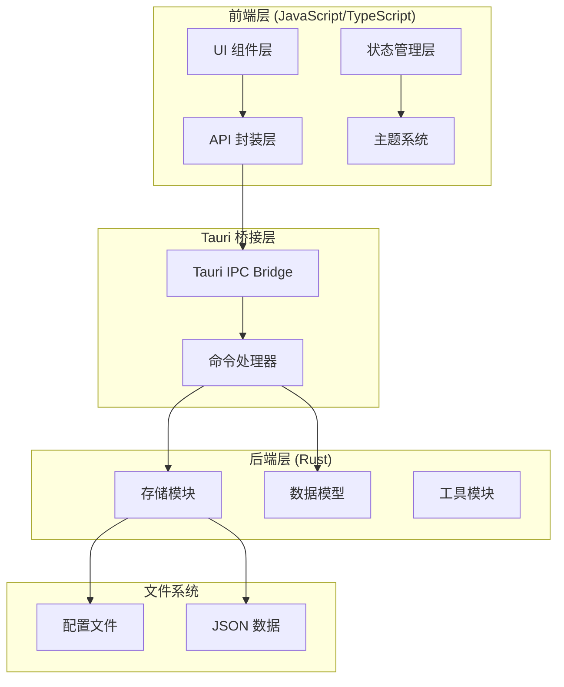
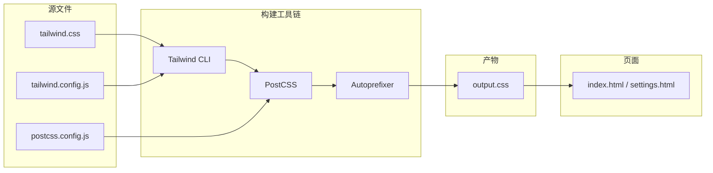
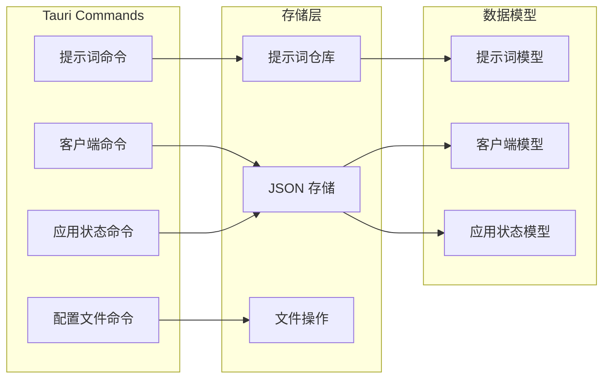

# SystemPromptVault 整体架构设计

## 1. Purpose

SystemPromptVault 是一个基于 Tauri v2 的桌面应用，用于管理和快速应用系统提示词。本文档描述系统的整体架构设计、技术栈选择、模块划分和数据流。

## 2. How it Works

### 2.1 技术栈架构



### 2.2 前端模块化架构

- **`dist/js/main.js`**: 主应用模块，包含应用初始化、状态管理、UI 渲染
- **`dist/js/settings.js`**: 设置页面模块，管理提示词和客户端的 CRUD 操作
- **`dist/js/api.js`**: API 封装模块，统一处理 Tauri 命令调用
- **`dist/js/theme.js`**: 主题管理模块，处理暗色/亮色主题切换
- **`dist/js/utils.js`**: 工具函数模块，提供通用工具方法

### 2.3 CSS 构建流程架构



**构建命令**:
- `bun run build:css`: 生产构建（压缩、Tree Shaking）
- `bun run watch:css`: 开发模式（实时监听文件变化）

**Tauri 集成自动化构建**:

Tailwind CSS 构建已集成到 Tauri 的开发和生产构建流程中（`src-tauri/tauri.conf.json`）：

```json
{
  "build": {
    "beforeDevCommand": "bun run watch:css",
    "beforeBuildCommand": "bun run build:css"
  }
}
```

- 执行 `cargo tauri dev` 时自动启动 CSS 实时监听
- 执行 `cargo tauri build` 时自动生成优化的 CSS
- 开发者无需手动管理 CSS 构建流程

**构建特性**:
- **按需生成**: 仅生成 HTML/JS 中实际使用的 Tailwind 类
- **暗色模式**: 支持 `dark:` 前缀和 `.dark` 类切换
- **自动前缀**: Autoprefixer 自动添加浏览器兼容性前缀
- **压缩优化**: 生产构建启用 `--minify` 参数

### 2.4 后端命令系统架构



### 2.5 核心数据流

1. **应用初始化流程**:
   ```
   DOM 加载 → 主题初始化 → 元素缓存 → 事件绑定 → 数据加载 → UI 渲染
   ```

2. **提示词应用流程**:
   ```
   用户点击 → API 调用 → Rust 命令 → 文件写入 → 状态更新 → UI 反馈
   ```

3. **主题切换流程**:
   ```
   用户触发 → 主题计算 → CSS 类更新 → 本地存储 → 图标更新
   ```

4. **CSS 构建流程**:
   ```
   开发者修改 → Tailwind CLI 监听 → 扫描文件 → 生成样式 → PostCSS 处理 → 输出产物
   ```

### 2.6 状态管理设计

```javascript
// main.js 中的状态结构
const state = {
  clients: [],           // 客户端列表
  currentClientId: "claude", // 当前选中客户端
  prompts: [],           // 提示词列表
  selectedTags: [],      // 选中的过滤标签
  recentTags: [],        // 最近使用的标签列表（最多5个）
  tagDropdownOpen: false, // 下拉菜单开关状态
  tagSearchQuery: "",    // 标签搜索关键词
  configContent: "",     // 当前配置文件内容
  splitRatio: 0.5,       // 左右面板分割比例
};

// tooltip 状态管理
const tooltipState = {
  activePromptId: null,
  anchorHovered: false,
  tooltipHovered: false,
};

// 本地存储键名
const RECENT_TAGS_KEY = "tagFilterRecentTags";  // 最近使用标签持久化键
const SPLIT_RATIO_KEY = "splitRatio";            // 分割比例持久化键
```

## 3. Relevant Code Modules

### 前端核心模块
- `dist/js/main.js`: 主应用逻辑、状态管理、UI 渲染
- `dist/js/settings.js`: 设置页面管理、模态框处理、表格渲染
- `dist/js/theme.js`: 主题切换逻辑、状态持久化
- `dist/js/api.js`: Tauri 命令封装、错误处理

### 后端核心模块
- `src-tauri/src/commands/prompt.rs`: 提示词相关命令实现
- `src-tauri/src/commands/mod.rs`: 命令模块入口
- `src-tauri/src/storage/prompt_repository.rs`: 提示词数据仓库
- `src-tauri/src/storage/json_store.rs`: JSON 存储抽象层

### 配置文件
- `src-tauri/tauri.conf.json`: Tauri 应用配置
- `tailwind.config.js`: Tailwind CSS 主配置文件，定义主题扩展和内容扫描路径
- `postcss.config.js`: PostCSS 配置，集成 Tailwind 和 Autoprefixer
- `package.json`: NPM 构建脚本定义（`build:css`, `watch:css`）
- `dist/index.html`: 主页面结构
- `dist/settings.html`: 设置页面结构

### 样式文件
- `dist/css/tailwind.css`: Tailwind CSS 源文件，包含基础层、组件层和工具层
- `dist/css/output.css`: 编译产物（由 Tailwind CLI 生成，不应手动修改）
- `dist/css/main.css`: 自定义 CSS，定义主题变量和特殊样式
- `dist/css/components.css`: 组件样式定义

## 4. Attention

### 架构注意事项

1. **模块职责分离**: 前端模块按功能划分，避免循环依赖
2. **状态管理集中**: 主要状态在 `main.js` 中集中管理，避免状态碎片化
3. **错误处理统一**: API 层统一处理错误，前端显示友好的错误信息
4. **主题系统解耦**: 主题管理独立模块，支持系统主题自动切换

### 性能注意事项

1. **防抖机制**: tooltip 显示/隐藏使用防抖，避免频繁 DOM 操作
2. **事件委托**: 使用事件委托处理动态生成的元素事件
3. **原子操作**: 文件写入使用原子操作，避免数据损坏
4. **内存管理**: 及时清理定时器和事件监听器

### 安全注意事项

1. **输入验证**: 前后端双重验证用户输入
2. **文件路径**: 使用 Tauri 的安全文件系统 API
3. **权限控制**: 通过 Tauri capabilities 系统控制文件访问权限