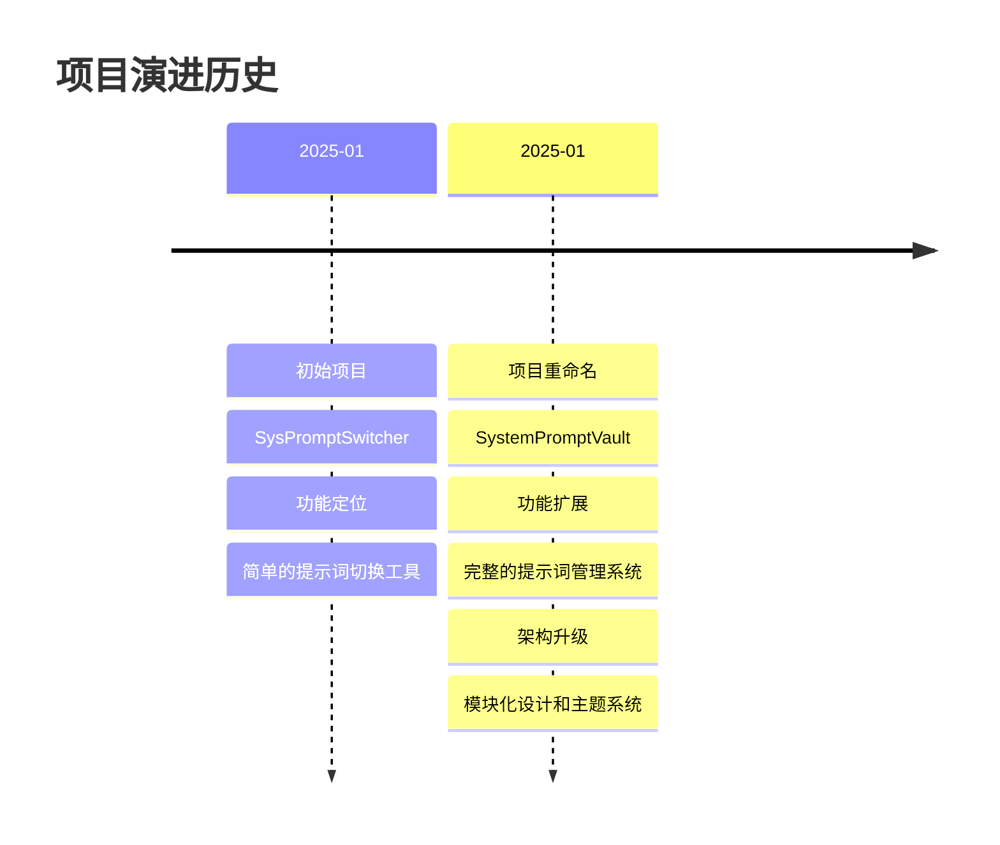

# 项目命名规范与演进历史

## 1. Purpose

本文档记录 SystemPromptVault 项目的命名规范和项目演进历史，包括项目重命名的背景、影响范围和迁移指南。

## 2. How it Works

### 2.1 项目演进历史



### 2.2 命名变更对比

| 维度 | 旧名称 | 新名称 | 变更原因 |
|------|--------|--------|----------|
| 项目名称 | SysPromptSwitcher | SystemPromptVault | 更准确反映功能定位 |
| 应用标识符 | com.example.sysprompt-switcher | com.example.systemprompt-vault | 保持一致性 |
| 产品名称 | SysPrompt Switcher | System Prompt Vault | 品牌升级 |
| 窗口标题 | SysPrompt Switcher | System Prompt Vault | UI 统一 |
| 包名称 | sysprompt-switcher | systemprompt-vault | 技术规范 |

### 2.3 影响范围分析

#### 配置文件变更

```json
// src-tauri/tauri.conf.json
{
  "productName": "SystemPromptVault",  // 从 SysPromptSwitcher 更改
  "identifier": "com.example.systemprompt-vault",  // 从 com.example.sysprompt-switcher 更改
  "app": {
    "windows": [{
      "title": "System Prompt Vault"  // 从 SysPrompt Switcher 更改
    }]
  }
}
```

#### Cargo 配置变更

```toml
# src-tauri/Cargo.toml
[package]
name = "systemprompt-vault"  # 从 sysprompt-switcher 更改
```

#### HTML 标题变更

```html
<!-- dist/index.html -->
<title>System Prompt Vault</title>  <!-- 从 SysPrompt Switcher 更改 -->
```

### 2.4 命名规范定义

#### 包名称规范

- **格式**: 全小写，使用连字符分隔
- **示例**: `systemprompt-vault`
- **适用**: package.json, Cargo.toml

#### 应用标识符规范

- **格式**: 反向域名格式，全小写，使用连字符
- **示例**: `com.example.systemprompt-vault`
- **适用**: tauri.conf.json 中的 identifier 字段

#### 产品名称规范

- **格式**: 首字母大写，空格分隔单词
- **示例**: `System Prompt Vault`
- **适用**: 用户界面、窗口标题、文档

#### 目录名称规范

- **格式**: 全小写，可使用连字符或驼峰
- **示例**: `SystemPromptVault` (仓库名), `systemprompt-vault` (包名)
- **适用**: 文件系统路径

### 2.5 迁移检查清单

#### 必需变更项

- [x] `src-tauri/tauri.conf.json` - productName, identifier, window title
- [x] `src-tauri/Cargo.toml` - package name, lib name
- [x] `package.json` - name 字段
- [x] `dist/index.html` - title 标签
- [x] `dist/settings.html` - title 标签
- [x] `README.md` - 项目名称和描述

#### 可选变更项

- [ ] Git 仓库名称（如需要）
- [ ] CI/CD 配置文件
- [ ] 部署脚本
- [ ] 文档引用

#### 数据迁移项

- [ ] 应用数据目录（根据操作系统自动处理）
- [ ] 本地存储数据（可能需要手动迁移）
- [ ] 配置文件路径（可能需要更新）

## 3. Relevant Code Modules

### 配置文件
- `src-tauri/tauri.conf.json`: Tauri 应用配置，包含产品名称和标识符
- `src-tauri/Cargo.toml`: Rust 包配置，包含包名称
- `package.json`: Node.js 包配置，包含项目名称

### HTML 文件
- `dist/index.html`: 主页面，包含窗口标题
- `dist/settings.html`: 设置页面，包含窗口标题

### 文档文件
- `README.md`: 项目说明文档
- `TROUBLESHOOTING.md`: 故障排除文档

### 相关路径
- `llmdoc/agent/`: Agent 生成的文档，可能包含旧项目名称引用

## 4. Attention

### 命名一致性原则

1. **跨平台一致性**: 确保所有平台使用相同的命名约定
2. **配置同步**: 所有配置文件中的名称保持同步
3. **用户可见性**: 用户界面使用友好的产品名称
4. **技术规范**: 包名称和标识符遵循技术规范

### 向后兼容性

1. **数据目录**: Tauri 应用数据目录由 identifier 决定，重命名可能导致数据路径变化
2. **本地存储**: localStorage 数据不受项目名称影响
3. **配置文件**: 如果配置文件路径包含项目名称，需要考虑迁移
4. **用户通知**: 重大命名变更应通知用户

### 重命名风险

1. **应用数据丢失**: identifier 变更可能导致应用数据目录变化
2. **配置不一致**: 部分配置未同步更新可能导致混淆
3. **文档过时**: 旧文档中的项目名称需要更新
4. **用户困惑**: 频繁的命名变更可能导致用户困惑

### 最佳实践

1. **一次性完成**: 重命名应一次性完成所有必要的变更
2. **版本标记**: 在版本号中标记重大命名变更
3. **迁移指南**: 提供清晰的用户数据迁移指南
4. **文档更新**: 同步更新所有相关文档