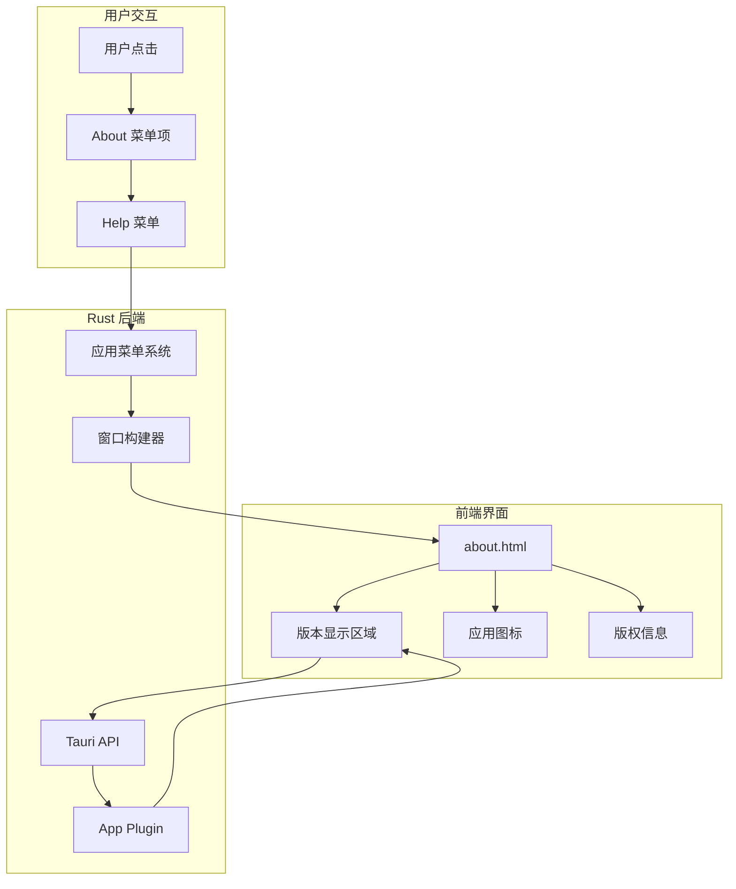

# About 窗口功能

## 1. Purpose

About 窗口功能提供应用信息展示，包括应用图标、版本号和版权信息。该窗口通过系统应用菜单访问，采用极简设计风格，通过 Tauri API 动态获取版本号，确保信息准确性。

## 2. How it Works

### 2.1 技术架构



### 2.2 窗口创建流程

#### 2.2.1 菜单项处理

```rust
// src-tauri/src/app_menu.rs
"about" => {
    show_about_dialog(app_handle);
    Ok(())
}
```

#### 2.2.2 窗口实例管理

```rust
// src-tauri/src/app_menu.rs
fn show_about_dialog<R: Runtime>(app_handle: &AppHandle<R>) {
    // 检查About窗口是否已存在
    if let Some(about_window) = app_handle.get_webview_window("about") {
        let _ = about_window.set_focus();
        return;
    }

    // 使用独立的 about.html 文件
    let _ = WebviewWindowBuilder::new(
        app_handle,
        "about",
        WebviewUrl::App("about.html".into()),
    )
    .title("About")
    .inner_size(320.0, 240.0)
    .resizable(false)
    .minimizable(false)
    .maximizable(false)
    .center()
    .build();
}
```

### 2.3 版本号动态获取

#### 2.3.1 前端版本获取逻辑

```javascript
// dist/about.html
<script type="module">
    // 导入 Tauri API
    import { invoke } from '@tauri-apps/api/core';

    // 获取应用版本号
    (async () => {
        try {
            const version = await invoke('plugin:app|version');
            const versionNumberEl = document.getElementById('version-number');
            if (version && versionNumberEl) {
                versionNumberEl.textContent = version;
            }
        } catch (error) {
            console.warn('Failed to get version:', error);
            // 版本号获取失败不影响界面显示,使用默认值 0.1.0
        }
    })();
</script>
```

### 2.4 窗口样式设计

#### 2.4.1 视觉设计原则

- **极简风格**: 移除冗余元素，专注核心信息展示
- **品牌一致性**: 使用与应用主界面一致的视觉语言
- **响应式设计**: 支持不同窗口尺寸下的信息展示
- **透明背景设计**: 图标容器采用透明背景，融入渐变背景色

#### 2.4.2 核心样式组件

```css
/* dist/about.html */
body {
    font-family: -apple-system, BlinkMacSystemFont, "Segoe UI", Roboto, sans-serif;
    display: flex;
    flex-direction: column;
    align-items: center;
    justify-content: center;
    height: 100vh;
    background: linear-gradient(135deg, #667eea 0%, #764ba2 100%);
    color: white;
    text-align: center;
    padding: 20px;
}

.icon {
    width: 80px;
    height: 80px;
    margin-bottom: 20px;
    display: flex;
    align-items: center;
    justify-content: center;
}

.app-name {
    font-size: 18px;
    font-weight: 600;
    margin-bottom: 8px;
    letter-spacing: 0.5px;
}

.version {
    font-size: 14px;
    opacity: 0.95;
    margin-bottom: 12px;
    font-weight: 500;
}

.copyright {
    font-size: 12px;
    opacity: 0.85;
    line-height: 1.5;
}
```

#### 2.4.3 HTML 结构描述

```html
<!-- dist/about.html -->
<body>
    <div class="icon">
        
    </div>
    <div class="app-name">System Prompt Vault</div>
    <div class="version">
        Version <span id="version-number">0.1.0</span>
    </div>
    <div class="copyright">
        Copyright © 2025, Saul &lt;p@sora.im&gt;
    </div>
</body>
```

**信息层次结构**:
1. **图标层**: 64x64px PNG 图标，使用 `object-fit: contain` 保持比例
2. **应用名称层**: 18px, font-weight: 600, letter-spacing: 0.5px
3. **版本号层**: 14px, opacity: 0.95, font-weight: 500
4. **版权信息层**: 12px, opacity: 0.85

### 2.5 构建系统集成

#### 2.5.1 Vite 入口配置

```javascript
// vite.config.js
build: {
    rollupOptions: {
        input: {
            main: resolve(rootDir, 'index.html'),
            settings: resolve(rootDir, 'settings.html'),
            about: resolve(rootDir, 'about.html')  // 新增 About 页面入口
        }
    }
}
```

#### 2.5.2 资源路径配置

About 窗口使用 `WebviewUrl::App("about.html".into())` 方式加载，确保：
- 开发模式下正确加载开发服务器资源
- 生产构建后正确访问打包后的 HTML 文件
- 避免了之前的 data URL 和 urlencoding 方案的复杂性

## 3. Relevant Code Modules

### 核心实现文件
- `dist/about.html`: About 窗口的完整 HTML 结构和样式
- `src-tauri/src/app_menu.rs`: 应用菜单系统和窗口创建逻辑
- `vite.config.js`: 构建配置，包含 about.html 入口

### 依赖模块
- `src-tauri/src/main.rs`: 应用菜单系统集成
- `src-tauri/tauri.conf.json`: Tauri 应用配置
- `@tauri-apps/api/core`: 前端 Tauri API 调用

### 设计资源
- `src-tauri/icons/128x128.png`: 应用图标文件（64x64px 显示）
- 品牌色彩规范（渐变背景色彩 #667eea 到 #764ba2）

## 4. Attention

### 开发注意事项

1. **窗口实例管理**: 每次点击 About 菜单时先检查窗口是否已存在，避免重复创建
2. **版本号容错**: 版本号获取失败时使用默认值，确保界面正常显示
3. **窗口尺寸控制**: 320x240px 的固定尺寸，不可调整大小以保持设计一致性
4. **错误处理**: 版本号 API 调用使用 try-catch 包装，避免影响其他功能

### 性能注意事项

1. **资源加载**: about.html 作为独立文件加载，不影响主页面性能
2. **窗口创建**: 仅在用户请求时创建窗口，不占用系统资源
3. **API 调用**: 版本号获取为异步操作，不阻塞界面渲染

### 用户体验注意事项

1. **视觉简洁**: 极简设计，仅显示必要信息
2. **品牌一致性**: 渐变背景与应用整体风格保持一致
3. **响应迅速**: 窗口创建和版本号获取均为快速操作
4. **无障碍支持**: 使用语义化 HTML 结构，支持屏幕阅读器

### 维护注意事项

1. **版本号同步**: 确保 Cargo.toml 中的版本号与实际显示一致
2. **版权信息更新**: 每年更新版权年份信息
3. **样式维护**: 保持与应用整体设计风格的一致性
4. **兼容性测试**: 确保在不同操作系统上的表现一致
5. **图标文件维护**: 确保 `src-tauri/icons/128x128.png` 图标文件存在且可访问
6. **资源路径管理**: 图标使用相对路径引用，确保构建后路径正确

### 安全注意事项

1. **版本号验证**: 虽然使用 Tauri API 获取版本号，但仍需要前端验证
2. **窗口安全**: About 窗口禁用了不必要的窗口功能
3. **资源访问**: 仅访问必要的系统 API 和应用资源