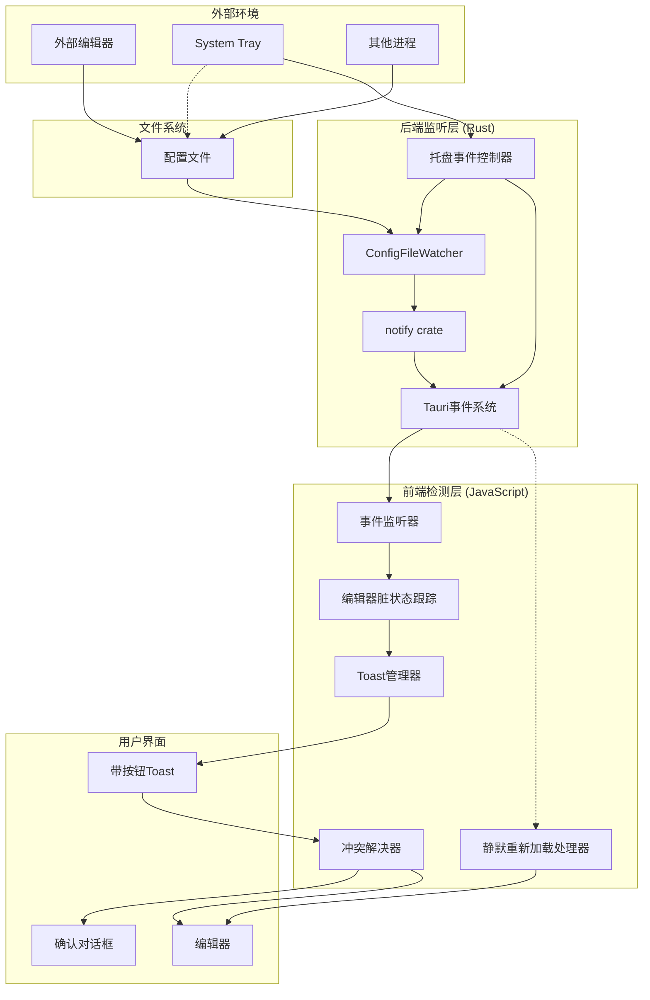
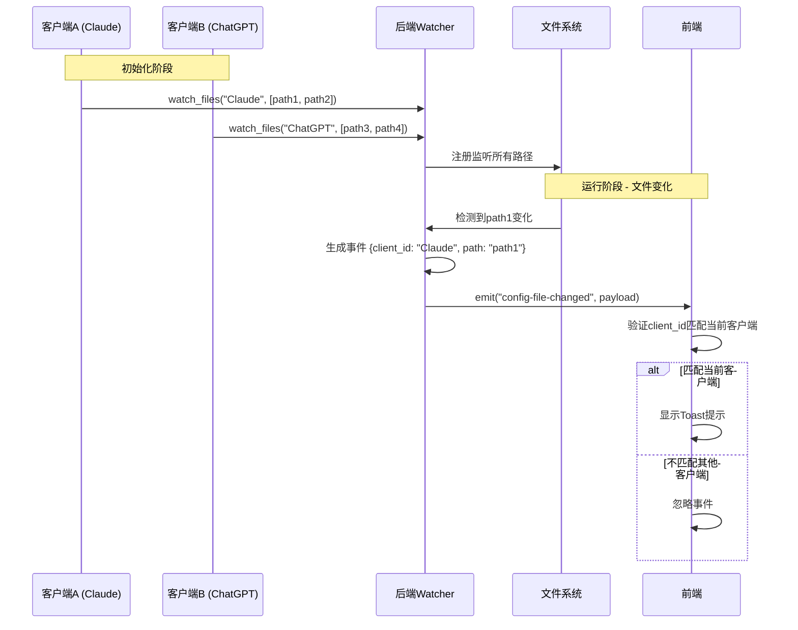

# 配置文件变化检测与重新加载

## 1. Purpose

配置文件变化检测系统提供实时监听配置文件外部修改的能力，支持单客户端多配置文件路径同时监听，以及多客户端的隔离事件处理。当文件被外部编辑器修改、System Tray恢复快照、或其他进程修改时，自动检测变化并通知用户重新加载，确保编辑器内容与文件内容保持同步，避免数据丢失或冲突。系统采用单一Watcher实例监听所有路径的架构设计，优化资源占用，并支持客户端事件隔离和向后兼容。

## 2. How it Works

### 2.1 系统架构



### 2.2 文件监听器实现

#### 2.2.1 ConfigFileWatcher 核心结构

```rust
// src-tauri/src/file_watcher.rs
use notify::{Event, EventKind, RecommendedWatcher, RecursiveMode, Watcher};
use serde_json::json;
use std::collections::{HashMap, HashSet};
use std::path::PathBuf;
use tauri::{AppHandle, Emitter, Runtime};

pub const LEGACY_CLIENT_ID: &str = "__legacy_config_client__";

pub struct ConfigFileWatcher {
    watcher: Option<RecommendedWatcher>,
    watched_paths: HashMap<String, Vec<PathBuf>>, // key=客户端ID, value=路径列表
}

impl ConfigFileWatcher {
    pub fn new() -> Self {
        Self {
            watcher: None,
            watched_paths: HashMap::new(),
        }
    }

    pub fn watch_files<R: Runtime>(
        &mut self,
        client_id: String,
        paths: Vec<PathBuf>,
        app_handle: AppHandle<R>,
    ) -> Result<(), String> {
        let unique_paths = Self::dedup_paths(paths);
        if unique_paths.is_empty() {
            return Err("未提供任何可监听的配置文件路径".to_string());
        }

        // 检查是否需要重新监听
        if let Some(existing) = self.watched_paths.get(&client_id) {
            if Self::paths_are_identical(existing, &unique_paths) {
                return Ok(());
            }
        }

        self.stop();

        // 设置事件发送机制
        let fallback_path = unique_paths
            .first()
            .map(|path| path.to_string_lossy().to_string())
            .unwrap_or_default();
        let event_client_id = client_id.clone();
        let fallback_for_event = fallback_path.clone();

        let mut watcher = notify::recommended_watcher(move |res: Result<Event, notify::Error>| {
            match res {
                Ok(event) => {
                    if matches!(
                        event.kind,
                        EventKind::Modify(_) | EventKind::Create(_) | EventKind::Remove(_)
                    ) {
                        // 处理所有受影响的路径
                        let mut affected_paths: Vec<String> = event
                            .paths
                            .iter()
                            .map(|p| p.to_string_lossy().to_string())
                            .collect();

                        if affected_paths.is_empty() && !fallback_for_event.is_empty() {
                            affected_paths.push(fallback_for_event.clone());
                        }

                        // 为每个变化的路径发送事件（包含客户端ID）
                        for changed_path in affected_paths {
                            let payload = json!({
                                "client_id": event_client_id.clone(),
                                "path": changed_path,
                            });
                            if let Err(err) = app_handle.emit("config-file-changed", payload) {
                                eprintln!(
                                    "[FileWatcher] Failed to emit config-file-changed event: {}",
                                    err
                                );
                            }
                        }
                    }
                }
                Err(err) => {
                    eprintln!("[FileWatcher] 文件监听器错误: {}", err);
                }
            }
        })
        .map_err(|e| format!("创建文件监听器失败: {}", e))?;

        // 监听所有路径
        for path in &unique_paths {
            watcher
                .watch(path, RecursiveMode::NonRecursive)
                .map_err(|e| format!("监听文件失败: {} ({})", path.display(), e))?;
        }

        self.watcher = Some(watcher);
        self.watched_paths.insert(client_id, unique_paths);
        return Ok(());
    }

    // 向后兼容的单路径监听接口
    pub fn watch_file<R: Runtime>(
        &mut self,
        path: PathBuf,
        app_handle: AppHandle<R>,
    ) -> Result<(), String> {
        self.watch_files(
            LEGACY_CLIENT_ID.to_string(),
            vec![path],
            app_handle,
        )
    }

    pub fn stop(&mut self) {
        if let Some(mut watcher) = self.watcher.take() {
            let watched: Vec<PathBuf> = self
                .watched_paths
                .values()
                .flat_map(|paths| paths.iter().cloned())
                .collect();
            for path in watched {
                if let Err(err) = watcher.unwatch(&path) {
                    eprintln!(
                        "[FileWatcher] 停止监听文件失败: {} ({})",
                        path.display(),
                        err
                    );
                }
            }
        }
        self.watched_paths.clear();
    }

    // 辅助方法：路径去重
    fn dedup_paths(paths: Vec<PathBuf>) -> Vec<PathBuf> {
        let mut seen = HashSet::new();
        let mut unique = Vec::new();
        for path in paths {
            if seen.insert(path.clone()) {
                unique.push(path);
            }
        }
        unique
    }

    // 辅助方法：比较路径列表是否相同
    fn paths_are_identical(left: &[PathBuf], right: &[PathBuf]) -> bool {
        left.len() == right.len() && left.iter().zip(right).all(|(a, b)| a == b)
    }
}
```

#### 2.2.2 跨平台支持

- **macOS**: 使用 FSEvents，高性能，低延迟
- **Windows**: 使用 ReadDirectoryChangesW
- **Linux**: 使用 inotify
- **通用**: notify crate 自动选择最佳实现

### 2.3 Tauri命令接口

```rust
// src-tauri/src/commands/file_watcher.rs
use super::config_file::expand_tilde;
use crate::file_watcher::{ConfigFileWatcher, LEGACY_CLIENT_ID};
use std::sync::{Arc, Mutex};
use tauri::{AppHandle, State};

#[tauri::command]
pub fn start_watching_config(
    client_id: Option<String>,
    file_paths: Option<Vec<String>>,
    file_path: Option<String>,
    app_handle: AppHandle,
    watcher: State<'_, Arc<Mutex<ConfigFileWatcher>>>,
) -> Result<(), String> {
    // 处理客户端ID：优先使用传入值，否则使用默认的legacy ID
    let client_id = client_id
        .filter(|value| !value.trim().is_empty())
        .unwrap_or_else(|| LEGACY_CLIENT_ID.to_string());

    // 处理文件路径：优先使用file_paths数组，回退到file_path
    let mut provided_paths = file_paths.unwrap_or_default();
    if provided_paths.is_empty() {
        if let Some(single) = file_path {
            provided_paths.push(single);
        }
    }

    if provided_paths.is_empty() {
        return Err("未提供任何配置文件路径".to_string());
    }

    // 验证路径存在性并展开用户目录
    let mut expanded_paths = Vec::with_capacity(provided_paths.len());
    for raw_path in provided_paths {
        if raw_path.trim().is_empty() {
            continue;
        }
        let expanded = expand_tilde(&raw_path);
        if !expanded.exists() {
            return Err(format!("文件不存在: {}", raw_path));
        }
        expanded_paths.push(expanded);
    }

    if expanded_paths.is_empty() {
        return Err("提供的配置文件路径均无效".to_string());
    }

    let mut watcher_guard = watcher
        .lock()
        .map_err(|e| format!("锁定文件监听器失败: {}", e))?;
    watcher_guard.watch_files(client_id, expanded_paths, app_handle)?;
    Ok(())
}

#[tauri::command]
pub fn stop_watching_config(
    watcher: State<'_, Arc<Mutex<ConfigFileWatcher>>>,
) -> Result<(), String> {
    let mut watcher_guard = watcher
        .lock()
        .map_err(|e| format!("锁定文件监听器失败: {}", e))?;
    watcher_guard.stop();
    Ok(())
}
```

#### 2.3.1 多路径监听API调用示例

```javascript
// 新的多路径API调用
await invoke("start_watching_config", {
    clientId: "Claude",
    filePaths: [
        "~/.config/claude/prompt.md",
        "~/.config/claude/system.md",
        "~/.config/claude/config.json"
    ]
});

// 向后兼容的单路径API调用
await invoke("start_watching_config", {
    filePath: "~/.config/claude/prompt.md"
});

// 混合调用（同时提供两种参数，优先使用filePaths）
await invoke("start_watching_config", {
    clientId: "Claude",
    filePaths: ["~/.config/claude/prompt.md", "~/.config/claude/system.md"],
    filePath: "~/.config/claude/legacy.md"  // 这个会被忽略
});
```

#### 2.3.2 事件格式变更

**新事件格式（包含客户端ID）**：
```json
{
    "client_id": "Claude",
    "path": "/Users/user/.config/claude/prompt.md"
}
```

**旧事件格式（向后兼容）**：
```json
"/Users/user/.config/claude/prompt.md"
```

### 2.4 前端事件处理

#### 2.4.1 编辑器脏状态跟踪

```javascript
// dist/js/main.js
const state = {
    editorDirty: false,          // 编辑器是否有未保存修改
    fileChangeToast: null,       // 当前文件变化Toast引用
    editorChangeBlocked: false,  // 是否阻塞编辑器变化事件
};

// Monaco编辑器变化监听
const handleMonacoEditorChange = () => {
    if (!state.editorChangeBlocked) {
        state.editorDirty = true;
        // console.log('[Editor] Content marked as dirty');
    }
};

// Fallback文本框变化监听
const handleTextareaChange = () => {
    if (!state.editorChangeBlocked) {
        state.editorDirty = true;
    }
};
```

#### 2.4.2 多路径文件监听管理

```javascript
// dist/js/main.js - 启动文件监听
const startFileWatcher = async (clientId) => {
    try {
        const client = state.clients.find(c => c.id === clientId);
        if (!client) {
            console.warn(`[FileWatcher] Client not found: ${clientId}`);
            return;
        }

        // 获取客户端的所有配置文件路径
        const configPaths = client.config_file_paths || [];
        if (configPaths.length === 0) {
            console.warn(`[FileWatcher] Client ${clientId} has no config paths to watch`);
            return;
        }

        // 构建API调用参数
        const payload = {
            clientId: client.id,
            filePaths: configPaths,
        };

        // 向后兼容：如果是单路径，也设置filePath参数
        if (configPaths.length === 1) {
            payload.filePath = configPaths[0];
        }

        await invoke("start_watching_config", payload);
        console.log(
            `[FileWatcher] Started watching ${configPaths.length} file(s) for ${client.id}`
        );
    } catch (error) {
        console.warn("[FileWatcher] Failed to start watching:", error);
    }
};

// 停止文件监听
const stopFileWatcher = async () => {
    try {
        const invoke = window.__TAURI_INTERNALS__?.invoke;
        if (typeof invoke !== "function") {
            return;
        }
        await invoke("stop_watching_config");
        console.log("[FileWatcher] Stopped watching");
    } catch (error) {
        console.error("[FileWatcher] Failed to stop watching:", error);
    }
};

// 监听Tauri事件（支持客户端隔离）
const listenToFileChanges = async () => {
    try {
        const { listen } = window.__TAURI_INTERNALS__;
        let hasExternalListener = !!state.fileChangeUnlisten;
        let hasSilentListener = !!state.silentReloadUnlisten;

        // 监听文件变化事件（支持客户端ID验证）
        if (!hasExternalListener) {
            console.log("[FileWatcher] Registering config-file-changed listener...");
            try {
                state.fileChangeUnlisten = await listen("config-file-changed", async (event) => {
                    console.log("[FileWatcher] Config file changed:", event.payload);
                    try {
                        const payload = event?.payload;

                        // 处理新旧事件格式
                        const eventClientId = payload?.client_id || payload;
                        const eventPath = payload?.path || payload;

                        // 客户端ID隔离：只处理当前客户端或legacy客户端的事件
                        if (eventClientId && eventClientId !== state.currentClientId && eventClientId !== "__legacy_config_client__") {
                            console.log(`[FileWatcher] Ignoring event for different client: ${eventClientId} (current: ${state.currentClientId})`);
                            return;
                        }

                        await handleConfigFileChanged(eventPath);
                    } catch (error) {
                        console.warn("[FileWatcher] Failed to process config change:", error);
                    }
                });
                console.log("[FileWatcher] config-file-changed listener registered successfully!");
            } catch (error) {
                console.error("[FileWatcher] Failed to register config-file-changed listener:", error);
            }
        }

        // 监听静默重新加载事件（托盘恢复快照）
        if (!hasSilentListener) {
            console.log("[FileWatcher] Registering config-reload-silent listener...");
            try {
                state.silentReloadUnlisten = await listen("config-reload-silent", async (event) => {
                    console.log("[FileWatcher] Silent reload event received:", event.payload);
                    try {
                        const payload = event?.payload;
                        const payloadIsObject = typeof payload === "object" && payload !== null;
                        const targetClientId = payloadIsObject
                            ? payload.client_id ?? payload.clientId ?? null
                            : null;
                        const targetPath = payloadIsObject
                            ? payload.path ?? null
                            : payload;

                        // 客户端ID验证
                        if (targetClientId && targetClientId !== state.currentClientId && targetClientId !== "__legacy_config_client__") {
                            console.log(`[FileWatcher] Ignoring silent reload for different client: ${targetClientId} (current: ${state.currentClientId})`);
                            return;
                        }

                        await reloadConfigSilently();
                    } catch (error) {
                        console.warn("[FileWatcher] Failed to process silent reload:", error);
                    }
                });
                console.log("[FileWatcher] config-reload-silent listener registered successfully!");
            } catch (error) {
                console.error("[FileWatcher] Failed to register config-reload-silent listener:", error);
            }
        }
    } catch (error) {
        console.error("[FileWatcher] Failed to setup event listeners:", error);
    }
};
```

#### 2.4.3 多路径文件变化处理逻辑

```javascript
// dist/js/main.js - 处理配置文件变化
const handleConfigFileChanged = async (changedPath = null) => {
    // 移除现有的文件变化Toast
    if (state.fileChangeToast) {
        state.fileChangeToast.remove();
        state.fileChangeToast = null;
    }

    // 检查编辑器脏状态
    if (state.editorDirty) {
        // 有未保存修改 - 显示警告Toast
        state.fileChangeToast = showActionToast(
            "⚠️ 配置文件已在外部修改",
            "重新加载",
            async () => {
                const confirmed = await showConfirm(
                    "配置文件已在外部修改，是否重新加载？（将丢失未保存的修改）"
                );
                if (confirmed) {
                    await reloadConfigFile();
                }
            }
        );
    } else {
        // 无未保存修改 - 显示普通Toast
        const fileDisplayName = changedPath ?
            changedPath.split('/').pop() : '配置文件';

        state.fileChangeToast = showActionToast(
            `📝 ${fileDisplayName} 已更新`,
            "重新加载",
            async () => {
                await reloadConfigFile();
            }
        );
    }
};

const reloadConfigFile = async () => {
    try {
        await loadConfigFile(state.currentClientId);
        state.editorDirty = false;
        showToast("✅ 配置已重新加载", "success");
    } catch (error) {
        console.error("[FileWatcher] Failed to reload config:", error);
        showToast("❌ 重新加载失败", "error");
    }
};

// 静默重新加载（用于托盘恢复快照）
const reloadConfigSilently = async () => {
    console.log("[ReloadSilent] Starting silent config reload...");
    if (!state.currentClientId) {
        console.warn("[ReloadSilent] No current client ID");
        return;
    }
    const success = await loadConfigFile(state.currentClientId);
    if (success) {
        dismissFileChangeToast(); // 移除现有Toast
        state.editorDirty = false; // 清除脏状态
        console.log("[ReloadSilent] Config reloaded silently");
    } else {
        console.error("[ReloadSilent] Failed to reload config");
    }
};

// 移除文件变化Toast
const dismissFileChangeToast = () => {
    if (state.fileChangeToast) {
        state.fileChangeToast.remove();
        state.fileChangeToast = null;
    }
};
```

### 2.5 托盘恢复快照的事件优化机制

#### 2.5.1 问题背景

在托盘恢复快照时，会同时触发两个事件：
1. `config-reload-silent` (托盘主动发送) → 静默重新加载 ✅
2. `config-file-changed` (文件监听器检测到文件变化) → 显示 "配置文件已更新 重新加载" toast ❌

这导致用户在托盘恢复快照时看到不必要的Toast提示，影响用户体验。

#### 2.5.2 优化解决方案

托盘恢复快照现在采用**文件监听器临时控制 + 静默事件**的机制：

```rust
// src-tauri/src/tray.rs - restore_snapshot_from_menu 函数
fn restore_snapshot_from_menu<R: Runtime>(
    app_handle: &AppHandle<R>,
    client_id: &str,
    snapshot_id: &str,
) -> TrayResult<()> {
    // ... 获取快照内容 ...

    // 临时停止文件监听器，避免写入时触发 config-file-changed 事件
    let watcher_state = app_handle.state::<Arc<Mutex<crate::file_watcher::ConfigFileWatcher>>>();
    {
        let mut watcher = watcher_state
            .lock()
            .map_err(|_| TrayError::from_poison("文件监听器"))?;
        watcher.stop();
        eprintln!("[Tray] Temporarily stopped file watcher before writing config");
    }

    // 写入配置文件
    commands::config_file::write_config_file(client_state.clone(), client_id.to_string(), content)?;

    // 重新启动文件监听器
    if let Some(path) = &config_path {
        let mut watcher = watcher_state
            .lock()
            .map_err(|_| TrayError::from_poison("文件监听器"))?;
        let expanded_path = expand_tilde(path);
        if let Err(e) = watcher.watch_file(expanded_path, app_handle.clone()) {
            eprintln!("[Tray] Warning: Failed to restart file watcher: {}", e);
        } else {
            eprintln!("[Tray] File watcher restarted successfully");
        }
    }

    // 发送静默重新加载事件
    if let Some(path) = &config_path {
        let expanded_path = expand_tilde(path);
        let path_str = expanded_path.to_string_lossy().to_string();

        match app_handle.emit("config-reload-silent", path_str) {
            Ok(_) => eprintln!("[Tray] Event emitted successfully"),
            Err(e) => eprintln!("[Tray] Failed to emit event: {}", e),
        }
    }

    // ... 显示通知 ...
}
```

#### 2.5.3 前端静默重新加载处理

```javascript
// dist/js/main.js - 静默重新加载事件处理
const listenToFileChanges = async () => {
    try {
        const { listen } = window.__TAURI_INTERNALS_;

        // 监听文件变化事件（外部编辑器）
        await listen("config-file-changed", async (event) => {
            console.log("[FileWatcher] File change detected:", event.payload);
            await handleConfigFileChanged();
        });

        // 监听静默重新加载事件（托盘恢复快照）
        await listen("config-reload-silent", async (event) => {
            console.log("[FileWatcher] Silent reload event received:", event.payload);
            try {
                await reloadConfigSilently();
            } catch (error) {
                console.warn("[FileWatcher] Failed to process silent reload:", error);
            }
        });
    } catch (error) {
        console.error("[FileWatcher] Failed to setup event listener:", error);
    }
};

const reloadConfigSilently = async () => {
    console.log("[ReloadSilent] Starting silent config reload...");
    if (!state.currentClientId) {
        console.warn("[ReloadSilent] No current client ID");
        return;
    }
    const success = await loadConfigFile(state.currentClientId);
    if (success) {
        dismissFileChangeToast();
        console.log("[ReloadSilent] Config reloaded silently");
    } else {
        console.error("[ReloadSilent] Failed to reload config");
    }
};
```

#### 2.5.4 优化效果

**优化前**：
- ❌ 托盘恢复快照 → 显示不必要的Toast提示
- ❌ 用户体验被打断
- ❌ 单路径监听，无法支持复杂配置

**优化后**：
- ✅ 托盘恢复快照 → 静默刷新，不显示Toast
- ✅ 外部编辑器修改 → 正常显示Toast提示
- ✅ 用户体验流畅，无干扰
- ✅ 保持文件监听器对外部修改的检测能力
- ✅ 支持多客户端、多配置文件路径同时监听
- ✅ 客户端事件隔离，避免交叉干扰
- ✅ 资源优化：单一Watcher实例监听所有路径

### 2.6 多配置文件路径监听架构

#### 2.6.1 核心设计变更

1. **数据结构升级**：
   - 从单路径 `watched_path: Option<PathBuf>`
   - 升级为多客户端多路径 `watched_paths: HashMap<String, Vec<PathBuf>>`

2. **资源优化**：
   - 单个 `RecommendedWatcher` 实例监听所有配置文件路径
   - 减少系统资源占用（每个Watcher约1-2MB内存）
   - 统一事件分发机制，提高效率

3. **客户端隔离**：
   - 每个客户端ID对应独立的配置文件路径列表
   - 事件包含客户端ID标识，确保事件处理隔离
   - 防止跨客户端事件错误处理

#### 2.6.2 多路径事件处理流程



#### 2.6.3 向后兼容策略

1. **Legacy客户端支持**：
   - 使用 `LEGACY_CLIENT_ID = "__legacy_config_client__"` 标识
   - 保留旧版 `watch_file()` 单路径接口
   - 新旧事件格式同时支持

2. **API参数兼容**：
   - `filePaths` (新) 和 `filePath` (旧) 同时支持
   - 优先使用 `filePaths` 数组参数
   - 空值时回退到 `filePath` 单路径参数

3. **事件格式兼容**：
   - 新格式：`{client_id: string, path: string}`
   - 旧格式：`string` (直接路径)
   - 前端自动识别和适配两种格式

#### 2.6.4 错误处理和边界情况

1. **路径验证**：
   - 所有路径必须存在且可访问
   - 自动去除重复路径
   - 支持用户目录展开（`~`）

2. **监听器状态管理**：
   - 切换客户端时正确停止旧监听
   - 启动新监听前清理现有状态
   - 错误时自动回滚到安全状态

3. **事件验证**：
   - 验证事件来源的客户端ID
   - 防止处理其他客户端的事件
   - 支持legacy客户端事件处理

### 2.7 用户界面实现

#### 2.7.1 带操作按钮的Toast

```javascript
// dist/js/utils.js
export const showActionToast = (message, actionLabel, onAction) => {
    const container = document.getElementById("toastContainer") || createToastContainer();

    const toast = document.createElement("div");
    toast.className = "toast toast-info action-toast";

    const messageSpan = document.createElement("span");
    messageSpan.textContent = message;

    const button = document.createElement("button");
    button.className = "toast-action-btn";
    button.textContent = actionLabel;

    button.onclick = async () => {
        if (typeof onAction === "function") {
            await onAction();
        }
        toast.remove();
    };

    toast.appendChild(messageSpan);
    toast.appendChild(button);
    container.appendChild(toast);

    // 30秒后自动移除
    setTimeout(() => {
        if (toast.parentNode) {
            toast.remove();
        }
    }, 30000);

    return toast;
};
```

#### 2.7.2 Toast样式

```css
/* dist/css/components.css */
.action-toast {
    display: flex;
    align-items: center;
    justify-content: space-between;
    gap: 1rem;
    padding: 0.75rem 1rem;
    min-width: 320px;
    max-width: 500px;
}

.toast-action-btn {
    padding: 0.375rem 0.75rem;
    background: rgba(255, 255, 255, 0.2);
    border: 1px solid rgba(255, 255, 255, 0.3);
    border-radius: 6px;
    color: white;
    font-size: 0.875rem;
    font-weight: 500;
    cursor: pointer;
    transition: all 0.2s ease;
    white-space: nowrap;
}

.toast-action-btn:hover {
    background: rgba(255, 255, 255, 0.3);
    border-color: rgba(255, 255, 255, 0.5);
    transform: translateY(-1px);
}

.toast-info {
    background: linear-gradient(135deg, #667eea 0%, #764ba2 100%);
    color: white;
}
```

## 3. Relevant Code Modules

### 后端核心模块
- `src-tauri/src/file_watcher.rs`: ConfigFileWatcher核心实现，支持泛型Runtime和临时停止功能
- `src-tauri/src/commands/file_watcher.rs`: 文件监听Tauri命令接口
- `src-tauri/src/tray.rs`: 托盘恢复快照的文件监听器控制和静默事件发送
- `src-tauri/src/main.rs`: 应用启动时的状态初始化和命令注册

### 前端核心模块
- `dist/js/main.js`: 文件监听管理、编辑器脏状态跟踪、双事件处理逻辑、静默重新加载处理
- `dist/js/utils.js`: showActionToast函数实现
- `dist/css/components.css`: ActionToast样式定义

### 依赖配置
- `src-tauri/Cargo.toml`: notify依赖配置
- `src-tauri/tauri.conf.json`: event权限配置

## 4. Attention

### 功能注意事项

1. **文件监听范围**：仅监听应用管理的配置文件，不监听其他目录
2. **多路径支持**：支持单个客户端监听多个配置文件路径，实现更灵活的配置管理
3. **客户端隔离**：不同客户端的文件监听事件相互隔离，避免交叉干扰
4. **事件去重**：短时间内多次文件变化可能触发多个事件，前端需要处理
5. **错误恢复**：文件监听失败时自动重试机制
6. **托盘恢复优化**：托盘恢复快照时临时停止文件监听器，避免重复事件
7. **静默事件处理**：使用`config-reload-silent`事件进行静默更新，不显示Toast
8. **资源清理**：切换客户端时自动停止旧监听，启动新监听
9. **向后兼容**：支持旧版单路径API和事件格式，确保平滑升级
10. **路径验证**：自动去除重复路径，验证文件存在性和可访问性

### 性能注意事项

1. **CPU占用**：文件监听器几乎不消耗CPU（仅在文件变化时工作）
2. **内存占用**：每个监听器约占用1-2MB内存，多路径共享单个Watcher实例
3. **响应延迟**：从文件修改到Toast显示通常<100ms
4. **网络无关**：完全本地化，不依赖网络连接
5. **资源优化**：单一Watcher实例监听所有路径，减少系统资源占用
6. **扩展性**：支持大量文件路径监听，性能线性扩展

### 用户体验注意事项

1. **非阻塞设计**：文件变化不会打断用户当前操作
2. **清晰提示**：Toast消息明确说明变化类型和操作选项
3. **冲突保护**：检测到未保存修改时显示警告对话框
4. **自动消失**：Toast在30秒后自动消失，避免界面混乱
5. **静默更新**：托盘恢复快照时不显示干扰性Toast，保持用户体验流畅

### 安全注意事项

1. **路径验证**：仅监听配置文件路径，防止路径遍历攻击
2. **权限检查**：文件不存在时拒绝监听，避免错误
3. **状态隔离**：使用Arc<Mutex<>>保证线程安全
4. **事件验证**：验证事件来源，防止伪造事件

### 兼容性注意事项

1. **macOS FSEvents**：在某些边缘情况下可能不触发，已通过托盘主动事件解决
2. **Windows权限**：需要文件系统读取权限
3. **Linux inotify**：监听文件数量有限制（通常足够使用）
4. **网络文件系统**：网络驱动器可能支持有限
5. **事件类型支持**：新的`config-reload-silent`事件需要前端支持

## 5. Testing Checklist

### 5.1 基础功能测试

- [ ] 外部编辑器修改配置文件后显示Toast提示
- [ ] 有未保存修改时显示警告对话框
- [ ] 无未保存修改时直接显示重新加载按钮
- [ ] 点击重新加载后编辑器内容更新
- [ ] Toast在30秒后自动消失
- [ ] 文件不存在时显示错误提示
- [ ] 应用关闭时文件监听器正确停止
- [ ] 重新加载成功后编辑器脏状态清除

### 5.2 托盘恢复快照测试

- [ ] 托盘恢复快照后主窗口自动更新
- [ ] 托盘恢复快照时不显示Toast提示（静默更新）
- [ ] 托盘恢复快照时临时停止文件监听器
- [ ] 托盘恢复快照后重新启动文件监听器
- [ ] config-reload-silent事件正确触发和处理
- [ ] 静默重新加载时正确移除现有的文件变化Toast
- [ ] 文件监听器重启失败时显示警告日志

### 5.3 多配置文件路径测试

- [ ] 单客户端监听多个配置文件路径
- [ ] 多客户端各自监听独立的配置文件路径
- [ ] 任何一个配置文件变化都能触发Toast提示
- [ ] Toast显示具体的文件名（而非泛指"配置文件"）
- [ ] 客户端ID隔离：只处理当前客户端的文件变化事件
- [ ] 忽略其他客户端的文件变化事件
- [ ] 支持legacy客户端（无client_id）的事件处理

### 5.4 API兼容性测试

- [ ] 新API：使用filePaths数组参数监听多个文件
- [ ] 旧API：使用filePath单路径参数仍可正常工作
- [ ] 混合参数：同时提供filePaths和filePath时优先使用filePaths
- [ ] 新事件格式：包含client_id和path字段
- [ ] 旧事件格式：纯字符串路径仍可正常处理
- [ ] 空参数处理：未提供任何路径时返回错误

### 5.5 边界情况和错误处理测试

- [ ] 重复路径自动去重
- [ ] 不存在的文件路径返回错误
- [ ] 切换客户端时文件监听器正确切换
- [ ] 多次快速文件修改不会导致重复Toast
- [ ] 确认对话框的取消操作保留当前编辑器内容
- [ ] 网络文件系统监听（如果支持）
- [ ] 文件权限不足时的错误处理

### 5.6 性能和资源测试

- [ ] 单个Watcher实例监听多个文件（资源优化）
- [ ] 内存占用：多路径监听不显著增加内存使用
- [ ] CPU占用：文件变化检测响应时间<100ms
- [ ] 大量文件监听的性能表现
- [ ] 长时间运行稳定性测试