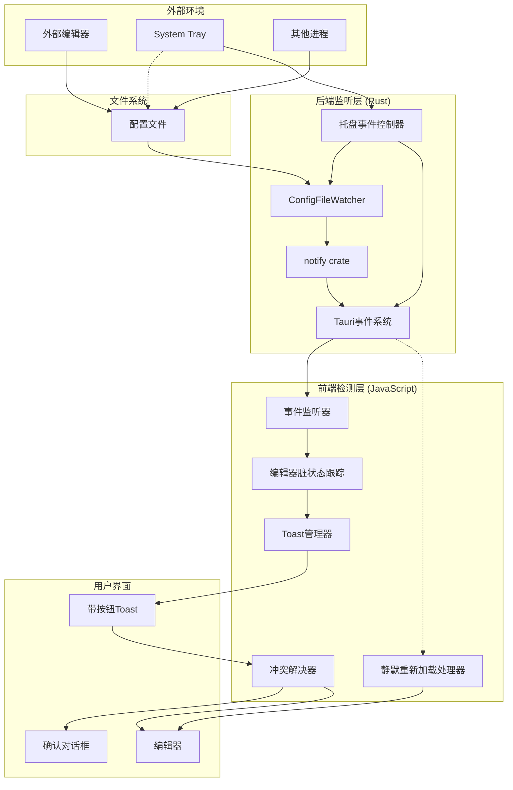

# 配置文件变化检测与重新加载

## 1. Purpose

配置文件变化检测系统提供实时监听配置文件外部修改的能力，当文件被外部编辑器修改、System Tray恢复快照、或其他进程修改时，自动检测变化并通知用户重新加载，确保编辑器内容与文件内容保持同步，避免数据丢失或冲突。

## 2. How it Works

### 2.1 系统架构



### 2.2 文件监听器实现

#### 2.2.1 ConfigFileWatcher 核心结构

```rust
// src-tauri/src/file_watcher.rs
pub struct ConfigFileWatcher {
    watcher: Option<notify::RecommendedWatcher>,
    watched_path: Option<PathBuf>,
}

impl ConfigFileWatcher {
    pub fn new() -> Self {
        Self {
            watcher: None,
            watched_path: None,
        }
    }

    pub fn watch_file<R: Runtime>(&mut self, path: PathBuf, app_handle: AppHandle<R>) -> Result<(), String> {
        if self.watched_path.as_ref() == Some(&path) {
            return Ok(());
        }

        self.stop();

        let (tx, rx) = mpsc::channel::<Event>();
        let emitter_app = app_handle.clone();
        let fallback_path = path.to_string_lossy().to_string();

        std::thread::spawn(move || {
            while let Ok(event) = rx.recv() {
                let path_str = event
                    .paths
                    .first()
                    .map(|p| p.to_string_lossy().to_string())
                    .unwrap_or_else(|| fallback_path.clone());
                let _ = emitter_app.emit("config-file-changed", path_str);
            }
        });

        let mut watcher = notify::recommended_watcher(move |res: Result<Event, notify::Error>| {
            if let Ok(event) = res {
                if matches!(
                    event.kind,
                    EventKind::Modify(_) | EventKind::Create(_) | EventKind::Remove(_)
                ) {
                    let _ = tx.send(event);
                }
            }
        }).map_err(|e| format!("创建文件监听器失败: {}", e))?;

        watcher.watch(&path, RecursiveMode::NonRecursive)
            .map_err(|e| format!("监听文件失败: {}", e))?;

        self.watcher = Some(watcher);
        self.watched_path = Some(path);
        Ok(())
    }

    pub fn stop(&mut self) {
        self.watcher = None;
        self.watched_path = None;
    }
}
```

#### 2.2.2 跨平台支持

- **macOS**: 使用 FSEvents，高性能，低延迟
- **Windows**: 使用 ReadDirectoryChangesW
- **Linux**: 使用 inotify
- **通用**: notify crate 自动选择最佳实现

### 2.3 Tauri命令接口

```rust
// src-tauri/src/commands/file_watcher.rs
#[tauri::command]
pub fn start_watching_config(
    file_path: String,
    app_handle: AppHandle,
    watcher: State<'_, Arc<Mutex<ConfigFileWatcher>>>,
) -> Result<(), String> {
    let path = expand_tilde(&file_path);

    // 验证文件存在
    if !path.exists() {
        return Err(format!("文件不存在: {}", file_path));
    }

    let mut watcher_guard = watcher
        .lock()
        .map_err(|e| format!("锁定文件监听器失败: {}", e))?;

    watcher_guard.watch_file(path, app_handle)?;
    Ok(())
}

#[tauri::command]
pub fn stop_watching_config(
    watcher: State<'_, Arc<Mutex<ConfigFileWatcher>>>,
) -> Result<(), String> {
    let mut watcher_guard = watcher
        .lock()
        .map_err(|e| format!("锁定文件监听器失败: {}", e))?;
    watcher_guard.stop();
    Ok(())
}
```

### 2.4 前端事件处理

#### 2.4.1 编辑器脏状态跟踪

```javascript
// dist/js/main.js
const state = {
    editorDirty: false,          // 编辑器是否有未保存修改
    fileChangeToast: null,       // 当前文件变化Toast引用
    editorChangeBlocked: false,  // 是否阻塞编辑器变化事件
};

// Monaco编辑器变化监听
const handleMonacoEditorChange = () => {
    if (!state.editorChangeBlocked) {
        state.editorDirty = true;
        // console.log('[Editor] Content marked as dirty');
    }
};

// Fallback文本框变化监听
const handleTextareaChange = () => {
    if (!state.editorChangeBlocked) {
        state.editorDirty = true;
    }
};
```

#### 2.4.2 文件监听管理

```javascript
// 启动文件监听
const startFileWatcher = async (clientId) => {
    try {
        const client = state.clients.find(c => c.id === clientId);
        if (!client) {
            console.warn(`[FileWatcher] Client not found: ${clientId}`);
            return;
        }

        const invoke = await getInvoke();
        await invoke("start_watching_config", {
            filePath: client.config_file_path
        });

        console.log(`[FileWatcher] Started watching: ${client.config_file_path}`);
    } catch (error) {
        console.error("[FileWatcher] Failed to start watching:", error);
    }
};

// 停止文件监听
const stopFileWatcher = async () => {
    try {
        const invoke = await getInvoke();
        await invoke("stop_watching_config");
        console.log("[FileWatcher] Stopped watching");
    } catch (error) {
        console.error("[FileWatcher] Failed to stop watching:", error);
    }
};

// 监听Tauri事件
const listenToFileChanges = async () => {
    try {
        const { listen } = window.__TAURI_INTERNALS__;
        await listen("config-file-changed", async (event) => {
            console.log("[FileWatcher] File change detected:", event.payload);
            await handleConfigFileChanged();
        });
        console.log("[FileWatcher] Event listener established");
    } catch (error) {
        console.error("[FileWatcher] Failed to setup event listener:", error);
    }
};
```

#### 2.4.3 文件变化处理逻辑

```javascript
const handleConfigFileChanged = async () => {
    // 移除现有的文件变化Toast
    if (state.fileChangeToast) {
        state.fileChangeToast.remove();
        state.fileChangeToast = null;
    }

    // 检查编辑器脏状态
    if (state.editorDirty) {
        // 有未保存修改 - 显示警告Toast
        state.fileChangeToast = showActionToast(
            "⚠️ 配置文件已在外部修改",
            "重新加载",
            async () => {
                const confirmed = await showConfirm(
                    "配置文件已在外部修改，是否重新加载？（将丢失未保存的修改）"
                );
                if (confirmed) {
                    await reloadConfigFile();
                }
            }
        );
    } else {
        // 无未保存修改 - 显示普通Toast
        state.fileChangeToast = showActionToast(
            "📝 配置文件已更新",
            "重新加载",
            async () => {
                await reloadConfigFile();
            }
        );
    }
};

const reloadConfigFile = async () => {
    try {
        await loadConfigFile(state.currentClientId);
        state.editorDirty = false;
        showToast("✅ 配置已重新加载", "success");
    } catch (error) {
        console.error("[FileWatcher] Failed to reload config:", error);
        showToast("❌ 重新加载失败", "error");
    }
};
```

### 2.5 托盘恢复快照的事件优化机制

#### 2.5.1 问题背景

在托盘恢复快照时，会同时触发两个事件：
1. `config-reload-silent` (托盘主动发送) → 静默重新加载 ✅
2. `config-file-changed` (文件监听器检测到文件变化) → 显示 "配置文件已更新 重新加载" toast ❌

这导致用户在托盘恢复快照时看到不必要的Toast提示，影响用户体验。

#### 2.5.2 优化解决方案

托盘恢复快照现在采用**文件监听器临时控制 + 静默事件**的机制：

```rust
// src-tauri/src/tray.rs - restore_snapshot_from_menu 函数
fn restore_snapshot_from_menu<R: Runtime>(
    app_handle: &AppHandle<R>,
    client_id: &str,
    snapshot_id: &str,
) -> TrayResult<()> {
    // ... 获取快照内容 ...

    // 临时停止文件监听器，避免写入时触发 config-file-changed 事件
    let watcher_state = app_handle.state::<Arc<Mutex<crate::file_watcher::ConfigFileWatcher>>>();
    {
        let mut watcher = watcher_state
            .lock()
            .map_err(|_| TrayError::from_poison("文件监听器"))?;
        watcher.stop();
        eprintln!("[Tray] Temporarily stopped file watcher before writing config");
    }

    // 写入配置文件
    commands::config_file::write_config_file(client_state.clone(), client_id.to_string(), content)?;

    // 重新启动文件监听器
    if let Some(path) = &config_path {
        let mut watcher = watcher_state
            .lock()
            .map_err(|_| TrayError::from_poison("文件监听器"))?;
        let expanded_path = expand_tilde(path);
        if let Err(e) = watcher.watch_file(expanded_path, app_handle.clone()) {
            eprintln!("[Tray] Warning: Failed to restart file watcher: {}", e);
        } else {
            eprintln!("[Tray] File watcher restarted successfully");
        }
    }

    // 发送静默重新加载事件
    if let Some(path) = &config_path {
        let expanded_path = expand_tilde(path);
        let path_str = expanded_path.to_string_lossy().to_string();

        match app_handle.emit("config-reload-silent", path_str) {
            Ok(_) => eprintln!("[Tray] Event emitted successfully"),
            Err(e) => eprintln!("[Tray] Failed to emit event: {}", e),
        }
    }

    // ... 显示通知 ...
}
```

#### 2.5.3 前端静默重新加载处理

```javascript
// dist/js/main.js - 静默重新加载事件处理
const listenToFileChanges = async () => {
    try {
        const { listen } = window.__TAURI_INTERNALS_;

        // 监听文件变化事件（外部编辑器）
        await listen("config-file-changed", async (event) => {
            console.log("[FileWatcher] File change detected:", event.payload);
            await handleConfigFileChanged();
        });

        // 监听静默重新加载事件（托盘恢复快照）
        await listen("config-reload-silent", async (event) => {
            console.log("[FileWatcher] Silent reload event received:", event.payload);
            try {
                await reloadConfigSilently();
            } catch (error) {
                console.warn("[FileWatcher] Failed to process silent reload:", error);
            }
        });
    } catch (error) {
        console.error("[FileWatcher] Failed to setup event listener:", error);
    }
};

const reloadConfigSilently = async () => {
    console.log("[ReloadSilent] Starting silent config reload...");
    if (!state.currentClientId) {
        console.warn("[ReloadSilent] No current client ID");
        return;
    }
    const success = await loadConfigFile(state.currentClientId);
    if (success) {
        dismissFileChangeToast();
        console.log("[ReloadSilent] Config reloaded silently");
    } else {
        console.error("[ReloadSilent] Failed to reload config");
    }
};
```

#### 2.5.4 优化效果

**优化前**：
- ❌ 托盘恢复快照 → 显示不必要的Toast提示
- ❌ 用户体验被打断

**优化后**：
- ✅ 托盘恢复快照 → 静默刷新，不显示Toast
- ✅ 外部编辑器修改 → 正常显示Toast提示
- ✅ 用户体验流畅，无干扰
- ✅ 保持文件监听器对外部修改的检测能力

### 2.6 用户界面实现

#### 2.6.1 带操作按钮的Toast

```javascript
// dist/js/utils.js
export const showActionToast = (message, actionLabel, onAction) => {
    const container = document.getElementById("toastContainer") || createToastContainer();

    const toast = document.createElement("div");
    toast.className = "toast toast-info action-toast";

    const messageSpan = document.createElement("span");
    messageSpan.textContent = message;

    const button = document.createElement("button");
    button.className = "toast-action-btn";
    button.textContent = actionLabel;

    button.onclick = async () => {
        if (typeof onAction === "function") {
            await onAction();
        }
        toast.remove();
    };

    toast.appendChild(messageSpan);
    toast.appendChild(button);
    container.appendChild(toast);

    // 30秒后自动移除
    setTimeout(() => {
        if (toast.parentNode) {
            toast.remove();
        }
    }, 30000);

    return toast;
};
```

#### 2.6.2 Toast样式

```css
/* dist/css/components.css */
.action-toast {
    display: flex;
    align-items: center;
    justify-content: space-between;
    gap: 1rem;
    padding: 0.75rem 1rem;
    min-width: 320px;
    max-width: 500px;
}

.toast-action-btn {
    padding: 0.375rem 0.75rem;
    background: rgba(255, 255, 255, 0.2);
    border: 1px solid rgba(255, 255, 255, 0.3);
    border-radius: 6px;
    color: white;
    font-size: 0.875rem;
    font-weight: 500;
    cursor: pointer;
    transition: all 0.2s ease;
    white-space: nowrap;
}

.toast-action-btn:hover {
    background: rgba(255, 255, 255, 0.3);
    border-color: rgba(255, 255, 255, 0.5);
    transform: translateY(-1px);
}

.toast-info {
    background: linear-gradient(135deg, #667eea 0%, #764ba2 100%);
    color: white;
}
```

## 3. Relevant Code Modules

### 后端核心模块
- `src-tauri/src/file_watcher.rs`: ConfigFileWatcher核心实现，支持泛型Runtime和临时停止功能
- `src-tauri/src/commands/file_watcher.rs`: 文件监听Tauri命令接口
- `src-tauri/src/tray.rs`: 托盘恢复快照的文件监听器控制和静默事件发送
- `src-tauri/src/main.rs`: 应用启动时的状态初始化和命令注册

### 前端核心模块
- `dist/js/main.js`: 文件监听管理、编辑器脏状态跟踪、双事件处理逻辑、静默重新加载处理
- `dist/js/utils.js`: showActionToast函数实现
- `dist/css/components.css`: ActionToast样式定义

### 依赖配置
- `src-tauri/Cargo.toml`: notify依赖配置
- `src-tauri/tauri.conf.json`: event权限配置

## 4. Attention

### 功能注意事项

1. **文件监听范围**：仅监听应用管理的配置文件，不监听其他目录
2. **事件去重**：短时间内多次文件变化可能触发多个事件，前端需要处理
3. **错误恢复**：文件监听失败时自动重试机制
4. **托盘恢复优化**：托盘恢复快照时临时停止文件监听器，避免重复事件
5. **静默事件处理**：使用`config-reload-silent`事件进行静默更新，不显示Toast
6. **资源清理**：切换客户端时自动停止旧监听，启动新监听

### 性能注意事项

1. **CPU占用**：文件监听器几乎不消耗CPU（仅在文件变化时工作）
2. **内存占用**：每个监听器约占用1-2MB内存
3. **响应延迟**：从文件修改到Toast显示通常<100ms
4. **网络无关**：完全本地化，不依赖网络连接

### 用户体验注意事项

1. **非阻塞设计**：文件变化不会打断用户当前操作
2. **清晰提示**：Toast消息明确说明变化类型和操作选项
3. **冲突保护**：检测到未保存修改时显示警告对话框
4. **自动消失**：Toast在30秒后自动消失，避免界面混乱
5. **静默更新**：托盘恢复快照时不显示干扰性Toast，保持用户体验流畅

### 安全注意事项

1. **路径验证**：仅监听配置文件路径，防止路径遍历攻击
2. **权限检查**：文件不存在时拒绝监听，避免错误
3. **状态隔离**：使用Arc<Mutex<>>保证线程安全
4. **事件验证**：验证事件来源，防止伪造事件

### 兼容性注意事项

1. **macOS FSEvents**：在某些边缘情况下可能不触发，已通过托盘主动事件解决
2. **Windows权限**：需要文件系统读取权限
3. **Linux inotify**：监听文件数量有限制（通常足够使用）
4. **网络文件系统**：网络驱动器可能支持有限
5. **事件类型支持**：新的`config-reload-silent`事件需要前端支持

## 5. Testing Checklist

- [ ] 外部编辑器修改配置文件后显示Toast提示
- [ ] 托盘恢复快照后主窗口自动更新
- [ ] 托盘恢复快照时不显示Toast提示（静默更新）
- [ ] 托盘恢复快照时临时停止文件监听器
- [ ] 托盘恢复快照后重新启动文件监听器
- [ ] 有未保存修改时显示警告对话框
- [ ] 无未保存修改时直接显示重新加载按钮
- [ ] 切换客户端时文件监听器正确切换
- [ ] 点击重新加载后编辑器内容更新
- [ ] Toast在30秒后自动消失
- [ ] 文件不存在时显示错误提示
- [ ] 应用关闭时文件监听器正确停止
- [ ] 多次快速文件修改不会导致重复Toast
- [ ] 确认对话框的取消操作保留当前编辑器内容
- [ ] 重新加载成功后编辑器脏状态清除
- [ ] config-reload-silent事件正确触发和处理
- [ ] 静默重新加载时正确移除现有的文件变化Toast
- [ ] 文件监听器重启失败时显示警告日志