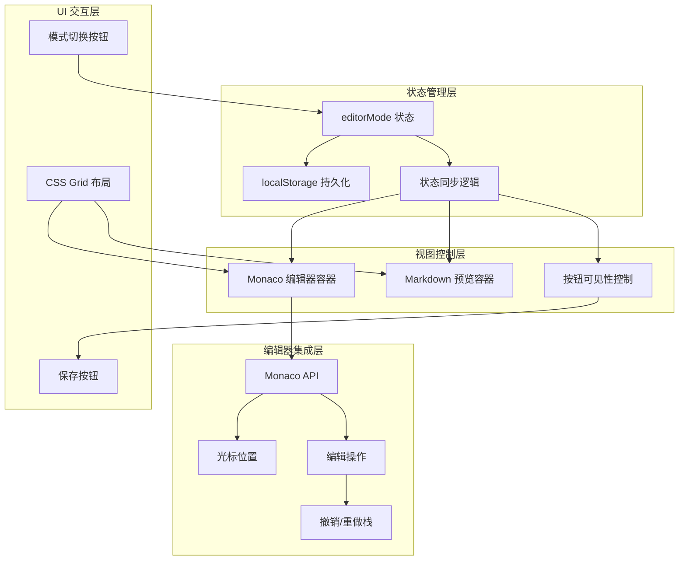

# 编辑器模式状态管理与布局系统

## 1. Purpose

SystemPromptVault 的编辑器支持编辑模式和预览模式两种状态，本文档详细描述了模式切换的状态管理、预览窗口的滚动容器设计、按钮可见性控制，以及CSS Grid布局系统在配置编辑器区域的应用。这些设计确保了编辑器在不同模式下的用户体验一致性、布局稳定性，以及与Monaco编辑器的深度集成功能，如智能插入提示词和撤销重做支持。

## 2. How it Works

### 2.1 编辑器模式状态管理架构



### 2.2 状态同步修复实现

解决了程序重启后状态与视图不同步的问题。关键改进是移除了早期返回逻辑，确保视图切换总是执行。

**核心实现** (`dist/js/main.js:616-645`):

```javascript
const toggleEditorMode = (mode) => {
  if (!mode || (mode !== "edit" && mode !== "preview")) {
    return;
  }

  // 更新状态（如果需要）
  const stateChanged = state.editorMode !== mode;
  if (stateChanged) {
    state.editorMode = mode;
    persistEditorMode(); // 保存模式状态到 localStorage
  }

  // 执行视图切换（即使状态相同也要执行，用于重启后恢复视图）
  if (mode === "preview") {
    elements.monacoEditorContainer?.classList.add("hidden");
    elements.markdownPreview?.classList.remove("hidden");
    elements.btnSaveConfig?.classList.add("hidden");  // 预览模式隐藏保存按钮
    renderMarkdownPreview();
  } else {
    elements.markdownPreview?.classList.add("hidden");
    elements.monacoEditorContainer?.classList.remove("hidden");
    elements.btnSaveConfig?.classList.remove("hidden");  // 编辑模式显示保存按钮
    if (state.monacoEditor) {
      state.monacoEditor.layout();
    }
  }

  // 更新按钮状态
  setModeToggleState();
};
```

**关键修复点**:
1. **移除早期返回**: 原先在状态匹配时会提前返回，导致重启后DOM不更新
2. **强制视图同步**: 即使 `stateChanged` 为 `false`，仍执行视图切换逻辑
3. **Monaco 编辑器重布局**: 切换到编辑模式时调用 `layout()` 方法重新计算尺寸

### 2.3 滚动容器约束设计

解决了预览窗口导致整页滚动的问题，通过 Flexbox 约束确保预览内容在容器内滚动。

**CSS 实现** (`dist/css/components.css:159-196`):

```css
/* 配置编辑器容器约束 */
.config-editor-shell {
  display: flex;
  flex-direction: column;
  width: 100%;
  flex: 1 1 0;      /* 关键：允许收缩但不增长 */
  min-height: 0;     /* 关键：允许收缩到小于内容高度 */
  overflow: hidden;  /* 防止容器溢出 */
}

/* Monaco 编辑器和预览容器 */
.monaco-editor-container,
.markdown-preview {
  width: 100%;
  flex: 1;           /* 平分剩余空间 */
  border: 1px solid #d1d5db;
  border-radius: 0.5rem;
  background: #f8fafc;
  color: inherit;
}

/* Monaco 编辑器特殊约束 */
.monaco-editor-container {
  min-height: 420px;     /* 最小高度保证可用性 */
  position: relative;
  overflow: hidden;      /* 防止编辑器溢出 */
  height: 100%;          /* 填充父容器 */
}

/* 预览容器滚动设计 */
.markdown-preview {
  padding: 1rem;
  overflow-y: auto;      /* 仅垂直方向滚动 */
  display: flex;
  flex-direction: column;
}

/* 预览内容区域 */
.markdown-preview__body {
  flex: 1 1 auto;        /* 允许内容区域伸缩 */
  min-height: 0;         /* 允许收缩 */
}
```

**设计原理**:
1. **容器约束**: 使用 `flex: 1 1 0` 和 `min-height: 0` 确保容器可以收缩
2. **滚动隔离**: 预览内容在容器内滚动，不影响页面其他部分
3. **最小高度**: Monaco 编辑器保持 420px 最小高度，确保编辑体验
4. **溢出控制**: 通过 `overflow: hidden` 防止意外滚动行为

### 2.4 按钮可见性控制系统

实现了基于编辑器模式的按钮动态显示/隐藏逻辑。

**可见性逻辑**:
```javascript
// 预览模式：隐藏保存按钮
if (mode === "preview") {
  elements.btnSaveConfig?.classList.add("hidden");
  renderMarkdownPreview();
}
// 编辑模式：显示保存按钮
else {
  elements.btnSaveConfig?.classList.remove("hidden");
  if (state.monacoEditor) {
    state.monacoEditor.layout();
  }
}
```

**CSS 样式** (`dist/css/components.css:247-283`):
```css
/* 编辑器模式图标按钮样式 */
.btn-icon-secondary {
  background: transparent;
  color: #6b7280;
  border: none;
  transition: all 0.15s ease;
}

.dark .btn-icon-secondary {
  color: #9ca3af;
}

.btn-icon-secondary:hover {
  background: rgba(59, 130, 246, 0.1);
  color: #3b82f6;
}

.btn-icon-secondary.is-active {
  background: #3b82f6;
  color: #ffffff;
}

/* 隐藏状态 */
.hidden {
  display: none !important;
}
```

### 2.5 CSS Grid 布局重构

将配置编辑器头部从 Flexbox 改为 CSS Grid，实现更好的视觉平衡和按钮布局控制。

**HTML 结构** (`dist/index.html:45-90`):
```html
<!-- CSS Grid 布局头部 -->
<div class="grid grid-cols-3 items-center gap-3">
  <!-- 左侧：客户端下拉菜单 -->
  <div class="client-dropdown" id="clientDropdown">
    <button class="client-dropdown__toggle" id="clientDropdownToggle">
      <span class="client-dropdown__label" id="clientDropdownLabel">选择客户端</span>
      <svg class="client-dropdown__icon">...</svg>
    </button>
    <!-- 下拉面板 -->
  </div>

  <!-- 中间：配置文件名（居中显示） -->
  <span id="configFileName" class="text-sm text-gray-600 dark:text-gray-400 text-center">
    CLAUDE.md
  </span>

  <!-- 右侧：操作按钮组 -->
  <div class="flex items-center gap-2 justify-end">
    <!-- 保存按钮（编辑模式显示） -->
    <button class="btn-icon btn-icon-primary" id="btnSaveConfig" type="button">
      <svg class="w-5 h-5">...</svg>
    </button>

    <!-- 模式切换按钮 -->
    <button class="btn-icon btn-icon-secondary" id="btnToggleEditorMode" type="button">
      <!-- 编辑模式图标 -->
      <svg class="w-5 h-5" id="iconEditMode">...</svg>
      <!-- 预览模式图标 -->
      <svg class="w-5 h-5 hidden" id="iconPreviewMode">...</svg>
    </button>
  </div>
</div>
```

**布局特点**:
1. **三列网格**: `grid-cols-3` 将头部均分为三个区域
2. **居中对齐**: `items-center` 垂直居中，文件名添加 `text-center` 水平居中
3. **按钮顺序**: 保存按钮在前，切换按钮在后，符合操作逻辑
4. **响应式**: 通过 Tailwind CSS 类实现响应式布局

### 2.6 状态持久化机制

编辑器模式状态通过 localStorage 实现持久化，确保重启应用后恢复上次状态。

**持久化实现**:
```javascript
// 保存编辑器模式到 localStorage
const persistEditorMode = () => {
  try {
    localStorage.setItem("editorMode", state.editorMode);
  } catch (error) {
    console.warn("Failed to persist editor mode:", error);
  }
};

// 从 localStorage 恢复编辑器模式
const restoreEditorMode = () => {
  try {
    const savedMode = localStorage.getItem("editorMode");
    if (savedMode && (savedMode === "edit" || savedMode === "preview")) {
      state.editorMode = savedMode;
      // 应用恢复的模式
      toggleEditorMode(savedMode);
    }
  } catch (error) {
    console.warn("Failed to restore editor mode:", error);
    state.editorMode = "edit"; // 默认编辑模式
  }
};
```

### 2.7 模式切换图标系统

实现了基于 SVG 的模式切换图标，通过 CSS 类切换显示不同图标。

**图标切换逻辑** (`dist/js/main.js:580-614`):
```javascript
const setModeToggleState = () => {
  const isPreview = state.editorMode === "preview";

  // 切换图标显示
  const editIcon = elements.iconEditMode;
  const previewIcon = elements.iconPreviewMode;

  if (editIcon && previewIcon) {
    editIcon.classList.toggle("hidden", isPreview);
    previewIcon.classList.toggle("hidden", !isPreview);
  }

  // 更新按钮状态
  if (elements.btnToggleEditorMode) {
    elements.btnToggleEditorMode.classList.toggle("is-active", isPreview);
    elements.btnToggleEditorMode.setAttribute("data-tooltip", isPreview ? "编辑" : "预览");
    elements.btnToggleEditorMode.setAttribute("aria-label",
      isPreview ? "切换到编辑模式" : "切换到预览模式");
  }
};
```

### 2.7 Monaco编辑器深度集成

编辑模式不仅提供基础的代码编辑功能，还实现了与提示词系统的深度集成，支持智能插入和撤销重做操作。

#### 2.7.1 智能插入支持

```javascript
// 编辑器模式检测逻辑
if (state.editorMode === "edit" && state.monacoEditor) {
  // 获取当前光标位置
  const position = state.monacoEditor.getPosition();
  if (position) {
    // 使用Monaco API进行精确插入
    state.monacoEditor.executeEdits(
      "appendPrompt",
      [
        {
          range: {
            startLineNumber: position.lineNumber,
            startColumn: position.column,
            endLineNumber: position.lineNumber,
            endColumn: position.column,
          },
          text: insertionText,
          forceMoveMarkers: true,
        },
      ]
    );
  }
}
```

#### 2.7.2 撤销重做栈管理

通过使用Monaco的 `executeEdits()` API 而非直接内容替换，确保：

1. **撤销/重做支持**: 用户可通过 Cmd+Z / Shift+Cmd+Z 进行撤销和重做
2. **编辑历史完整性**: 保持Monaco编辑器的内部操作历史
3. **光标位置保持**: 插入操作后光标自动移动到插入内容末尾

#### 2.7.3 编辑器模式影响

- **编辑模式**: 启用Monaco编辑器的高级功能，包括智能插入、撤销重做、语法高亮
- **预览模式**: 禁用编辑功能，切换到Markdown预览，回退到传统的文件末尾追加

## 3. Relevant Code Modules

### 核心状态管理模块
- `dist/js/main.js:616-645`: 编辑器模式切换核心逻辑，包含状态同步修复
- `dist/js/main.js:580-614`: 模式切换按钮状态更新和图标切换
- `dist/js/main.js:1-50`: 应用初始化和状态恢复逻辑

### CSS 样式模块
- `dist/css/components.css:159-196`: 配置编辑器容器和滚动约束样式
- `dist/css/components.css:247-283`: 编辑器模式按钮样式和激活状态
- `dist/css/main.css:300-350`: CSS Grid 布局相关样式

### HTML 结构模块
- `dist/index.html:45-90`: 配置编辑器头部三列网格布局
- `dist/index.html:100-150`: Monaco 编辑器和预览容器结构

### 主题系统模块
- `dist/js/theme.js`: 主题切换时编辑器样式更新逻辑
- `dist/css/theme.css`: 暗色主题下编辑器容器的样式适配

## 4. Attention

### Monaco编辑器集成注意事项

1. **智能插入逻辑**: 提示词追加操作会根据编辑器模式选择不同的插入策略，编辑模式下使用光标位置插入
2. **撤销重做栈**: 必须使用Monaco的 `executeEdits()` API来保持撤销重做功能，避免直接内容替换
3. **模式依赖**: 智能插入功能仅在编辑模式下可用，预览模式回退到传统文件末尾追加
4. **光标位置管理**: 插入操作后需要正确处理光标位置，确保良好的用户体验

### 状态同步注意事项

1. **强制视图更新**: 切换模式时必须执行DOM更新，即使状态已经匹配，这是重启后状态恢复的关键
2. **Monaco 编辑器重布局**: 切换到编辑模式时必须调用 `monacoEditor.layout()` 重新计算尺寸
3. **异常处理**: localStorage 操作需要异常处理，避免因存储异常导致功能不可用

### 滚动容器注意事项

1. **Flexbox 约束**: `flex: 1 1 0` 和 `min-height: 0` 组合是实现容器约束的关键
2. **溢出控制**: 容器级别的 `overflow: hidden` 防止意外滚动行为
3. **内容滚动**: 只有预览内容区域允许 `overflow-y: auto`，其他区域禁止滚动
4. **最小高度**: Monaco 编辑器的 `min-height: 420px` 确保基本可用性

### 按钮可见性注意事项

1. **模式驱动**: 按钮可见性完全由编辑器模式决定，避免状态不一致
2. **CSS 类切换**: 使用 `classList.add/remove("hidden")` 而非样式直接操作
3. **无障碍支持**: 按钮状态变化时同步更新 `aria-label` 属性

### Grid 布局注意事项

1. **三列平衡**: 使用 `grid-cols-3` 确保三列宽度相等，实现视觉平衡
2. **内容对齐**: 文件名使用 `text-center` 实现水平居中
3. **按钮组**: 右侧按钮组使用 `justify-end` 确保按钮靠右对齐
4. **响应式**: 通过 Tailwind CSS 类实现小屏幕下的布局调整

### 主题适配注意事项

1. **边框颜色**: 编辑器容器边框在暗色主题下使用 `--color-border` 变量
2. **背景色**: 预览容器背景在暗色主题下自动适配
3. **图标颜色**: 按钮图标颜色根据主题自动调整
4. **滚动条样式**: 预览容器的滚动条在暗色主题下需要特殊样式

### 性能优化注意事项

1. **DOM 操作最小化**: 模式切换时只更新必要的DOM元素
2. **Monaco 编辑器优化**: 避免频繁调用 `layout()` 方法
3. **事件监听器**: 确保按钮事件监听器正确绑定和解绑
4. **CSS 动画**: 按钮状态切换使用 CSS 过渡动画提升体验