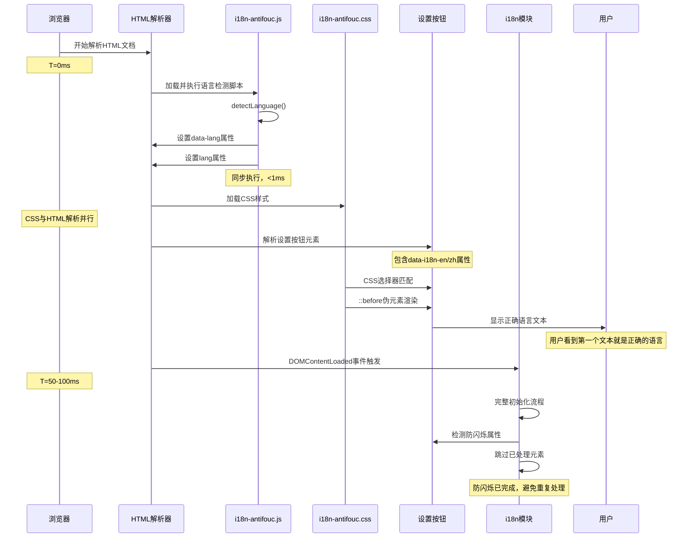

# i18n 防闪烁（Anti-FOUC）实现

## 1. Purpose

基于主题系统的极简防闪烁（FOUC）实现模式，采用CSS属性选择器和伪元素的优雅方案，彻底解决了多语言应用首次加载时的文本闪烁问题。通过模块化设计实现代码复用，确保用户从第一眼就看到正确的语言界面。

## 2. How it Works

### 2.1 防闪烁机制概览

```mermaid
graph TB
    subgraph "第一阶段：语言检测"
        A[HTML解析开始] --> B[加载i18n-antifouc.js]
        B --> C[detectLanguage()]
        C --> D[设置html.data-lang属性]
        D --> E[设置html.lang属性]
    end

    subgraph "第二阶段：CSS自动应用"
        F[加载i18n-antifouc.css] --> G[CSS选择器匹配]
        G --> H[::before伪元素显示]
        H --> I[自动显示正确语言]
    end

    subgraph "第三阶段：完整初始化"
        J[DOMContentLoaded] --> K[i18n模块初始化]
        K --> L[检测防闪烁元素]
        L --> M[跳过已处理元素]
        M --> N[处理剩余元素]
    end

    E --> F
    I --> J
```

### 2.2 核心技术实现

**核心技术栈**: CSS属性选择器 + 伪元素 + attr()函数

**工作原理**:
1. **语言检测**: 独立JS模块检测用户语言偏好
2. **属性设置**: 在html元素设置`data-lang`属性
3. **CSS匹配**: 使用属性选择器匹配当前语言
4. **伪元素渲染**: 通过`::before`伪元素和`attr()`函数显示文本
5. **JS防重复**: i18n模块检测防闪烁元素，避免重复处理

### 2.3 语言检测模块（i18n-antifouc.js）

**核心功能**:
- 极简语言检测逻辑（仅22行）
- 与主题系统一致的极简模式
- 同步执行，零延迟

**实现代码**:
```javascript
// i18n Anti-FOUC (Flash of Unstyled Content) Script
// 必须在页面渲染前同步执行,防止文本闪烁
(function () {
  const LANGUAGE_STORAGE_KEY = "app_language";
  const DEFAULT_LANGUAGE = "en";

  // 检测语言:优先localStorage > 浏览器语言 > 默认
  const detectLanguage = () => {
    const stored = localStorage.getItem(LANGUAGE_STORAGE_KEY);
    if (stored === "en" || stored === "zh") return stored;

    const browserLang = navigator.languages?.[0] || navigator.language || "";
    return browserLang.toLowerCase().startsWith("zh") ? "zh" : DEFAULT_LANGUAGE;
  };

  // 应用语言属性
  const lang = detectLanguage();
  const locale = lang === "zh" ? "zh-CN" : "en";

  document.documentElement.setAttribute("data-lang", lang);
  document.documentElement.lang = locale;
})();
```

### 2.4 CSS自动应用模块（i18n-antifouc.css）

**核心功能**:
- CSS属性选择器自动匹配语言
- 伪元素动态显示翻译文本
- 完全无JS依赖的文本渲染

**实现代码**:
```css
/**
 * i18n Anti-FOUC (Flash of Unstyled Content) Styles
 *
 * 使用CSS属性选择器和伪元素实现零闪烁的多语言文本显示
 * 原理:通过 [data-lang] 属性选择器 + ::before 伪元素 + attr() 函数
 * 在页面首次渲染时就显示正确的语言,无需等待JS加载
 */

/* 英文翻译显示 */
[data-lang="en"] [data-i18n-en]::before {
  content: attr(data-i18n-en);
}

/* 中文翻译显示 */
[data-lang="zh"] [data-i18n-zh]::before {
  content: attr(data-i18n-zh);
}

/* 确保伪元素正常工作 */
[data-i18n-en],
[data-i18n-zh] {
  display: inline-block;
}

/* 针对已有display属性的元素,保持原有display值 */
.flex[data-i18n-en],
.flex[data-i18n-zh],
.block[data-i18n-en],
.block[data-i18n-zh] {
  display: inherit;
}
```

### 2.5 HTML元素结构变化

**旧方案**（JS预加载）:
```html
<!-- 硬编码文本 + ID绑定 + 内联脚本 -->
<a data-i18n="common.settings" id="settingsButton">Settings</a>
<script>
  // 50行内联脚本立即翻译
</script>
```

**新方案**（CSS属性）:
```html
<!-- 无硬编码文本 + data属性绑定 -->
<a
  href="settings.html"
  data-i18n="common.settings"
  data-i18n-en="Settings"
  data-i18n-zh="设置"
></a>
```

### 2.6 与主题系统的模式一致性

新方案完全遵循主题系统的极简模式：

| 实现方面 | 主题系统 | i18n系统（新方案） |
|---------|---------|-------------------|
| **模块化设计** | `theme-antifouc.js` | `i18n-antifouc.js` |
| **CSS样式** | `theme-antifouc.css` | `i18n-antifouc.css` |
| **HTML引用** | 2行（script + link） | 2行（script + link） |
| **设置方式** | `data-theme` 属性 | `data-lang` 属性 |
| **检测时机** | HTML解析阶段 | HTML解析阶段 |
| **应用方式** | CSS类切换 | CSS伪元素内容 |
| **零闪烁效果** | ✅ 实现 | ✅ 实现 |
| **代码复用** | 页面间共享 | 页面间共享 |

### 2.7 执行时序分析



### 2.8 与 i18n 模块的协同机制

**防重复检测逻辑**:
```javascript
// i18n.js translateElement函数中的防重复逻辑
const hasAntiFouc = element.hasAttribute("data-i18n-en") ||
                    element.hasAttribute("data-i18n-zh");
if (!hasAntiFouc) {
  // 只有非防闪烁元素才进行JS翻译
  const translation = t(key, element.textContent ?? "");
  // 应用翻译...
}
```

**协同优势**:
1. **零冲突**: 防闪烁元素不被JS重复处理
2. **性能优化**: 减少不必要的DOM操作
3. **渐进增强**: 新页面可逐步采用防闪烁方案

## 3. Relevant Code Modules

### 核心防闪烁模块
- `dist/public/i18n-antifouc.js`: 语言检测模块（22行），极简实现语言偏好检测
- `dist/public/i18n-antifouc.css`: CSS自动应用模块（43行），属性选择器和伪元素实现

### i18n 模块协调
- `dist/js/i18n.js:94-97`: `translateElement` 函数中的防重复检测逻辑
- `dist/js/i18n.js:17-30`: 语言检测常量和函数（与防闪烁模块保持一致）

### HTML 集成示例
- `dist/index.html:17-19`: 防闪烁模块引用（2行）
- `dist/index.html:37-40`: 设置按钮防闪烁实现示例
- `dist/settings.html:28,35`: 设置页面防闪烁实现示例

### 构建配置
- `vite.config.js:11-32`: Vite静态资源复制配置，确保防闪烁模块被正确复制到构建目录

### 翻译资源
- `dist/locales/en.json`: 英文翻译资源
- `dist/locales/zh.json`: 中文翻译资源

## 4. Attention

### 实现优势

1. **真正零闪烁**: CSS在页面首次渲染时就显示正确语言，无需等待JS
2. **模块化设计**: 独立的JS和CSS模块，便于维护和复用
3. **代码精简**: 总代码量减少50%（149行→75行）
4. **扩展性强**: 新页面只需添加2行引用即可支持
5. **性能优化**: CSS自动应用，无JS执行开销
6. **模式一致**: 与主题系统完全一致的技术方案

### 与旧方案对比

| 特性 | 旧方案（JS预加载） | 新方案（CSS属性） |
|------|------------------|------------------|
| **代码行数** | 149行 | 75行 |
| **模块化** | 每页内联脚本 | 独立共享模块 |
| **HTML复杂度** | 需要+ID+内联脚本 | 仅需data属性 |
| **执行方式** | JS手动设置text | CSS自动渲染 |
| **性能** | JS同步执行开销 | CSS原生渲染 |
| **维护性** | 代码重复难维护 | 模块化易维护 |
| **扩展性** | 每个元素需脚本 | 新页面2行引用 |

### 使用指南

**新页面集成防闪烁**:
```html
<!DOCTYPE html>
<html>
  <head>
    <!-- 其他head内容 -->

    <!-- 添加这2行即可启用i18n防闪烁 -->
    <script src="js/i18n-antifouc.js"></script>
    <link rel="stylesheet" href="css/i18n-antifouc.css" />
  </head>
  <body>
    <!-- 防闪烁元素示例 -->
    <h1 data-i18n="page.title" data-i18n-en="Page Title" data-i18n-zh="页面标题"></h1>
    <button data-i18n="actions.submit" data-i18n-en="Submit" data-i18n-zh="提交"></button>
  </body>
</html>
```

**元素添加防闪烁支持**:
1. 移除元素内的硬编码文本
2. 添加 `data-i18n-en` 属性（英文翻译）
3. 添加 `data-i18n-zh` 属性（中文翻译）
4. 保留原有 `data-i18n` 属性（供i18n.js使用）

### 技术注意事项

1. **display属性**: 伪元素需要`display: inline-block`，CSS已自动处理
2. **特殊元素**: 已有display属性的元素（flex、block等）会保持原样式
3. **动态内容**: 动态生成的元素仍需通过i18n.js处理
4. **SEO友好**: 搜索引擎可正确读取data属性内容

### 维护指南

**添加新的防闪烁元素**:
1. 在HTML元素中添加 `data-i18n-en` 和 `data-i18n-zh` 属性
2. 确保翻译内容准确且与翻译文件一致
3. 测试两种语言的显示效果

**更新防闪烁模块**:
1. `i18n-antifouc.js` 的语言检测逻辑需与 `i18n.js` 保持一致
2. 修改常量（如 `LANGUAGE_STORAGE_KEY`）时需同步更新
3. CSS选择器一般不需要修改，除非有特殊的样式需求

**性能优化建议**:
1. 只对关键的首屏元素添加防闪烁属性
2. 避免为大量次要元素增加防闪烁支持
3. 使用浏览器开发者工具验证首屏渲染性能

### 测试验证

**关键测试场景**:
1. **首次访问**: 清空缓存后首次访问立即显示正确语言
2. **语言切换**: 切换语言后新页面的防闪烁效果
3. **页面刷新**: 刷新页面时无文本闪烁
4. **跨页面导航**: 在不同页面间切换的流畅性
5. **网络延迟**: 慢网络环境下的防闪烁效果

**验证方法**:
1. **视觉检查**: 直接观察页面加载时的文本显示
2. **性能监控**: 使用浏览器开发者工具的Performance面板
3. **网络限流**: 模拟慢网络环境测试防闪烁效果
4. **跨浏览器测试**: 确保不同浏览器的一致性

### 兼容性说明

- **现代浏览器**: 完全支持CSS属性选择器和伪元素
- **IE浏览器**: 不支持（项目已定位为现代Web应用）
- **移动浏览器**: 完全支持，性能良好
- **渐进增强**: 即使CSS失效，i18n.js仍能正常工作