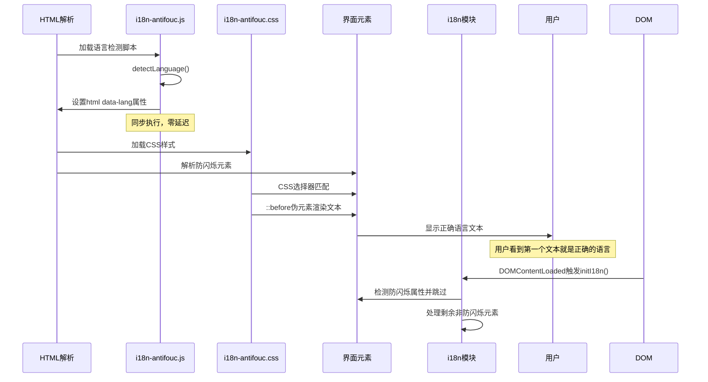
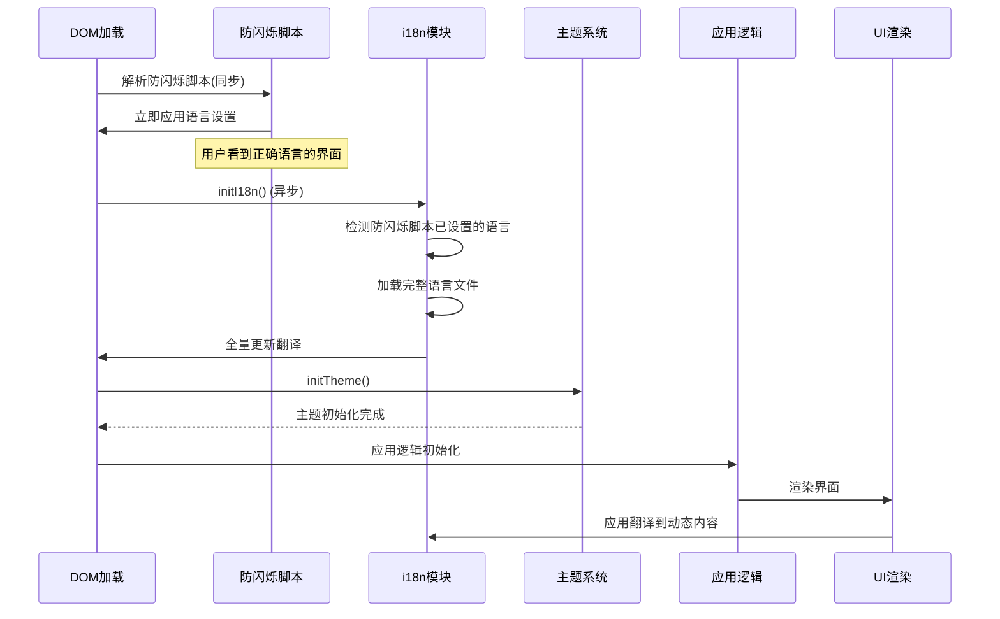

# i18n 国际化功能实现

## 1. Purpose

SystemPromptVault 的国际化（i18n）功能提供完整的多语言支持，包括系统语言自动检测、用户手动语言切换、界面文本动态翻译、跨窗口语言同步等功能。系统支持英文（en）和中文（zh）两种语言，通过模块化设计实现高效的翻译管理和 DOM 自动更新。

## 2. How it Works

### 2.1 系统架构设计


### 2.2 语言检测与初始化流程


### 2.3 翻译键值解析系统

i18n 系统支持嵌套键值结构，使用点号分隔的路径访问深层翻译：

```javascript
// 翻译文件结构
{
  "common": {
    "appTitle": "System Prompt Vault",
    "actions": {
      "save": "Save",
      "cancel": "Cancel"
    }
  },
  "prompts": {
    "sectionTitle": "Prompts",
    "empty": "No prompts found"
  }
}

// 使用方式
t("common.appTitle")           // "System Prompt Vault"
t("common.actions.save")       // "Save"
t("prompts.sectionTitle")      // "Prompts"
t("prompts.empty")             // "No prompts found"
```

### 2.4 DOM 自动更新机制

系统通过扫描特定 `data-*` 属性自动更新界面文本：

**支持的属性类型**:
- `data-i18n`: 元素文本内容
- `data-i18n-placeholder`: 输入框占位符
- `data-i18n-aria`: ARIA 标签
- `data-i18n-tooltip`: 工具提示
- `data-i18n-title`: 标题属性
- `data-i18n-value`: 表单元素值

**HTML 示例**:
```html
<!-- 基本文本翻译 -->
<h1 data-i18n="clients.header">Clients</h1>

<!-- 占位符翻译 -->
<input type="text" data-i18n-placeholder="tags.searchPlaceholder">

<!-- ARIA 标签翻译 -->
<button data-i18n-aria="actions.saveConfig" aria-label="Save">

<!-- 工具提示翻译 -->
<div data-i18n-tooltip="editor.preview" data-tooltip="Preview">
```

### 2.5 跨窗口语言同步


### 2.6 语言切换完整流程


### 2.7 防闪烁（Anti-FOUC）机制



### 2.8 CSS属性选择器防闪烁方案

**核心技术**: CSS属性选择器 + 伪元素 + attr()函数

**实现机制**:
1. **语言检测**: `i18n-antifouc.js` 检测用户语言偏好并设置 `data-lang` 属性
2. **自动匹配**: CSS根据 `[data-lang]` 值自动选择对应语言的翻译
3. **伪元素渲染**: 通过 `::before` 伪元素和 `content: attr()` 显示文本
4. **防重复处理**: i18n模块检测防闪烁元素，避免重复JS操作

**模块化结构**:
- `i18n-antifouc.js` (22行): 极简语言检测脚本
- `i18n-antifouc.css` (42行): CSS自动应用规则
- **HTML集成**: 每个页面仅需2行引用即可启用

**HTML使用方式**:
```html
<head>
  <!-- 启用i18n防闪烁 -->
  <script src="js/i18n-antifouc.js"></script>
  <link rel="stylesheet" href="css/i18n-antifouc.css" />
</head>
<body>
  <!-- 防闪烁元素 -->
  <a data-i18n="common.settings" data-i18n-en="Settings" data-i18n-zh="设置"></a>
</body>
```

**CSS选择器逻辑**:
```css
/* 英文环境 */
[data-lang="en"] [data-i18n-en]::before {
  content: attr(data-i18n-en);
}

/* 中文环境 */
[data-lang="zh"] [data-i18n-zh]::before {
  content: attr(data-i18n-zh);
}
```

**i18n模块协调**:
```javascript
const translateElement = (element) => {
  const hasAntiFouc = element.hasAttribute("data-i18n-en") ||
                    element.hasAttribute("data-i18n-zh");
  if (!hasAntiFouc) {
    // 只处理非防闪烁元素
    const translation = t(key, element.textContent ?? "");
    // 应用翻译...
  }
};
```

### 2.9 与主题系统的技术一致性

防闪烁实现完全遵循主题系统的极简模式：

| 技术特性 | 主题系统 | i18n系统 |
|---------|---------|---------|
| **JavaScript模块** | `theme-antifouc.js` | `i18n-antifouc.js` |
| **CSS样式模块** | `theme-antifouc.css` | `i18n-antifouc.css` |
| **HTML集成复杂度** | 2行引用 | 2行引用 |
| **属性设置** | `data-theme` 属性 | `data-lang` 属性 |
| **应用机制** | CSS类切换 | CSS伪元素内容 |
| **模块复用** | 页面间共享 | 页面间共享 |
| **执行时机** | HTML解析阶段 | HTML解析阶段 |
| **零闪烁效果** | ✅ 实现 | ✅ 实现 |

### 2.10 应用初始化中的 i18n 集成



## 3. Relevant Code Modules

### 核心模块
- `dist/js/i18n.js`: 国际化核心实现（211行），包含语言检测、翻译加载、DOM更新、跨窗口同步
- `dist/locales/en.json`: 英文翻译资源文件（228行）
- `dist/locales/zh.json`: 中文翻译资源文件（228行）

### 集成模块
- `dist/js/main.js`: 主应用模块，集成 i18n 初始化和翻译函数使用
- `dist/js/settings.js`: 设置页面模块，集成语言设置界面和翻译函数
- `dist/js/utils.js`: 工具函数模块，Toast 系统国际化

### 防闪烁实现模块
- `dist/js/i18n-antifouc.js`: 语言检测模块（22行），极简实现语言偏好检测
- `dist/css/i18n-antifouc.css`: CSS自动应用模块（42行），属性选择器和伪元素实现
- `dist/index.html:17-19`: 防闪烁模块引用（2行）
- `dist/index.html:37-40`: 设置按钮防闪烁实现示例
- `dist/settings.html:28,35`: 设置页面防闪烁实现示例

### i18n模块防重复处理
- `dist/js/i18n.js:94-97`: `translateElement` 函数中的防重复检测逻辑，跳过已处理的防闪烁元素

### 配置文件
- `dist/js/i18n.js`: 定义常量 `SUPPORTED_LANGUAGES`, `DEFAULT_LANGUAGE`, `LANGUAGE_STORAGE_KEY`

## 4. Attention

### 性能优化注意事项

1. **翻译缓存**: 使用 `Map` 缓存已加载的语言文件，避免重复网络请求
2. **防抖机制**: 语言切换操作使用防抖，避免频繁切换导致的性能问题
3. **DOM 更新优化**: 只更新包含 `data-*` 属性的元素，减少不必要的 DOM 操作
4. **懒加载**: 语言文件按需加载，首次启动只加载所需语言

### 开发注意事项

1. **翻译键命名**: 使用点号分隔的嵌套结构，保持逻辑分组（如 `common.actions.save`）
2. **回退机制**: 翻译缺失时使用键名作为回退，确保界面可用性
3. **HTML 属性**: 为所有需要翻译的元素添加适当的 `data-*` 属性
4. **动态内容**: 动态生成的内容需要手动调用 `applyTranslations()` 或 `t()` 函数

### 国际化最佳实践

1. **文本外化**: 所有用户可见的文本都必须提取到翻译文件中
2. **上下文保持**: 翻译时保持文本的上下文含义，避免直译导致的信息丢失
3. **占位符处理**: 包含变量的文本使用占位符格式，便于翻译时的词序调整
4. **测试覆盖**: 测试时需要验证两种语言的显示效果和功能完整性

### 存储和同步注意事项

1. **持久化键**: 使用固定键名 `app_language` 存储用户语言选择
2. **跨窗口同步**: 通过 `storage` 事件实现多窗口语言自动同步
3. **错误处理**: 语言加载失败时自动回退到默认语言，确保应用可用性

### 防闪烁实现注意事项

1. **模块化设计**: 新方案采用独立的JS和CSS模块，便于维护和页面复用
2. **技术一致性**: 与主题系统完全一致的极简模式，便于理解和扩展
3. **属性检测**: 防闪烁脚本必须与i18n.js使用相同的语言检测逻辑和常量
4. **CSS优先级**: 防闪烁CSS通过伪元素显示内容，需要确保display属性正确设置
5. **防重复处理**: i18n模块会检测防闪烁属性，避免重复处理已渲染的元素
6. **扩展性**: 新页面只需添加2行引用即可支持防闪烁，新元素只需添加data属性

### 防闪烁维护指南

1. **模块同步**: 修改语言检测逻辑时需同步更新 `i18n-antifouc.js` 和 `i18n.js`
2. **常量一致性**: `LANGUAGE_STORAGE_KEY` 等常量在两个模块间必须保持一致
3. **CSS维护**: 一般情况下CSS选择器无需修改，除非有特殊样式需求
4. **元素添加**: 为新元素添加防闪烁时，需同时添加 `data-i18n-en` 和 `data-i18n-zh` 属性
5. **测试验证**: 确保首次访问、页面刷新、语言切换等场景的零闪烁效果