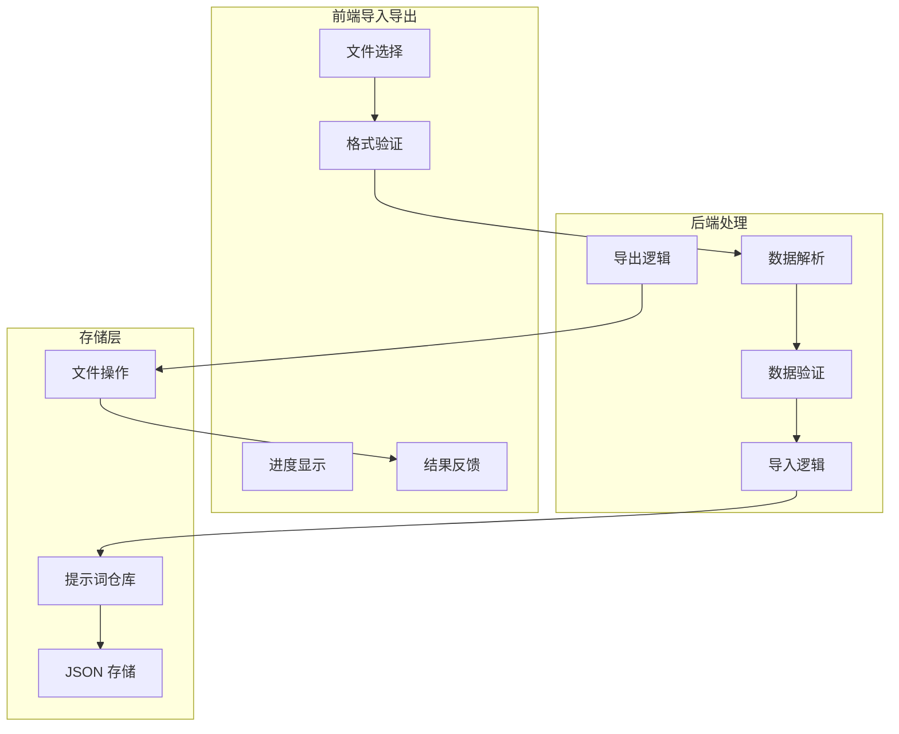

# 导入导出功能

## 1. Purpose

SystemPromptVault 实现了完整的提示词导入导出功能，支持批量数据处理、格式验证、去重更新、文件操作等。本文档详细描述导入导出功能的实现机制和数据处理流程。

## 2. How it Works

### 2.1 导入导出架构



### 2.2 前端文件处理

```javascript
// 导出功能实现
const handleExportPrompts = async () => {
  try {
    // 调用后端导出 API
    const data = await withLoading(async () => PromptAPI.exportPrompts());

    // 创建 Blob 对象
    const blob = new Blob([data], { type: "application/json;charset=utf-8" });

    // 创建下载链接
    const url = URL.createObjectURL(blob);
    const link = document.createElement("a");
    link.href = url;
    link.download = `prompts_backup_${formatExportTimestamp()}.json`;

    // 触发下载
    document.body.appendChild(link);
    link.click();
    document.body.removeChild(link);
    URL.revokeObjectURL(url);

    showToast("提示词已导出", "success");
  } catch (error) {
    showToast(getErrorMessage(error) || "导出提示词失败", "error");
  }
};

// 导入功能实现
const handleImportFileChange = async (event) => {
  const file = event.target?.files?.[0];
  if (!file) return;

  try {
    // 读取文件内容
    const content = await file.text();

    // 前端基础验证
    validateImportPayload(content);

    // 调用后端导入 API
    const importResult = await withLoading(async () => {
      const result = await PromptAPI.importPrompts(content);
      await loadPrompts(); // 重新加载提示词列表
      return result;
    });

    // 显示导入结果
    showImportResult(importResult);
  } catch (error) {
    showToast(getErrorMessage(error) || "导入提示词失败", "error");
  } finally {
    if (event.target) {
      event.target.value = ""; // 清空文件选择，允许重复选择同一文件
    }
  }
};
```

### 2.3 数据格式验证

```javascript
const validateImportPayload = (jsonText) => {
  if (!jsonText.trim()) {
    throw new Error("导入文件为空");
  }

  let parsed;
  try {
    parsed = JSON.parse(jsonText);
  } catch (error) {
    throw new Error("JSON 格式无效");
  }

  if (!Array.isArray(parsed)) {
    throw new Error("JSON 内容必须是提示词数组");
  }
};
```

### 2.4 后端导入处理

```rust
// 导入结果结构
#[derive(Debug, Clone, Serialize, Deserialize)]
pub struct ImportResult {
    pub total: usize,    // 总数
    pub added: usize,    // 新增数量
    pub updated: usize,  // 更新数量
}

// 导入命令实现
#[tauri::command]
pub fn import_prompts(
    repository: State<'_, Arc<Mutex<PromptRepository>>>,
    json_data: String,
) -> Result<ImportResult, String> {
    // 解析和验证数据
    let prompts = parse_and_validate_prompts(&json_data)?;
    if prompts.is_empty() {
        return Ok(ImportResult {
            total: 0,
            added: 0,
            updated: 0,
        });
    }

    // 执行导入逻辑
    let mut repo = lock_repo(&repository)?;
    repo.import_prompts(prompts)
}
```

### 2.5 数据解析和验证

```rust
fn parse_and_validate_prompts(json_data: &str) -> Result<Vec<Prompt>, String> {
    let trimmed = json_data.trim();
    if trimmed.is_empty() {
        return Err("导入数据不能为空".to_string());
    }

    // 解析 JSON
    let value: Value = serde_json::from_str(trimmed)
        .map_err(|e| format!("解析提示词 JSON 失败: {}", e))?;

    // 验证数组结构
    let entries = value.as_array()
        .ok_or_else(|| "导入数据必须是提示词数组".to_string())?;

    // 验证每个条目的字段
    validate_prompt_entries(entries)?;

    // 转换为 Prompt 对象
    let prompts: Vec<Prompt> = serde_json::from_value(value)
        .map_err(|e| format!("转换提示词数据失败: {}", e))?;

    // 验证数据模型
    validate_prompt_models(&prompts)?;

    Ok(prompts)
}
```

### 2.6 字段验证逻辑

```rust
fn validate_prompt_entries(entries: &[Value]) -> Result<(), String> {
    for (index, entry) in entries.iter().enumerate() {
        let obj = entry.as_object()
            .ok_or_else(|| format!("第{}个条目必须是对象", index + 1))?;

        // 验证必需字段
        ensure_string_field(obj, "id", index)?;
        ensure_string_field(obj, "name", index)?;
        ensure_string_field(obj, "content", index)?;
        ensure_array_field(obj, "tags", index)?;
        ensure_string_field(obj, "created_at", index)?;
        ensure_string_field(obj, "updated_at", index)?;
    }
    Ok(())
}

fn ensure_string_field(
    obj: &serde_json::Map<String, Value>,
    field: &str,
    index: usize,
) -> Result<(), String> {
    match obj.get(field) {
        Some(Value::String(value)) if !value.trim().is_empty() => Ok(()),
        Some(Value::String(_)) => Err(format!(
            "第{}个提示词的{}不能为空",
            index + 1,
            field_label(field)
        )),
        Some(_) => Err(format!(
            "第{}个提示词的{}格式错误",
            index + 1,
            field_label(field)
        )),
        None => Err(format!(
            "第{}个提示词缺少{}字段",
            index + 1,
            field_label(field)
        )),
    }
}
```

### 2.7 导入逻辑实现

```rust
// PromptRepository 中的导入实现
impl PromptRepository {
    pub fn import_prompts(&mut self, prompts: Vec<Prompt>) -> Result<ImportResult, String> {
        let mut result = ImportResult {
            total: prompts.len(),
            added: 0,
            updated: 0,
        };

        for prompt in prompts {
            match self.prompts.get(&prompt.id) {
                Some(existing) => {
                    // 更新现有提示词
                    let mut updated_prompt = prompt;
                    updated_prompt.created_at = existing.created_at; // 保持原创建时间
                    self.prompts.insert(prompt.id.clone(), updated_prompt);
                    result.updated += 1;
                }
                None => {
                    // 添加新提示词
                    self.prompts.insert(prompt.id.clone(), prompt);
                    result.added += 1;
                }
            }
        }

        // 保存到文件
        self.save()?;
        Ok(result)
    }
}
```

### 2.8 导出功能实现

```rust
#[tauri::command]
pub fn export_prompts(
    repository: State<'_, Arc<Mutex<PromptRepository>>>,
) -> Result<String, String> {
    let repo = lock_repo(&repository)?;
    let prompts = repo.get_all()?;

    // 序列化为格式化的 JSON
    serde_json::to_string_pretty(&prompts)
        .map_err(|e| format!("序列化提示词失败: {}", e))
}
```

### 2.9 结果处理和反馈

```javascript
// 显示导入结果
const showImportResult = (importResult) => {
  const { total = 0, added = 0, updated = 0 } = importResult || {};
  let message;

  if (total === 0) {
    message = "未导入任何提示词";
  } else if (added === total) {
    message = `成功导入 ${total} 个新提示词`;
  } else if (added === 0) {
    message = `已更新 ${updated} 个提示词`;
  } else {
    message = `成功导入 ${total} 个提示词（新增 ${added} 个，更新 ${updated} 个）`;
  }

  showToast(message, "success");
};

// 时间戳格式化
const formatExportTimestamp = () => {
  const now = new Date();
  const pad = (value) => value.toString().padStart(2, "0");
  return `${now.getFullYear()}${pad(now.getMonth() + 1)}${pad(now.getDate())}_${pad(
    now.getHours()
  )}${pad(now.getMinutes())}${pad(now.getSeconds())}`;
};
```

## 3. Relevant Code Modules

### 前端模块
- `dist/js/settings.js`: 导入导出 UI 逻辑、文件处理、结果反馈
- `dist/js/api.js`: API 调用封装、错误处理
- `dist/settings.html`: 导入导出按钮、文件输入元素

### 后端模块
- `src-tauri/src/commands/prompt.rs`: 导入导出命令实现、数据验证
- `src-tauri/src/storage/prompt_repository.rs`: 数据仓库操作、导入逻辑
- `src-tauri/src/storage/json_store.rs`: JSON 存储基础操作

## 4. Attention

### 数据安全注意事项

1. **输入验证**: 严格的 JSON 格式验证和数据类型检查
2. **文件大小限制**: 前端和后端都应该有合理的文件大小限制
3. **恶意内容**: 检查潜在的恶意 JSON 内容和脚本注入
4. **数据清理**: 导入时清理和标准化数据格式

### 错误处理注意事项

1. **友好提示**: 提供清晰的错误信息和解决建议
2. **部分失败**: 支持部分数据导入失败时的回滚机制
3. **日志记录**: 记录导入导出操作的详细日志
4. **用户确认**: 重要操作前要求用户确认

### 性能优化注意事项

1. **大文件处理**: 对大文件使用流式处理或分块处理
2. **内存管理**: 及时释放大量数据处理时的内存占用
3. **进度反馈**: 长时间操作提供进度指示
4. **并发控制**: 防止并发导入导出操作

### 用户体验注意事项

1. **操作反馈**: 清晰的成功/失败状态反馈
2. **文件命名**: 自动生成有意义的文件名
3. **格式示例**: 提供正确的导入文件格式示例
4. **操作撤销**: 考虑提供批量操作的撤销功能