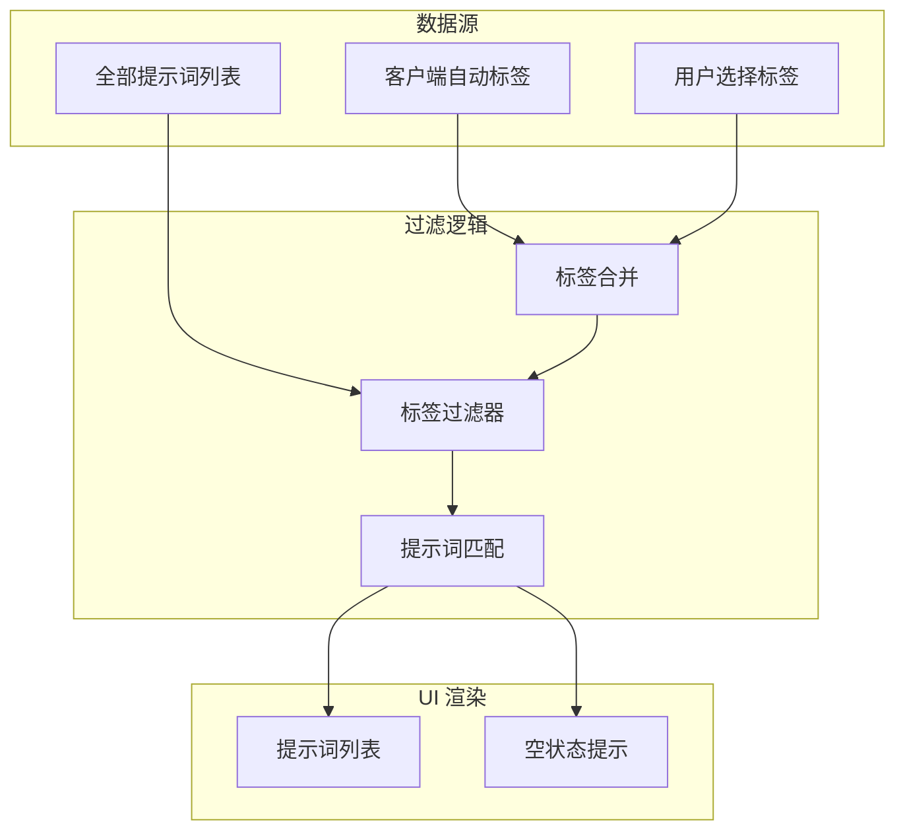
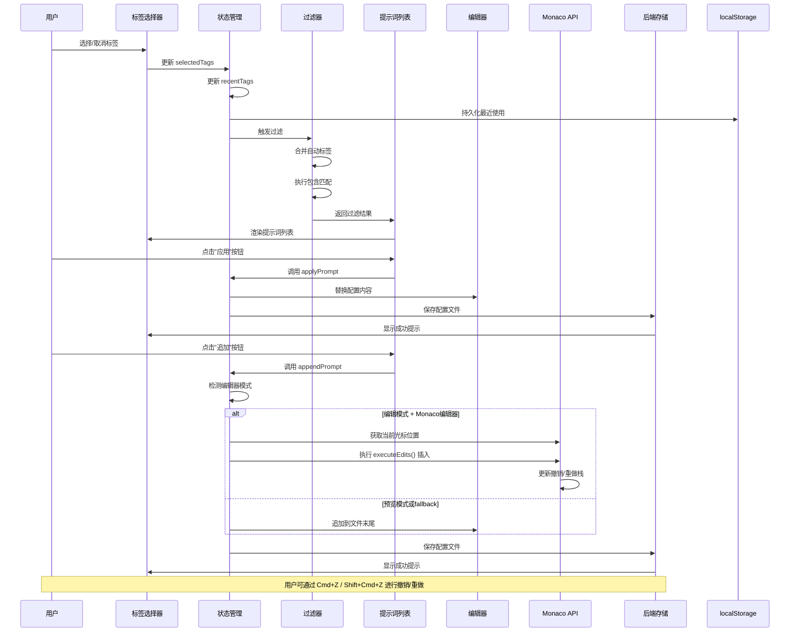

# 提示词管理模块

## 1. Purpose

提示词管理模块负责提示词的展示、过滤、应用和追加操作。本文档详细描述提示词列表渲染、标签过滤系统、搜索功能和用户交互流程的技术实现。

## 2. How it Works

### 2.1 提示词过滤架构



### 2.2 标签过滤系统

#### 2.2.1 标签类型与状态管理

系统支持两种类型的标签，并采用分离的状态管理策略：

**标签类型定义**：

1. **自动标签**: 由客户端配置自动应用，不可手动移除
   - 来源：`currentClient.auto_tags`
   - 特性：自动激活、不可禁用、随客户端切换

2. **手动标签**: 用户通过下拉菜单手动选择的标签
   - 来源：`state.selectedTags`
   - 特性：用户可控、可清空、支持多选

**状态管理架构**：

```javascript
// 核心状态
const state = {
  selectedTags: [],       // 手动选择的标签列表（用户可控）
  recentTags: [],         // 最近使用的标签列表（持久化）
  tagDropdownOpen: false, // 下拉菜单开关状态
  tagSearchQuery: "",     // 标签搜索关键词
};

// 标签计算函数
const getAutoTags = () => {
  const currentClient = state.clients.find((c) => c.id === state.currentClientId);
  return currentClient?.auto_tags ?? [];
};

const getActiveTags = () => {
  const autoTags = getAutoTags();
  const selectedTags = state.selectedTags;
  return [...new Set([...autoTags, ...selectedTags])]; // 去重合并
};
```

**清空已选标签功能**：

```javascript
const clearSelectedTags = () => {
  if (!state.selectedTags.length) {
    return;
  }
  // 仅清空手动选择的标签，不影响自动标签
  state.selectedTags = [];
  renderTagFilter();
  renderPromptList();
};
```

**设计决策**：
- **选择性清空**：只清除手动标签（`state.selectedTags`），保留自动标签
- **状态分离**：手动标签和自动标签分别管理，避免混淆
- **用户体验**：提供一键清空功能，同时支持连续多选操作

#### 2.2.2 过滤算法

提示词过滤采用**包含匹配**策略：提示词的标签必须包含所有激活的标签（手动+自动）才会被显示。

```javascript
const getFilteredPrompts = () => {
  const activeTags = getActiveTags(); // 获取合并后的激活标签
  if (!activeTags.length) {
    return state.prompts; // 无标签限制时显示所有提示词
  }

  return state.prompts.filter((prompt) => {
    const promptTags = prompt.tags ?? [];
    return activeTags.every((tag) => promptTags.includes(tag));
  });
};
```

**示例**:
- 提示词 A 标签: `["coding", "javascript", "react"]`
- 选中标签: `["coding", "react"]`
- 结果: ✅ 匹配（提示词包含所有选中标签）

- 提示词 B 标签: `["coding", "python"]`
- 选中标签: `["coding", "react"]`
- 结果: ❌ 不匹配（提示词缺少 `react` 标签）

#### 2.2.3 标签列表生成

从所有提示词中提取去重的标签列表:

```javascript
const getAllTags = () => {
  const tagSet = new Set();
  state.prompts.forEach((prompt) => {
    const tags = prompt.tags ?? [];
    tags.forEach((tag) => {
      if (typeof tag === "string" && tag.trim()) {
        tagSet.add(tag);
      }
    });
  });
  return Array.from(tagSet).sort();
};
```

### 2.3 下拉菜单标签选择器

#### 2.3.1 UI 组件结构

```html
<div class="tag-dropdown" id="tagFilter">
  <!-- 切换按钮 -->
  <button class="tag-dropdown__toggle" id="tagDropdownToggle">
    <span class="tag-dropdown__label">筛选标签</span>
    <span class="tag-dropdown__badge" id="tagDropdownBadge">3</span>
    <svg class="tag-dropdown__icon">...</svg>
  </button>

  <!-- 下拉面板 -->
  <div class="tag-dropdown__panel" id="tagDropdownPanel">
    <!-- 搜索框 -->
    <div class="tag-dropdown__search">
      <input type="text" id="tagDropdownSearch" placeholder="搜索标签..." />
    </div>

    <!-- 最近使用区 -->
    <div class="tag-dropdown__section">
      <div class="tag-dropdown__section-header">
        <span class="tag-dropdown__section-title">最近使用</span>
      </div>
      <div class="tag-dropdown__list" id="tagDropdownRecent">
        <!-- 动态渲染最近使用的标签 -->
      </div>
    </div>

    <!-- 全部标签区 -->
    <div class="tag-dropdown__section">
      <div class="tag-dropdown__section-header">
        <span class="tag-dropdown__section-title">全部标签</span>
        <span class="tag-dropdown__count" id="tagDropdownCount">共 15 个</span>
      </div>
      <div class="tag-dropdown__list" id="tagDropdownList">
        <!-- 动态渲染全部标签 -->
      </div>
    </div>
  </div>
</div>
```

#### 2.3.2 标签选项渲染

```javascript
const createTagDropdownOption = (tag, { isAuto, isActive }) => {
  const button = document.createElement("button");
  button.type = "button";
  button.className = "tag-dropdown__option";
  button.dataset.tagOption = tag;
  button.setAttribute("role", "option");
  button.setAttribute("aria-selected", String(Boolean(isActive)));

  if (isActive) {
    button.classList.add("is-active");
  }

  // 自动标签不可操作
  if (isAuto) {
    button.disabled = true;
    button.setAttribute("aria-disabled", "true");
    button.classList.add("is-auto");
    button.title = "由当前客户端自动应用";
  }

  const label = document.createElement("span");
  label.className = "tag-dropdown__option-label";
  label.textContent = tag;
  button.appendChild(label);

  if (isAuto) {
    const meta = document.createElement("span");
    meta.className = "tag-dropdown__option-meta";
    meta.textContent = "自动";
    button.appendChild(meta);
  }

  return button;
};
```

#### 2.3.3 最近使用标签

系统记录最近使用的标签（最多5个），并持久化到 `localStorage`:

```javascript
const RECENT_TAGS_KEY = "tagFilterRecentTags";
const MAX_RECENT_TAGS = 5;

const updateRecentTags = (tag) => {
  if (typeof tag !== "string" || !tag.trim()) return;
  const normalized = tag.trim();

  // 将新标签移到列表开头,去除重复
  const nextRecent = [
    normalized,
    ...state.recentTags.filter((item) => item !== normalized)
  ];

  state.recentTags = nextRecent.slice(0, MAX_RECENT_TAGS);
  persistRecentTags();
};

const persistRecentTags = () => {
  try {
    localStorage.setItem(RECENT_TAGS_KEY, JSON.stringify(state.recentTags));
  } catch {
    // 忽略写入异常
  }
};

const hydrateRecentTags = () => {
  try {
    const stored = localStorage.getItem(RECENT_TAGS_KEY);
    if (!stored) {
      state.recentTags = [];
      return;
    }
    const parsed = JSON.parse(stored);
    state.recentTags = Array.isArray(parsed)
      ? parsed.filter((tag) => typeof tag === "string" && tag.trim())
      : [];
  } catch {
    state.recentTags = [];
  }
};
```

### 2.4 提示词列表渲染

#### 2.4.1 列表项结构

```javascript
const createPromptListItem = (prompt) => {
  const item = document.createElement("div");
  item.className = "prompt-list-item";
  item.dataset.promptId = String(prompt.id ?? "");
  item.setAttribute("role", "listitem");

  // 标题
  const title = document.createElement("span");
  title.className = "prompt-item-title";
  title.textContent = prompt.name || "未命名提示词";
  item.appendChild(title);

  // 操作按钮
  const actions = document.createElement("div");
  actions.className = "prompt-item-actions";
  actions.appendChild(
    createPromptActionButton("apply", "应用提示词", () => applyPrompt(prompt.id))
  );
  actions.appendChild(
    createPromptActionButton("append", "追加提示词", () => appendPrompt(prompt.id))
  );
  item.appendChild(actions);

  // 绑定 tooltip 悬停事件
  attachPromptHoverHandlers(title, prompt);

  return item;
};
```

#### 2.4.2 空状态处理

当没有匹配的提示词时,显示空状态提示:

```javascript
const renderPromptList = () => {
  const container = elements.promptList;
  if (!container) return;

  container.setAttribute("role", "list");
  hidePromptTooltip();
  container.innerHTML = "";

  const prompts = getFilteredPrompts();
  if (!prompts.length) {
    const empty = document.createElement("div");
    empty.className = "empty-state";
    empty.textContent = "暂无符合条件的提示词";
    container.appendChild(empty);
    return;
  }

  const fragment = document.createDocumentFragment();
  prompts.forEach((prompt) => {
    fragment.appendChild(createPromptListItem(prompt));
  });
  container.appendChild(fragment);
};
```

### 2.5 提示词应用与追加

#### 2.5.1 应用提示词

**应用**操作会替换配置文件的全部内容:

```javascript
const applyPrompt = async (promptId) => {
  const prompt = state.prompts.find((item) => item.id === promptId);
  if (!prompt) {
    showToast("未找到提示词", "error");
    return;
  }

  const editor = elements.configEditor;
  if (!editor) return;

  // 直接替换内容
  editor.value = prompt.content;
  state.configContent = prompt.content;

  const saved = await saveConfigFile({ silent: true });
  if (saved) {
    showToast(`已应用提示词「${prompt.name}」`, "success");
  }
};
```

#### 2.5.2 追加提示词

**追加**操作支持智能插入策略，根据编辑器模式和光标位置进行内容插入：

```javascript
const appendPrompt = async (promptId) => {
  const prompt = state.prompts.find((item) => item.id === promptId);
  if (!prompt) {
    showToast("未找到提示词", "error");
    return;
  }

  const currentValue = getEditorContent();
  const promptContent = prompt.content ?? "";
  const needsSpacer = currentValue.trim().length > 0;
  const insertionText = `${needsSpacer ? "\n\n" : ""}${promptContent}`;
  let handledByMonaco = false;

  // 编辑模式 + Monaco编辑器：插入到当前光标位置
  if (state.editorMode === "edit" && state.monacoEditor) {
    const position = state.monacoEditor.getPosition();
    if (position) {
      // 使用 Monaco 内置编辑操作以保持撤销/重做栈
      state.monacoEditor.executeEdits(
        "appendPrompt",
        [
          {
            range: {
              startLineNumber: position.lineNumber,
              startColumn: position.column,
              endLineNumber: position.lineNumber,
              endColumn: position.column,
            },
            text: insertionText,
            forceMoveMarkers: true,
          },
        ]
      );
      handledByMonaco = true;
    }
  }

  // 预览模式或fallback：追加到文件末尾
  if (!handledByMonaco) {
    const nextValue = `${currentValue}${insertionText}`;
    setEditorContent(nextValue);
  }

  const saved = await saveConfigFile({ silent: true });
  if (saved) {
    showToast(`已追加提示词「${prompt.name}」`, "success");
  }
};
```

**智能插入行为**:

1. **编辑模式 + Monaco编辑器**:
   - 在当前光标位置插入提示词内容
   - 支持撤销/重做操作（Cmd+Z / Shift+Cmd+Z）
   - 保持编辑器撤销栈的完整性

2. **预览模式或fallback**:
   - 追加到文件末尾（保持原有行为）
   - 使用传统的文本替换方式

3. **格式化处理**:
   - 自动添加双换行符分隔（当原内容非空时）
   - 保持内容格式的一致性

### 2.6 数据流



## 3. Relevant Code Modules

### 前端核心模块
- `dist/js/main.js`: 提示词过滤逻辑、列表渲染、应用/追加操作 (第 545-850 行)
- `dist/js/main.js`: 智能追加提示词实现，支持Monaco编辑器和光标位置插入 (第 1335-1379 行)
- `dist/index.html`: 标签下拉菜单 DOM 结构 (第 45-120 行)

### 样式模块
- `dist/css/main.css`: 标签下拉菜单样式、提示词列表样式 (第 197-850 行)

### 后端接口
- `src-tauri/src/commands/prompt.rs`: 提示词 CRUD 命令实现
- `src-tauri/src/storage/prompt_repository.rs`: 提示词数据仓库

### API 封装
- `dist/js/api.js`: `PromptAPI.getAll()` 接口封装

## 4. Attention

### 标签状态管理注意事项

1. **状态分离原则**：手动标签（`state.selectedTags`）和自动标签（`getAutoTags()`）分别管理，清空操作只影响手动标签
2. **连续多选支持**：标签选择器支持连续选择，点击标签选项后面板保持开启，提升多选体验
3. **选择性与自动性平衡**：用户可以清空手动选择，但自动标签始终生效（随客户端配置）

### 智能插入注意事项

1. **Monaco编辑器集成**: 编辑模式下优先使用Monaco的 `executeEdits()` API，确保撤销/重做栈的完整性
2. **光标位置插入**: 在编辑模式下，提示词会插入到当前光标位置，而非文件末尾
3. **fallback机制**: 当Monaco编辑器不可用或处于预览模式时，自动回退到文件末尾追加
4. **格式化一致性**: 无论在何处插入，都会自动添加适当的换行符分隔符

### 过滤策略注意事项

1. **包含匹配**: 提示词标签必须包含**所有**选中标签,而非部分匹配
2. **自动标签优先**: 客户端自动标签始终应用,不可移除
3. **大小写敏感**: 标签匹配区分大小写,确保数据一致性

### 性能优化注意事项

1. **DOM 批量渲染**: 使用 `DocumentFragment` 批量插入列表项,减少重排
2. **标签去重**: 使用 `Set` 数据结构高效去重
3. **最近使用限制**: 最多保存 5 个最近使用标签,避免存储膨胀

### 用户体验注意事项

1. **空状态提示**: 无匹配提示词时显示明确的空状态信息
2. **自动标签标识**: 通过"自动"标记和禁用状态区分自动标签
3. **搜索实时过滤**: 输入搜索关键词时立即过滤标签列表
4. **徽章计数**: 实时显示已选标签数量

### 数据一致性注意事项

1. **最近使用清理**: 切换客户端时清理不再有效的最近使用标签
2. **localStorage 异常处理**: 捕获并忽略 localStorage 读写异常
3. **标签验证**: 确保标签为非空字符串,过滤无效数据
