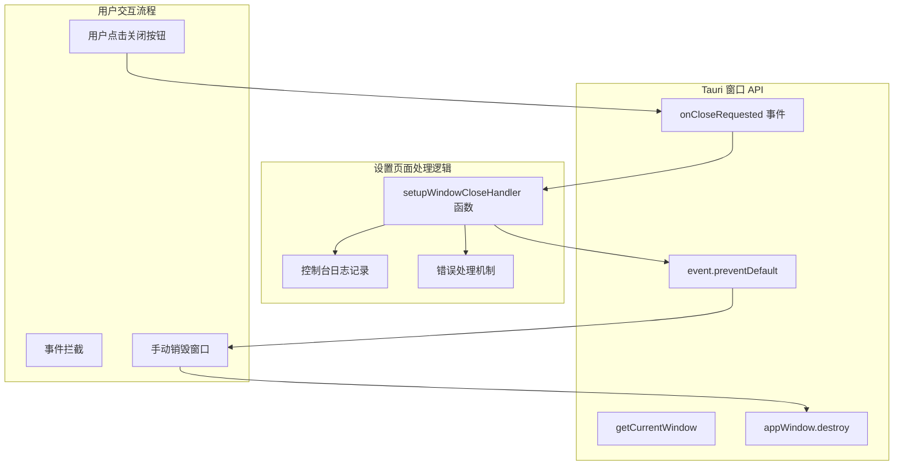
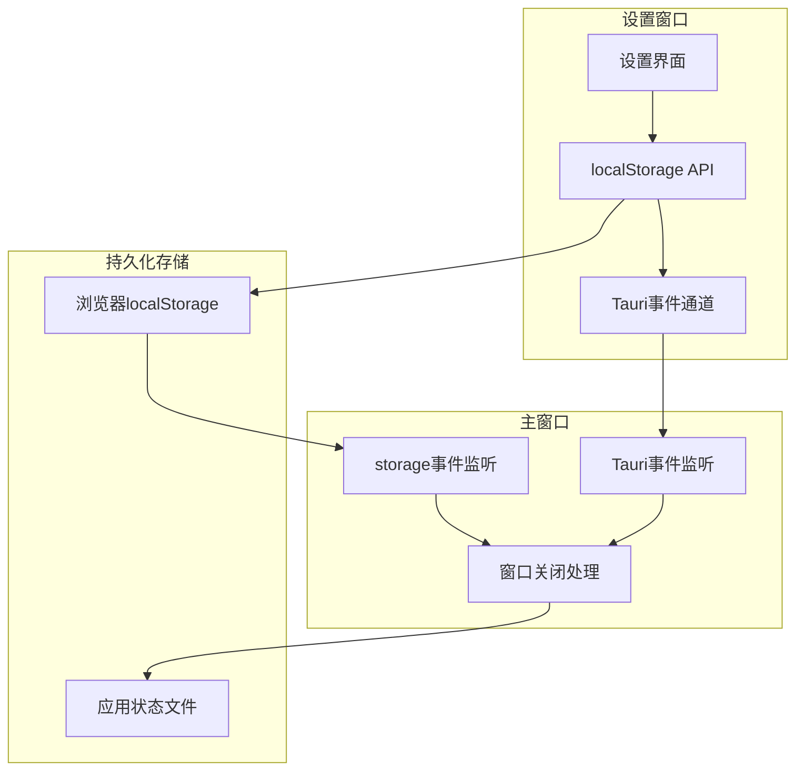

# 设置页面窗口生命周期管理

## 1. Purpose

为设置页面添加完整的窗口生命周期管理和行为配置功能，解决设置页面窗口关闭行为不一致的问题，并提供灵活的窗口关闭策略选择（最小化到托盘/直接退出）。该功能确保设置页面与主窗口具有一致的窗口行为、用户体验和跨窗口配置同步机制。

## 2. How it Works

### 2.1 窗口关闭事件处理架构



### 2.2 核心实现逻辑

**Tauri API 集成**:
```javascript
// 导入 Tauri 窗口 API
import { getCurrentWindow } from "@tauri-apps/api/window";

// 创建窗口实例
const appWindow = getCurrentWindow();
```

**窗口关闭处理函数** (`dist/js/settings.js:82-104`):
```javascript
const setupWindowCloseHandler = async () => {
  // 检查 API 可用性
  if (!appWindow?.onCloseRequested) {
    return;
  }

  try {
    // 监听窗口关闭请求事件
    await appWindow.onCloseRequested(async (event) => {
      console.log("[SettingsWindow] 关闭请求触发");

      // 阻止默认关闭行为
      event.preventDefault();
      console.log("[SettingsWindow] 已阻止默认关闭行为，开始销毁窗口");

      try {
        // 手动销毁窗口
        await appWindow.destroy();
        console.log("[SettingsWindow] 窗口销毁成功");
      } catch (error) {
        console.error("[SettingsWindow] 关闭窗口失败:", error);
      }
    });

    console.log("[SettingsWindow] 窗口关闭事件监听器注册成功");
  } catch (error) {
    console.error("[SettingsWindow] 注册窗口关闭事件失败:", error);
  }
};
```

**初始化集成** (`dist/js/settings.js:309`):
```javascript
const initSettings = async () => {
  // ... 其他初始化逻辑

  // 设置窗口关闭处理器
  await setupWindowCloseHandler();

  // ... 后续初始化
};
```

### 2.3 与主窗口的一致性设计

设置页面的窗口关闭处理与主窗口保持一致的实现模式：

**主窗口实现** (`dist/js/main.js:1215-1260`):
```javascript
const registerWindowStatePersistence = async () => {
  if (!appWindow?.onCloseRequested) return;

  try {
    await appWindow.onCloseRequested(async (event) => {
      console.log("[WindowState] 关闭请求触发");
      event.preventDefault();

      // 实时获取最新的窗口行为配置
      const behavior = loadWindowBehavior();
      console.log(`[WindowState] Using latest closeBehavior=${behavior.closeBehavior}`);

      // 保存窗口状态
      await persistWindowState();

      // 根据配置决定关闭行为
      if (behavior.closeBehavior === "tray") {
        console.log("[WindowState] 采用托盘模式，尝试隐藏窗口");
        try {
          await appWindow.hide();
          console.log("[WindowState] 窗口已隐藏到托盘");
        } catch (error) {
          console.error("[WindowState] 隐藏到托盘失败，尝试直接销毁:", error);
          await appWindow.destroy();
        }
        return;
      }

      // 退出模式：直接销毁窗口
      console.log("[WindowState] 采用退出模式，开始销毁窗口...");
      await appWindow.destroy();
    });
  } catch (error) {
    console.error("[WindowState] 注册窗口关闭事件失败:", error);
  }
};
```

**一致性特点**:
1. **相同的 API 使用**: 都使用 `getCurrentWindow()` 和 `onCloseRequested`
2. **相同的事件处理流程**: 拦截事件 → 阻止默认行为 → 根据配置执行操作
3. **相同的日志格式**: 使用统一的日志前缀 `[SettingsWindow]` 和 `[WindowState]`
4. **相同的错误处理**: try-catch 包装，确保错误不会影响应用稳定性
5. **配置同步机制**: 两个窗口都支持实时配置更新和跨窗口同步

### 2.4 窗口行为配置系统

**数据模型简化**:
```rust
// 后端数据结构 (src-tauri/src/models/app_state.rs)
#[derive(Debug, Clone, Serialize, Deserialize)]
pub struct WindowBehavior {
    pub close_behavior: String,  // 简化为单字段，移除 minimize_behavior
}

// 前端默认配置 (dist/js/main.js & settings.js)
const DEFAULT_WINDOW_BEHAVIOR = Object.freeze({
  closeBehavior: "tray",  // 支持的值: "tray" | "exit"
});
```

**跨窗口配置同步机制**:



**配置保存流程** (`dist/js/settings.js:200-250`):
```javascript
const saveWindowBehavior = async (closeBehavior) => {
  try {
    // 1. 参数验证和标准化
    const behavior = { closeBehavior: sanitizeValue(closeBehavior) };

    // 2. 保存到 localStorage (触发 storage 事件)
    window.localStorage.setItem(
      WINDOW_BEHAVIOR_STORAGE_KEY,
      JSON.stringify(behavior)
    );

    // 3. 保存到后端持久化存储
    await AppStateAPI.setWindowBehavior(closeBehavior);

    // 4. 发送 Tauri 自定义事件 (跨窗口通知)
    await emit(WINDOW_BEHAVIOR_EVENT, behavior);

    console.log("[WindowBehavior] Configuration saved and synchronized");
  } catch (error) {
    console.error("[WindowBehavior] Failed to save configuration:", error);
  }
};
```

**配置实时加载** (`dist/js/main.js:155-172`):
```javascript
const loadWindowBehavior = () => {
  let resolvedBehavior = { ...DEFAULT_WINDOW_BEHAVIOR };
  try {
    // 每次从 localStorage 读取最新配置，移除缓存机制
    const stored = window.localStorage?.getItem(WINDOW_BEHAVIOR_STORAGE_KEY);
    if (stored) {
      const parsed = JSON.parse(stored);
      resolvedBehavior = resolveWindowBehavior(parsed);
    }
  } catch (error) {
    console.warn("[WindowBehavior] Failed to load from storage, using defaults:", error);
  }
  return resolvedBehavior;
};
```

**双通道同步机制**:
1. **localStorage + storage 事件**: 同一浏览器实例下的跨标签页/窗口同步
2. **Tauri 自定义事件**: 跨不同 Tauri 窗口的同步，支持设置窗口通知主窗口

### 2.5 技术限制与架构决策

**Tauri v2 框架限制**:
- **最小化按钮事件拦截**: Tauri v2 不支持拦截系统最小化按钮的点击事件
- **官方文档确认**: 通过 Context7 MCP 查询官方文档确认此为框架限制
- **架构简化**: 移除 `minimize_behavior` 配置项，仅保留 `close_behavior`

**数据模型简化决策**:
```javascript
// 原始设计 (已废弃)
const ORIGINAL_WINDOW_BEHAVIOR = {
  closeBehavior: "tray",
  minimizeBehavior: "tray"  // 移除此字段
};

// 简化后设计 (当前实现)
const CURRENT_WINDOW_BEHAVIOR = {
  closeBehavior: "tray"  // 只支持关闭按钮行为配置
};
```

**技术限制应对策略**:
1. **明确用户沟通**: 在设置界面移除最小化配置选项，避免用户困惑
2. **文档说明**: 在技术文档中明确记录此限制和原因
3. **向后兼容**: 保持 API 的向前兼容性，便于未来可能的框架更新

### 2.6 问题修复背景
**问题描述**:
- 设置页面窗口无法通过点击 macOS 窗口标题栏的关闭按钮正常关闭
- 用户只能通过设置页面内的关闭按钮或快捷键关闭窗口
- 这与主窗口的行为不一致，影响用户体验
- 缺乏灵活的窗口关闭行为配置，无法满足不同用户的使用习惯

**根本原因**:
- `settings.js` 缺少窗口关闭事件监听器的实现
- `main.js` 中已有完整的窗口关闭处理逻辑，但设置页面作为独立窗口需要单独处理
- 原有的窗口行为配置支持最小化按钮行为，但 Tauri v2 框架不支持此功能
- 配置同步机制不完善，设置窗口的配置变更无法实时同步到主窗口

**解决方案**:
- 在 `settings.js` 中添加与 `main.js` 类似的窗口关闭处理逻辑
- 实现窗口行为配置系统，支持"最小化到托盘"和"直接退出"两种模式
- 建立跨窗口配置同步机制（localStorage + Tauri 自定义事件）
- 移除不支持的"最小化按钮行为"配置，简化数据模型
- 使用相同的 Tauri 窗口 API 和事件处理模式，确保两个窗口的关闭行为保持一致

## 3. Relevant Code Modules

### 前端窗口行为管理
- `dist/js/main.js`: 主窗口逻辑，包含窗口行为配置加载、实时同步、关闭事件处理 (第 130-285, 1215-1285)
- `dist/js/settings.js`: 设置窗口逻辑，包含窗口行为配置保存、UI 交互、关闭事件处理 (第 70-180, 200-250)
- `dist/js/api.js`: 前端 API 接口，新增窗口行为配置相关 API 调用 (第 43-46)

### 后端状态管理
- `src-tauri/src/models/app_state.rs`: 应用状态数据模型，新增 `WindowBehavior` 结构体 (第 24-28)
- `src-tauri/src/commands/app_state.rs`: 应用状态命令，新增 `set_window_behavior` 和 `get_window_behavior` 命令 (第 52-72)

### Tauri 权限配置
- `src-tauri/tauri.conf.json`: 应用权限配置，新增 10 个窗口操作权限 (第 42-52)
  - `core:window:allow-hide`, `core:window:allow-show`, `core:window:allow-minimize`
  - `core:window:allow-unminimize`, `core:window:allow-maximize`, `core:window:allow-unmaximize`
  - `core:window:allow-is-minimized`, `core:window:allow-is-maximized`
  - `core:window:allow-is-focused`, `core:window:allow-center`

### 前端UI组件
- `dist/settings.html`: 设置页面 HTML 结构，移除最小化配置表单，保留关闭行为配置选项
- `dist/locales/en.json`, `dist/locales/zh.json`: 国际化文件，移除最小化相关翻译

### Tauri API 集成
- `@tauri-apps/api/window`: Tauri 窗口管理 API，提供 `getCurrentWindow()`, `hide()`, `destroy()` 等方法
- `@tauri-apps/api/event`: Tauri 事件系统 API，支持跨窗口事件通信 (`emit`, `listen`)

## 4. Attention

### 实现注意事项

1. **API 兼容性检查**: 在调用 `appWindow.onCloseRequested` 前检查 API 可用性，避免在不支持的环境中出错
2. **事件阻止机制**: 必须调用 `event.preventDefault()` 阻止默认关闭行为，否则手动控制可能失败
3. **实时配置读取**: 窗口关闭时必须调用 `loadWindowBehavior()` 获取最新配置，不能使用缓存的 `state.windowBehavior`
4. **权限配置重要性**: Tauri 权限系统严格，缺少权限会导致窗口操作（如 `hide()`）静默失败
5. **双通道同步**: 必须同时使用 localStorage 和 Tauri 自定义事件确保跨窗口配置同步
6. **错误隔离**: 使用 try-catch 包装所有窗口操作，提供降级策略（托盘失败时转为销毁窗口）

### Tauri 框架限制

1. **最小化按钮事件**: Tauri v2 不支持拦截系统最小化按钮事件，此为框架技术限制
2. **权限静默失败**: 缺少必要权限时，窗口操作不会抛出错误而是静默失败
3. **跨平台差异**: 不同操作系统的窗口管理策略可能有细微差异
4. **事件时序**: storage 事件和 Tauri 自定义事件的触发时序可能不同，需要做好状态管理

### 配置同步机制

1. **移除缓存策略**: `loadWindowBehavior()` 每次都从 localStorage 读取，确保获取最新配置
2. **状态标准化**: `resolveWindowBehavior()` 函数处理字段名兼容性（`closeBehavior` vs `close_behavior`）
3. **参数验证**: `sanitizeWindowBehaviorValue()` 确保配置值在允许范围内
4. **事件监听管理**: 正确管理事件监听器的注册和注销，避免内存泄漏

### 调试和监控

1. **详细日志记录**: 完整的控制台日志记录窗口关闭流程、配置同步、错误处理的每个步骤
2. **状态变更追踪**: 记录配置变更的来源（storage 事件、Tauri 事件、初始化加载）
3. **错误恢复策略**: 记录降级操作的执行过程（托盘失败转为窗口销毁）
4. **性能监控**: 避免频繁的配置读取和事件处理造成的性能问题

### 用户体验考虑

1. **行为一致性**: 确保设置窗口与主窗口的关闭行为完全一致
2. **配置即时生效**: 设置窗口的配置变更应立即在主窗口生效，无需重启应用
3. **默认值策略**: 合理的默认配置（tray 模式）符合大多数用户的使用习惯
4. **错误对用户透明**: 窗口操作失败时的降级策略对用户应该是透明的