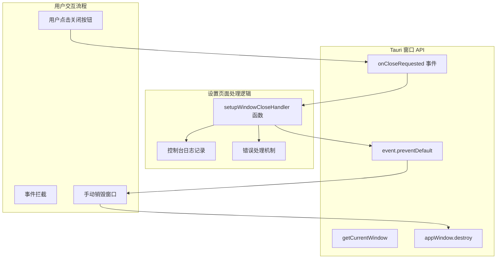

# 设置页面窗口生命周期管理

## 1. Purpose

为设置页面添加完整的窗口生命周期管理功能，解决设置页面窗口无法通过 macOS 窗口关闭按钮正常关闭的问题。该功能确保设置页面与主页面具有一致的窗口行为和用户体验。

## 2. How it Works

### 2.1 窗口关闭事件处理架构



### 2.2 核心实现逻辑

**Tauri API 集成**:
```javascript
// 导入 Tauri 窗口 API
import { getCurrentWindow } from "@tauri-apps/api/window";

// 创建窗口实例
const appWindow = getCurrentWindow();
```

**窗口关闭处理函数** (`dist/js/settings.js:82-104`):
```javascript
const setupWindowCloseHandler = async () => {
  // 检查 API 可用性
  if (!appWindow?.onCloseRequested) {
    return;
  }

  try {
    // 监听窗口关闭请求事件
    await appWindow.onCloseRequested(async (event) => {
      console.log("[SettingsWindow] 关闭请求触发");

      // 阻止默认关闭行为
      event.preventDefault();
      console.log("[SettingsWindow] 已阻止默认关闭行为，开始销毁窗口");

      try {
        // 手动销毁窗口
        await appWindow.destroy();
        console.log("[SettingsWindow] 窗口销毁成功");
      } catch (error) {
        console.error("[SettingsWindow] 关闭窗口失败:", error);
      }
    });

    console.log("[SettingsWindow] 窗口关闭事件监听器注册成功");
  } catch (error) {
    console.error("[SettingsWindow] 注册窗口关闭事件失败:", error);
  }
};
```

**初始化集成** (`dist/js/settings.js:309`):
```javascript
const initSettings = async () => {
  // ... 其他初始化逻辑

  // 设置窗口关闭处理器
  await setupWindowCloseHandler();

  // ... 后续初始化
};
```

### 2.3 与主窗口的一致性设计

设置页面的窗口关闭处理与主窗口保持一致的实现模式：

**主窗口实现** (`dist/js/main.js:1042-1063`):
```javascript
const registerWindowStatePersistence = async () => {
  if (!appWindow?.onCloseRequested) return;

  try {
    await appWindow.onCloseRequested(async (event) => {
      console.log("[WindowState] 关闭请求触发");
      event.preventDefault();

      // 保存窗口状态
      await persistWindowState();

      // 销毁窗口
      await appWindow.destroy();
    });
  } catch (error) {
    console.error("[WindowState] 注册窗口关闭事件失败:", error);
  }
};
```

**一致性特点**:
1. **相同的 API 使用**: 都使用 `getCurrentWindow()` 和 `onCloseRequested`
2. **相同的事件处理流程**: 拦截事件 → 阻止默认行为 → 手动销毁
3. **相同的日志格式**: 使用统一的日志前缀 `[SettingsWindow]` 和 `[WindowState]`
4. **相同的错误处理**: try-catch 包装，确保错误不会影响应用稳定性

### 2.4 问题修复背景

**问题描述**:
- 设置页面窗口无法通过点击 macOS 窗口标题栏的关闭按钮正常关闭
- 用户只能通过设置页面内的关闭按钮或快捷键关闭窗口
- 这与主窗口的行为不一致，影响用户体验

**根本原因**:
- `settings.js` 缺少窗口关闭事件监听器的实现
- `main.js` 中已有完整的窗口关闭处理逻辑，但设置页面作为独立窗口需要单独处理

**解决方案**:
- 在 `settings.js` 中添加与 `main.js` 类似的窗口关闭处理逻辑
- 使用相同的 Tauri 窗口 API 和事件处理模式
- 确保两个窗口的关闭行为保持一致

## 3. Relevant Code Modules

### 前端设置模块
- `dist/js/settings.js`: 设置页面主逻辑，包含窗口关闭事件处理、初始化流程 (第 1-350 行)
- `dist/settings.html`: 设置页面 HTML 结构，包含完整的设置界面布局

### Tauri API 集成
- `@tauri-apps/api/window`: Tauri 窗口管理 API，提供 `getCurrentWindow()` 和窗口事件处理功能

### 对比实现
- `dist/js/main.js`: 主窗口实现参考，包含完整的窗口状态持久化和关闭处理逻辑 (第 1040-1065 行)

### 样式相关 (附加优化)
- `dist/css/components.css`: 表格滚动容器样式优化，支持设置页面的表格滚动功能 (第 267-341 行)
- `dist/settings.html`: HTML 布局调整，支持 flex 布局和滚动容器 (第 32, 143, 158, 213, 270 行)

## 4. Attention

### 实现注意事项

1. **API 兼容性检查**: 在调用 `appWindow.onCloseRequested` 前检查 API 可用性，避免在不支持的环境中出错
2. **事件阻止机制**: 必须调用 `event.preventDefault()` 阻止默认关闭行为，否则手动销毁可能失败
3. **异步处理**: 窗口关闭事件处理使用 async/await 模式，确保操作的正确执行顺序
4. **错误隔离**: 使用 try-catch 包装窗口销毁操作，防止因销毁失败导致应用崩溃
5. **日志一致性**: 使用与主窗口一致的日志格式，便于调试和问题追踪

### 与主窗口的差异

1. **功能简化**: 设置窗口的关闭处理相对简单，不需要保存窗口状态等复杂逻辑
2. **独立实现**: 设置页面作为独立窗口运行，需要自己的窗口管理逻辑
3. **生命周期不同**: 设置窗口是临时窗口，主窗口是持久窗口

### 调试和监控

1. **日志追踪**: 完整的控制台日志记录窗口关闭流程的每个步骤
2. **错误报告**: 详细的错误信息记录，便于问题诊断
3. **状态验证**: 通过日志确认窗口事件监听器是否成功注册

### 用户体验考虑

1. **行为一致性**: 确保设置窗口与主窗口的关闭行为完全一致
2. **响应速度**: 窗口关闭操作应该快速响应，避免延迟感
3. **错误恢复**: 即使在异常情况下，用户仍应能够正常关闭窗口