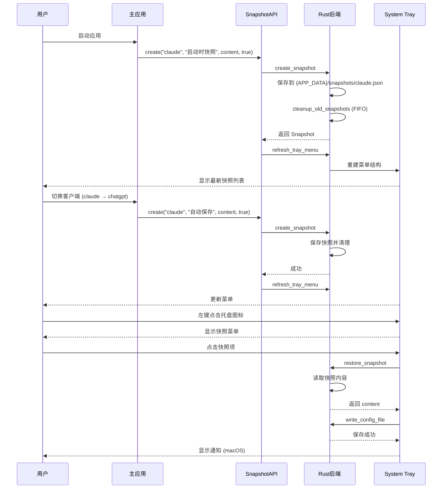

# 快照版本管理系统

## 1. Purpose

快照版本管理系统为配置文件提供轻量级的版本控制功能，支持自动和手动快照创建、快速恢复、System Tray集成。本文档详细描述快照系统的技术实现、数据模型、触发机制和用户交互流程。

## 2. How it Works

### 2.1 快照系统架构

```mermaid
graph TB
    subgraph "前端层 (JavaScript)"
        MainApp[主应用 main.js]
        SettingsPage[设置页面 settings.js]
        SnapshotAPI[SnapshotAPI 封装]
    end

    subgraph "Tauri 桥接层"
        Commands[快照命令]
        TrayMenu[System Tray 菜单]
    end

    subgraph "后端层 (Rust)"
        SnapshotRepo[快照仓库]
        TrayBuilder[托盘菜单构建器]
        Storage[JSON 存储]
    end

    subgraph "文件系统"
        SnapshotFiles[快照文件 {client_id}.json]
    end

    MainApp --> SnapshotAPI
    SettingsPage --> SnapshotAPI
    SnapshotAPI --> Commands
    Commands --> SnapshotRepo
    SnapshotRepo --> Storage
    Storage --> SnapshotFiles
    TrayMenu --> Commands
    TrayBuilder --> SnapshotRepo
```

### 2.2 数据模型

#### 2.2.1 快照结构

```rust
pub struct Snapshot {
    pub id: String,              // UUID v4 唯一标识符
    pub name: String,            // 快照名称（用户自定义或自动生成）
    pub content: String,         // 配置文件文本内容
    pub client_id: String,       // 所属客户端ID
    pub created_at: DateTime<Utc>, // 创建时间（UTC时间戳）
    pub is_auto: bool,          // 是否为自动生成快照
}
```

#### 2.2.2 快照配置结构

```rust
pub struct SnapshotConfig {
    pub client_id: String,       // 客户端ID
    pub max_snapshots: usize,    // 最大快照保存数量（默认5）
    pub snapshots: Vec<Snapshot>, // 快照列表
}
```

#### 2.2.3 存储位置

```
{APP_DATA}/snapshots/{client_id}.json
```

**示例文件内容**：
```json
{
  "client_id": "claude",
  "max_snapshots": 5,
  "snapshots": [
    {
      "id": "550e8400-e29b-41d4-a716-446655440000",
      "name": "优化后的配置",
      "content": "You are an expert AI assistant...",
      "client_id": "claude",
      "created_at": "2025-11-10T14:20:30Z",
      "is_auto": false
    },
    {
      "id": "6ba7b810-9dad-11d1-80b4-00c04fd430c8",
      "name": "自动保存 2025-11-10 14:15",
      "content": "...",
      "client_id": "claude",
      "created_at": "2025-11-10T14:15:22Z",
      "is_auto": true
    }
  ]
}
```

### 2.3 快照触发机制

#### 2.3.1 自动触发场景

| 触发时机 | 快照名称格式 | is_auto | 说明 |
|---------|------------|---------|-----|
| **程序启动时** | `启动时自动快照 YYYY-MM-DD HH:mm` | `true` | 每次打开应用自动创建 |
| **切换客户端前** | `自动保存 YYYY-MM-DD HH:mm` | `true` | 保存当前客户端状态 |
| **手动触发** | 用户输入的名称 | `false` | Shift+点击保存或Shift+Cmd/Ctrl+S |

#### 2.3.2 自动快照实现

```javascript
// 格式化快照名称
const formatSnapshotName = (prefix) => {
  const now = new Date();
  const year = now.getFullYear();
  const month = String(now.getMonth() + 1).padStart(2, "0");
  const day = String(now.getDate()).padStart(2, "0");
  const hours = String(now.getHours()).padStart(2, "0");
  const minutes = String(now.getMinutes()).padStart(2, "0");
  return `${prefix} ${year}-${month}-${day} ${hours}:${minutes}`;
};

// 创建自动快照（统一函数）
const createAutoSnapshot = async (clientId, content, prefix) => {
  try {
    const name = formatSnapshotName(prefix);
    await SnapshotAPI.create(clientId, name, content, true);
    await SnapshotAPI.refreshTrayMenu();
    console.log(`[Snapshot] 已创建快照: ${name} (客户端: ${clientId})`);
  } catch (error) {
    console.warn(`[Snapshot] 创建快照失败:`, error);
  }
};
```

#### 2.3.3 启动时快照

```javascript
// 在 initApp() 函数中
try {
  const content = await ConfigFileAPI.read(state.currentClientId);
  await createAutoSnapshot(state.currentClientId, content, "启动时自动快照");
} catch (error) {
  console.warn("创建启动快照失败:", error);
}
```

#### 2.3.4 切换客户端时快照

```javascript
// 在 selectClient(clientId) 函数中
if (state.currentClientId && state.currentClientId !== clientId) {
  try {
    const currentContent = getEditorContent();
    await createAutoSnapshot(state.currentClientId, currentContent, "自动保存");
  } catch (error) {
    console.warn("切换客户端时保存快照失败:", error);
  }
}
```

#### 2.3.5 手动快照（Shift+保存）

```javascript
// 在 saveConfigFile() 函数中
if (createSnapshot) {
  const name = prompt("请输入快照名称（留空取消）：");
  if (name && name.trim()) {
    try {
      await SnapshotAPI.create(state.currentClientId, name.trim(), content, false);
      await SnapshotAPI.refreshTrayMenu();
      showToast(`快照「${name.trim()}」已创建`, "success");
    } catch (error) {
      showToast("创建快照失败", "error");
    }
  }
}
```

**快捷键支持**：
- **Shift+点击保存按钮**：触发快照创建
- **Shift+Cmd+S (macOS)** 或 **Shift+Ctrl+S (Windows/Linux)**：保存并创建快照

### 2.4 FIFO 清理策略

#### 2.4.1 清理逻辑

当快照数量超过 `max_snapshots` 限制时，自动删除最旧的快照：

```rust
fn cleanup_old_snapshots(&mut self, client_id: &str) -> Result<(), String> {
    let mut config = self.get_config(client_id)?;

    if config.snapshots.len() <= config.max_snapshots {
        return Ok(());
    }

    // 按创建时间升序排序
    config.snapshots.sort_by(|a, b| a.created_at.cmp(&b.created_at));

    // 保留最新的 max_snapshots 个快照
    let keep_count = config.max_snapshots;
    config.snapshots = config
        .snapshots
        .into_iter()
        .rev()
        .take(keep_count)
        .rev()
        .collect();

    self.store.save(&config)?;
    Ok(())
}
```

#### 2.4.2 清理时机

- **创建新快照后**：`create_snapshot()` 自动调用清理
- **设置 `max_snapshots` 后**：立即清理多余快照

### 2.5 System Tray 集成

#### 2.5.1 托盘菜单结构

```
SystemPromptVault
├── 📋 Client: Claude (5个快照)
│   ├── ✨ 优化后的配置 (用户自定义)
│   ├── 🔄 自动保存 2025-11-10 14:20
│   └── 🚀 启动时自动快照 2025-11-10 09:30
├── 📋 Client: ChatGPT (3个快照)
│   ├── ✨ 初始配置
│   └── 🔄 自动保存 2025-11-10 13:45
├── ---
├── 🏠 打开主窗口
└── ❌ 退出
```

#### 2.5.2 菜单构建逻辑

```rust
pub fn build_tray_menu(app_handle: &AppHandle) -> Result<Menu<Wry>, Box<dyn std::error::Error>> {
    let menu = MenuBuilder::new(app_handle);

    // 获取所有客户端
    let clients = get_all_clients(app_handle)?;

    for client in clients {
        // 获取该客户端的快照列表
        let snapshots = get_snapshots(client.id.clone(), app_handle)?;

        // 创建子菜单
        let submenu = SubmenuBuilder::new(app_handle, format!("📋 Client: {} ({}个快照)", client.name, snapshots.len()));

        // 按创建时间降序排列（最新在上）
        let mut sorted = snapshots;
        sorted.sort_by(|a, b| b.created_at.cmp(&a.created_at));

        for snapshot in sorted {
            let icon = if snapshot.is_auto { "🔄" } else { "✨" };
            let item = MenuItemBuilder::new(format!("{} {}", icon, snapshot.name))
                .id(&format!("restore_snapshot_{}_{}", client.id, snapshot.id))
                .build(app_handle)?;
            submenu.item(&item);
        }

        menu.item(&submenu.build()?);
    }

    menu.separator()
        .item(&MenuItemBuilder::new("🏠 打开主窗口").id("show_main_window").build(app_handle)?)
        .item(&MenuItemBuilder::new("❌ 退出").id("quit").build(app_handle)?)
        .build()
}
```

#### 2.5.3 事件处理

```rust
pub fn handle_tray_event(app: &AppHandle, event: TrayIconEvent) {
    if let TrayIconEvent::Click { id, .. } = event {
        let id_str = id.as_ref();

        // 恢复快照
        if id_str.starts_with("restore_snapshot_") {
            let parts: Vec<&str> = id_str.split('_').collect();
            if parts.len() >= 4 {
                let client_id = parts[2];
                let snapshot_id = parts[3];

                // 恢复快照内容
                match restore_snapshot(client_id.to_string(), snapshot_id.to_string(), app) {
                    Ok(content) => {
                        // 写入配置文件
                        let _ = write_config_file(client_id.to_string(), content, app);

                        // 显示通知 (macOS)
                        let _ = std::process::Command::new("osascript")
                            .args(&["-e", &format!("display notification \"已恢复快照\" with title \"SystemPromptVault\"")])
                            .output();
                    }
                    Err(e) => eprintln!("恢复快照失败: {}", e),
                }
            }
        }

        // 其他菜单项
        match id_str {
            "show_main_window" => {
                if let Some(window) = app.get_webview_window("main") {
                    let _ = window.show();
                    let _ = window.set_focus();
                }
            }
            "quit" => app.exit(0),
            _ => {}
        }
    }
}
```

### 2.6 设置页面管理

#### 2.6.1 General Settings Tab

**功能**：
- 配置最大快照保存数量（1-20，默认5）
- 每个客户端独立配置
- 修改后立即生效并触发FIFO清理

**UI 结构**：
```html
<section id="tabGeneral">
  <h2>常规设置</h2>
  <form id="formGeneralSettings">
    <label for="inputMaxSnapshots">最大快照保存数量</label>
    <input type="number" id="inputMaxSnapshots" min="1" max="20" value="5" />
    <p class="form-help-text">超过此数量时将自动删除最旧的快照（默认5个）</p>
    <button type="submit" class="btn-primary">保存设置</button>
  </form>
</section>
```

**逻辑实现**：
```javascript
const loadGeneralSettings = async (clientId) => {
  try {
    const snapshots = await SnapshotAPI.getAll(clientId);
    const maxSnapshots = snapshots.maxSnapshots || 5;
    elements.inputMaxSnapshots.value = maxSnapshots;
  } catch (error) {
    console.error("加载常规设置失败:", error);
  }
};

const saveGeneralSettings = async (event) => {
  event.preventDefault();
  const max = Math.max(1, Math.min(20, parseInt(elements.inputMaxSnapshots.value, 10) || 5));

  try {
    await SnapshotAPI.setMaxSnapshots(state.currentClientId, max);
    showToast("设置已保存", "success");
  } catch (error) {
    showToast("保存设置失败", "error");
  }
};
```

#### 2.6.2 Snapshots Management Tab

**功能**：
- 查看所有快照列表（支持客户端切换）
- 删除快照
- 重命名快照
- 手动刷新列表

**UI 结构**：
```html
<section id="tabSnapshots">
  <div class="flex items-center justify-between">
    <h2>快照管理</h2>
    <div>
      <label>选择客户端：</label>
      <select id="snapshotClientSelector">
        <!-- 动态填充 -->
      </select>
      <button id="btnRefreshSnapshots">刷新</button>
    </div>
  </div>
  <table>
    <thead>
      <tr>
        <th>快照名称</th>
        <th>创建时间</th>
        <th>类型</th>
        <th>操作</th>
      </tr>
    </thead>
    <tbody id="snapshotTable">
      <!-- 动态渲染 -->
    </tbody>
  </table>
</section>
```

**表格渲染**：
```javascript
const renderSnapshotTable = (snapshots) => {
  const tbody = elements.snapshotTable;
  tbody.innerHTML = "";

  if (!snapshots || snapshots.length === 0) {
    tbody.innerHTML = `
      <tr id="emptyStateSnapshot">
        <td colspan="4">暂无快照</td>
      </tr>
    `;
    return;
  }

  // 按创建时间降序排列
  const sorted = [...snapshots].sort((a, b) =>
    new Date(b.created_at) - new Date(a.created_at)
  );

  sorted.forEach(snapshot => {
    const row = document.createElement("tr");
    row.innerHTML = `
      <td>${escapeHtml(snapshot.name)}</td>
      <td>${formatDateTime(snapshot.created_at)}</td>
      <td>${snapshot.is_auto ? "自动" : "手动"}</td>
      <td>
        <button class="btn-secondary" onclick="renameSnapshot('${snapshot.id}')">重命名</button>
        <button class="btn-danger" onclick="deleteSnapshot('${snapshot.id}')">删除</button>
      </td>
    `;
    tbody.appendChild(row);
  });
};
```

**操作函数**：
```javascript
const deleteSnapshot = async (snapshotId) => {
  if (!confirm("确定要删除此快照吗？")) return;

  try {
    await SnapshotAPI.delete(state.currentClientId, snapshotId);
    await SnapshotAPI.refreshTrayMenu();
    await loadSnapshotsTable(state.currentClientId);
    showToast("快照已删除", "success");
  } catch (error) {
    showToast("删除快照失败", "error");
  }
};

const renameSnapshot = async (snapshotId) => {
  const newName = prompt("请输入新的快照名称：");
  if (!newName || !newName.trim()) return;

  try {
    await SnapshotAPI.rename(state.currentClientId, snapshotId, newName.trim());
    await SnapshotAPI.refreshTrayMenu();
    await loadSnapshotsTable(state.currentClientId);
    showToast("快照已重命名", "success");
  } catch (error) {
    showToast("重命名失败", "error");
  }
};
```

### 2.7 数据流



## 3. Relevant Code Modules

### 后端核心模块
- `src-tauri/src/models/snapshot.rs`: 快照数据模型定义 (第 1-45 行)
- `src-tauri/src/storage/snapshot_repository.rs`: 快照仓库实现 (第 1-200 行)
- `src-tauri/src/commands/snapshot.rs`: 快照命令处理 (第 1-90 行)
- `src-tauri/src/tray.rs`: System Tray 菜单构建和事件处理 (第 1-300 行)
- `src-tauri/src/main.rs`: 应用启动和托盘初始化 (第 23-70 行)

### 前端核心模块
- `dist/js/api.js`: SnapshotAPI 封装 (第 64-74 行)
- `dist/js/main.js`: 自动快照触发逻辑 (第 131-150, 986-1010, 1042-1070, 1075-1095 行)
- `dist/js/settings.js`: 快照管理Tab和常规设置Tab (第 533-1100 行)
- `dist/settings.html`: 设置页面HTML结构 (第 62-90, 212-244, 245-290 行)

### 配置文件
- `src-tauri/Cargo.toml`: 依赖项配置 (第 25-26 行添加 `uuid`, `chrono`)
- `src-tauri/tauri.conf.json`: Tauri 应用配置（已启用 tray-icon feature）

## 4. Attention

### 功能注意事项

1. **静默失败策略**：自动快照失败不会打断用户流程，仅在console中记录警告
2. **FIFO清理时机**：每次创建快照后自动触发，确保不超过限制
3. **托盘菜单刷新**：所有快照操作（增删改）后必须调用 `refreshTrayMenu()`
4. **时间格式统一**：快照名称使用 `YYYY-MM-DD HH:mm` 格式（24小时制）

### 性能注意事项

1. **异步操作**：所有快照操作使用 `async/await`，不阻塞主线程
2. **防抖机制**：快照列表加载使用防抖，避免频繁请求
3. **批量读取**：托盘菜单构建时批量读取所有客户端的快照
4. **原子写入**：快照文件使用原子操作写入，避免数据损坏

### 用户体验注意事项

1. **快捷键支持**：Shift+Cmd/Ctrl+S 或 Shift+点击保存按钮触发手动快照
2. **清晰的快照类型**：自动快照使用🔄图标，手动快照使用✨图标
3. **通知反馈**：托盘恢复快照后显示系统通知（macOS使用AppleScript）
4. **空状态提示**：无快照时显示明确的空状态信息

### 数据一致性注意事项

1. **客户端隔离**：每个客户端的快照存储在独立的JSON文件中
2. **并发安全**：使用 `Arc<Mutex<SnapshotRepository>>` 保证线程安全
3. **错误恢复**：JSON解析失败时自动创建新的空配置
4. **时间戳标准**：所有时间戳使用UTC时区，前端显示时转换为本地时间

### 安全注意事项

1. **输入验证**：快照名称长度限制、max_snapshots范围验证
2. **文件路径**：使用Tauri的安全文件系统API，不直接操作路径
3. **快照内容**：不进行内容转义，保持配置文件原始格式

### 可扩展性注意事项

1. **快照元数据**：Snapshot结构可扩展（如添加 `description` 字段）
2. **快照过滤**：可按类型（自动/手动）、时间范围过滤
3. **批量操作**：可实现批量删除、导出快照等功能
4. **快照对比**：可实现快照内容diff对比功能

## 5. Future Enhancements

### 短期优化
- [ ] 快照内容预览（Tooltip悬停显示前几行）
- [ ] 快照搜索过滤（按名称、日期搜索）
- [ ] 快照导出/导入功能

### 长期规划
- [ ] 快照内容Diff对比视图
- [ ] 定时自动快照（可配置间隔）
- [ ] 快照标签和分类系统
- [ ] 快照同步到云存储（可选）
- [ ] 快照分支管理（Git-like分支）

## 6. Known Issues

1. **macOS通知限制**：使用AppleScript发送通知，需要终端权限
2. **托盘菜单数量限制**：快照过多时菜单可能过长（建议限制显示最近10个）
3. **快照名称冲突**：不同时间戳的快照可能有相同名称（允许重复）

## 7. Testing Checklist

- [ ] 启动应用时自动创建快照
- [ ] 切换客户端前自动保存快照
- [ ] Shift+保存触发手动快照命名
- [ ] 托盘菜单显示所有客户端的快照
- [ ] 托盘菜单快照按时间降序排列
- [ ] 点击托盘菜单快照项成功恢复配置
- [ ] 恢复快照后显示系统通知
- [ ] 设置页面General Tab保存最大快照数量
- [ ] 设置页面Snapshots Tab显示快照列表
- [ ] 删除快照后刷新托盘菜单
- [ ] 重命名快照后刷新托盘菜单
- [ ] 超过max_snapshots后自动删除最旧快照
- [ ] 暗色模式下所有UI正常显示
