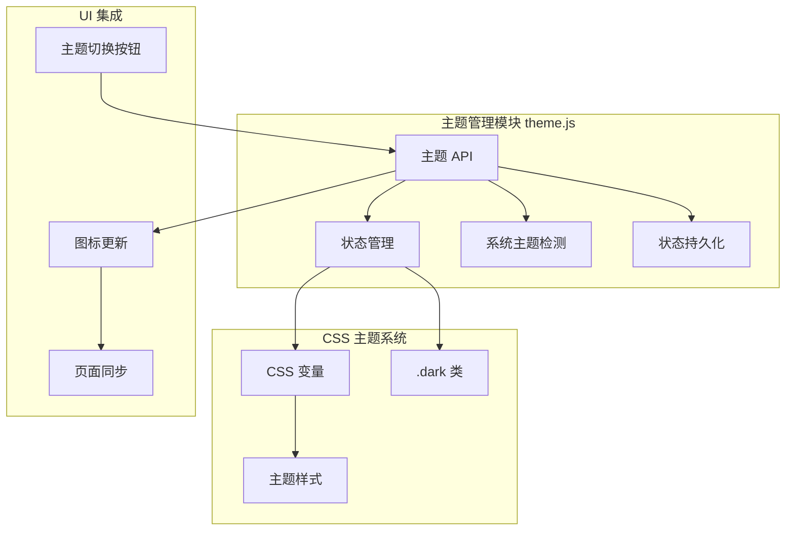
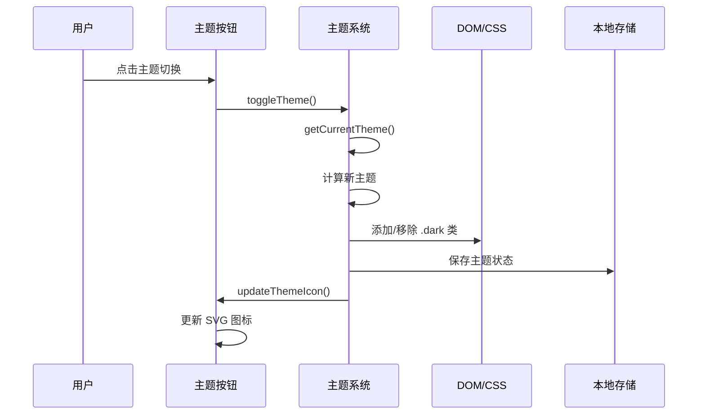

# 主题系统实现

## 1. Purpose

SystemPromptVault 实现了完整的暗色/亮色主题切换系统，支持手动切换、系统主题自动跟随、状态持久化等功能。本文档详细描述主题系统的实现机制和集成方式。

## 2. How it Works

### 2.1 主题系统架构



### 2.2 核心实现逻辑

```javascript
// 主题常量定义
const THEME_KEY = 'app-theme';
const THEME_DARK = 'dark';
const THEME_LIGHT = 'light';

// 主题获取逻辑
export function getCurrentTheme() {
  const stored = localStorage.getItem(THEME_KEY);
  if (stored === THEME_DARK || stored === THEME_LIGHT) {
    return stored; // 用户手动设置的主题
  }
  // 默认使用系统主题
  return window.matchMedia('(prefers-color-scheme: dark)').matches ? THEME_DARK : THEME_LIGHT;
}

// 主题应用逻辑
export function applyTheme(theme) {
  if (theme === THEME_DARK) {
    document.documentElement.classList.add('dark');
  } else {
    document.documentElement.classList.remove('dark');
  }
  localStorage.setItem(THEME_KEY, theme);
}
```

### 2.3 主题切换流程



### 2.4 CSS 主题变量系统

```css
:root {
  /* 亮色主题变量 */
  --color-bg: #f5f5f5;
  --color-surface: #ffffff;
  --color-border: #e0e0e0;
  --color-text: #333333;
  --color-muted: #666666;
  --color-primary: #5b9fff;
  --color-primary-dark: #4a8eef;
  --shadow-sm: 0 2px 8px rgba(0, 0, 0, 0.05);
  --shadow-md: 0 12px 32px rgba(0, 0, 0, 0.12);
}

/* 暗色主题变量覆盖 */
.dark {
  --color-bg: #0f0f0f;
  --color-surface: #1a1a1a;
  --color-border: #2a2a2a;
  --color-text: #e8e8e8;
  --color-muted: #888888;
  --color-primary: #5b9fff;
  --color-primary-dark: #4a8eef;
  --color-success: #3dd684;
  --color-error: #ff6b6b;
  --color-warning: #ffb74d;
  --shadow-sm: 0 2px 8px rgba(0, 0, 0, 0.25);
  --shadow-md: 0 12px 32px rgba(0, 0, 0, 0.4);
}
```

### 2.5 暗色主题配色统一

本次重构统一了所有主要区域的暗色主题配色方案,使用**深蓝色半透明背景**和**统一的边框色**,提升视觉一致性。

#### 2.5.1 统一配色方案

**主区域背景**: `rgba(15, 23, 42, 0.9)` (深蓝色,90% 不透明度)
**边框色**: `rgba(148, 163, 184, 0.2)` (浅灰色,20% 不透明度)
**阴影**: `0 10px 30px rgba(0, 0, 0, 0.55)` (加深阴影以增强层次感)

**应用区域**:
1. **主页配置区域** (`dist/index.html:27-63`):
   ```html
   <section id="configSection" class="..." style="background: rgba(255, 255, 255, 0.95);">
     <style>
       .dark #configSection {
         background: rgba(15, 23, 42, 0.9) !important;
         border-color: rgba(148, 163, 184, 0.2) !important;
       }
     </style>
   </section>
   ```

2. **主页提示词区域** (`dist/index.html:72-160`):
   ```html
   <section id="promptSection" class="..." style="background: rgba(255, 255, 255, 0.95);">
     <style>
       .dark #promptSection {
         background: rgba(15, 23, 42, 0.9) !important;
         border-color: rgba(148, 163, 184, 0.2) !important;
       }
     </style>
   </section>
   ```

3. **设置页主区域** (`dist/settings.html:32-145`):
   ```html
   <main class="..." style="background: rgba(255, 255, 255, 0.95);">
     <style>
       .dark main {
         background: rgba(15, 23, 42, 0.9) !important;
         border-color: rgba(148, 163, 184, 0.2) !important;
       }
     </style>
   </main>
   ```

4. **下拉菜单面板** (`dist/css/main.css:148-153`):
   ```css
   .dark .client-dropdown__panel {
     background: rgba(15, 23, 42, 0.9);
     border-color: rgba(148, 163, 184, 0.2);
     box-shadow: 0 10px 30px rgba(0, 0, 0, 0.55);
   }
   ```

5. **标签下拉菜单面板** (`dist/css/main.css:378-382`):
   ```css
   .dark .tag-dropdown__panel {
     background: rgba(15, 23, 42, 0.9);
     border-color: rgba(148, 163, 184, 0.2);
     box-shadow: 0 30px 60px rgba(0, 0, 0, 0.55);
   }
   ```

#### 2.5.2 内联样式优先级

使用 **`!important` 内联样式**确保暗色主题样式优先级最高,覆盖 Tailwind CSS 生成的样式:

```html
<style>
  .dark #configSection {
    background: rgba(15, 23, 42, 0.9) !important;
    border-color: rgba(148, 163, 184, 0.2) !important;
  }
</style>
```

**原因**: Tailwind CSS 的 `dark:bg-*` 类会生成高优先级的 utility 类,普通 CSS 选择器无法覆盖。使用 `!important` 确保自定义主题样式生效。

#### 2.5.3 半透明背景的优势

1. **毛玻璃效果**: 配合 `backdrop-filter: blur()` 实现毛玻璃背景模糊效果
2. **层次感**: 半透明背景让下层内容若隐若现,增强视觉层次
3. **统一性**: 所有主要区域使用相同的背景色和不透明度,视觉一致
4. **对比度**: 深蓝色背景与白色文字形成良好对比,提升可读性

### 2.6 主题按钮组件

```javascript
export function createThemeToggleButton() {
  const button = document.createElement('button');
  button.type = 'button';
  button.className = 'theme-toggle-btn btn-icon btn-icon-primary';
  button.setAttribute('aria-label', '切换主题');
  button.setAttribute('data-tooltip', '切换主题');

  // SVG 图标结构
  button.innerHTML = `
    <svg class="theme-icon-sun w-5 h-5 hidden" fill="none" stroke="currentColor" viewBox="0 0 24 24">
      <!-- 太阳图标路径 -->
    </svg>
    <svg class="theme-icon-moon w-5 h-5" fill="none" stroke="currentColor" viewBox="0 0 24 24">
      <!-- 月亮图标路径 -->
    </svg>
  `;

  button.addEventListener('click', () => {
    toggleTheme();
    updateThemeIcon();
  });

  return button;
}
```

#### 2.6.1 样式设计原则

**统一图标按钮语言**:
- 使用 `btn-icon btn-icon-primary` 样式类
- 与其他操作按钮保持视觉一致性
- 透明背景，hover 时显示淡蓝色背景

**提示功能优化**:
- 使用 `data-tooltip` 替代 `title` 属性
- 统一的悬浮提示系统
- 更好的无障碍支持

#### 2.6.2 CSS 样式特性

**无边框设计**:
```css
.theme-toggle-btn.btn-icon.btn-icon-primary {
  /* 透明背景 */
  background: transparent;
  /* 无边框 */
  border: none;
  /* 统一圆角和间距 */
  border-radius: 0.375rem;
  padding: 0.5rem;
  /* 平滑过渡 */
  transition: all 0.2s ease;
}
```

**主题适配**:
- 亮色主题：灰色图标，hover 变蓝色
- 暗色主题：浅灰色图标，hover 变蓝色
- 自动适配当前主题颜色

### 2.7 系统主题监听

```javascript
export function initTheme() {
  const theme = getCurrentTheme();
  applyTheme(theme);

  // 监听系统主题变化
  window.matchMedia('(prefers-color-scheme: dark)').addEventListener('change', (e) => {
    const stored = localStorage.getItem(THEME_KEY);
    // 只有在没有手动设置时才自动切换
    if (!stored) {
      applyTheme(e.matches ? THEME_DARK : THEME_LIGHT);
      updateThemeIcon();
    }
  });
}
```

### 2.8 Tailwind CSS darkMode 集成

主题系统与 Tailwind CSS 的 `darkMode: 'class'` 配置深度集成：

```javascript
// tailwind.config.js
module.exports = {
  darkMode: 'class',  // 通过 .dark 类控制暗色模式
  content: ["./dist/**/*.{html,js}"],
  // ...
}
```

**集成方式**:
- Tailwind 的 `darkMode: 'class'` 监听 `<html>` 或 `<body>` 元素的 `.dark` 类
- 主题系统通过 `document.documentElement.classList` 添加/移除 `.dark` 类
- 所有使用 `dark:` 前缀的 Tailwind 类自动根据 `.dark` 类切换样式

**示例**:
```html
<!-- 暗色模式下自动应用 dark: 前缀的样式 -->
<div class="bg-white dark:bg-gray-800 text-gray-900 dark:text-gray-100">
  内容会根据主题自动切换颜色
</div>
```

### 2.9 主题闪烁防止机制

为防止页面加载时出现主题闪烁（FOUC - Flash of Unstyled Content），在 HTML `<head>` 中放置同步初始化脚本：

```html
<script>
  (function() {
    const theme = localStorage.getItem('app-theme') ||
      (window.matchMedia('(prefers-color-scheme: dark)').matches ? 'dark' : 'light');
    if (theme === 'dark') {
      document.documentElement.classList.add('dark');
    }
  })();
</script>
<link rel="stylesheet" href="css/output.css" />
```

**关键设计**:
1. **同步执行**: 脚本必须同步执行（不使用 `async` 或 `defer`）
2. **CSS 之前**: 必须在 CSS 文件加载之前执行
3. **立即应用**: 读取存储的主题偏好并立即添加 `.dark` 类
4. **避免闪烁**: 确保首次渲染时就使用正确的主题样式

## 3. Relevant Code Modules

### 主题核心模块
- `dist/js/theme.js`: 主题系统核心实现，包含所有主题相关 API
- `dist/css/main.css`: CSS 主题变量定义和样式实现
- `dist/css/tailwind.css`: Tailwind CSS 源文件，包含 `dark:` 前缀样式定义
- `dist/css/output.css`: 编译后的 Tailwind CSS（包含暗色模式样式）
- `dist/index.html`: 主页面主题集成点，包含闪烁防止脚本
- `dist/settings.html`: 设置页面主题集成点，包含闪烁防止脚本

### 集成模块
- `dist/js/main.js`: 主应用主题初始化和按钮集成
- `dist/js/settings.js`: 设置页面主题初始化和按钮集成

### 配置文件
- `tailwind.config.js`: Tailwind CSS 配置，包含 `darkMode: 'class'` 设置

## 4. Attention

### 实现注意事项

1. **优先级逻辑**: 用户手动设置的主题优先级高于系统主题
2. **状态持久化**: 使用 `localStorage` 持久化主题选择
3. **初始渲染**: 在 DOM 加载完成后立即应用主题，避免闪烁
4. **系统集成**: 监听系统主题变化，但仅在用户未手动设置时生效
5. **闪烁防止**: 必须在 `<head>` 中放置同步脚本，在 CSS 加载前初始化主题

### 暗色主题配色注意事项

1. **统一配色**: 所有主要区域使用 `rgba(15, 23, 42, 0.9)` 深蓝色半透明背景
2. **边框统一**: 统一使用 `rgba(148, 163, 184, 0.2)` 浅灰色半透明边框
3. **阴影加深**: 暗色主题下阴影更深 (`rgba(0, 0, 0, 0.55)`),增强层次感
4. **!important 优先级**: 使用内联 `<style>` 标签和 `!important` 覆盖 Tailwind CSS 样式
5. **半透明优势**: 半透明背景支持毛玻璃效果 (`backdrop-filter: blur()`),增强视觉层次

### Tailwind CSS 集成注意事项

1. **darkMode 配置**: `tailwind.config.js` 必须设置 `darkMode: 'class'`
2. **类名前缀**: 所有暗色样式必须使用 `dark:` 前缀（如 `dark:bg-gray-800`）
3. **双系统并存**: CSS 变量系统（`main.css`）和 Tailwind darkMode 同时生效
4. **构建要求**: 修改 Tailwind 样式后需重新构建 CSS（`bun run build:css`）
5. **优先级冲突**: Tailwind utility 类优先级高,需使用 `!important` 覆盖

### CSS 变量系统注意事项

1. **变量更新**: 本次重构更新了 CSS 变量值,确保与暗色主题配色统一
2. **主色调**: `--color-primary` 更新为 `#5b9fff`,亮色和暗色主题使用相同主色
3. **背景色**: 暗色主题背景色从 `#1a1a1a` 更新为 `#0f0f0f`,更深邃
4. **边框色**: 暗色主题边框色从 `#404040` 更新为 `#2a2a2a`,更柔和
5. **阴影**: 新增 `--shadow-md` 变量,支持更强的阴影效果

### 兼容性注意事项

1. **CSS 变量支持**: 确保目标环境支持 CSS 自定义属性
2. **类名切换**: 使用 `document.documentElement` 切换类名，确保全局生效
3. **媒体查询**: 使用 `matchMedia` API 检测系统主题偏好
4. **事件监听**: 注意媒体查询事件监听器的浏览器兼容性
5. **backdrop-filter**: 毛玻璃效果需浏览器支持,考虑降级方案

### 用户体验注意事项

1. **过渡动画**: CSS 变量切换时添加适当的过渡动画
2. **图标状态**: 主题图标应准确反映当前主题状态
3. **无障碍支持**: 添加适当的 `aria-label` 和 `title` 属性
4. **状态一致性**: 确保所有页面的主题状态保持一致
5. **FOUC 防止**: 同步脚本必须在所有 CSS 加载之前执行，避免内容闪烁
6. **视觉一致性**: 统一的配色方案提升整体视觉一致性和专业感