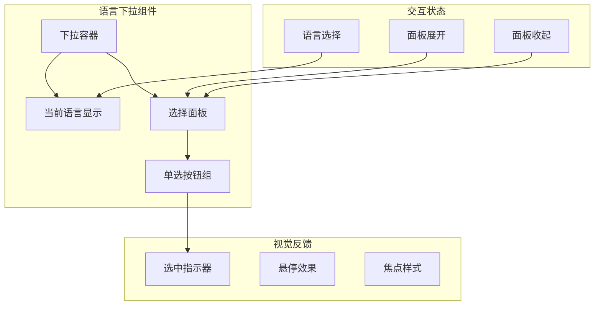

# UI 交互优化

## 1. Purpose

SystemPromptVault 在 UI 交互方面进行了深度优化，包括智能 tooltip 系统、下拉菜单标签选择器、防抖机制、无障碍支持、紧凑布局设计等。本文档详细描述这些交互优化的实现原理和技术细节。

## 2. How it Works

### 2.1 Tooltip 系统架构

系统实现了**两套独立的 Tooltip 系统**,针对不同的使用场景优化:

#### 2.1.1 双重 Tooltip 系统


**核心区别**:

| 特性         | 提示词 Tooltip (prompt-tooltip)       | 按钮 Tooltip (button-tooltip)  |
| ------------ | ------------------------------------- | ------------------------------ |
| **触发元素** | 提示词列表项标题                      | 所有带 `data-tooltip` 的按钮   |
| **显示延迟** | 500ms (防止快速划过时闪烁)            | 无延迟 (即时显示)              |
| **内容**     | 富文本:标题、标签列表、内容预览       | 纯文本标签                     |
| **定位方式** | 固定位置,智能边界检测                 | 跟随鼠标移动                   |
| **交互性**   | 可进入 tooltip 内部 (pointer-events)  | 不可交互 (pointer-events:none) |
| **z-index**  | 1900 (最高层)                         | 1500                           |
| **样式复杂度** | 复杂:内边距、布局、最大高度、滚动 | 简单:黑色半透明背景,纯文本     |

#### 2.1.2 提示词 Tooltip 架构


### 2.2 按钮 Tooltip 系统实现

#### 2.2.1 通用按钮 Tooltip

所有操作按钮 (保存、筛选、应用、追加、导入、导出、编辑、删除) 统一使用跟随鼠标的通用 tooltip 系统。

**触发方式**:
```html
<!-- 通过 data-tooltip 属性触发 -->
<button class="btn-icon" data-tooltip="保存">
  <svg>...</svg>
</button>
```

**核心实现** (`dist/js/main.js`, `dist/js/settings.js`):

```javascript
const initButtonTooltips = () => {
  const tooltip = document.getElementById("buttonTooltip");
  if (!tooltip) return;

  let activeTarget = null;
  let removeActiveListeners = null;

  const releaseActiveTarget = () => {
    if (removeActiveListeners) {
      removeActiveListeners();
      removeActiveListeners = null;
    }
    activeTarget = null;
  };

  const hideTooltip = () => {
    releaseActiveTarget();
    tooltip.classList.add("hidden");
    tooltip.textContent = "";
    tooltip.style.left = "";
    tooltip.style.top = "";
    tooltip.setAttribute("aria-hidden", "true");
  };

  const updatePosition = (clientX, clientY) => {
    const tooltipRect = tooltip.getBoundingClientRect();
    let left = clientX + 10;
    let top = clientY + 10;

    // 边界检测:防止超出视口
    if (left + tooltipRect.width > window.innerWidth - 10) {
      left = clientX - tooltipRect.width - 10;
    }
    if (top + tooltipRect.height > window.innerHeight - 10) {
      top = clientY - tooltipRect.height - 10;
    }

    tooltip.style.left = `${left}px`;
    tooltip.style.top = `${top}px`;
  };

  const handleEnter = (event) => {
    const candidate = event.target instanceof Element
      ? event.target.closest("[data-tooltip]")
      : null;
    if (!candidate || candidate === activeTarget) return;

    const text = candidate.getAttribute("data-tooltip");
    if (!text) return;

    releaseActiveTarget();
    tooltip.textContent = text;
    tooltip.classList.remove("hidden");
    tooltip.setAttribute("aria-hidden", "false");
    updatePosition(event.clientX, event.clientY);
    activeTarget = candidate;

    // 跟随鼠标移动
    const handleMouseMove = (moveEvent) => updatePosition(moveEvent.clientX, moveEvent.clientY);
    const handleMouseLeave = () => {
      candidate.removeEventListener("mousemove", handleMouseMove);
      candidate.removeEventListener("mouseleave", handleMouseLeave);
      hideTooltip();
    };

    candidate.addEventListener("mousemove", handleMouseMove);
    candidate.addEventListener("mouseleave", handleMouseLeave, { once: true });

    removeActiveListeners = () => {
      candidate.removeEventListener("mousemove", handleMouseMove);
      candidate.removeEventListener("mouseleave", handleMouseLeave);
    };
  };

  // 全局事件监听 (事件捕获阶段)
  document.addEventListener("mouseenter", handleEnter, true);
  document.addEventListener("scroll", hideTooltip, true);
  document.addEventListener("pointerdown", hideTooltip, true);
  window.addEventListener("resize", hideTooltip);
  document.addEventListener("visibilitychange", () => {
    if (document.hidden) hideTooltip();
  });
};
```

**样式实现** (`dist/css/main.css`):

```css
.button-tooltip {
  position: fixed;
  z-index: 1500;
  padding: 6px 10px;
  background: rgba(0, 0, 0, 0.85);
  color: #fff;
  font-size: 0.75rem;
  border-radius: 6px;
  pointer-events: none;  /* 不可交互 */
  white-space: nowrap;
}

.dark .button-tooltip {
  background: rgba(255, 255, 255, 0.9);
  color: #1f2937;
}
```

#### 2.2.2 按钮图标化设计

所有操作按钮改为 SVG 图标按钮,统一使用 `btn-icon` 和 `btn-icon-primary` 样式类:

**样式定义** (`dist/css/main.css`):

```css
.btn-icon {
  display: inline-flex;
  align-items: center;
  justify-content: center;
  padding: 0.5rem;
  border-radius: 0.375rem;
  border: 1px solid transparent;
  transition: all 0.2s ease;
  background: transparent;
  color: inherit;
}

.btn-icon-primary {
  background: transparent;
  color: var(--color-text-secondary, #6b7280);
  border: none;
}

.dark .btn-icon-primary {
  color: var(--color-text-secondary, #9ca3af);
}

.btn-icon-primary:hover {
  background: var(--color-surface-hover, rgba(59, 130, 246, 0.1));
  color: var(--color-primary, #3b82f6);
}

.btn-icon:focus-visible {
  outline: 2px solid var(--color-primary, #3b82f6);
  outline-offset: 2px;
}

.btn-icon:disabled {
  opacity: 0.6;
  cursor: not-allowed;
}
```

**应用场景**:
- 主页保存按钮 (`dist/index.html:73-78`)
- 主页筛选标签按钮 (`dist/index.html:67-72`)
- 主页编辑器模式切换按钮 (`dist/index.html:79-88`)
- 设置页导入/导出/新建按钮 (`dist/settings.html:47-75`)
- 表格编辑/删除按钮 (`dist/js/settings.js:318-342`)

### 2.3 提示词 Tooltip 状态管理

```javascript
// 提示词 tooltip 状态管理
const tooltipState = {
  activePromptId: null,     // 当前激活的提示词 ID
  anchorHovered: false,     // 锚点悬停状态
  tooltipHovered: false,    // tooltip 悬停状态
};

// 防抖配置
const TOOLTIP_DELAY = 500;      // 显示延迟
const TOOLTIP_HIDE_DELAY = 150; // 隐藏延迟
```

### 2.3 防抖机制实现

```javascript
const createDebounced = (fn, delay) => {
  let timerId = null;
  const debounced = (...args) => {
    if (timerId) {
      clearTimeout(timerId);
    }
    timerId = window.setTimeout(() => {
      timerId = null;
      fn(...args);
    }, delay);
  };

  debounced.cancel = () => {
    if (timerId) {
      clearTimeout(timerId);
      timerId = null;
    }
  };

  return debounced;
};

// 应用到 tooltip 调度
const scheduleTooltipShow = createDebounced(({ prompt, x, y }) => {
  showPromptTooltip(prompt, x, y);
}, TOOLTIP_DELAY);

const scheduleTooltipHide = createDebounced(() => {
  if (!tooltipState.anchorHovered && !tooltipState.tooltipHovered) {
    hidePromptTooltip();
  }
}, TOOLTIP_HIDE_DELAY);
```

### 2.4 Tooltip 交互流程


### 2.5 智能定位算法

```javascript
const positionPromptTooltip = (clientX = 0, clientY = 0) => {
  const tooltip = elements.promptTooltip;
  if (!tooltip) return;

  const offsetX = 18;
  const offsetY = 10;
  const padding = 12;
  const tooltipWidth = tooltip.offsetWidth;
  const tooltipHeight = tooltip.offsetHeight;

  let left = clientX + offsetX;
  let top = clientY + offsetY;

  // 视口边界检测
  const maxLeft = window.innerWidth - tooltipWidth - padding;
  const maxTop = window.innerHeight - tooltipHeight - padding;

  left = Math.min(Math.max(padding, left), Math.max(padding, maxLeft));
  top = Math.min(Math.max(padding, top), Math.max(padding, maxTop));

  tooltip.style.left = `${left}px`;
  tooltip.style.top = `${top}px`;
};
```

### 2.6 紧凑布局设计

```css
/* 提示词列表项设计 */
.prompt-list-item {
  @apply flex items-center justify-between p-3 border border-gray-200 rounded-lg hover:bg-gray-50 transition-colors duration-200 cursor-pointer;
}

.prompt-item-title {
  @apply text-sm font-medium text-gray-900 truncate flex-1 mr-3;
}

.prompt-item-actions {
  @apply flex items-center gap-2 opacity-0 group-hover:opacity-100 transition-opacity duration-200;
}

.prompt-action-btn {
  @apply w-8 h-8 flex items-center justify-center rounded-md transition-colors duration-200;
}
```

### 2.7 无障碍支持实现

```javascript
const createPromptListItem = (prompt) => {
  const item = document.createElement('div');
  item.className = 'prompt-list-item';
  item.dataset.promptId = String(prompt.id ?? "");
  item.setAttribute('role', 'listitem');

  // 创建操作按钮
  const actions = document.createElement('div');
  actions.className = 'prompt-item-actions';

  actions.appendChild(
    createPromptActionButton("apply", "应用提示词", () => applyPrompt(prompt.id))
  );
  actions.appendChild(
    createPromptActionButton("append", "追加提示词", () => appendPrompt(prompt.id))
  );

  return item;
};

const createPromptActionButton = (type, label, handler) => {
  const button = document.createElement('button');
  button.type = 'button';
  button.className = `prompt-action-btn prompt-action-${type}`;
  button.setAttribute('aria-label', label);

  // 添加屏幕阅读器专用文本
  const srText = document.createElement('span');
  srText.className = 'sr-only';
  srText.textContent = label;
  button.appendChild(srText);

  return button;
};

// Tooltip 无障碍支持
const showPromptTooltip = (prompt, clientX, clientY) => {
  const tooltip = elements.promptTooltip;
  if (!tooltip) return;

  tooltip.classList.remove('hidden');
  tooltip.setAttribute('aria-hidden', 'false');
  // ... 其他逻辑
};
```

### 2.8 事件处理优化

```javascript
// 事件委托处理动态元素
document.addEventListener(
  "scroll",
  (event) => {
    const tooltip = elements.promptTooltip;
    if (tooltip && tooltip.contains(event.target)) {
      return; // 如果事件来自 tooltip 内部，不隐藏
    }
    hidePromptTooltip();
  },
  true // 使用捕获阶段
);

// 窗口大小变化时隐藏 tooltip
window.addEventListener("resize", hidePromptTooltip);

// 触摸设备优化
element.addEventListener(
  "touchstart",
  () => {
    scheduleTooltipShow.cancel();
    hidePromptTooltip();
  },
  { passive: true }
);
```

### 2.9 下拉菜单标签选择器

标签过滤功能从传统的横向排列按钮改为下拉菜单式选择器，提供更好的可扩展性和用户体验。

#### 2.9.1 状态管理

```javascript
// 标签过滤相关状态
const state = {
  selectedTags: [],       // 当前选中的标签列表
  recentTags: [],         // 最近使用的标签列表（最多5个）
  tagDropdownOpen: false, // 下拉菜单开关状态
  tagSearchQuery: "",     // 标签搜索关键词
};

// 常量配置
const RECENT_TAGS_KEY = "tagFilterRecentTags";
const MAX_RECENT_TAGS = 5;
```

#### 2.9.2 下拉菜单架构


#### 2.9.3 交互流程


#### 2.9.4 核心实现

**开关逻辑**:

```javascript
const toggleTagDropdown = (forceState) => {
  const toggle = elements.tagDropdownToggle;
  const panel = elements.tagDropdownPanel;
  if (!toggle || !panel || toggle.disabled) return;

  const nextState = typeof forceState === "boolean"
    ? forceState
    : !Boolean(state.tagDropdownOpen);

  if (state.tagDropdownOpen === nextState) return;

  state.tagDropdownOpen = nextState;
  updateTagDropdownVisibility();
};

const updateTagDropdownVisibility = () => {
  const panel = elements.tagDropdownPanel;
  const toggle = elements.tagDropdownToggle;
  if (!panel || !toggle) return;

  const isOpen = Boolean(state.tagDropdownOpen) && !toggle.disabled;
  panel.classList.toggle("is-open", isOpen);
  panel.setAttribute("aria-hidden", String(!isOpen));
  toggle.setAttribute("aria-expanded", String(isOpen));

  // 打开时自动聚焦搜索框
  if (isOpen) {
    window.requestAnimationFrame(() => {
      if (elements.tagDropdownSearch && !elements.tagDropdownSearch.disabled) {
        elements.tagDropdownSearch.focus({ preventScroll: true });
      }
    });
  }
};
```

**搜索过滤**:

```javascript
const handleTagSearchInput = (event) => {
  state.tagSearchQuery = event?.target?.value ?? "";
  renderTagFilter();
};

const filterTagsByQuery = (tags, query) => {
  if (!Array.isArray(tags) || !tags.length) return [];
  const normalized = query?.trim()?.toLowerCase();
  if (!normalized) return [...tags];
  return tags.filter((tag) => tag.toLowerCase().includes(normalized));
};
```

**最近使用标签管理**:

```javascript
const updateRecentTags = (tag) => {
  if (typeof tag !== "string" || !tag.trim()) return;
  const normalized = tag.trim();
  const nextRecent = [
    normalized,
    ...state.recentTags.filter((item) => item !== normalized)
  ];
  state.recentTags = nextRecent.slice(0, MAX_RECENT_TAGS);
  persistRecentTags();
};

const persistRecentTags = () => {
  try {
    localStorage.setItem(RECENT_TAGS_KEY, JSON.stringify(state.recentTags));
  } catch {
    // 忽略写入异常
  }
};
```

**键盘导航**:

```javascript
const handleTagSearchKeyNavigation = (event) => {
  if (!state.tagDropdownOpen) return;
  if (event.key === "ArrowDown") {
    event.preventDefault();
    focusAdjacentTagOption(1);
  } else if (event.key === "ArrowUp") {
    event.preventDefault();
    focusAdjacentTagOption(-1);
  } else if (event.key === "Escape") {
    event.preventDefault();
    closeTagDropdown();
  }
};

const focusAdjacentTagOption = (direction = 1) => {
  const options = getFocusableTagOptions();
  if (!options.length) return;

  const activeElement = document.activeElement;
  let currentIndex = options.indexOf(activeElement);
  if (currentIndex === -1) {
    currentIndex = direction > 0 ? -1 : options.length;
  }

  const nextIndex = (currentIndex + direction + options.length) % options.length;
  const nextOption = options[nextIndex];
  if (nextOption) {
    nextOption.focus();
  }
};
```

#### 2.9.4 标签选择交互优化

为提升多选体验，标签选择器进行了以下交互优化：

**连续多选支持**：
- 点击标签选项后面板保持打开状态，支持连续选择多个标签
- 移除了点击标签后自动关闭面板的行为，保留其他关闭方式（点击外部、Escape 键、点击切换按钮）
- 用户可以通过点击标签选项快速切换选中状态，无需重复打开面板

**事件处理优化** (`dist/js/main.js:1034-1056`):

```javascript
const handleDocumentClickForDropdown = (event) => {
  if (!state.tagDropdownOpen || !elements.tagFilter) return;
  const target = event.target;
  if (!(target instanceof Node)) return;

  // 优化逻辑：首先检查是否在面板内部点击
  if (elements.tagFilter.contains(target)) {
    return; // 面板内部点击不关闭
  }

  // 兼容处理：检查 composedPath 是否包含面板
  if (typeof event.composedPath === "function") {
    const path = event.composedPath();
    if (Array.isArray(path) && path.includes(elements.tagFilter)) {
      return; // 仍然在面板内部，不关闭
    }
  }

  closeTagDropdown(); // 真正的外部点击才关闭
};
```

**设计原理**：
- **增强可发现性**：用户可以一次打开面板，尝试多个标签组合
- **减少操作成本**：无需重复点击切换按钮来选择多个标签
- **保持一致性**：清空按钮也保持面板开启，提供一致的操作体验
- **边界控制**：保留原有的关闭方式，确保用户能正常关闭面板

**点击外部关闭**:

```javascript
const handleDocumentClickForDropdown = (event) => {
  if (!state.tagDropdownOpen || !elements.tagFilter) return;
  const target = event.target;
  if (!(target instanceof Node)) return;
  if (!elements.tagFilter.contains(target)) {
    closeTagDropdown();
  }
};

const handleDocumentKeydownForDropdown = (event) => {
  if (event.key === "Escape" && state.tagDropdownOpen) {
    event.preventDefault();
    closeTagDropdown();
  }
};
```

#### 2.9.5 清空已选标签按钮

为了提升用户体验，标签下拉面板新增了"清空已选标签"按钮，允许用户一键清除所有手动选择的标签。

**设计决策**：
- **选择性清空**：仅清空手动选择的标签（`state.selectedTags`），不影响客户端自动标签
- **条件显示**：只在有手动选择标签时显示按钮（`state.selectedTags.length > 0`）
- **位置优化**：与搜索框并排显示，形成完整的标签操作区域

**HTML 结构** (`dist/index.html:228-247`):

```html
<div class="tag-dropdown__search flex items-center gap-2">
  <!-- 搜索框 -->
  <input
    type="text"
    id="tagDropdownSearch"
    class="tag-dropdown__search-input flex-1"
    placeholder="Search tags..."
    aria-label="Search Tags"
  />

  <!-- 清空按钮 -->
  <button
    type="button"
    id="tagDropdownClear"
    class="tag-dropdown__clear hidden flex-shrink-0 rounded-md px-3 py-2 text-sm font-medium text-primary transition-colors hover:text-primary hover:bg-gray-50 dark:hover:bg-gray-700 flex items-center justify-center gap-2"
    aria-label="Clear all selected tags"
    aria-disabled="true"
  >
    <svg class="w-4 h-4" viewBox="0 0 24 24" fill="none" stroke="currentColor" stroke-width="2">
      <path d="M6 6l12 12M6 18L18 6"></path>
    </svg>
    <span data-i18n="tags.clearAll">Clear All</span>
  </button>
</div>
```

**核心实现** (`dist/js/main.js:1086-1097`):

```javascript
const handleClearSelectedTags = (event) => {
  event?.preventDefault();
  event?.stopPropagation();
  clearSelectedTags();
};

const clearSelectedTags = () => {
  if (!state.selectedTags.length) {
    return;
  }
  state.selectedTags = [];
  renderTagFilter();
  renderPromptList();
};
```

**显示逻辑** (`dist/js/main.js:2221-2227`):

```javascript
// 渲染标签过滤器时控制清空按钮的显示状态
if (elements.tagDropdownClear) {
  const hasSelection = state.selectedTags.length > 0;
  elements.tagDropdownClear.classList.toggle("hidden", !hasSelection);
  elements.tagDropdownClear.disabled = !hasSelection;
  elements.tagDropdownClear.setAttribute("aria-disabled", String(!hasSelection));
}
```

**交互优化**：
- **面板保持开启**：点击清空按钮后标签面板保持打开状态，用户可以继续选择其他标签
- **状态同步**：清空操作后立即更新提示词列表显示
- **无障碍支持**：使用 `aria-disabled` 属性正确反映按钮状态，屏幕阅读器可识别

**国际化支持**:
- `tags.clearAll`: "Clear All" / "清空已选"
- `tags.clearAllAria`: "Clear all selected tags" / "清空所有选中的标签"

#### 2.9.6 CSS 样式实现

**下拉面板样式**:

```css
.tag-dropdown__panel {
  position: absolute;
  top: calc(100% + 10px);
  right: 0;
  width: min(420px, calc(100vw - 40px));
  max-height: 440px;
  padding: 16px;
  border-radius: var(--radius-lg, 12px);
  border: 1px solid rgba(15, 23, 42, 0.08);
  background: rgba(255, 255, 255, 0.95);
  box-shadow: 0 30px 60px rgba(0, 0, 0, 0.18);
  backdrop-filter: blur(18px);
  opacity: 0;
  visibility: hidden;
  transform: translateY(-6px) scale(0.98);
  pointer-events: none;
  transition: opacity 0.2s ease, transform 0.2s ease;
}

.tag-dropdown__panel.is-open {
  opacity: 1;
  visibility: visible;
  transform: translateY(0) scale(1);
  pointer-events: auto;
}
```

**标签选项样式**:

```css
.tag-dropdown__option {
  border: 1px solid var(--color-border);
  border-radius: 999px;
  padding: 4px 12px;
  background: var(--color-surface);
  color: var(--color-text);
  font-size: 0.82rem;
  transition: all 0.2s ease;
}

.tag-dropdown__option.is-active {
  background: rgba(91, 159, 255, 0.12);
  border-color: rgba(91, 159, 255, 0.45);
  color: var(--color-primary);
}

.tag-dropdown__option.is-auto {
  cursor: not-allowed;
  opacity: 0.7;
}
```

### 2.10 客户端和设置下拉菜单

本次重构将原来的**横向标签切换 UI**改为**下拉菜单**,统一交互模式。

#### 2.10.1 客户端下拉菜单 (主页)

**原设计**: 客户端以横向标签形式排列,占用大量空间
**新设计**: 下拉菜单,移至配置区域顶部,与配置文件名并列

**DOM 结构** (`dist/index.html:28-51`):

```html
<div class="client-dropdown" id="clientDropdown">
  <button
    type="button"
    class="client-dropdown__toggle"
    id="clientDropdownToggle"
    aria-haspopup="listbox"
    aria-expanded="false"
    aria-controls="clientDropdownPanel"
    aria-label="选择客户端"
  >
    <span class="client-dropdown__label" id="clientDropdownLabel">选择客户端</span>
    <svg class="client-dropdown__icon">...</svg>
  </button>
  <div
    class="client-dropdown__panel"
    id="clientDropdownPanel"
    role="listbox"
    aria-label="客户端列表"
    aria-hidden="true"
  >
    <div class="client-dropdown__list" id="clientDropdownList">
      <!-- 动态渲染客户端选项 -->
    </div>
  </div>
</div>
```

**核心逻辑** (`dist/js/main.js`):

```javascript
const toggleClientDropdown = () => {
  const toggle = elements.clientDropdownToggle;
  const panel = elements.clientDropdownPanel;
  if (!toggle || !panel) return;

  const isOpen = toggle.getAttribute("aria-expanded") === "true";
  toggle.setAttribute("aria-expanded", String(!isOpen));
  panel.setAttribute("aria-hidden", String(isOpen));
  panel.classList.toggle("is-open", !isOpen);
};

const closeClientDropdown = () => {
  elements.clientDropdownToggle?.setAttribute("aria-expanded", "false");
  elements.clientDropdownPanel?.setAttribute("aria-hidden", "true");
  elements.clientDropdownPanel?.classList.remove("is-open");
};

// 点击外部关闭
document.addEventListener("click", (event) => {
  if (!elements.clientDropdown?.contains(event.target)) {
    closeClientDropdown();
  }
});

// ESC 键关闭
document.addEventListener("keydown", (event) => {
  if (event.key === "Escape") {
    closeClientDropdown();
  }
});
```

#### 2.10.2 设置下拉菜单 (设置页)

**原设计**: "提示词管理" 和 "客户端管理" 以横向标签形式切换
**新设计**: 下拉菜单,位于设置页主区域顶部

**DOM 结构** (`dist/settings.html:33-61`):

```html
<div class="client-dropdown" id="settingsDropdown">
  <button
    type="button"
    class="client-dropdown__toggle"
    id="settingsDropdownToggle"
    aria-haspopup="listbox"
    aria-expanded="false"
    aria-controls="settingsDropdownPanel"
    aria-label="选择设置类型"
  >
    <span class="client-dropdown__label" id="settingsDropdownLabel">提示词管理</span>
    <svg class="client-dropdown__icon">...</svg>
  </button>
  <div
    class="client-dropdown__panel"
    id="settingsDropdownPanel"
    role="listbox"
    aria-label="设置类型列表"
    aria-hidden="true"
  >
    <div class="client-dropdown__list" id="settingsDropdownList">
      <button type="button" class="client-dropdown__option" role="option" aria-selected="true" data-target="tabPrompts">
        提示词管理
      </button>
      <button type="button" class="client-dropdown__option" role="option" aria-selected="false" data-target="tabClients">
        客户端管理
      </button>
    </div>
  </div>
</div>
```

**核心逻辑** (`dist/js/settings.js:97-103`):

```javascript
elements.settingsDropdownToggle?.addEventListener("click", toggleSettingsDropdown);
elements.settingsDropdownList?.addEventListener("click", (event) => {
  const option = event.target.closest(".client-dropdown__option");
  if (!option) return;
  const targetId = option.getAttribute("data-target");
  if (targetId) {
    switchTab(targetId);
    closeSettingsDropdown();
  }
});
```

#### 2.10.3 统一样式设计

**切换按钮样式** (`dist/css/main.css:95-122`):

```css
.client-dropdown__toggle {
  display: inline-flex;
  align-items: center;
  gap: 0.5rem;
  padding: 0.5rem 1rem;
  background: transparent;
  border: none;
  border-radius: 0.5rem;
  font-size: 0.875rem;
  font-weight: 600;
  color: var(--color-text-secondary, #6b7280);
  transition: all 0.2s;
  cursor: pointer;
}

.client-dropdown__toggle:hover:not(:disabled) {
  background: var(--color-surface-hover, rgba(59, 130, 246, 0.1));
  color: var(--color-primary, #3b82f6);
}

.client-dropdown__toggle:disabled {
  opacity: 1;
}
```

**下拉面板样式** (`dist/css/main.css:135-162`):

```css
.client-dropdown__panel {
  position: absolute;
  top: calc(100% + 0.5rem);
  left: 0;
  min-width: 200px;
  padding: 0.5rem;
  background: #fff;
  border: 1px solid var(--color-border, #e5e7eb);
  border-radius: 0.5rem;
  box-shadow: 0 10px 30px rgba(0, 0, 0, 0.1);
  opacity: 0;
  visibility: hidden;
  transform: translateY(-0.5rem);
  transition: all 0.2s;
  z-index: 1000;
}

.dark .client-dropdown__panel {
  background: rgba(15, 23, 42, 0.9);
  border-color: rgba(148, 163, 184, 0.2);
  box-shadow: 0 10px 30px rgba(0, 0, 0, 0.55);
}

.client-dropdown__panel[aria-hidden="false"] {
  opacity: 1;
  visibility: visible;
  transform: translateY(0);
}
```

**选项样式** (`dist/css/main.css:169-194`):

```css
.client-dropdown__option {
  padding: 0.5rem 0.75rem;
  border-radius: 0.375rem;
  font-size: 0.875rem;
  color: var(--color-text, #1f2937);
  background: transparent;
  border: none;
  cursor: pointer;
  text-align: left;
  transition: all 0.15s;
}

.client-dropdown__option:hover {
  background: var(--color-surface-hover, #f3f4f6);
}

.dark .client-dropdown__option:hover {
  background: var(--color-surface-hover, #4b5563);
}

.client-dropdown__option[aria-selected="true"] {
  background: rgba(59, 130, 246, 0.1);
  color: var(--color-primary, #3b82f6);
  font-weight: 600;
}
```

### 2.11 CSS Grid 布局在编辑器头部中的应用

配置编辑器头部采用 CSS Grid 三列布局，替代了传统的 Flexbox 设计，实现了更好的视觉平衡和组件定位。

#### 2.11.1 布局结构设计


**HTML 结构** (`dist/index.html:45-90`):

```html
<div class="grid grid-cols-3 items-center gap-3">
  <!-- 左侧：客户端下拉菜单 -->
  <div class="client-dropdown" id="clientDropdown">
    <button class="client-dropdown__toggle" id="clientDropdownToggle">
      <span class="client-dropdown__label">选择客户端</span>
      <svg class="client-dropdown__icon">...</svg>
    </button>
    <!-- 下拉面板 -->
  </div>

  <!-- 中间：配置文件名（居中显示） -->
  <span id="configFileName" class="text-sm text-gray-600 dark:text-gray-400 text-center">
    CLAUDE.md
  </span>

  <!-- 右侧：操作按钮组 -->
  <div class="flex items-center gap-2 justify-end">
    <button class="btn-icon btn-icon-primary" id="btnSaveConfig">
      <!-- 保存按钮图标 -->
    </button>
    <button class="btn-icon btn-icon-secondary" id="btnToggleEditorMode">
      <!-- 模式切换图标 -->
    </button>
  </div>
</div>
```

#### 2.11.2 CSS Grid 优势分析

**对比 Flexbox 方案**:

| 特性 | Flexbox 方案 | CSS Grid 方案 |
|------|-------------|--------------|
| **列宽控制** | 需要手动计算宽度 | `grid-cols-3` 自动等分 |
| **居中对齐** | 需要额外的 flex 属性 | `text-center` 直接居中 |
| **按钮定位** | 依赖 margin 控制位置 | `justify-end` 自动靠右 |
| **响应式** | 需要媒体查询调整 | Tailwind 自动处理 |
| **代码复杂度** | 较高 | 较低 |

**布局特点**:
1. **三列等分**: `grid-cols-3` 将容器均分为三个相等宽度的列
2. **垂直居中**: `items-center` 确保所有元素在垂直方向居中对齐
3. **水平居中**: 文件名使用 `text-center` 在其列内水平居中
4. **右对齐**: 按钮组使用 `justify-end` 在右侧列内右对齐
5. **间距控制**: `gap-3` 提供统一的列间距

#### 2.11.3 响应式设计考虑

CSS Grid 布局天然支持响应式设计，在不同屏幕尺寸下自动调整：

```css
/* 桌面端（默认）: 三列等宽布局 */
.grid-cols-3 {
  grid-template-columns: repeat(3, minmax(0, 1fr));
}

/* 移动端自动适配 */
@media (max-width: 640px) {
  /* Tailwind 自动调整 Grid 行为 */
  .grid-cols-3 {
    /* 在极小屏幕上可能变为单列或调整列宽 */
  }
}
```

**移动端优化**:
1. **自动换行**: 在极小屏幕上，Grid 项目会自动换行
2. **最小宽度**: `minmax(0, 1fr)` 确保每列最小宽度为 0，允许收缩
3. **按钮堆叠**: 右侧按钮组在移动端保持水平排列，通过 `gap-2` 控制间距

#### 2.11.4 无障碍支持

Grid 布局改善了内容的逻辑顺序和无障碍体验：

```html
<!-- 语义化结构保持逻辑顺序 -->
<div class="grid grid-cols-3 items-center gap-3">
  <!-- 1. 客户端选择（主要操作） -->
  <div class="client-dropdown">
    <button aria-label="选择客户端">...</button>
  </div>

  <!-- 2. 文件名显示（上下文信息） -->
  <span class="text-center">CLAUDE.md</span>

  <!-- 3. 操作按钮（次要操作） -->
  <div class="flex justify-end">
    <button aria-label="保存配置">...</button>
    <button aria-label="切换编辑/预览模式">...</button>
  </div>
</div>
```

**无障碍优势**:
1. **逻辑顺序**: DOM 顺序与视觉顺序一致，屏幕阅读器按逻辑读取
2. **焦点管理**: Tab 键按照 DOM 顺序在元素间导航
3. **语义标记**: 每个交互元素都有明确的 `aria-label`
4. **视觉反馈**: 按钮状态变化时提供适当的视觉和屏幕阅读器反馈

### 2.12 语言选择下拉组件

语言选择器采用单选按钮卡片式设计，提供清晰的语言切换体验。

#### 2.12.1 组件架构



#### 2.12.2 HTML 结构

**DOM 结构** (`dist/index.html` 或相关模板):

```html
<div class="client-dropdown client-dropdown--language" id="languageDropdown">
  <details class="client-dropdown__details">
    <summary class="client-dropdown__toggle">
      <div class="language-dropdown__label">
        <span class="language-dropdown__current" data-language-code="en">English</span>
        <span class="language-dropdown__current" data-language-code="zh">中文</span>
      </div>
    </summary>

    <div class="client-dropdown__panel">
      <div class="client-dropdown__list">
        <!-- English 选项 -->
        <div class="language-card">
          <input type="radio" name="language" value="en" id="languageOptionEn" class="language-radio">
          <label for="languageOptionEn" class="language-option-label">
            <span class="language-option-indicator"></span>
            <span>English</span>
          </label>
        </div>

        <!-- 中文选项 -->
        <div class="language-card">
          <input type="radio" name="language" value="zh" id="languageOptionZh" class="language-radio">
          <label for="languageOptionZh" class="language-option-label">
            <span class="language-option-indicator"></span>
            <span>中文</span>
          </label>
        </div>
      </div>
    </div>
  </details>
</div>
```

#### 2.12.3 CSS 样式实现

**下拉容器样式**:

```css
.client-dropdown--language {
  display: block;
}

.client-dropdown--language summary {
  list-style: none;
}

.client-dropdown--language summary::-webkit-details-marker {
  display: none;
}

.client-dropdown--language[open] .client-dropdown__panel {
  opacity: 1;
  visibility: visible;
  transform: translateY(0);
}
```

**当前语言显示**:

```css
.language-dropdown__label {
  display: inline-flex;
  align-items: center;
  gap: 0.5rem;
  font-weight: 600;
  color: var(--color-text, #1f2937);
}

.dark .language-dropdown__label {
  color: var(--color-text, #f3f4f6);
}

.language-dropdown__current {
  display: none;
}

.language-dropdown__current[data-language-code="en"] {
  display: inline-flex;
}

/* CSS :has() 选择器动态切换显示 */
#languageDropdown:has(#languageOptionZh:checked) .language-dropdown__current[data-language-code="en"] {
  display: none;
}

#languageDropdown:has(#languageOptionZh:checked) .language-dropdown__current[data-language-code="zh"] {
  display: inline-flex;
}
```

**单选按钮指示器**:

```css
.language-option-indicator {
  width: 1.25rem;
  height: 1.25rem;
  border-radius: 9999px;
  border: 2px solid var(--color-border, #e5e7eb);
  flex-shrink: 0;
  position: relative;
}

.language-option-indicator::after {
  content: "";
  position: absolute;
  top: 50%;
  left: 50%;
  width: 6px;
  height: 12px;
  border: 2px solid #fff;
  border-top: 0;
  border-left: 0;
  transform: translate(-50%, -55%) rotate(45deg);
  opacity: 0;
  transition: opacity 0.2s ease;
}

.dark .language-option-indicator {
  border-color: rgba(148, 163, 184, 0.5);
}

.language-card .language-radio:checked + .language-option-indicator {
  background: var(--color-primary, #3b82f6);
  border-color: var(--color-primary, #3b82f6);
  box-shadow: 0 0 0 4px rgba(59, 130, 246, 0.15);
}

.language-card .language-radio:checked + .language-option-indicator::after {
  opacity: 1;
}
```

#### 2.12.4 交互特性

**CSS :has() 选择器应用**:
- 使用现代CSS `:has()` 选择器实现父元素状态驱动的显示控制
- 通过单选按钮的 `:checked` 状态动态切换当前语言显示
- 避免了JavaScript监听，提升性能

**视觉反馈**:
- **未选中状态**: 圆形边框指示器
- **选中状态**: 蓝色填充 + 白色勾选标记 + 阴影效果
- **悬停效果**: 选项卡片背景变化
- **焦点样式**: 键盘导航时的焦点指示

### 2.13 Toggle Switch 开关组件

Toggle Switch 提供iOS风格的开关交互体验，适用于二值状态切换场景。

#### 2.13.1 组件结构

```html
<div class="toggle-switch">
  <input type="radio" class="toggle-switch__input" name="toggle" value="off">
  <div class="toggle-switch__track">
    <div class="toggle-switch__thumb"></div>
  </div>
  <div class="toggle-switch__hit-area"></div>

  <input type="radio" class="toggle-switch__input" name="toggle" value="tray" checked>
  <div class="toggle-switch__track">
    <div class="toggle-switch__thumb"></div>
  </div>
  <div class="toggle-switch__hit-area"></div>
</div>
```

#### 2.13.2 CSS 样式实现

**轨道和滑块**:

```css
.toggle-switch {
  position: relative;
  width: 36px;
  height: 20px;
}

.toggle-switch__input {
  position: absolute;
  opacity: 0;
}

.toggle-switch__track {
  position: relative;
  width: 100%;
  height: 100%;
  border-radius: 9999px;
  background: var(--color-border, #d1d5db);
  transition: background 0.2s ease, box-shadow 0.2s ease;
}

.dark .toggle-switch__track {
  background: rgba(148, 163, 184, 0.35);
}

.toggle-switch__thumb {
  position: absolute;
  top: 3px;
  left: 3px;
  width: 14px;
  height: 14px;
  border-radius: 9999px;
  background: #fff;
  box-shadow: 0 1px 3px rgba(0, 0, 0, 0.12);
  transition: transform 0.2s ease, background 0.2s ease;
}

.dark .toggle-switch__thumb {
  background: rgba(255, 255, 255, 0.9);
}
```

**激活状态**:

```css
.toggle-switch__input[value="tray"]:checked ~ .toggle-switch__track {
  background: var(--color-primary, #3b82f6);
}

.toggle-switch__input[value="tray"]:checked ~ .toggle-switch__track .toggle-switch__thumb {
  transform: translateX(16px);
}
```

**点击区域和焦点**:

```css
.toggle-switch__hit-area {
  position: absolute;
  top: 0;
  bottom: 0;
  width: 50%;
  cursor: pointer;
  display: block;
  z-index: 2;
}

.toggle-switch__hit-area:first-of-type {
  left: 0;
}

.toggle-switch__hit-area:last-of-type {
  right: 0;
}

.toggle-switch__input:focus-visible ~ .toggle-switch__track {
  box-shadow: 0 0 0 3px rgba(59, 130, 246, 0.35);
}
```

#### 2.13.3 交互特性

**双单选按钮设计**:
- 使用两个隐藏的单选按钮实现两段式切换
- 每个按钮控制一个点击区域，提供精确的点击控制
- 避免了传统checkbox的单向切换限制

**无障碍支持**:
- 键盘Tab键可在两个状态间导航
- 焦点时显示明显的视觉反馈
- 屏幕阅读器可正确识别状态变化

**状态动画**:
- 平滑的滑块移动动画 (0.2s ease)
- 背景色渐变过渡
- 激活状态的阴影效果

### 2.14 提示词搜索框组件

提示词搜索框提供简洁的文本输入体验，支持实时筛选和图标装饰。

#### 2.14.1 组件结构

```html
<div class="prompt-search">
  <input
    type="text"
    class="prompt-search__input"
    placeholder="Search prompts..."
    aria-label="Search prompts"
  />
</div>
```

#### 2.14.2 CSS 样式实现

```css
.prompt-search {
  display: flex;
  align-items: center;
  gap: 8px;
  height: 40px;
  padding: 0 12px;
  border-radius: var(--radius-md, 10px);
  border: none;
  background: transparent;
  width: 200px;
  flex-shrink: 1;
  min-width: 150px;
}

.prompt-search__input {
  width: 100%;
  height: 100%;
  border: none;
  background: transparent;
  color: var(--color-text);
  font-size: 0.95rem;
}

.prompt-search__input::placeholder {
  color: var(--color-muted);
}

.prompt-search__input:focus {
  outline: none;
}
```

#### 2.14.3 响应式设计

**布局适配**:
- 设置页面的标签筛选器移除默认的 `width: 100%`
- 支持自适应宽度收缩
- 最小宽度保证可用性

```css
/* 设置页面的标签筛选器 - 移除默认的 width: 100% */
#promptActions .tag-filter,
#promptActions .tag-dropdown {
  width: auto;
  justify-content: flex-start;
  flex-shrink: 0;
}
```

### 2.15 主题切换按钮样式优化

主题切换按钮移除了边框，提供更简洁的视觉体验。

```css
/* 去掉主题切换按钮和右边按钮的边框 */
#themeToggleContainer .theme-toggle-btn,
#themeToggleContainer + a {
  border: none !important;
}
```

**设计决策**：
- **视觉简化**: 移除边框减少视觉噪音
- **焦点突出**: 通过颜色和背景变化突出状态
- **一致性**: 与其他无边框按钮保持设计一致性

### 2.16 编辑器模式按钮的状态管理

模式切换按钮集成了状态指示功能，通过图标和颜色变化提供即时反馈。

#### 2.16.1 按钮状态系统


**状态切换逻辑** (`dist/js/main.js:580-614`):

```javascript
const setModeToggleState = () => {
  const isPreview = state.editorMode === "preview";

  // 切换图标显示
  const editIcon = elements.iconEditMode;
  const previewIcon = elements.iconPreviewMode;

  if (editIcon && previewIcon) {
    editIcon.classList.toggle("hidden", isPreview);
    previewIcon.classList.toggle("hidden", !isPreview);
  }

  // 更新按钮视觉状态
  if (elements.btnToggleEditorMode) {
    elements.btnToggleEditorMode.classList.toggle("is-active", isPreview);
    elements.btnToggleEditorMode.setAttribute("data-tooltip",
      isPreview ? "编辑" : "预览");
    elements.btnToggleEditorMode.setAttribute("aria-label",
      isPreview ? "切换到编辑模式" : "切换到预览模式");
  }
};
```

#### 2.16.2 视觉状态设计

**按钮样式层次** (`dist/css/components.css:247-283`):

```css
/* 基础样式 */
.btn-icon-secondary {
  background: transparent;
  color: #6b7280;
  border: none;
  transition: all 0.15s ease;
}

/* 暗色主题适配 */
.dark .btn-icon-secondary {
  color: #9ca3af;
}

/* 悬停状态 */
.btn-icon-secondary:hover {
  background: rgba(59, 130, 246, 0.1);
  color: #3b82f6;
}

/* 激活状态（预览模式） */
.btn-icon-secondary.is-active {
  background: #3b82f6;
  color: #ffffff;
}

/* 激活状态悬停 */
.btn-icon-secondary.is-active:hover {
  background: #2563eb;
}

/* 暗色主题激活状态 */
.dark .btn-icon-secondary.is-active {
  background: #2563eb;
}

.dark .btn-icon-secondary.is-active:hover {
  background: #1d4ed8;
}
```

**状态特征**:
1. **编辑模式**: 透明背景，灰色图标，表示非激活状态
2. **预览模式**: 蓝色背景，白色图标，表示激活状态
3. **悬停反馈**: 两种模式下都有悬停效果
4. **主题适配**: 暗色主题下使用不同的颜色变体
5. **平滑过渡**: 所有状态变化使用 0.15s CSS 过渡动画

## 3. Relevant Code Modules

### 核心交互模块
- `dist/js/main.js`: 主要交互逻辑,包含双重 tooltip 系统、下拉菜单、防抖实现、事件处理 (第 1-850 行)
- `dist/js/settings.js`: 设置页面交互逻辑,包含设置下拉菜单、按钮 tooltip 系统 (第 1-350 行)
- `dist/css/main.css`: UI 样式定义,包含 tooltip 样式、下拉菜单样式、按钮图标化样式、语言选择组件、Toggle Switch组件、提示词搜索框组件 (第 1-1916 行)
- `dist/css/components.css`: 组件样式,包含按钮、列表项、模态框样式

### 辅助工具模块
- `dist/js/utils.js`: 工具函数,包含防抖、节流、DOM 操作等

### HTML 结构
- `dist/index.html`: 主页面 HTML 结构,包含提示词 tooltip、按钮 tooltip、客户端下拉菜单、标签下拉菜单、语言选择下拉菜单 (第 3-160 行)
- `dist/settings.html`: 设置页面 HTML 结构,包含设置下拉菜单、按钮 tooltip、Toggle Switch组件 (第 3-145 行)

### 无障碍支持
- 所有下拉菜单使用 `aria-haspopup`、`aria-expanded`、`aria-controls`、`aria-hidden` 属性
- 所有 tooltip 使用 `aria-hidden`、`aria-label` 属性
- 图标按钮使用 `aria-label` 和 `data-tooltip` 属性
- 语言选择单选按钮使用原生HTML单选按钮语义
- Toggle Switch 使用 `focus-visible` 提供键盘导航反馈

## 4. Attention

### Tooltip 系统注意事项

1. **双重系统隔离**: 提示词 tooltip 和按钮 tooltip 完全独立,互不干扰
2. **提示词 tooltip**: 500ms 延迟显示,150ms 延迟隐藏,防止快速划过时闪烁
3. **按钮 tooltip**: 无延迟即时显示,跟随鼠标移动,提供即时反馈
4. **z-index 层级**: 提示词 tooltip (1900) > 按钮 tooltip (1500),确保提示词 tooltip 始终在最上层
5. **交互性差异**: 提示词 tooltip 可进入内部,按钮 tooltip 不可交互 (pointer-events: none)

### 按钮图标化注意事项

1. **统一样式**: 所有操作按钮统一使用 `btn-icon` 和 `btn-icon-primary` 类
2. **无边框设计**: 按钮默认透明背景,hover 时显示淡蓝色背景 (`rgba(59, 130, 246, 0.1)`)
3. **暗色主题适配**: 图标按钮在暗色主题下自动调整颜色 (`--color-text-secondary`)
4. **焦点管理**: 使用 `focus-visible` 伪类,仅在键盘导航时显示轮廓
5. **禁用状态**: 禁用按钮自动降低透明度至 60%,并阻止点击

### 下拉菜单注意事项

1. **统一交互**: 客户端下拉菜单、设置下拉菜单、标签下拉菜单统一使用 `client-dropdown` 样式类
2. **点击外部关闭**: 所有下拉菜单支持点击外部区域关闭
3. **ESC 键关闭**: 所有下拉菜单支持 ESC 键关闭
4. **动画过渡**: 下拉面板使用 `opacity`、`visibility`、`transform` 实现平滑过渡动画
5. **暗色主题**: 下拉面板在暗色主题下使用 `rgba(15, 23, 42, 0.9)` 深蓝色半透明背景

### 性能优化注意事项

1. **防抖策略**: 提示词 tooltip 显示/隐藏使用不同延迟时间,避免用户快速移动时的闪烁
2. **事件委托**: 按钮 tooltip 使用全局事件委托 (事件捕获阶段),减少内存占用
3. **DOM 复用**: 两套 tooltip 元素复用,避免频繁创建/销毁
4. **位置计算**: 按钮 tooltip 跟随鼠标实时计算位置,提示词 tooltip 固定位置计算一次

### 用户体验注意事项

1. **渐进式显示**: 提示词 tooltip 延迟显示,避免干扰用户正常操作
2. **即时反馈**: 按钮 tooltip 即时显示,提供即时反馈
3. **智能定位**: 两套 tooltip 均支持边界检测,避免超出视口边界
4. **平滑动画**: CSS 过渡动画提升视觉体验
5. **触摸优化**: 触摸设备上禁用 tooltip,避免干扰滑动操作

### 无障碍注意事项

1. **语义化 HTML**: 使用正确的 HTML 语义和 ARIA 属性
2. **键盘导航**: 确保所有交互元素支持键盘操作 (Tab、Enter、ESC、方向键)
3. **屏幕阅读器**: 添加适当的 `aria-label`、`aria-hidden`、`aria-expanded`、`aria-haspopup` 属性
4. **焦点管理**: 正确管理焦点状态,避免焦点陷阱
5. **状态同步**: `aria-expanded` 和 `aria-hidden` 属性与 UI 状态同步

### UI组件设计注意事项

1. **语言选择组件**：
   - 使用CSS `:has()` 选择器实现声明式状态控制，需要现代浏览器支持
   - 单选按钮语义确保无障碍，但需注意键盘导航体验
   - 选中指示器使用伪元素，避免额外DOM节点

2. **Toggle Switch 组件**：
   - 双单选按钮设计提供精确的点击控制
   - 使用 `transform` 实现滑块动画，避免触发重排
   - 点击区域(hit-area)必须覆盖整个开关，提升可操作性

3. **提示词搜索框**：
   - 透明背景设计需要确保父容器有合适的背景色
   - `flex-shrink: 1` 允许在空间不足时收缩
   - 最小宽度保证输入框始终可用

4. **主题切换按钮**：
   - 使用 `!important` 强制覆盖边框样式，需谨慎使用
   - 无边框设计依赖背景色和颜色变化提供视觉反馈

### 浏览器兼容性注意事项

1. **事件监听**: 注意捕获阶段和冒泡阶段的兼容性 (事件委托使用捕获阶段)
2. **CSS 支持**:
   - CSS `:has()` 选择器需要 Chrome 105+, Safari 15.4+, Firefox 121+
   - `backdrop-filter`、`transform` 需要检查目标浏览器支持
3. **触摸事件**: 考虑不同设备的触摸事件行为差异
4. **性能考虑**: 在低端设备上适当调整动画和延迟参数