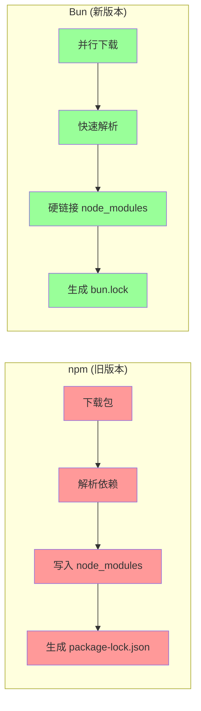

# Bun 包管理器迁移指南

## 1. Purpose

SystemPromptVault 项目已从 npm 迁移到 Bun 包管理器，以提升开发效率和性能。本文档描述了迁移的背景、变更内容、新的开发工作流和性能优势。

## 2. How it Works

### 2.1 迁移概述

**Bun** 是一个现代的 JavaScript 运行时和包管理器，相比 npm 具有以下优势：
- **依赖安装速度**: 2-10x 更快的依赖安装
- **脚本执行速度**: 2-5x 更快的脚本执行
- **统一运行时**: 同时作为 JavaScript 运行时和包管理器
- **更好的兼容性**: 与 npm 生态完全兼容

### 2.2 核心变更

#### 锁文件变更

```bash
# 旧版本 (已废弃)
- package-lock.json (二进制格式)

# 新版本 (当前)
+ bun.lock (文本格式，更易审查)
```

**优势**:
- 文本格式可读，便于代码审查
- 更快的锁文件解析速度
- 更好的依赖冲突解决

#### 包管理命令变更

```bash
# 依赖安装
npm install -> bun install

# 添加依赖
npm add <package> -> bun add <package>

# 添加开发依赖
npm add -D <package> -> bun add -d <package>

# 移除依赖
npm remove <package> -> bun remove <package>

# 更新依赖
npm update -> bun update
```

#### 脚本执行变更

```bash
# 旧版本
npm run <script>

# 新版本 (推荐)
bun run <script>

# 新版本 (简化)
bun <script>
```

### 2.3 项目文件变更

#### package.json 保持不变

`package.json` 结构完全保持兼容，无需修改：

```json
{
  "name": "systemprompt-vault",
  "version": "1.0.0",
  "scripts": {
    "build:css": "tailwindcss -i ./dist/css/tailwind.css -o ./dist/css/output.css --minify",
    "watch:css": "tailwindcss -i ./dist/css/tailwind.css -o ./dist/css/output.css --watch",
    "tauri:dev": "cargo tauri dev",
    "tauri:build": "cargo tauri build",
    "tauri:build:universal": "cargo tauri build --target universal-apple-darwin"
  },
  "devDependencies": {
    "@tailwindcss/typography": "^0.5.19",
    "@tauri-apps/cli": "^2.9.4",
    "autoprefixer": "^10.4.16",
    "postcss": "^8.4.35",
    "tailwindcss": "^3.4.17"
  }
}
```

#### Tauri 配置更新

`src-tauri/tauri.conf.json` 中的构建命令更新为使用 Bun：

```json
{
  "build": {
    "beforeDevCommand": "bun run watch:css",
    "beforeBuildCommand": "bun run build:css",
    "frontendDist": "../dist"
  }
}
```

### 2.4 新的开发工作流

#### 环境准备

```bash
# 安装 Bun (如未安装)
curl -fsSL https://bun.sh/install | bash

# 或使用 Homebrew (macOS)
brew install bun

# 验证安装
bun --version
```

#### 项目初始化

```bash
# 克隆项目后
git clone <repository-url>
cd systemprompt-vault

# 安装依赖 (使用 Bun)
bun install

# 启动开发模式
bun run tauri:dev
```

#### 常用开发命令

```bash
# CSS 开发模式 (实时监听)
bun run watch:css

# CSS 生产构建
bun run build:css

# 启动 Tauri 开发模式
bun run tauri:dev

# 构建 Tauri 应用
bun run tauri:build

# 构建 Universal macOS 应用
bun run tauri:build:universal
```

#### 依赖管理

```bash
# 添加新的依赖
bun add <package-name>

# 添加开发依赖
bun add -d <package-name>

# 移除依赖
bun remove <package-name>

# 更新所有依赖
bun update

# 更新特定依赖
bun update <package-name>
```

### 2.5 性能提升详解

#### 依赖安装性能



**性能对比**:
- 依赖安装: 2-10x 速度提升
- 脚本执行: 2-5x 速度提升
- 锁文件解析: 5x+ 速度提升

#### 开发体验改进

1. **更快的冷启动**: Bun 作为 JavaScript 运行时，启动速度更快
2. **更好的缓存**: 智能缓存机制，减少重复计算
3. **内置工具**: 集成打包器、测试运行器等工具
4. **TypeScript 原生支持**: 无需额外配置即可运行 TypeScript

## 3. Relevant Code Modules

### 核心配置文件
- `package.json`: 项目配置和脚本定义（保持不变）
- `bun.lock`: 新的锁文件（文本格式，替代 `package-lock.json`）
- `src-tauri/tauri.conf.json`: Tauri 配置，构建命令已更新为使用 Bun

### 开发脚本
- `package.json scripts`: 所有脚本保持相同的名称，通过 `bun run` 调用
- `build:css`: Tailwind CSS 构建脚本
- `watch:css`: Tailwind CSS 实时监听脚本
- `tauri:dev`: Tauri 开发模式
- `tauri:build`: Tauri 生产构建

### 依赖管理
- `devDependencies`: 开发依赖（Tailwind CSS、PostCSS、Autoprefixer、Tauri CLI）
- 依赖安装: 通过 `bun install` 管理
- 依赖添加/移除: 通过 `bun add/remove` 管理

## 4. Attention

### 迁移注意事项

1. **向后兼容**: 所有现有命令和脚本保持兼容，只是执行方式从 `npm run` 变为 `bun run`
2. **团队协作**: 团队成员需要安装 Bun 才能正常开发和构建
3. **CI/CD 更新**: 持续集成环境需要安装 Bun 并使用相应命令
4. **IDE 配置**: IDE/编辑器可能需要配置使用 Bun 作为默认包管理器

### 开发环境要求

1. **Bun 版本**: 建议使用 Bun v1.0.0 或更高版本
2. **Node.js 版本**: Bun 与 Node.js 生态兼容，无需特定版本要求
3. **操作系统**: Bun 支持 macOS、Linux 和 Windows

### 故障排除

#### 常见问题

1. **Q: Bun 安装失败？**
   A: 检查网络连接，或使用代理安装，也可以使用包管理器安装

2. **Q: 依赖安装过程中断？**
   A: 清理缓存 `rm -rf node_modules bun.lockb`，重新运行 `bun install`

3. **Q: 脚本执行速度没有明显提升？**
   A: 首次运行可能需要缓存，第二次运行应该会明显加快

4. **Q: 与现有工具链不兼容？**
   A: Bun 与 npm 生态完全兼容，如有问题可使用 `bunx` 运行 CLI 工具

### 最佳实践

1. **依赖管理**: 优先使用 `bun add/remove` 而不是手动编辑 `package.json`
2. **版本锁定**: 定期提交 `bun.lock` 文件，确保团队依赖一致性
3. **缓存清理**: 遇到奇怪问题时，可以清理缓存 `bun run --clear-cache`
4. **性能监控**: 使用 `bun run --prof` 分析脚本性能

### 未来规划

1. **全栈迁移**: 未来可能考虑使用 Bun 作为整个项目的 JavaScript 运行时
2. **构建优化**: 探索 Bun 内置的打包器替代部分构建流程
3. **测试集成**: 使用 Bun 内置的测试运行器提升测试速度
4. **部署优化**: 在 CI/CD 中利用 Bun 的速度优势缩短构建时间