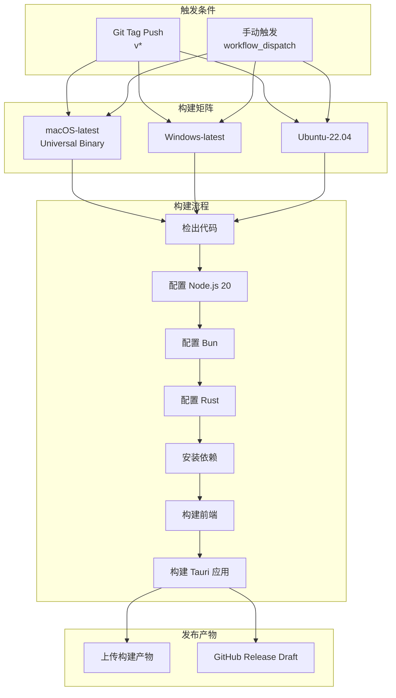
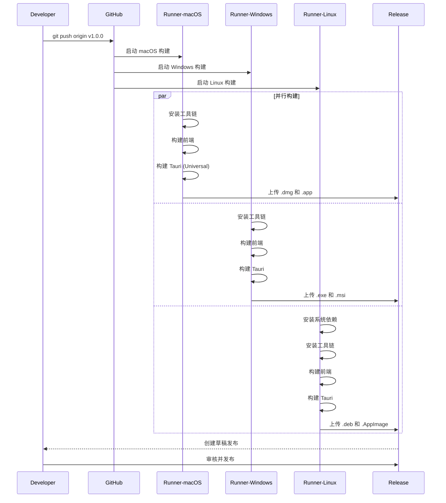

# CI/CD 构建流程

## 1. Purpose

本文档描述 SystemPromptVault 项目的持续集成与持续交付（CI/CD）流程，使用 GitHub Actions 实现跨平台自动化构建和发布。系统支持 macOS（通用二进制）、Windows 和 Linux 三个主流平台的自动化构建，确保每次发布的一致性和可靠性。

## 2. How it Works

### 2.1 CI/CD 架构



### 2.2 工作流配置

#### 2.2.1 文件位置

- `.github/workflows/build.yml`

#### 2.2.2 触发条件

```yaml
on:
  push:
    tags:
      - 'v*'       # 推送 v* 标签时触发（如 v1.0.0）
  workflow_dispatch:  # 支持手动触发
```

**触发方式**：
1. **自动触发**：推送版本标签到远程仓库
   ```bash
   git tag v1.0.0
   git push origin v1.0.0
   ```

2. **手动触发**：在 GitHub Actions 页面点击 "Run workflow"

### 2.3 构建矩阵策略

#### 2.3.1 平台配置

```yaml
strategy:
  fail-fast: false  # 一个平台失败不影响其他平台继续构建
  matrix:
    settings:
      - platform: 'macos-latest'
        args: '--target universal-apple-darwin'
      - platform: 'windows-latest'
        args: ''
      - platform: 'ubuntu-22.04'
        args: ''
```

**平台特性**：
| 平台 | Runner | 构建参数 | 输出格式 |
|------|--------|---------|---------|
| macOS | macos-latest | `--target universal-apple-darwin` | .app, .dmg (通用二进制) |
| Windows | windows-latest | - | .exe, .msi |
| Linux | ubuntu-22.04 | - | .deb, .AppImage |

#### 2.3.2 macOS 通用二进制

```yaml
targets: ${{ matrix.settings.platform == 'macos-latest' && 'aarch64-apple-darwin,x86_64-apple-darwin' || '' }}
```

**技术要点**：
- **双架构支持**：同时支持 Apple Silicon (ARM64) 和 Intel (x86_64)
- **单一产物**：用户无需选择架构，系统自动适配
- **文件大小**：通用二进制体积约为单架构的 1.8 倍

### 2.4 构建步骤详解

#### 2.4.1 环境准备

```yaml
- name: Checkout repository
  uses: actions/checkout@v4

- name: Setup Node.js
  uses: actions/setup-node@v4
  with:
    node-version: 20

- name: Setup Bun
  uses: oven-sh/setup-bun@v1
  with:
    bun-version: latest

- name: Install Rust stable
  uses: dtolnay/rust-toolchain@stable
  with:
    targets: ${{ matrix.settings.platform == 'macos-latest' && 'aarch64-apple-darwin,x86_64-apple-darwin' || '' }}
```

**工具链版本**：
- **Node.js**: 20.x LTS
- **Bun**: 最新稳定版
- **Rust**: stable channel

#### 2.4.2 Linux 平台依赖安装

```yaml
- name: Install dependencies (Ubuntu only)
  if: matrix.settings.platform == 'ubuntu-22.04'
  run: |
    sudo apt-get update
    sudo apt-get install -y libwebkit2gtk-4.1-dev libappindicator3-dev librsvg2-dev patchelf
```

**依赖说明**：
- `libwebkit2gtk-4.1-dev`: WebView2 渲染引擎
- `libappindicator3-dev`: 系统托盘支持
- `librsvg2-dev`: SVG 图标渲染
- `patchelf`: ELF 二进制修补工具

#### 2.4.3 前端构建

```yaml
- name: Install frontend dependencies
  run: bun install

- name: Build frontend
  run: bun run build
```

**执行流程**：
1. `bun install`：安装 npm 依赖
2. `bun run build`：执行以下命令
   - `bun run build:css`：构建 Tailwind CSS
   - `vite build`：构建前端资源到 `build/` 目录

#### 2.4.4 Tauri 构建和发布

```yaml
- name: Build Tauri app
  uses: tauri-apps/tauri-action@v0
  env:
    GITHUB_TOKEN: ${{ secrets.GITHUB_TOKEN }}
  with:
    tagName: ${{ github.ref_name }}
    releaseName: 'SystemPromptVault ${{ github.ref_name }}'
    releaseBody: 'See the CHANGELOG.md for details.'
    releaseDraft: true
    prerelease: false
    args: ${{ matrix.settings.args }}
```

**参数说明**：
- `tagName`: 使用触发构建的 Git 标签名
- `releaseName`: 发布名称（如 "SystemPromptVault v1.0.0"）
- `releaseBody`: 发布说明（引用 CHANGELOG.md）
- `releaseDraft`: 创建为草稿发布，需要手动发布
- `prerelease`: 是否为预发布版本
- `args`: 平台特定的构建参数

#### 2.4.5 产物上传

```yaml
- name: Upload artifacts
  uses: actions/upload-artifact@v4
  with:
    name: SystemPromptVault-${{ matrix.settings.platform }}
    path: |
      src-tauri/target/release/bundle/
      src-tauri/target/*/release/bundle/
```

**产物结构**：
```
artifacts/
├── SystemPromptVault-macos-latest/
│   └── src-tauri/target/universal-apple-darwin/release/bundle/
│       ├── dmg/
│       └── macos/
├── SystemPromptVault-windows-latest/
│   └── src-tauri/target/release/bundle/
│       ├── msi/
│       └── nsis/
└── SystemPromptVault-ubuntu-22.04/
    └── src-tauri/target/release/bundle/
        ├── deb/
        └── appimage/
```

### 2.5 构建流程时序图



### 2.6 发布流程

#### 2.6.1 自动化发布

构建完成后，GitHub Actions 会自动：
1. 创建 GitHub Release（草稿状态）
2. 将所有平台的构建产物附加到 Release
3. 填充发布标题和说明

#### 2.6.2 手动发布步骤

1. 在 GitHub 仓库的 Releases 页面找到草稿发布
2. 检查所有平台的构建产物是否完整
3. 编辑发布说明（通常引用 CHANGELOG.md）
4. 点击 "Publish release" 正式发布

### 2.7 本地验证流程

在推送标签触发 CI/CD 之前，建议本地验证构建：

```bash
# 1. 更新版本号（src-tauri/tauri.conf.json）
# 2. 更新 CHANGELOG.md

# 3. 本地构建测试
bun run build
bun run tauri:build

# 4. 测试构建产物
open src-tauri/target/release/bundle/macos/SystemPromptVault.app

# 5. 确认无误后推送标签
git tag v1.0.0
git push origin v1.0.0
```

## 3. Relevant Code Modules

### 工作流配置
- `.github/workflows/build.yml`: GitHub Actions 工作流定义文件

### 构建脚本
- `package.json`: 前端构建脚本配置
  - `build` 脚本：构建前端资源
  - `build:css` 脚本：构建 Tailwind CSS

### Tauri 配置
- `src-tauri/tauri.conf.json`: Tauri 应用配置
  - `version` 字段：应用版本号
  - `build.beforeBuildCommand`: 前端构建命令
  - `build.frontendDist`: 前端构建输出目录

### 前端构建
- `vite.config.js`: Vite 构建配置
- `dist/`: 前端源代码目录
- `build/`: 前端构建输出目录

### Rust 构建
- `src-tauri/Cargo.toml`: Rust 项目配置
- `src-tauri/src/`: Rust 源代码

## 4. Attention

### 构建性能注意事项

1. **并行构建**：三个平台同时构建，总耗时约等于最慢平台的构建时间
2. **缓存策略**：GitHub Actions 自动缓存 Rust 依赖和 npm 依赖，加速后续构建
3. **构建时间**：
   - macOS Universal: 约 15-20 分钟
   - Windows: 约 10-15 分钟
   - Linux: 约 10-15 分钟

### 版本管理注意事项

1. **版本号一致性**：
   - Git 标签版本号（如 `v1.0.0`）
   - `src-tauri/tauri.conf.json` 中的 `version` 字段（`1.0.0`）
   - `package.json` 中的 `version` 字段（`1.0.0`）
   - 三者必须保持一致

2. **语义化版本**：遵循 [SemVer](https://semver.org/) 规范
   - 主版本号：不兼容的 API 修改
   - 次版本号：向下兼容的功能性新增
   - 修订号：向下兼容的问题修正

### 发布注意事项

1. **草稿发布**：默认创建草稿发布，需要手动审核和发布
2. **发布说明**：建议在 `CHANGELOG.md` 中维护详细的变更日志
3. **预发布版本**：测试版本可设置 `prerelease: true`

### 安全注意事项

1. **GITHUB_TOKEN**：由 GitHub 自动提供，具有写入 Release 的权限
2. **代码签名**：
   - macOS 和 Windows 构建未配置代码签名
   - 如需分发，建议配置 Apple Developer 证书和 Windows 代码签名证书
3. **依赖安全**：定期更新 `package.json` 和 `Cargo.toml` 中的依赖

### 故障排查注意事项

1. **查看构建日志**：在 GitHub Actions 页面查看详细日志
2. **本地复现**：使用相同的命令本地复现问题
3. **平台差异**：注意不同平台的路径分隔符和命令差异
4. **依赖问题**：确保 `bun install` 和 `cargo build` 能正常执行

## 5. Common Issues

### 问题1：macOS 构建失败

**症状**：
```
error: linking with `cc` failed
```

**解决方法**：
1. 确认 Rust 工具链已安装 `aarch64-apple-darwin` 和 `x86_64-apple-darwin` 目标
2. 检查 Xcode Command Line Tools 是否正确安装

### 问题2：Linux 缺少系统依赖

**症状**：
```
Package webkit2gtk-4.1 was not found
```

**解决方法**：
1. 确认工作流中的 `apt-get install` 步骤包含所有必需依赖
2. 参考 [Tauri 官方文档](https://tauri.app/v1/guides/getting-started/prerequisites#linux) 确认依赖列表

### 问题3：前端构建失败

**症状**：
```
error: vite build failed
```

**解决方法**：
1. 本地运行 `bun run build` 复现问题
2. 检查 `vite.config.js` 配置是否正确
3. 确认 `dist/` 目录结构完整

### 问题4：发布权限不足

**症状**：
```
Resource not accessible by integration
```

**解决方法**：
1. 确认仓库设置中 Actions 权限为 "Read and write permissions"
2. 检查 `GITHUB_TOKEN` 是否正确传递

## 6. Best Practices

### 发布前检查清单

- [ ] 更新 `CHANGELOG.md` 记录本次发布的变更
- [ ] 确认 `src-tauri/tauri.conf.json` 版本号已更新
- [ ] 确认 `package.json` 版本号已更新
- [ ] 本地构建测试通过（`bun run tauri:build`）
- [ ] 所有功能测试通过
- [ ] 代码已合并到主分支

### 版本发布流程

1. **开发分支**：在 `develop` 或 `feature/*` 分支开发
2. **合并主分支**：开发完成后合并到 `main` 分支
3. **更新版本号**：修改配置文件中的版本号
4. **提交变更**：
   ```bash
   git add .
   git commit -m "chore: bump version to 1.0.0"
   ```
5. **推送代码**：
   ```bash
   git push origin main
   ```
6. **创建标签**：
   ```bash
   git tag v1.0.0
   git push origin v1.0.0
   ```
7. **监控构建**：在 GitHub Actions 页面监控构建进度
8. **发布版本**：构建完成后审核并发布 Release

### 回滚策略

如果发布后发现严重问题：

1. **删除有问题的 Release**：
   ```bash
   gh release delete v1.0.0
   ```

2. **删除 Git 标签**：
   ```bash
   git tag -d v1.0.0
   git push origin :refs/tags/v1.0.0
   ```

3. **修复问题**：修复代码并重新发布

## 7. Future Enhancements

### 短期优化
- [ ] 添加自动化测试（单元测试、集成测试）
- [ ] 配置代码签名（macOS 公证、Windows 签名）
- [ ] 添加构建缓存优化，减少构建时间
- [ ] 集成代码质量检查（ESLint、clippy）

### 长期规划
- [ ] 实现自动版本号管理（基于提交信息）
- [ ] 添加 beta 和 alpha 预发布通道
- [ ] 配置自动更新机制（Tauri updater）
- [ ] 集成性能监控和错误追踪

## 8. References

- [GitHub Actions 官方文档](https://docs.github.com/en/actions)
- [Tauri Action 文档](https://github.com/tauri-apps/tauri-action)
- [Tauri 构建指南](https://tauri.app/v1/guides/building/)
- [语义化版本规范](https://semver.org/)
