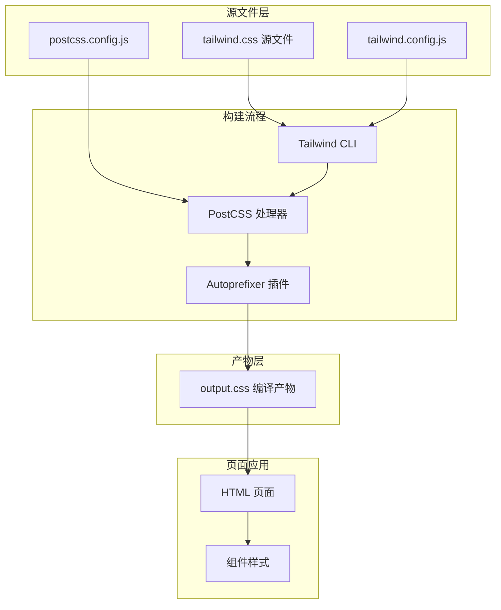
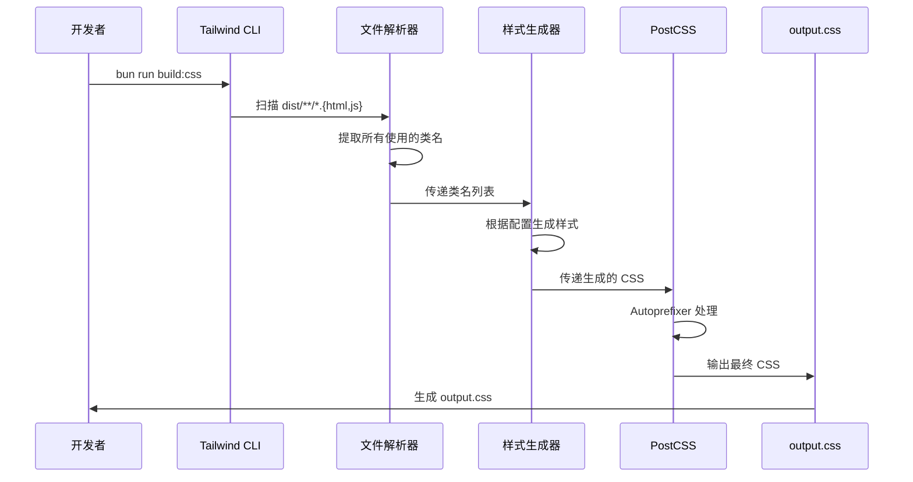

# Tailwind CSS 集成指南

## 1. Purpose

SystemPromptVault 集成了 Tailwind CSS 框架用于现代化 UI 设计和样式管理。本文档描述 Tailwind CSS 的 CLI 构建集成方式、自定义配置、构建流程和最佳实践。

## 2. How it Works

### 2.1 集成架构



### 2.2 构建系统配置

#### Tailwind 配置文件

**文件路径**: `tailwind.config.js`

```javascript
/** @type {import('tailwindcss').Config} */
module.exports = {
  darkMode: 'class',  // 暗色模式通过 .dark 类控制
  content: [
    "./dist/**/*.{html,js}",  // 扫描 dist 目录下的 HTML 和 JS 文件
  ],
  theme: {
    extend: {
      fontFamily: {
        sans: ['"SF Pro Display"', '"Segoe UI"', 'system-ui', '-apple-system', 'BlinkMacSystemFont', 'sans-serif'],
        mono: ['"SF Mono"', '"JetBrains Mono"', 'monospace'],
      },
      colors: {
        primary: {
          DEFAULT: '#0066cc',
          dark: '#0053a3',
          50: '#e6f0ff',
          500: '#0066cc',
          600: '#0053a3',
        },
        success: '#1d9b6c',
        error: '#d64545',
        warning: '#e08b2e',
      },
      boxShadow: {
        'sm': '0 2px 8px rgba(0, 0, 0, 0.05)',
        'md': '0 12px 32px rgba(0, 0, 0, 0.12)',
      },
      borderRadius: {
        'sm': '6px',
        'md': '10px',
        'lg': '16px',
        'xl': '20px',
      },
      keyframes: {
        'marquee-scroll': {
          '0%, 30%': {
            transform: 'translateX(0)',
          },
          '50%, 80%': {
            transform: 'translateX(calc(-1 * var(--marquee-scroll-distance, 0px)))',
          },
          '100%': {
            transform: 'translateX(0)',
          },
        },
        'marquee-scroll-hover': {
          '0%': {
            transform: 'translateX(0)',
          },
          '50%': {
            transform: 'translateX(calc(-1 * var(--marquee-scroll-distance, 0px)))',
          },
          '100%': {
            transform: 'translateX(0)',
          },
        },
      },
      animation: {
        'marquee': 'marquee-scroll 12s ease-in-out infinite',
        'marquee-hover': 'marquee-scroll-hover 8s ease-in-out infinite',
      },
    },
  },
  plugins: [],
}
```

#### PostCSS 配置文件

**文件路径**: `postcss.config.js`

```javascript
module.exports = {
  plugins: {
    tailwindcss: {},      // Tailwind CSS 处理器
    autoprefixer: {},     // 自动添加浏览器前缀
  },
}
```

#### Bun 构建脚本

**文件路径**: `package.json`

```json
{
  "scripts": {
    "build:css": "tailwindcss -i ./dist/css/tailwind.css -o ./dist/css/output.css --minify",
    "watch:css": "tailwindcss -i ./dist/css/tailwind.css -o ./dist/css/output.css --watch",
    "tauri:dev": "cargo tauri dev",
    "tauri:build": "cargo tauri build"
  },
  "devDependencies": {
    "@tailwindcss/typography": "^0.5.19",
    "@tauri-apps/cli": "^2.9.4",
    "autoprefixer": "^10.4.16",
    "postcss": "^8.4.35",
    "tailwindcss": "^3.4.17"
  }
}
```

### 2.3 源文件结构

#### Tailwind CSS 源文件

**文件路径**: `dist/css/tailwind.css`

```css
@tailwind base;
@tailwind components;
@tailwind utilities;

/* 自定义样式 */
@layer base {
  body {
    @apply bg-gray-100 text-gray-800 text-[15px] min-h-screen;
    font-family: "SF Pro Display", "Segoe UI", system-ui, -apple-system, BlinkMacSystemFont, sans-serif;
  }
}

@layer components {
  .btn {
    @apply inline-flex items-center justify-center rounded-md font-semibold transition-all duration-200;
    @apply px-4 py-2 cursor-pointer;
  }

  .btn-primary {
    @apply bg-primary text-white border border-primary hover:bg-primary-dark hover:border-primary-dark;
  }

  /* 更多组件类... */
}
```

**说明**:
- `@tailwind base`: 引入 Tailwind 基础样式重置
- `@tailwind components`: 引入组件类
- `@tailwind utilities`: 引入所有工具类
- `@layer base`: 定义基础层自定义样式
- `@layer components`: 定义可复用组件类

### 2.4 构建流程



### 2.5 HTML 集成方式

#### 旧版 CDN 集成（已废弃）

```html
<!-- 已废弃：Tailwind CSS Play CDN -->
<script src="https://cdn.tailwindcss.com"></script>
<script>
  tailwind.config = {
    darkMode: 'class',
    theme: { /* ... */ }
  }
</script>
```

#### 新版 CLI 构建集成

```html
<!-- 防止主题闪烁 - 必须在页面渲染前执行 -->
<script>
  (function() {
    const theme = localStorage.getItem('app-theme') ||
      (window.matchMedia('(prefers-color-scheme: dark)').matches ? 'dark' : 'light');
    if (theme === 'dark') {
      document.documentElement.classList.add('dark');
    }
  })();
</script>

<!-- 引入编译后的 Tailwind CSS -->
<link rel="stylesheet" href="css/output.css" />

<!-- 保留原有样式以确保平滑过渡 -->
<link rel="stylesheet" href="css/main.css" />
<link rel="stylesheet" href="css/components.css" />
```

### 2.6 开发工作流

#### 开发模式（实时监听）

```bash
bun run watch:css
```

**行为**: Tailwind CLI 监听 `dist/` 目录下的所有 HTML 和 JS 文件变化，自动重新编译 CSS。

#### 生产构建（压缩输出）

```bash
bun run build:css
```

**行为**:
- 扫描所有文件提取使用的类名
- 生成最小化的 CSS
- 移除未使用的样式（Tree Shaking）
- 添加浏览器前缀（Autoprefixer）

#### Tauri 集成的自动化构建

Tailwind CSS 构建流程已集成到 Tauri 开发和生产构建流程中：

**Tauri 配置文件**: `src-tauri/tauri.conf.json`

```json
{
  "build": {
    "beforeDevCommand": "bun run watch:css",
    "beforeBuildCommand": "bun run build:css"
  }
}
```

**行为说明**:
- 执行 `bun run tauri:dev` 时，自动启动 `bun run watch:css`，实时监听 CSS 变化
- 执行 `bun run tauri:build` 时，自动运行 `bun run build:css`，生成优化的生产版本 CSS
- 开发者无需手动运行 CSS 构建命令，Tauri 会自动管理

### 2.7 自定义动画系统

项目在 Tailwind 配置中定义了跑马灯滚动动画，用于处理配置文件下拉框和下拉菜单项中的长文件名显示。

#### 2.7.1 跑马灯动画配置

**keyframes 定义**:

```javascript
keyframes: {
  'marquee-scroll': {
    '0%, 30%': {
      transform: 'translateX(0)',
    },
    '50%, 80%': {
      transform: 'translateX(calc(-1 * var(--marquee-scroll-distance, 0px)))',
    },
    '100%': {
      transform: 'translateX(0)',
    },
  },
  'marquee-scroll-hover': {
    '0%': {
      transform: 'translateX(0)',
    },
    '50%': {
      transform: 'translateX(calc(-1 * var(--marquee-scroll-distance, 0px)))',
    },
    '100%': {
      transform: 'translateX(0)',
    },
  },
}
```

**animation 配置**:

```javascript
animation: {
  'marquee': 'marquee-scroll 12s ease-in-out infinite',
  'marquee-hover': 'marquee-scroll-hover 8s ease-in-out infinite',
}
```

**设计特点**:
1. **持续循环动画** (`marquee`): 12秒周期，包含30%停留时间，适用于始终可见的重要信息
2. **hover 触发动画** (`marquee-hover`): 8秒周期，立即开始无停留，适用于按需查看的辅助信息
3. **CSS 变量控制**: 使用 `--marquee-scroll-distance` 动态计算滚动距离，由 JavaScript 运行时设置
4. **平滑效果**: 使用 `ease-in-out` 缓动函数提供自然的运动效果

#### 2.7.2 跑马灯动画使用示例

**持续循环模式**:

```html
<!-- 配置文件下拉框标签 -->
<span
  class="client-dropdown__label flex-1 max-w-[140px] overflow-hidden relative"
  id="configFileDropdownLabel"
  style="--marquee-scroll-distance: 80px;"
>
  <span class="inline-block min-w-full whitespace-nowrap will-change-transform pr-6 animate-marquee">
    very-long-config-file-name.md
  </span>
</span>
```

**hover 触发模式**:

```html
<!-- 下拉菜单项 -->
<button class="client-dropdown__option">
  <span
    class="client-dropdown__option-text"
    style="--marquee-scroll-distance: 60px;"
  >
    extremely-long-filename-that-needs-scrolling.md
  </span>
</button>
```

**CSS 样式配合**:

```css
/* hover 触发跑马灯 */
.client-dropdown__option:hover .client-dropdown__option-text {
  animation: marquee-scroll-hover 8s ease-in-out infinite;
}

/* 减少动画偏好支持 */
@media (prefers-reduced-motion: reduce) {
  .animate-marquee {
    animation: none !important;
  }
}
```

**JavaScript 动态控制**:

```javascript
// 测量溢出并设置CSS变量
const containerWidth = label.clientWidth;
const textWidth = textNode.scrollWidth;
const overflowAmount = textWidth - containerWidth;

if (overflowAmount > 4) {
  const dynamicGap = Math.min(
    Math.max(containerWidth * 0.15, 12),
    48
  );
  const scrollDistance = overflowAmount + dynamicGap;
  label.style.setProperty("--marquee-scroll-distance", `${scrollDistance}px`);
  textNode.classList.add("animate-marquee");
}
```

**关键点**:
- **CSS 变量**: `--marquee-scroll-distance` 由 JavaScript 运行时计算并设置
- **溢出检测**: 仅当内容溢出容器时启用动画（4px容差）
- **动态间距**: 滚动距离基于容器宽度的15%，范围12-48px
- **性能优化**: 使用 `requestAnimationFrame` 确保DOM渲染完成后再测量

### 2.8 自定义配置详解

#### 暗色模式配置

```javascript
darkMode: 'class'  // 通过 .dark 类控制暗色模式
```

**使用方式**:
```html
<!-- 应用到 <html> 或 <body> 元素 -->
<html class="dark">
  <!-- 内部元素自动应用暗色样式 -->
  <div class="bg-white dark:bg-gray-800">内容</div>
</html>
```

**主题闪烁防止**:

为防止页面加载时主题闪烁，在 HTML `<head>` 中添加同步脚本：

```html
<script>
  (function() {
    const theme = localStorage.getItem('app-theme') ||
      (window.matchMedia('(prefers-color-scheme: dark)').matches ? 'dark' : 'light');
    if (theme === 'dark') {
      document.documentElement.classList.add('dark');
    }
  })();
</script>
```

**关键点**:
- 必须在任何 CSS 加载之前执行（放在 `<head>` 顶部）
- 同步脚本（不使用 `async` 或 `defer`），确保在渲染前完成
- 读取 `localStorage` 或系统偏好，立即应用 `.dark` 类

#### 内容扫描配置

```javascript
content: ["./dist/**/*.{html,js}"]
```

**说明**:
- Tailwind CLI 会扫描 `dist/` 下所有 `.html` 和 `.js` 文件
- 提取所有类名（如 `bg-white`, `text-primary` 等）
- 只生成实际使用的样式，大幅减小文件体积

#### 主题扩展配置

```javascript
theme: {
  extend: {
    colors: {
      primary: { /* ... */ }  // 扩展调色板
    },
    fontFamily: { /* ... */ }  // 扩展字体
  }
}
```

### 2.9 工具类使用示例

#### 布局类

```html
<!-- 响应式容器 -->
<div class="min-h-screen max-w-7xl mx-auto p-5 flex flex-col gap-6">
  <!-- 内容 -->
</div>

<!-- 网格布局 -->
<div class="grid grid-cols-1 lg:grid-cols-2 gap-4 flex-1">
  <!-- 列内容 -->
</div>

<!-- Flex 布局 -->
<div class="flex items-center justify-between gap-3">
  <!-- 内容 -->
</div>
```

#### 按钮类

```html
<!-- 主要按钮 -->
<button class="bg-primary text-white px-4 py-2 rounded-md font-semibold hover:bg-primary-dark transition-colors">
  保存
</button>

<!-- 次要按钮 -->
<button class="border border-gray-300 bg-white text-gray-800 rounded-md px-3 py-2 hover:border-primary hover:text-primary transition-all duration-200">
  设置
</button>
```

#### 暗色模式类

```html
<!-- 自动适配暗色模式 -->
<div class="bg-white dark:bg-gray-800 text-gray-900 dark:text-gray-100">
  <p class="text-gray-600 dark:text-gray-400">辅助文本</p>
  <button class="border border-gray-300 dark:border-gray-600 hover:bg-gray-50 dark:hover:bg-gray-700">
    按钮
  </button>
</div>
```

### 2.10 自定义组件层

项目在 `tailwind.css` 中定义了可复用的组件类：

```css
@layer components {
  .btn {
    @apply inline-flex items-center justify-center rounded-md font-semibold transition-all duration-200;
    @apply px-4 py-2 cursor-pointer;
  }

  .card {
    @apply bg-white border border-gray-200 rounded-lg shadow-sm;
  }

  .modal-content {
    @apply bg-white rounded-lg p-5 w-full max-w-[520px] shadow-xl flex flex-col gap-4;
  }
}
```

**使用方式**:
```html
<button class="btn btn-primary">保存</button>
<div class="card p-5">卡片内容</div>
```

## 3. Relevant Code Modules

### 配置文件
- `tailwind.config.js`: Tailwind CSS 主配置文件，定义主题扩展和内容扫描路径
- `postcss.config.js`: PostCSS 配置，集成 Tailwind 和 Autoprefixer 插件
- `package.json`: Bun 构建脚本定义（`build:css`, `watch:css`, `tauri:dev`, `tauri:build`）
- `src-tauri/tauri.conf.json`: Tauri 应用配置，包含 CSS 构建钩子（`beforeDevCommand`, `beforeBuildCommand`）

### 样式源文件
- `dist/css/tailwind.css`: Tailwind CSS 源文件，包含基础层、组件层和工具层
- `dist/css/output.css`: 编译产物（由 Tailwind CLI 自动生成，不应手动修改）
- `dist/css/main.css`: 自定义 CSS，定义主题变量和特殊样式
- `dist/css/components.css`: 组件样式定义

### HTML 页面
- `dist/index.html`: 主页面，引入编译后的 `output.css` 和主题闪烁防止脚本
- `dist/settings.html`: 设置页面，引入编译后的 `output.css` 和主题闪烁防止脚本

### JavaScript 模块
- `dist/js/main.js`: 动态生成元素的 Tailwind 类应用
- `dist/js/settings.js`: 设置页面动态元素的 Tailwind 类应用
- `dist/js/theme.js`: 主题切换，动态添加/移除 `.dark` 类

## 4. Attention

### 构建系统注意事项

1. **源文件管理**: `dist/css/tailwind.css` 是源文件，`dist/css/output.css` 是产物，不应手动编辑产物文件
2. **内容扫描**: 确保所有使用 Tailwind 类的文件都在 `tailwind.config.js` 的 `content` 配置中
3. **动态类名**: 避免使用动态拼接的类名（如 `bg-${color}-500`），Tailwind 无法静态提取
4. **构建流程**: 开发时运行 `bun run watch:css`，生产构建时运行 `bun run build:css`

### 自定义动画注意事项

1. **跑马灯动画系统**:
   - `animate-marquee` 用于持续循环，`animate-marquee-hover` 用于 hover 触发
   - 必须配合 CSS 变量 `--marquee-scroll-distance` 使用，由 JavaScript 运行时设置
   - 支持 `prefers-reduced-motion` 媒体查询，自动禁用动画

2. **CSS 变量控制**:
   - 跑马灯距离通过 `--marquee-scroll-distance` 动态计算
   - 使用 `requestAnimationFrame` 确保测量准确性
   - 4px 容差避免边界情况下的频繁切换

3. **性能优化**:
   - 使用 `will-change: transform` 提示浏览器优化
   - 避免在动画过程中触发 reflow/repaint
   - 仅在内容真正溢出时启用动画

4. **配置扩展**:
   - 新增 keyframes 和 animation 定义在 `theme.extend` 中
   - 保持与现有动画系统的一致性（如缓动函数）
   - 动画时长和停留时间根据实际使用场景调整

### 性能优化

1. **Tree Shaking**: 生产构建自动移除未使用的样式，大幅减小文件体积
2. **压缩**: `--minify` 参数确保 CSS 压缩，减少网络传输
3. **缓存**: `output.css` 作为静态资源可被浏览器缓存
4. **Autoprefixer**: 自动添加浏览器前缀，无需手动维护

### 暗色模式注意事项

1. **类名策略**: 使用 `dark:` 前缀定义暗色样式（如 `dark:bg-gray-800`）
2. **类切换**: 通过 JavaScript 在 `<html>` 或 `<body>` 上添加/移除 `.dark` 类
3. **闪烁防止**: 在 `<head>` 中同步脚本初始化主题，避免页面闪烁
4. **变量系统**: 项目同时使用 CSS 变量系统（`main.css`）和 Tailwind 暗色模式

### 迁移注意事项

1. **CDN 移除**: 已移除 Tailwind Play CDN，使用 CLI 构建
2. **配置一致性**: `tailwind.config.js` 配置与原 CDN 内联配置保持一致
3. **兼容性**: 保留 `main.css` 和 `components.css` 确保平滑过渡
4. **依赖安装**: 确保安装 `tailwindcss`, `postcss`, `autoprefixer` 依赖（使用 `bun add` 安装）

### 最佳实践

1. **语义化**: 为复杂组件创建有意义的组件类（在 `@layer components` 中定义）
2. **复用性**: 提取常用类组合为组件类，避免重复
3. **可维护性**: 避免在 JavaScript 中硬编码大量 Tailwind 类
4. **一致性**: 统一使用间距、颜色、字体等设计标准
5. **开发工具**: 使用 Tailwind CSS IntelliSense VS Code 插件提升开发体验

### 常见问题

1. **Q: 新增的类不生效？**
   A: 确保运行了 `bun run watch:css` 或 `bun run build:css` 重新编译

2. **Q: 样式文件过大？**
   A: 检查 `content` 配置是否正确，确保只扫描实际使用 Tailwind 的文件

3. **Q: 暗色模式不生效？**
   A: 检查 `<html>` 或 `<body>` 是否有 `.dark` 类，检查 `darkMode: 'class'` 配置

4. **Q: 浏览器前缀缺失？**
   A: 确保 `postcss.config.js` 中配置了 `autoprefixer` 插件
