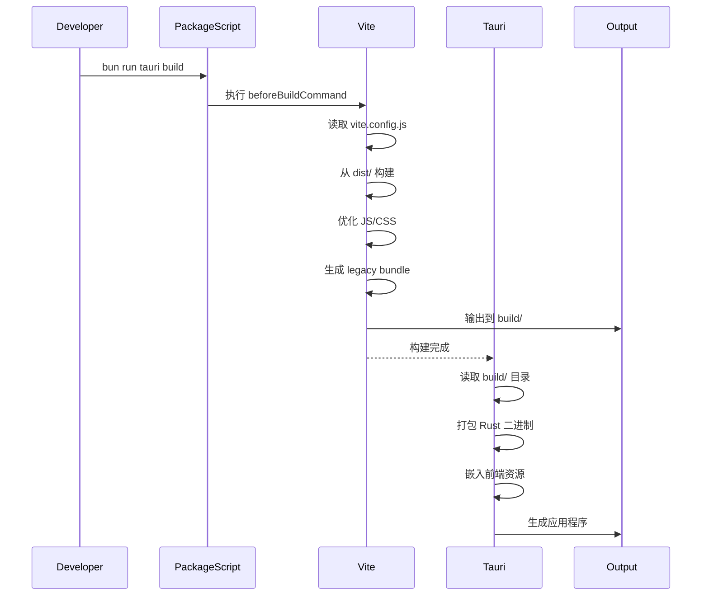

# Vite 构建配置指南

## 1. Purpose

本指南详细说明 SystemPromptVault 项目中的 Vite 构建配置，包括开发服务器配置、生产构建流程、legacy 浏览器支持、以及与 Tauri 集成的完整方案。Vite 配置取代了传统的手动构建方式，提供了更快的开发体验和优化的生产构建。

## 2. How it Works

### 2.1 配置架构

```mermaid
graph LR
    subgraph "源代码目录"
        DistDir[dist/]
        HTML[index.html/settings.html]
        JS[js/*.js]
        CSS[css/*.css]
    end

    subgraph "Vite 配置"
        ViteConfig[vite.config.js]
        LegacyPlugin[@vitejs/plugin-legacy]
        DevServer[Dev Server]
        BuildConfig[Build Config]
    end

    subgraph "构建输出"
        BuildDir[build/]
        BundledJS[assets/*.js]
        BundledCSS[assets/*.css]
        OptimizedHTML[*.html]
    end

    subgraph "Tauri 集成"
        TauriConf[tauri.conf.json]
        DevMode[dev mode]
        ProdBuild[prod build]
    end

    DistDir --> ViteConfig
    HTML --> ViteConfig
    JS --> ViteConfig
    CSS --> ViteConfig

    ViteConfig --> LegacyPlugin
    ViteConfig --> DevServer
    ViteConfig --> BuildConfig

    DevServer --> DevMode
    BuildConfig --> BuildDir
    BuildDir --> BundledJS
    BuildDir --> BundledCSS
    BuildDir --> OptimizedHTML

    TauriConf --> DevMode
    TauriConf --> ProdBuild
    BuildDir --> ProdBuild
```

### 2.2 核心配置文件

#### 2.2.1 vite.config.js

```javascript
import { defineConfig } from 'vite';
import legacy from '@vitejs/plugin-legacy';
import { resolve } from 'node:path';

const rootDir = resolve(__dirname, 'dist');

export default defineConfig({
  // 源代码根目录
  root: rootDir,

  // 插件配置
  plugins: [
    legacy()  // 支持 legacy 浏览器
  ],

  // 开发服务器配置
  server: {
    port: 1420,           // 固定端口
    strictPort: true      // 端口被占用时报错，而不是自动切换
  },

  // 构建配置
  build: {
    outDir: resolve(rootDir, '../build'),  // 输出到 build/ 目录
    emptyOutDir: true                      // 构建前清空输出目录
  }
});
```

### 2.3 Tauri 集成配置

#### 2.3.1 tauri.conf.json 关键配置

```json
{
  "build": {
    "beforeBuildCommand": "bun run build",
    "beforeDevCommand": "bun run dev",
    "frontendDist": "../build",
    "devUrl": "http://localhost:1420"
  }
}
```

**配置说明**：
- `beforeBuildCommand`: 生产构建前执行的命令
- `beforeDevCommand`: 开发模式前执行的命令
- `frontendDist`: 前端构建输出目录，Tauri会将其打包进应用
- `devUrl`: 开发模式下前端服务器地址

### 2.4 package.json 脚本

```json
{
  "scripts": {
    "dev": "vite",
    "build": "vite build",
    "preview": "vite preview"
  }
}
```

**脚本说明**：
- `dev`: 启动 Vite 开发服务器（HMR热重载）
- `build`: 构建生产版本到 `build/` 目录
- `preview`: 预览生产构建结果

### 2.5 Legacy 浏览器支持

#### 2.5.1 @vitejs/plugin-legacy 插件

```javascript
plugins: [
  legacy()
]
```

**功能**：
- 为旧版浏览器生成兼容的polyfill代码
- 生成两套bundle：现代浏览器bundle + legacy bundle
- 自动根据浏览器能力加载对应bundle

#### 2.5.2 构建输出示例

```
build/
├── assets/
│   ├── index-iECt0YgY.js          # 现代浏览器bundle
│   ├── index-legacy-D6r8N0E6.js   # legacy浏览器bundle
│   ├── polyfills-legacy-DG-sqYgg.js  # polyfills
│   └── index-DB0Gu-Oi.css         # 样式bundle
└── index.html                      # 入口HTML
```

### 2.6 开发模式 vs 生产模式

#### 2.6.1 开发模式

```bash
bun run dev
```

**特性**：
- 启动开发服务器（localhost:1420）
- 模块热重载（HMR）
- 源代码映射（source maps）
- 未压缩代码，易于调试

**Tauri 集成**：
```bash
bun run tauri dev
```
1. 执行 `beforeDevCommand` → 启动 Vite dev server
2. Tauri 窗口加载 `http://localhost:1420`
3. 代码变更自动刷新

#### 2.6.2 生产模式

```bash
bun run build
```

**特性**：
- 代码压缩和混淆
- Tree-shaking（移除未使用代码）
- CSS提取和优化
- 资源哈希命名（缓存破坏）
- Legacy bundle生成

**Tauri 集成**：
```bash
bun run tauri build
```
1. 执行 `beforeBuildCommand` → Vite build
2. Tauri 读取 `build/` 目录
3. 打包成应用程序（.app/.exe/.dmg等）

### 2.7 构建流程详解



### 2.8 目录结构说明

```
SystemPromptVault/
├── dist/                    # 源代码目录（未构建）
│   ├── index.html          # 入口HTML
│   ├── settings.html       # 设置页面HTML
│   ├── js/                 # JavaScript源代码
│   │   ├── main.js
│   │   ├── settings.js
│   │   ├── api.js
│   │   └── utils.js
│   └── css/                # CSS源代码
│       ├── output.css
│       └── components.css
│
├── build/                   # Vite构建输出（生产）
│   ├── assets/             # 打包后的资源（哈希命名）
│   ├── index.html          # 处理后的HTML
│   └── settings.html
│
├── vite.config.js          # Vite配置
├── package.json            # 包管理配置
└── src-tauri/              # Tauri后端
    └── tauri.conf.json     # Tauri配置
```

## 3. Relevant Code Modules

### 配置文件
- `vite.config.js`: Vite核心配置
- `src-tauri/tauri.conf.json`: Tauri与Vite集成配置
- `package.json`: NPM脚本和依赖配置

### 输入目录
- `dist/`: 前端源代码根目录
- `dist/index.html`: 主页面入口
- `dist/settings.html`: 设置页面入口
- `dist/js/`: JavaScript模块
- `dist/css/`: CSS样式

### 输出目录
- `build/`: Vite构建输出目录
- `build/assets/`: 打包后的JS和CSS资源

## 4. Attention

### 配置注意事项

1. **端口固定**：开发服务器使用固定端口 1420，避免与Tauri配置不匹配
2. **严格端口模式**：`strictPort: true` 确保端口冲突时立即报错
3. **清空输出目录**：每次构建前自动清空 `build/` 目录，避免旧文件残留
4. **路径解析**：使用 `resolve()` 确保跨平台路径兼容

### 性能注意事项

1. **开发模式HMR**：代码变更自动热重载，无需刷新页面
2. **生产构建优化**：自动进行代码压缩、Tree-shaking、CSS提取
3. **并行构建**：Vite使用esbuild进行快速转译
4. **缓存利用**：资源哈希命名支持长期缓存

### 兼容性注意事项

1. **Legacy支持**：@vitejs/plugin-legacy 确保旧版浏览器兼容
2. **Polyfills**：自动注入必要的polyfills
3. **模块格式**：现代浏览器使用ESM，旧版浏览器使用SystemJS
4. **目标环境**：默认支持 ES2015+

### 调试注意事项

1. **Source Maps**：开发模式自动生成，方便调试
2. **错误堆栈**：准确定位到源代码位置
3. **控制台日志**：Vite输出详细的构建信息
4. **预览模式**：`bun run preview` 可预览生产构建

### 集成注意事项

1. **Tauri同步**：确保 `frontendDist` 指向 Vite 输出目录
2. **命令顺序**：Tauri自动按顺序执行前端构建
3. **环境变量**：可通过 `.env` 文件配置环境变量
4. **跨平台兼容**：配置文件使用 `resolve()` 处理路径

## 5. Best Practices

### 开发最佳实践

1. **热重载优先**：开发时始终使用 `bun run dev`，利用HMR提升效率
2. **独立测试**：可单独运行 `bun run dev` 测试前端，无需启动Tauri
3. **预览构建**：正式打包前使用 `bun run preview` 检查构建结果
4. **代码分割**：合理组织模块，利用Vite的自动代码分割

### 构建最佳实践

1. **定期清理**：手动删除 `build/` 目录，确保干净构建
2. **检查输出**：构建后检查 `build/` 目录，确认资源完整
3. **性能监控**：关注构建输出的bundle大小和警告信息
4. **依赖管理**：定期更新 Vite 和相关插件版本

### 配置最佳实践

1. **环境变量**：敏感配置使用 `.env` 文件，不提交到版本控制
2. **插件节制**：仅添加必要的插件，避免构建变慢
3. **路径别名**：可配置路径别名简化import语句
4. **构建分析**：使用 `rollup-plugin-visualizer` 分析bundle大小

## 6. Common Issues

### 问题1：端口被占用

**症状**：
```
Port 1420 is in use, trying another one...
[ERROR] Strict port is enabled, port 1420 is in use
```

**解决方法**：
1. 找到占用端口的进程：`lsof -i :1420`
2. 终止该进程：`kill -9 <PID>`
3. 或者修改 `vite.config.js` 中的端口号

### 问题2：构建输出目录错误

**症状**：Tauri打包时找不到前端文件

**解决方法**：
1. 确认 `vite.config.js` 的 `build.outDir` 是 `../build`
2. 确认 `tauri.conf.json` 的 `frontendDist` 是 `../build`
3. 手动运行 `bun run build` 检查输出

### 问题3：Legacy bundle未生成

**症状**：旧版浏览器无法加载应用

**解决方法**：
1. 确认 `@vitejs/plugin-legacy` 已安装
2. 检查 `vite.config.js` 是否正确导入和使用插件
3. 重新安装依赖：`bun install`

### 问题4：HMR不工作

**症状**：修改代码后页面不自动刷新

**解决方法**：
1. 检查浏览器控制台是否有WebSocket连接错误
2. 确认开发服务器正在运行
3. 尝试重启开发服务器
4. 检查防火墙是否阻止了WebSocket连接

## 7. Migration Guide

### 从手动构建迁移到 Vite

**旧方式（手动）**：
```json
{
  "scripts": {
    "build:css": "tailwindcss ...",
    "watch:css": "tailwindcss ... --watch"
  }
}
```

**新方式（Vite）**：
```json
{
  "scripts": {
    "dev": "vite",
    "build": "vite build"
  }
}
```

**迁移步骤**：
1. 安装Vite和插件：`bun add -d vite @vitejs/plugin-legacy`
2. 创建 `vite.config.js` 配置文件
3. 更新 `package.json` 脚本
4. 更新 `tauri.conf.json` 构建配置
5. 测试开发模式：`bun run dev`
6. 测试生产构建：`bun run build`
7. 删除旧的构建脚本和配置

## 8. Future Enhancements

### 短期优化
- [ ] 配置代码分割策略（按路由拆分）
- [ ] 添加 PWA 插件支持离线使用
- [ ] 配置CSS代码分割，减少首屏CSS体积
- [ ] 添加构建性能分析工具

### 长期规划
- [ ] 迁移到 TypeScript 并配置类型检查
- [ ] 添加 Vue 或 React 框架支持
- [ ] 配置 SSR（服务端渲染）
- [ ] 集成单元测试和E2E测试框架

## 9. References

- [Vite 官方文档](https://vitejs.dev/)
- [@vitejs/plugin-legacy 文档](https://github.com/vitejs/vite/tree/main/packages/plugin-legacy)
- [Tauri + Vite 集成指南](https://tauri.app/v1/guides/getting-started/setup/vite)
- [Bun 包管理器文档](https://bun.sh/docs)