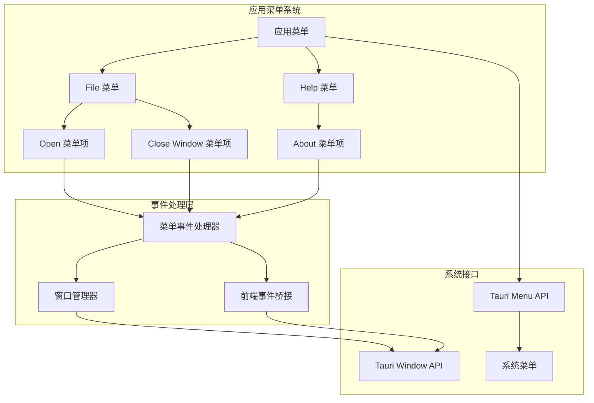

# 应用菜单模块

## 1. Purpose

应用菜单模块提供 macOS 原生应用菜单功能，包括 File 菜单和 Help 菜单。该模块通过 Tauri 的菜单 API 实现系统集成级菜单，支持文件操作、About 窗口打开等功能，为用户提供标准的桌面应用交互体验。

## 2. How it Works

### 2.1 菜单架构设计



### 2.2 菜单构建系统

#### 2.2.1 主菜单初始化

```rust
// src-tauri/src/app_menu.rs
pub fn build_app_menu<R: Runtime>(app_handle: &AppHandle<R>) -> Result<Menu<R>, tauri::Error> {
    let menu = Menu::new(app_handle)?;

    // File 菜单
    let file_menu = build_file_menu(app_handle)?;
    menu.append(&file_menu)?;

    // Help 菜单
    let help_menu = build_help_menu(app_handle)?;
    menu.append(&help_menu)?;

    Ok(menu)
}
```

#### 2.2.2 File 菜单构建

```rust
fn build_file_menu<R: Runtime>(app_handle: &AppHandle<R>) -> Result<Submenu<R>, tauri::Error> {
    // 创建 Open 菜单项
    let open_item = MenuItem::with_id(app_handle, "open", "Open", true, None::<&str>)?;

    // 创建分隔符
    let separator = PredefinedMenuItem::separator(app_handle)?;

    // 创建 Close Window 菜单项
    let close_item = PredefinedMenuItem::close_window(app_handle, None)?;

    // 创建 File 子菜单
    let file_submenu = Submenu::with_id_and_items(
        app_handle,
        "file",
        "File",
        true,
        &[&open_item, &separator, &close_item],
    )?;

    Ok(file_submenu)
}
```

#### 2.2.3 Help 菜单构建

```rust
fn build_help_menu<R: Runtime>(app_handle: &AppHandle<R>) -> Result<Submenu<R>, tauri::Error> {
    // 创建 About 菜单项
    let about_item = MenuItem::with_id(app_handle, "about", "About", true, None::<&str>)?;

    // 创建 Help 子菜单
    let help_submenu = Submenu::with_id_and_items(
        app_handle,
        "help",
        "Help",
        true,
        &[&about_item],
    )?;

    Ok(help_submenu)
}
```

### 2.3 菜单事件处理系统

#### 2.3.1 事件路由机制

```rust
// src-tauri/src/app_menu.rs
pub fn handle_menu_event<R: Runtime>(
    app_handle: &AppHandle<R>,
    event: &MenuEvent,
) -> Result<(), String> {
    let id = event.id().as_ref();

    match id {
        "open" => {
            handle_open_menu(app_handle)
        }
        "about" => {
            show_about_dialog(app_handle);
            Ok(())
        }
        _ => Ok(()),
    }
}
```

#### 2.3.2 Open 菜单处理

```rust
fn handle_open_menu<R: Runtime>(app_handle: &AppHandle<R>) -> Result<(), String> {
    // 显示文件选择对话框
    if let Some(window) = app_handle.get_webview_window("main") {
        window.show().map_err(|e| e.to_string())?;
        window.set_focus().map_err(|e| e.to_string())?;
        // 向前端发送打开文件事件
        window
            .emit("menu://file-open", ())
            .map_err(|e| e.to_string())?;
    }
    Ok(())
}
```

### 2.4 前端事件监听

#### 2.4.1 文件打开事件处理

```javascript
// 前端代码示例
window.addEventListener('menu://file-open', () => {
    // 处理文件打开逻辑
    // 例如：显示文件选择对话框、导航到文件管理页面等
    console.log('Open menu item clicked');
});
```

### 2.5 系统集成

#### 2.5.1 主应用集成

```rust
// src-tauri/src/main.rs
fn main() {
    tauri::Builder::default()
        .setup(|app| {
            // 构建并设置应用菜单
            match app_menu::build_app_menu(app) {
                Ok(menu) => {
                    app.set_menu(menu).expect("failed to set app menu");
                }
                Err(e) => eprintln!("Failed to build app menu: {}", e),
            }
            Ok(())
        })
        .on_menu_event(|app, event| {
            if let Err(err) = app_menu::handle_menu_event(app, &event) {
                eprintln!("Menu event handler error: {}", err);
            }
        })
        .run(tauri::generate_context!())
        .expect("error while running tauri application");
}
```

## 3. Relevant Code Modules

### 核心模块文件
- `src-tauri/src/app_menu.rs`: 应用菜单完整实现（109行代码）
- `src-tauri/src/main.rs`: 菜单系统集成和事件处理配置
- `src-tauri/src/lib.rs`: 模块导出声明

### 依赖模块
- `src-tauri/src/features/about-window-functionality.md`: About 窗口功能实现
- 前端事件监听器：处理菜单事件的前端逻辑

### 系统依赖
- Tauri Menu API: 菜单创建和管理
- Tauri Window API: 窗口操作和事件发送
- 系统原生菜单：macOS 系统菜单集成

## 4. Attention

### 功能注意事项

1. **菜单ID规范**: 菜单项使用字符串ID进行标识，确保唯一性
2. **错误处理**: 所有菜单操作都包含错误处理机制
3. **窗口状态管理**: Open 菜单会检查主窗口状态并进行相应操作
4. **事件命名**: 使用 `menu://` 前缀的事件名称，避免命名冲突

### 平台兼容性注意事项

1. **macOS 优先**: 当前实现主要针对 macOS 的应用菜单系统
2. **跨平台扩展**: 可扩展支持 Windows 和 Linux 的菜单系统
3. **系统样式**: 菜单样式遵循各系统的原生设计规范
4. **快捷键支持**: 可为菜单项添加键盘快捷键支持

### 用户体验注意事项

1. **标准菜单结构**: 遵循 macOS 的标准菜单组织方式
2. **菜单项状态**: 根据应用状态动态调整菜单项的可用性
3. **响应速度**: 菜单事件响应迅速，无明显延迟
4. **无障碍支持**: 支持屏幕阅读器等辅助技术

### 维护注意事项

1. **菜单项管理**: 新增功能时考虑是否需要在菜单中添加对应项
2. **国际化支持**: 菜单文本支持多语言（当前使用英文）
3. **快捷键一致性**: 确保快捷键与系统和其他应用保持一致
4. **测试覆盖**: 定期测试菜单功能的完整性和响应性

### 扩展性注意事项

1. **动态菜单**: 支持根据应用状态动态添加或移除菜单项
2. **上下文菜单**: 可扩展支持窗口上下文菜单
3. **插件系统**: 可考虑支持第三方菜单插件
4. **菜单状态同步**: 支持菜单状态与应用状态的实时同步

### 性能注意事项

1. **菜单构建**: 应用启动时一次性构建，运行时仅更新必要项
2. **事件处理**: 菜单事件处理逻辑保持轻量，避免阻塞UI
3. **内存使用**: 菜单对象使用合理的内存，及时清理不需要的引用
4. **响应延迟**: 确保菜单点击到响应的延迟 < 50ms