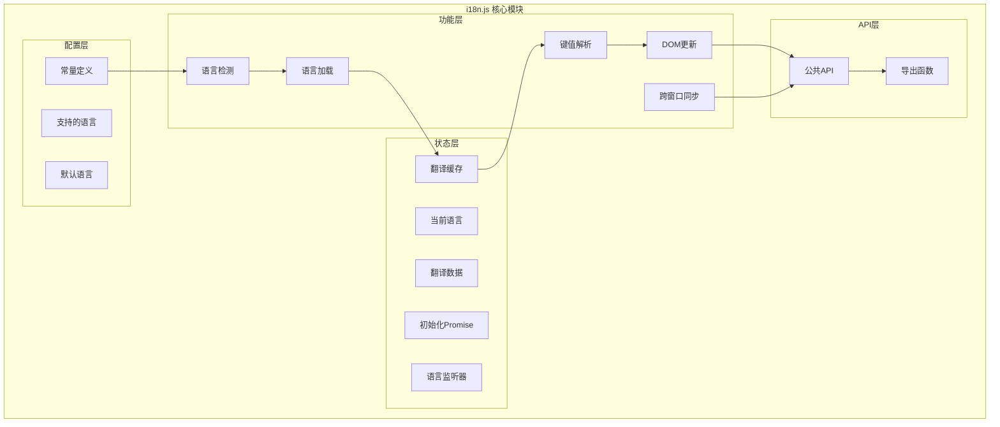

# i18n 国际化模块技术文档

## 1. Purpose

i18n 模块（`dist/js/i18n.js`）是 SystemPromptVault 应用的国际化核心模块，提供完整的多语言支持功能。该模块负责语言检测、翻译资源管理、DOM 自动更新、跨窗口同步等功能，采用模块化设计，支持嵌套键值翻译和多种 HTML 属性绑定。

## 2. How it Works

### 2.1 模块架构设计



### 2.2 核心常量配置

```javascript
const SUPPORTED_LANGUAGES = ["en", "zh"];  // 支持的语言列表
const DEFAULT_LANGUAGE = "en";             // 默认语言
const LANGUAGE_STORAGE_KEY = "app_language"; // 本地存储键名
const LOCALE_BASE_PATH = "locales";        // 语言文件相对路径
```

### 2.3 状态管理

```javascript
// 全局状态变量
let currentLanguage = DEFAULT_LANGUAGE;    // 当前活跃语言
let translations = {};                     // 当前翻译数据对象
let initPromise = null;                   // 初始化Promise，防止重复初始化
const translationCache = new Map();       // 翻译文件缓存
const languageListeners = new Set();      // 语言变更监听器集合
```

### 2.4 语言检测与规范化

#### `normalizeLanguage(lang)` 函数

```javascript
const normalizeLanguage = (lang) => {
  if (typeof lang !== "string" || !lang.trim()) {
    return DEFAULT_LANGUAGE;
  }
  const lower = lang.toLowerCase();
  if (SUPPORTED_LANGUAGES.includes(lower)) {
    return lower;
  }
  if (lower.startsWith("zh")) {
    return "zh";
  }
  return DEFAULT_LANGUAGE;
};
```

**功能说明**:
- 输入验证和类型检查
- 大小写不敏感的语言匹配
- 中文语言变体支持（zh-CN, zh-TW → zh）
- 无效语言回退到默认语言

#### `detectSystemLanguage()` 函数

```javascript
const detectSystemLanguage = () => {
  const candidates = Array.isArray(navigator.languages)
    ? navigator.languages
    : [];
  const primary = localStorage.getItem(LANGUAGE_STORAGE_KEY) ||
                  candidates[0] ||
                  navigator.language;
  return normalizeLanguage(primary);
};
```

**检测优先级**:
1. 用户之前存储的语言选择
2. 浏览器首选语言
3. 系统语言设置

### 2.5 翻译资源加载机制

#### `getLocaleUrl(lang)` 和 `fetchLocale(lang)`

```javascript
const getLocaleUrl = (lang) => `${LOCALE_BASE_PATH}/${lang}.json`;

const fetchLocale = async (lang) => {
  if (translationCache.has(lang)) {
    return translationCache.get(lang);
  }
  const response = await fetch(getLocaleUrl(lang), { cache: "no-store" });
  if (!response.ok) {
    throw new Error(`Failed to load locale: ${lang}`);
  }
  const localeData = await response.json();
  translationCache.set(lang, localeData);
  return localeData;
};
```

**特性**:
- **缓存机制**: 避免重复网络请求
- **错误处理**: 网络失败时抛出明确错误
- **禁用缓存**: 使用 `cache: "no-store"` 确保获取最新版本

### 2.6 嵌套键值解析系统

#### `resolveNested(keyPath)` 函数

```javascript
const resolveNested = (keyPath) => {
  if (!keyPath || typeof keyPath !== "string") {
    return undefined;
  }
  return keyPath.split(".").reduce((acc, part) => {
    if (acc && Object.prototype.hasOwnProperty.call(acc, part)) {
      return acc[part];
    }
    return undefined;
  }, translations);
};
```

**解析示例**:
```javascript
// 翻译数据结构
{
  "common": {
    "actions": {
      "save": "Save",
      "cancel": "Cancel"
    }
  }
}

// 键值解析
resolveNested("common.actions.save")  // "Save"
resolveNested("common.invalid")       // undefined
```

### 2.7 DOM 自动更新系统

#### 属性映射配置

```javascript
const ATTRIBUTE_MAPPINGS = [
  { dataKey: "i18nPlaceholder", attr: "placeholder" },
  { dataKey: "i18nAria", attr: "aria-label" },
  { dataKey: "i18nTooltip", attr: "data-tooltip" },
  { dataKey: "i18nTitle", attr: "title" },
  { dataKey: "i18nValue", attr: "value" },
];
```

#### `translateElement(element)` 函数

```javascript
const translateElement = (element) => {
  if (!(element instanceof Element)) {
    return;
  }

  // 处理主文本内容
  const key = element.dataset.i18n;
  if (key) {
    const translation = t(key, element.textContent ?? "");
    if (element.dataset.i18nHtml === "true") {
      element.innerHTML = translation;  // 支持 HTML 内容
    } else {
      element.textContent = translation;  // 纯文本内容
    }
  }

  // 处理各种属性翻译
  ATTRIBUTE_MAPPINGS.forEach(({ dataKey, attr }) => {
    const dataValue = element.dataset[dataKey];
    if (!dataValue) return;
    const translation = t(dataValue, "");
    if (!translation) return;
    element.setAttribute(attr, translation);
  });
};
```

#### `applyTranslationsToScope(root)` 函数

```javascript
const applyTranslationsToScope = (root = document) => {
  // 处理带有 data-i18n 属性的元素
  elementsMatching(root, "[data-i18n]").forEach(translateElement);

  // 处理带有翻译属性的元素
  ATTRIBUTE_MAPPINGS.forEach(({ dataKey, attr }) => {
    const selector = `[data-${dataKey.replace(/[A-Z]/g, (m) => `-${m.toLowerCase()}`)}]`;
    elementsMatching(root, selector).forEach((element) => {
      const key = element.dataset[dataKey];
      if (!key) return;
      const translation = t(key, "");
      if (!translation) return;
      element.setAttribute(attr, translation);
    });
  });
};
```

### 2.8 语言应用与持久化

#### `applyLanguage(lang, localeData)` 函数

```javascript
const applyLanguage = (lang, localeData) => {
  translations = localeData || {};
  currentLanguage = lang;
  localStorage.setItem(LANGUAGE_STORAGE_KEY, lang);
  setDocumentLanguage(lang);
  applyTranslationsToScope(document);
  languageListeners.forEach((listener) => {
    try {
      listener(lang);
    } catch (error) {
      console.error("[i18n] language listener error:", error);
    }
  });
};
```

**执行步骤**:
1. 更新内部翻译数据
2. 设置当前语言状态
3. 持久化到本地存储
4. 更新文档语言属性
5. 应用翻译到 DOM
6. 通知所有监听器

#### `setDocumentLanguage(lang)` 函数

```javascript
const setDocumentLanguage = (lang) => {
  const html = document.documentElement;
  if (!html) return;
  const locale = lang === "zh" ? "zh-CN" : "en";
  html.setAttribute("lang", locale);
};
```

### 2.9 跨窗口语言同步

```javascript
if (typeof window !== "undefined") {
  window.addEventListener("storage", (event) => {
    if (event.key !== LANGUAGE_STORAGE_KEY || !event.newValue) {
      return;
    }
    const newLanguage = normalizeLanguage(event.newValue);
    if (newLanguage === currentLanguage) {
      return;
    }
    loadLanguage(newLanguage).catch((error) => {
      console.error("[i18n] Failed to sync language from storage event:", error);
    });
  });
}
```

**同步机制**:
- 监听 `storage` 事件
- 只响应语言相关的事件
- 自动加载新语言并更新界面

### 2.10 公共 API 接口

#### 初始化 API

```javascript
export const initI18n = async () => {
  if (initPromise) {
    return initPromise;
  }
  const initialLanguage = detectSystemLanguage();
  initPromise = loadLanguage(initialLanguage).catch((error) => {
    console.error("[i18n] Initialization failed:", error);
    throw error;
  });
  return initPromise;
};
```

#### 翻译 API

```javascript
export const t = (key, fallback = "") => {
  const value = resolveNested(key);
  if (value === undefined || value === null) {
    return fallback || key || "";
  }
  return String(value);
};
```

**使用示例**:
```javascript
// 基本翻译
t("common.appTitle")  // "System Prompt Vault"

// 带回退值
t("nonexistent.key", "Default Text")  // "Default Text"

// 使用键名作为回退
t("missing.key")  // "missing.key"
```

#### 语言切换 API

```javascript
export const setLanguage = async (lang) => {
  await loadLanguage(lang);
};

export const getCurrentLanguage = () => currentLanguage;
```

#### DOM 操作 API

```javascript
export const applyTranslations = (root = document) => {
  applyTranslationsToScope(root);
};
```

#### 事件监听 API

```javascript
export const onLanguageChange = (listener) => {
  if (typeof listener !== "function") {
    return () => {};
  }
  languageListeners.add(listener);
  return () => languageListeners.delete(listener);
};
```

**使用示例**:
```javascript
const unsubscribe = onLanguageChange((newLang) => {
  console.log("Language changed to:", newLang);
});

// 取消监听
unsubscribe();
```

## 3. Relevant Code Modules

### 核心文件
- `dist/js/i18n.js`: i18n 模块主文件，包含所有国际化功能（211行代码）

### 资源文件
- `dist/locales/en.json`: 英文翻译资源（228行，包含完整界面文本）
- `dist/locales/zh.json`: 中文翻译资源（228行，完整本地化翻译）

### 集成文件
- `dist/js/main.js`: 主应用文件，导入并初始化 i18n 模块
- `dist/js/settings.js`: 设置页面文件，使用 i18n API 并集成语言设置界面

### 配置常量
- `SUPPORTED_LANGUAGES`: 支持的语言数组 `["en", "zh"]`
- `DEFAULT_LANGUAGE`: 默认语言 `"en"`
- `LANGUAGE_STORAGE_KEY`: 本地存储键名 `"app_language"`
- `LOCALE_BASE_PATH`: 语言文件目录 `"locales"`

## 4. Attention

### 性能优化要点

1. **Promise 缓存**: 使用 `initPromise` 防止重复初始化
2. **翻译缓存**: `translationCache` Map 缓存已加载的语言文件
3. **DOM 查询优化**: 使用 `elementsMatching` 函数优化元素查找
4. **监听器管理**: 使用 Set 数据结构管理语言变更监听器

### 错误处理策略

1. **输入验证**: 所有公共函数都进行参数类型和值验证
2. **网络错误**: 语言文件加载失败时自动回退到默认语言
3. **监听器异常**: 语言变更监听器异常不会影响其他监听器执行
4. **优雅降级**: 翻译缺失时使用键名或回退值确保界面可用

### 内存管理

1. **缓存清理**: 翻译缓存采用 Map 结构，可手动清理
2. **监听器清理**: `onLanguageChange` 返回取消订阅函数
3. **事件清理**: 全局 storage 事件监听器在模块级别管理

### 安全考虑

1. **XSS 防护**: 默认使用 `textContent` 避免 HTML 注入
2. **HTML 内容**: 仅在明确设置 `data-i18n-html="true"` 时使用 `innerHTML`
3. **属性安全**: 严格验证 HTML 属性名称和值

### 扩展性设计

1. **语言支持**: 通过修改 `SUPPORTED_LANGUAGES` 数组轻松添加新语言
2. **属性扩展**: 通过修改 `ATTRIBUTE_MAPPINGS` 支持新的 HTML 属性
3. **自定义格式**: 可扩展支持复数形式、日期格式等高级特性