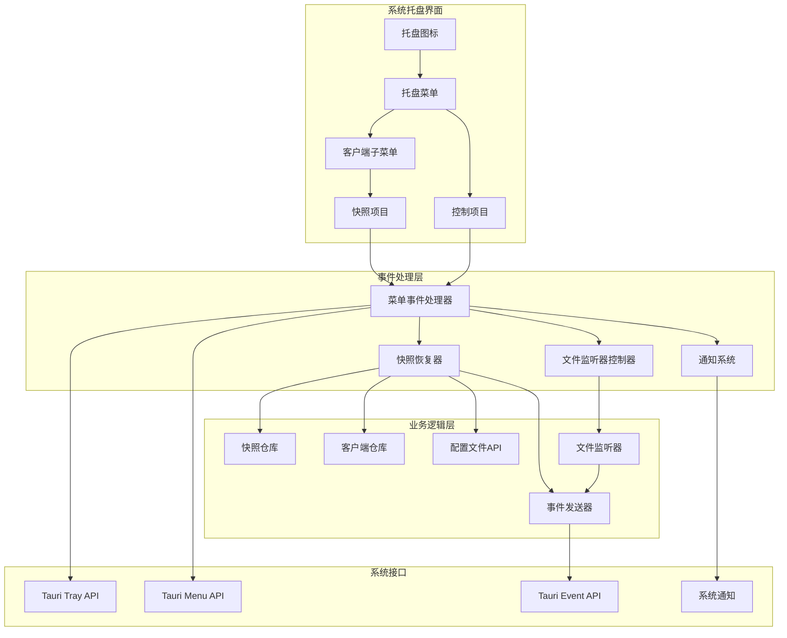

# System Tray 模块

## 1. Purpose

System Tray模块提供系统级托盘图标和菜单功能，支持快照快速访问、一键恢复、应用控制等功能。该模块集成了快照系统、配置管理、事件通知等多个子系统，为用户提供便捷的系统级操作入口。

## 2. How it Works

### 2.1 模块架构



### 2.2 核心数据结构

#### 2.2.1 TrayError 错误处理

```rust
// src-tauri/src/tray.rs
#[derive(Debug)]
pub struct TrayError(String);

impl TrayError {
    pub fn new(message: impl Into<String>) -> Self {
        Self(message.into())
    }

    fn from_poison(target: &str) -> Self {
        Self(format!("获取 {target} 锁失败"))
    }
}

impl std::fmt::Display for TrayError {
    fn fmt(&self, f: &mut std::fmt::Formatter<'_>) -> std::fmt::Result {
        write!(f, "{}", self.0)
    }
}

impl std::error::Error for TrayError {}
```

#### 2.2.2 常量定义

```rust
const TRAY_ID: &str = "systempromptvault_tray";
const SNAPSHOT_MENU_PREFIX: &str = "restore_snapshot_";
const SHOW_MAIN_WINDOW_MENU_ID: &str = "show_main_window";
const QUIT_MENU_ID: &str = "quit";
const SNAPSHOT_EVENT_NAME: &str = "tray://snapshot-restored";
const CONFIG_RELOAD_SILENT_EVENT: &str = "config-reload-silent";
```

### 2.3 托盘初始化

#### 2.3.1 应用启动时初始化

```rust
// src-tauri/src/tray.rs
pub fn init_tray(app: &App) -> TrayResult<()> {
    let handle = app.handle();
    let menu = build_tray_menu(&handle)?;
    create_tray_icon(&handle, menu)
}

fn create_tray_icon<R: Runtime>(app_handle: &AppHandle<R>, menu: Menu<R>) -> TrayResult<()> {
    let mut builder = TrayIconBuilder::with_id(TRAY_ID)
        .menu(&menu)
        .tooltip("SystemPromptVault")
        .show_menu_on_left_click(true)
        .on_menu_event(|app, event| {
            if let Err(err) = crate::tray::handle_tray_event(app, &event) {
                eprintln!("托盘菜单处理失败: {}", err);
            }
        });

    // 设置应用图标
    if let Some(icon) = app_handle.default_window_icon() {
        builder = builder.icon(icon.clone());
    }

    builder
        .build(app_handle)
        .map_err(TrayError::from)
        .map(|_| ())
}
```

#### 2.3.2 在 main.rs 中集成

```rust
// src-tauri/src/main.rs
#[cfg_attr(mobile, tauri::mobile_entry_point)]
pub fn run() {
    tauri::Builder::default()
        .manage(Arc::new(Mutex::new(SnapshotRepository::new())))
        .manage(Arc::new(Mutex::new(ConfigFileWatcher::new())))
        // ... 其他状态管理
        .setup(|app| {
            // 初始化系统托盘
            if let Err(err) = crate::tray::init_tray(app) {
                eprintln!("Failed to initialize system tray: {}", err);
            }
            Ok(())
        })
        .on_menu_event(|app, event| {
            if let Err(err) = crate::tray::handle_tray_event(app, &event) {
                eprintln!("Tray event handler error: {}", err);
            }
        })
        .invoke_handler(tauri::generate_handler![
            // ... 其他命令
            snapshot_commands::refresh_tray_menu
        ])
        .run(tauri::generate_context!())
        .expect("error while running tauri application");
}
```

### 2.4 菜单构建系统

#### 2.4.1 主菜单结构

```rust
fn build_tray_menu<R: Runtime>(app_handle: &AppHandle<R>) -> TrayResult<Menu<R>> {
    let menu = Menu::new(app_handle).map_err(TrayError::from)?;

    // 应用标题
    let title_item = MenuItem::new(app_handle, "SystemPromptVault", false, None::<&str>)
        .map_err(TrayError::from)?;
    menu.append(&title_item).map_err(TrayError::from)?;

    // 客户端子菜单
    let client_submenus = build_client_submenus(app_handle)?;
    if client_submenus.is_empty() {
        let placeholder = MenuItem::new(app_handle, "暂无可用快照", false, None::<&str>)
            .map_err(TrayError::from)?;
        menu.append(&placeholder).map_err(TrayError::from)?;
    } else {
        for submenu in client_submenus {
            menu.append(&submenu).map_err(TrayError::from)?;
        }
    }

    // 分隔线
    let separator = PredefinedMenuItem::separator(app_handle).map_err(TrayError::from)?;
    menu.append(&separator).map_err(TrayError::from)?;

    // 控制菜单项
    let show_item = MenuItem::with_id(
        app_handle,
        SHOW_MAIN_WINDOW_MENU_ID,
        "🏠 打开主窗口",
        true,
        None::<&str>,
    ).map_err(TrayError::from)?;
    menu.append(&show_item).map_err(TrayError::from)?;

    let quit_item = MenuItem::with_id(app_handle, QUIT_MENU_ID, "❌ 退出", true, None::<&str>)
        .map_err(TrayError::from)?;
    menu.append(&quit_item).map_err(TrayError::from)?;

    Ok(menu)
}
```

#### 2.4.2 客户端子菜单构建

```rust
fn build_client_submenus<R: Runtime>(app_handle: &AppHandle<R>) -> TrayResult<Vec<Submenu<R>>> {
    // 获取所有客户端并按名称排序
    let mut clients = collect_clients(app_handle)?;
    clients.sort_by(|a, b| a.name.cmp(&b.name));

    let snapshot_state = app_handle.state::<Arc<Mutex<SnapshotRepository>>>();
    let snapshot_repo = Arc::clone(snapshot_state.inner());

    // 收集客户端和对应的快照数据
    let mut data: Vec<(ClientConfig, Vec<Snapshot>)> = Vec::new();
    {
        let repo = snapshot_repo
            .lock()
            .map_err(|_| TrayError::from_poison("快照仓库"))?;

        for client in &clients {
            let snapshots = repo.get_snapshots(&client.id).map_err(TrayError::from)?;
            data.push((client.clone(), snapshots));
        }
    }

    // 为每个客户端构建子菜单
    let mut submenus = Vec::new();
    for (client, snapshots) in data {
        submenus.push(build_client_submenu(app_handle, &client, snapshots)?);
    }

    Ok(submenus)
}
```

#### 2.4.3 客户端子菜单项构建

```rust
fn build_client_submenu<R: Runtime>(
    app_handle: &AppHandle<R>,
    client: &ClientConfig,
    snapshots: Vec<Snapshot>,
) -> TrayResult<Submenu<R>> {
    let snapshot_count = snapshots.len();
    let mut menu_items: Vec<MenuItem<R>> = Vec::new();

    if snapshots.is_empty() {
        // 无快照时显示占位符
        menu_items.push(
            MenuItem::new(app_handle, "暂无快照", false, None::<&str>)
                .map_err(TrayError::from)?,
        );
    } else {
        // 为每个快照创建菜单项
        for snapshot in snapshots {
            let item_id = format!(
                "{SNAPSHOT_MENU_PREFIX}{}_{}",
                client.id.as_str(),
                snapshot.id
            );

            menu_items.push(
                MenuItem::with_id(
                    app_handle,
                    item_id,
                    format_snapshot_label(&snapshot),
                    true,
                    None::<&str>,
                ).map_err(TrayError::from)?
            );
        }
    }

    // 构建子菜单
    let mut item_refs: Vec<&dyn IsMenuItem<R>> = Vec::with_capacity(menu_items.len());
    for item in &menu_items {
        item_refs.push(item as &dyn IsMenuItem<R>);
    }

    Submenu::with_id_and_items(
        app_handle,
        format!("client_menu_{}", client.id),
        format_client_label(client, snapshot_count),
        true,
        &item_refs,
    ).map_err(TrayError::from)
}
```

### 2.5 格式化函数

#### 2.5.1 客户端标签格式化

```rust
fn format_client_label(client: &ClientConfig, snapshot_count: usize) -> String {
    if snapshot_count > 0 {
        format!("Client: {} ({}个快照)", client.name, snapshot_count)
    } else {
        format!("Client: {}", client.name)
    }
}
```

#### 2.5.2 快照标签格式化

```rust
fn format_snapshot_label(snapshot: &Snapshot) -> String {
    let local_time: DateTime<Local> = snapshot.created_at.with_timezone(&Local);
    format!("{} {}", snapshot.name, local_time.format("%m-%d %H:%M"))
}
```

### 2.6 事件处理系统

#### 2.6.1 主事件处理器

```rust
pub fn handle_tray_event<R: Runtime>(
    app_handle: &AppHandle<R>,
    event: &MenuEvent,
) -> TrayResult<()> {
    let id = event.id().as_ref();

    match id {
        SHOW_MAIN_WINDOW_MENU_ID => {
            show_main_window(app_handle)
        }
        QUIT_MENU_ID => {
            app_handle.exit(0);
            Ok(())
        }
        _ if id.starts_with(SNAPSHOT_MENU_PREFIX) => {
            // 解析客户端ID和快照ID
            if let Some(rest) = id.strip_prefix(SNAPSHOT_MENU_PREFIX) {
                if let Some(idx) = rest.rfind('_') {
                    let (client_raw, snapshot_raw) = rest.split_at(idx);
                    let snapshot_id = &snapshot_raw[1..];
                    restore_snapshot_from_menu(app_handle, client_raw, snapshot_id)
                } else {
                    Ok(())
                }
            } else {
                Ok(())
            }
        }
        _ => Ok(()),
    }
}
```

#### 2.6.2 快照恢复逻辑

```rust
fn restore_snapshot_from_menu<R: Runtime>(
    app_handle: &AppHandle<R>,
    client_id: &str,
    snapshot_id: &str,
) -> TrayResult<()> {
    // 获取快照内容
    let snapshot_state = app_handle.state::<Arc<Mutex<SnapshotRepository>>>();
    let content = commands::snapshot::restore_snapshot(
        snapshot_state,
        client_id.to_string(),
        snapshot_id.to_string(),
    ).map_err(TrayError::from)?;

    // 获取快照名称（用于通知）
    let snapshot_name = {
        let repo = snapshot_state.lock()
            .map_err(|_| TrayError::from_poison("快照仓库"))?;
        let snapshots = repo.get_snapshots(client_id).map_err(TrayError::from)?;
        snapshots
            .iter()
            .find(|s| s.id == snapshot_id)
            .map(|s| s.name.clone())
            .unwrap_or_else(|| "未知快照".to_string())
    };

    let client_state = app_handle.state::<Arc<Mutex<ClientRepository>>>();

    // 获取配置文件路径（用于后续重新启动监听器）
    let config_path = {
        let repo = client_state
            .inner()
            .lock()
            .map_err(|_| TrayError::from_poison("客户端仓库"))?;
        match repo.get_by_id(client_id) {
            Ok(Some(client)) => Some(client.config_file_path.clone()),
            _ => None,
        }
    };

    // 临时停止文件监听器，避免写入时触发 config-file-changed 事件
    let watcher_state = app_handle.state::<Arc<Mutex<crate::file_watcher::ConfigFileWatcher>>>();
    {
        let mut watcher = watcher_state
            .lock()
            .map_err(|_| TrayError::from_poison("文件监听器"))?;
        watcher.stop();
        eprintln!("[Tray] Temporarily stopped file watcher before writing config");
    }

    // 写入配置文件
    commands::config_file::write_config_file(client_state.clone(), client_id.to_string(), content)
        .map_err(TrayError::from)?;

    // 重新启动文件监听器
    if let Some(path) = &config_path {
        let mut watcher = watcher_state
            .lock()
            .map_err(|_| TrayError::from_poison("文件监听器"))?;
        let expanded_path = expand_tilde(path);
        if let Err(e) = watcher.watch_file(expanded_path, app_handle.clone()) {
            eprintln!("[Tray] Warning: Failed to restart file watcher: {}", e);
        } else {
            eprintln!("[Tray] File watcher restarted successfully");
        }
    }

    // 主动通知监听器，避免托盘恢复后主窗口不同步（静默刷新，不触发外部更改提示）
    if let Some(path) = &config_path {
        let expanded_path = expand_tilde(path);
        let path_str = expanded_path.to_string_lossy().to_string();

        eprintln!(
            "[Tray] Emitting config-reload-silent event for path: {} (expanded from: {})",
            path_str, path
        );
        match app_handle.emit(CONFIG_RELOAD_SILENT_EVENT, path_str) {
            Ok(_) => eprintln!("[Tray] Event emitted successfully"),
            Err(e) => eprintln!("[Tray] Failed to emit event: {}", e),
        }
    } else {
        eprintln!("[Tray] Warning: Could not get client config path for event emission");
    }

    eprintln!(
        "[Tray] Restored snapshot '{}' for client '{}'",
        snapshot_name, client_id
    );

    notify_snapshot_restored(app_handle, &snapshot_name);
    Ok(())
}
```

### 2.7 通知系统

#### 2.7.1 快照恢复通知

```rust
fn notify_snapshot_restored<R: Runtime>(app_handle: &AppHandle<R>, snapshot_name: &str) {
    let message = format!("已恢复快照「{}」", snapshot_name);

    // macOS系统通知
    #[cfg(target_os = "macos")]
    if let Err(err) = show_macos_notification("SystemPromptVault", &message) {
        eprintln!("通知发送失败: {}", err);
    }

    // 发送Tauri事件（前端可监听）
    let _ = app_handle.emit(SNAPSHOT_EVENT_NAME, message);
}
```

#### 2.7.2 macOS系统通知

```rust
#[cfg(target_os = "macos")]
fn show_macos_notification(title: &str, body: &str) -> TrayResult<()> {
    let script = format!(
        "display notification \"{}\" with title \"{}\"",
        escape_osascript_arg(body),
        escape_osascript_arg(title)
    );

    Command::new("osascript")
        .arg("-e")
        .arg(script)
        .status()
        .map_err(|err| TrayError::new(format!("调用 osascript 失败: {}", err)))?;

    Ok(())
}

#[cfg(target_os = "macos")]
fn escape_osascript_arg(value: &str) -> String {
    value.replace('\\', "\\\\").replace('"', "\\\"")
}
```

### 2.8 动态菜单刷新

#### 2.8.1 菜单刷新接口

```rust
pub fn refresh_tray_menu<R: Runtime>(app_handle: &AppHandle<R>) -> TrayResult<()> {
    let menu = build_tray_menu(app_handle)?;

    if let Some(tray) = app_handle.tray_by_id(TRAY_ID) {
        // 更新现有托盘图标
        tray.set_menu(Some(menu)).map_err(TrayError::from)
    } else {
        // 创建新的托盘图标
        create_tray_icon(app_handle, menu)
    }
}
```

#### 2.8.2 前端调用接口

```rust
// src-tauri/src/commands/snapshot.rs
#[tauri::command]
pub fn refresh_tray_menu(app_handle: tauri::AppHandle) -> Result<(), String> {
    tray::refresh_tray_menu(&app_handle).map_err(|err| err.to_string())
}
```

```javascript
// 前端调用
await SnapshotAPI.refreshTrayMenu();
```

## 3. Relevant Code Modules

### 核心模块文件
- `src-tauri/src/tray.rs`: System Tray完整实现（450+行代码）
- `src-tauri/src/commands/snapshot.rs`: 托盘菜单刷新命令接口
- `src-tauri/src/main.rs`: 托盘初始化和事件处理集成

### 依赖模块
- `src-tauri/src/models/snapshot.rs`: 快照数据模型
- `src-tauri/src/storage/snapshot_repository.rs`: 快照仓库
- `src-tauri/src/commands/config_file.rs`: 配置文件读写
- `src-tauri/src/file_watcher.rs`: 文件监听器（支持临时停止和重启）

### 前端集成
- `dist/js/api.js`: SnapshotAPI.refreshTrayMenu()调用
- `dist/js/main.js`: 快照操作后的菜单刷新、config-reload-silent事件处理
- `dist/js/settings.js`: 设置页面操作后的菜单更新

### 配置依赖
- `src-tauri/Cargo.toml`: tauri依赖（tray-icon feature）
- `src-tauri/tauri.conf.json`: tray权限配置
- 应用图标文件：应用默认图标用于托盘显示

## 4. Attention

### 功能注意事项

1. **菜单动态刷新**：快照操作（增删改）后必须调用 `refresh_tray_menu()`
2. **ID格式规范**：快照菜单项使用 `restore_snapshot_{client_id}_{snapshot_id}` 格式
3. **文件监听器控制**：托盘恢复快照时会临时停止文件监听器，避免重复事件触发
4. **静默刷新机制**：使用 `config-reload-silent` 事件进行静默刷新，不显示Toast提示
5. **错误处理**：所有操作使用 `TrayResult<T>` 统一错误处理

### 性能注意事项

1. **菜单构建效率**：批量读取客户端和快照数据，避免多次数据库查询
2. **内存管理**：使用 `Arc<Mutex<>>` 保证线程安全，避免数据竞争
3. **事件响应速度**：菜单点击响应时间通常 < 50ms

### 用户体验注意事项

1. **菜单排序**：客户端按名称排序，快照按时间降序排列
2. **空状态处理**：无快照时显示明确的占位符文本
3. **本地化时间**：快照时间转换为用户本地时区显示
4. **即时反馈**：恢复快照后立即显示系统通知

### 跨平台注意事项

1. **macOS通知**：使用AppleScript发送系统通知，需要终端权限
2. **Windows通知**：可扩展支持Windows原生通知
3. **Linux通知**：可扩展支持libnotify
4. **图标适配**：托盘图标需要适配不同平台的尺寸要求

### 安全注意事项

1. **权限检查**：仅在托盘菜单中显示用户有权限访问的快照
2. **输入验证**：解析菜单ID时进行安全检查
3. **资源清理**：应用关闭时正确清理托盘资源
4. **并发安全**：使用Mutex保护共享数据访问

### 可扩展性注意事项

1. **菜单结构**：可轻松添加新的菜单项和子菜单
2. **通知系统**：可扩展支持更多通知方式和自定义样式
3. **事件系统**：可扩展支持更多Tauri事件
4. **插件系统**：可考虑支持第三方托盘菜单插件

## 5. Testing Checklist

- [ ] 托盘图标正确显示
- [ ] 左键点击托盘图标显示菜单
- [ ] 客户端按名称排序显示
- [ ] 快照按时间降序排列
- [ ] 快照数量正确显示在客户端标签中
- [ ] 无快照时显示占位符
- [ ] 点击快照项正确恢复配置
- [ ] 恢复快照后显示系统通知（macOS）
- [ ] 恢复快照后临时停止文件监听器
- [ ] 恢复快照后重新启动文件监听器
- [ ] 恢复快照后发送config-reload-silent事件
- [ ] 主窗口静默更新，不显示Toast提示
- [ ] 点击"打开主窗口"正确显示应用窗口
- [ ] 点击"退出"正确关闭应用
- [ ] 创建新快照后托盘菜单自动刷新
- [ ] 删除快照后托盘菜单自动刷新
- [ ] 重命名快照后托盘菜单自动刷新
- [ ] 应用启动时托盘菜单正确初始化
- [ ] 切换客户端后托盘菜单正确更新
- [ ] 多次快速操作不会导致菜单重复或错乱
- [ ] 文件监听器重启失败时显示警告日志
- [ ] 配置路径获取失败时显示警告日志