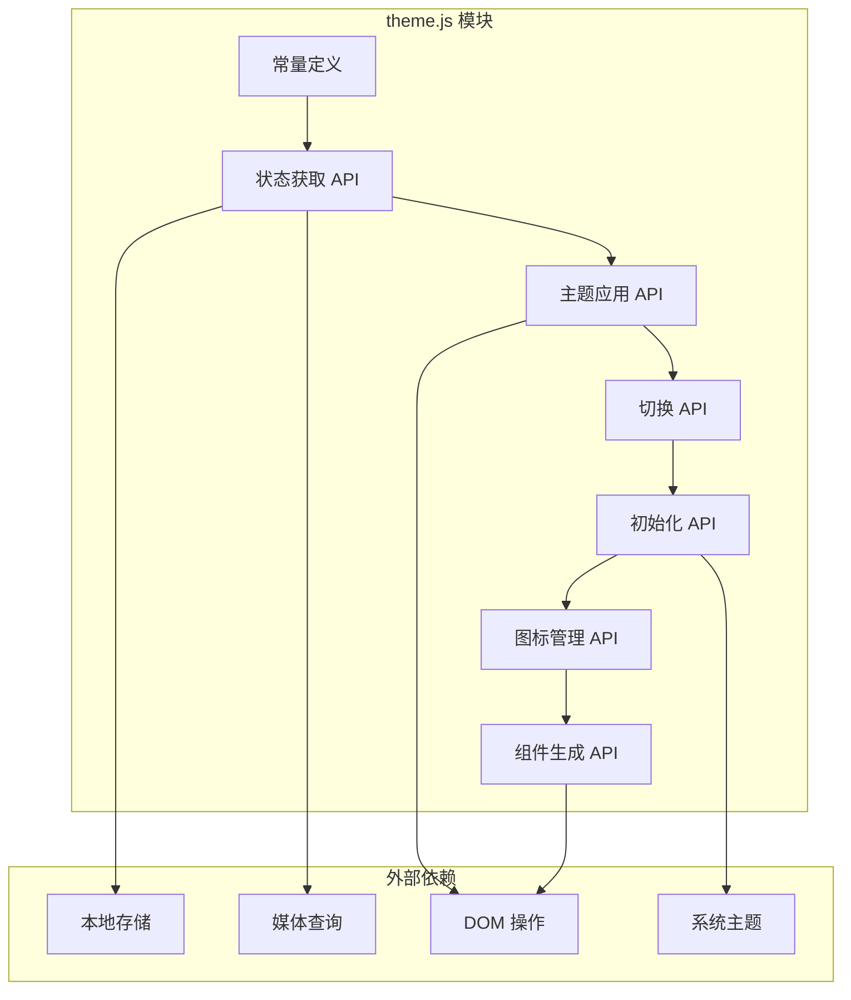

# 主题管理模块

## 1. Purpose

`theme.js` 模块是 SystemPromptVault 的主题系统核心，负责主题切换逻辑、状态管理、系统集成和 UI 组件生成。本文档详细描述该模块的实现细节和使用方式。

## 2. How it Works

### 2.1 模块架构设计



### 2.2 核心常量定义

```javascript
// 主题管理模块
const THEME_KEY = 'app-theme';
const THEME_DARK = 'dark';
const THEME_LIGHT = 'light';
```

这些常量定义了：
- `THEME_KEY`: 本地存储中的键名
- `THEME_DARK`: 暗色主题标识符
- `THEME_LIGHT`: 亮色主题标识符

### 2.3 主题状态获取逻辑

```javascript
/**
 * 获取当前主题
 */
export function getCurrentTheme() {
  const stored = localStorage.getItem(THEME_KEY);
  if (stored === THEME_DARK || stored === THEME_LIGHT) {
    return stored; // 优先使用用户手动设置的主题
  }
  // 默认使用系统主题
  return window.matchMedia('(prefers-color-scheme: dark)').matches ? THEME_DARK : THEME_LIGHT;
}
```

**获取逻辑优先级**:
1. 用户手动设置的主题（从 localStorage 读取）
2. 系统主题偏好（通过 `matchMedia` 检测）
3. 默认回退到亮色主题

### 2.4 主题应用机制

```javascript
/**
 * 应用主题
 */
export function applyTheme(theme) {
  if (theme === THEME_DARK) {
    document.documentElement.classList.add('dark');
  } else {
    document.documentElement.classList.remove('dark');
  }
  localStorage.setItem(THEME_KEY, theme);
}
```

**应用机制**:
1. 通过操作 `document.documentElement` 的 CSS 类名切换主题
2. 将主题选择持久化到 `localStorage`
3. 使用 `.dark` 类名激活暗色主题样式

### 2.5 主题切换逻辑

```javascript
/**
 * 切换主题
 */
export function toggleTheme() {
  const current = getCurrentTheme();
  const next = current === THEME_DARK ? THEME_LIGHT : THEME_DARK;
  applyTheme(next);
  return next;
}
```

**切换流程**:
1. 获取当前主题
2. 计算相反主题
3. 应用新主题
4. 返回新主题状态

### 2.6 初始化流程

```javascript
/**
 * 初始化主题
 */
export function initTheme() {
  const theme = getCurrentTheme();
  applyTheme(theme);

  // 监听系统主题变化
  window.matchMedia('(prefers-color-scheme: dark)').addEventListener('change', (e) => {
    const stored = localStorage.getItem(THEME_KEY);
    // 只有在没有手动设置时才自动切换
    if (!stored) {
      applyTheme(e.matches ? THEME_DARK : THEME_LIGHT);
      updateThemeIcon();
    }
  });
}
```

**初始化步骤**:
1. 计算初始主题
2. 应用主题样式
3. 设置系统主题监听器
4. 仅在用户未手动设置时响应系统主题变化

### 2.7 图标管理机制

```javascript
/**
 * 更新主题图标
 */
export function updateThemeIcon() {
  const isDark = getCurrentTheme() === THEME_DARK;
  const buttons = document.querySelectorAll('.theme-toggle-btn');

  buttons.forEach(btn => {
    const sunIcon = btn.querySelector('.theme-icon-sun');
    const moonIcon = btn.querySelector('.theme-icon-moon');

    if (sunIcon && moonIcon) {
      if (isDark) {
        sunIcon.classList.remove('hidden');
        moonIcon.classList.add('hidden');
      } else {
        sunIcon.classList.add('hidden');
        moonIcon.classList.remove('hidden');
      }
    }
  });
}
```

**图标逻辑**:
- 暗色主题显示太阳图标（切换到亮色主题）
- 亮色主题显示月亮图标（切换到暗色主题）
- 同时更新页面上的所有主题切换按钮

### 2.8 主题按钮组件生成

```javascript
/**
 * 创建主题切换按钮 HTML
 */
export function createThemeToggleButton() {
  const button = document.createElement('button');
  button.type = 'button';
  button.className = 'theme-toggle-btn border border-gray-300 bg-white text-gray-800 rounded-md px-3 py-2 hover:border-primary hover:text-primary transition-all duration-200 flex items-center justify-center';
  button.setAttribute('aria-label', '切换主题');
  button.title = '切换深色/浅色主题';

  // SVG 图标结构
  button.innerHTML = `
    <svg class="theme-icon-sun w-5 h-5 hidden" fill="none" stroke="currentColor" viewBox="0 0 24 24">
      <path stroke-linecap="round" stroke-linejoin="round" stroke-width="2" d="M12 3v1m0 16v1m9-9h-1M4 12H3m15.364 6.364l-.707-.707M6.343 6.343l-.707-.707m12.728 0l-.707.707M6.343 17.657l-.707.707M16 12a4 4 0 11-8 0 4 4 0 018 0z"></path>
    </svg>
    <svg class="theme-icon-moon w-5 h-5" fill="none" stroke="currentColor" viewBox="0 0 24 24">
      <path stroke-linecap="round" stroke-linejoin="round" stroke-width="2" d="M20.354 15.354A9 9 0 018.646 3.646 9.003 9.003 0 0012 21a9.003 9.003 0 008.354-5.646z"></path>
    </svg>
  `;

  // 事件处理
  button.addEventListener('click', () => {
    toggleTheme();
    updateThemeIcon();
  });

  return button;
}
```

**按钮特性**:
- 使用 Tailwind CSS 类进行样式设计
- 包含无障碍支持属性
- 集成点击事件处理
- 响应式图标切换

### 2.9 模块使用示例

```javascript
// 在 main.js 中集成
import { initTheme, createThemeToggleButton, updateThemeIcon } from "./theme.js";

const initApp = async () => {
  // 初始化主题
  initTheme();

  // 添加主题切换按钮
  const themeContainer = document.getElementById('themeToggleContainer');
  if (themeContainer) {
    themeContainer.appendChild(createThemeToggleButton());
    updateThemeIcon();
  }

  // ... 其他初始化逻辑
};
```

## 3. Relevant Code Modules

### 主题核心模块
- `dist/js/theme.js`: 主题系统完整实现，包含所有 API 和工具函数

### 集成模块
- `dist/js/main.js`: 主应用主题初始化和按钮集成
- `dist/js/settings.js`: 设置页面主题初始化和按钮集成

### 样式支持
- `dist/css/main.css`: CSS 主题变量定义和 `.dark` 类样式
- `dist/index.html`: 主题按钮容器 `#themeToggleContainer`
- `dist/settings.html`: 主题按钮容器 `#themeToggleContainer`

## 4. Attention

### 使用注意事项

1. **模块导入**: 使用 ES6 模块语法导入需要的功能
2. **初始化时机**: 确保在 DOM 加载完成后调用 `initTheme()`
3. **按钮容器**: 页面中需要提供 `#themeToggleContainer` 容器
4. **样式依赖**: 确保 CSS 文件中定义了相应的主题变量

### 扩展注意事项

1. **新主题**: 可以通过添加新的主题常量和 CSS 类来支持更多主题
2. **自定义按钮**: 可以修改 `createThemeToggleButton()` 函数来自定义按钮样式
3. **主题监听**: 可以扩展 `initTheme()` 函数来添加自定义主题变化监听器
4. **状态同步**: 在多页面应用中需要考虑主题状态的同步

### 性能注意事项

1. **DOM 操作**: 图标更新时会查询所有主题按钮，注意按钮数量
2. **事件监听器**: 系统主题监听器在初始化时添加，无需重复添加
3. **本地存储**: 频繁的主题切换不会影响性能，localStorage 操作很快
4. **CSS 切换**: 主题切换通过 CSS 类实现，性能优秀

### 兼容性注意事项

1. **LocalStorage**: 确保浏览器支持 localStorage
2. **MatchMedia**: 确保浏览器支持 `matchMedia` API
3. **CSS 变量**: 确保浏览器支持 CSS 自定义属性
4. **ES6 模块**: 确保环境支持 ES6 模块语法